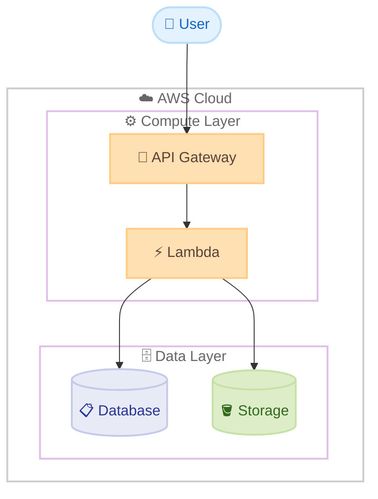
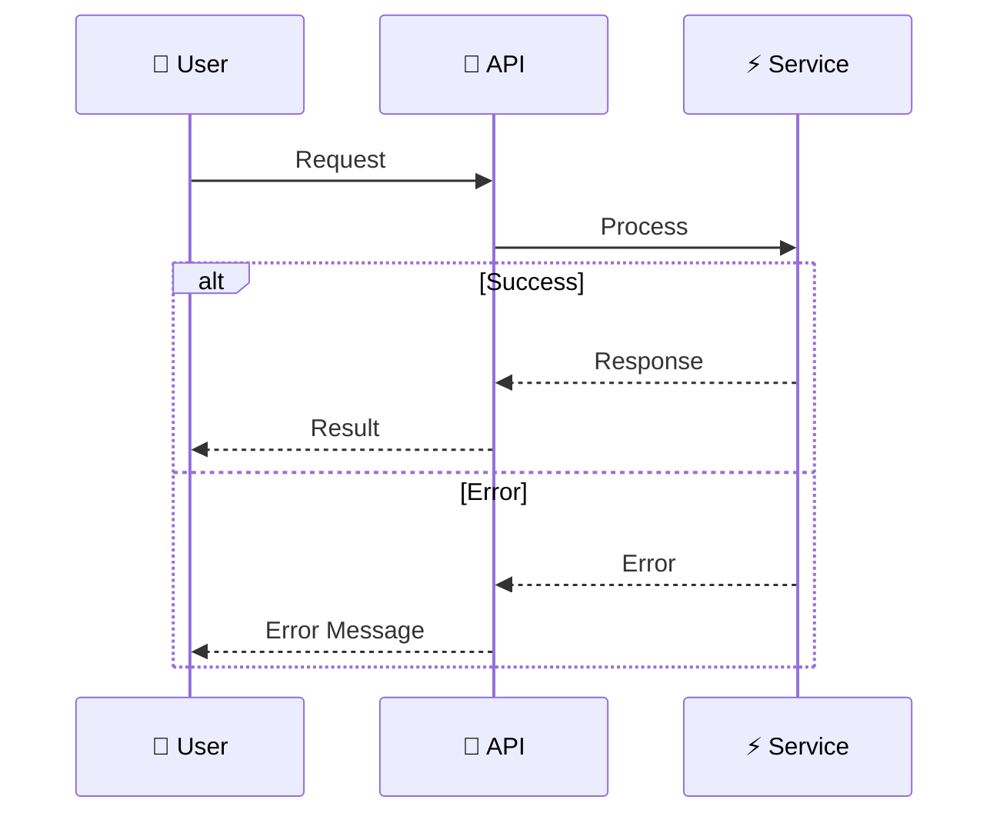

# Project Documentation Guidelines

This file contains guidelines and best practices for creating documentation in this workspace. Claude Code will automatically reference these guidelines when working on documents.

## Document Writing Standards

### Amazon Writing Guidelines

Follow Amazon's documentation standards for all written materials:

#### General Writing Principles
- Use clear, direct language
- Avoid unnecessary jargon or complex terminology
- Write for your audience's level of expertise
- Use active voice when possible
- Keep sentences and paragraphs concise
- Use consistent terminology throughout documents
- Follow established naming conventions
- Write for global audiences and use inclusive language

#### Japanese Document Guidelines

**Character Spacing Rules:**
1. **Space Between Japanese and Alphanumeric Characters**: Add one space between Japanese text and alphabetic/numeric characters, except when next to punctuation marks (、。)
   - ✓ Correct: `AI システム`, `4 時間`, `2024 年`, `API 仕様`
   - ✗ Incorrect: `AIシステム`, `4時間`, `2024年`, `API仕様`

2. **Hyphenated Terms**: Add spaces around hyphens when connecting Japanese and English terms
   - ✓ Correct: `AI - 人間協働`
   - ✗ Incorrect: `AI-人間協働`

3. **Exception - No Space Next to Punctuation**: Do not add spaces when adjacent to Japanese punctuation marks (、。)
   - ✓ Correct: `AI、機械学習`
   - ✗ Incorrect: `AI 、機械学習`

4. **Exception - No Period in Headings**: Headings should not end with a period (。)
   - ✓ Correct: `# メインタイトル`
   - ✗ Incorrect: `# メインタイトル。`

5. **Bold Labels**: Use colons (:) instead of periods (。) for bold labels followed by explanatory text
   - ✓ Correct: `**システム要件**: 説明文`
   - ✗ Incorrect: `**システム要件**。 説明文`

**Parentheses and Punctuation:**
1. **Use Half-Width Parentheses**: Use `()` instead of `（）` with proper spacing
   - ✓ Correct: `Amazon Web Services (AWS) は`
   - ✗ Incorrect: `Amazon Web Services(AWS)は`

2. **Use Half-Width Colons and Semicolons**: Use `:` and `;` instead of full-width versions

3. **Use Period Before Lists**: In Japanese, use a period (。) instead of colon (:) before lists
   - ✓ Correct: `以下の機能が含まれています。`
   - ✗ Incorrect: `以下の機能が含まれています:`

#### English Document Guidelines
- Use American English spelling and conventions
- Maintain a professional, helpful tone
- Use second person ("you") when addressing the reader
- Avoid contractions in formal documentation
- Define acronyms on first use
- Use sentence case for headings

### AWS Localization Style Guide (Japanese)

**Basic Principles:**
- 明確で客観的: シンプルで理解しやすい言語を使用
- 正確で具体的: 複雑な構造を最小限に抑え、正確な表現を使用
- 丁寧でプロフェッショナル: 礼儀正しく信頼できるアプローチ

**Avoid:**
- 複雑すぎる言語構造
- スラング、専門用語、インフォーマルな言語
- 否定的な表現
- 曖昧で不明確な表現

**Pronouns:**
- Avoid using personal pronouns when possible
- Use 「お客様」「ユーザー」 instead of 「あなた」
- Use 「当社」「私たち」 instead of 「私たち」 alone

**Numbers and Punctuation:**
- Use half-width Arabic numerals
- Use commas for thousands separator: `1,526,987`
- Use half-width % with no space: `50%`
- For UI elements, use half-width square brackets: `[今すぐサインアップ]`

**Katakana Words:**
- Do not use spaces or middle dots (・) between katakana words
- ✓ Correct: `ブラウザウィンドウ`
- ✗ Incorrect: `ブラウザ ウィンドウ`

## Document Types

### Technical Proposals & RFP Responses

**Required Elements:**
- Executive Summary (for leadership)
- Background and objectives
- Technical details and feasibility
- Business value and ROI
- Risks and mitigation strategies
- Timeline and milestones

**Style:**
- Persuasive logical flow
- Concrete numbers and data for support
- Use diagrams and architecture diagrams
- Clear competitive advantages

### Escalation Documents

**Required Elements:**
- Urgency indication in title (e.g., "URGENT")
- Executive Summary
- Quantified business impact
- Timeline and deadlines
- Technical details and root cause analysis
- Clear requirements
- Contact information

**Style:**
- Concise and to the point
- Fact-based descriptions
- Avoid emotional language, maintain objective tone
- Clear action items

### Incident Reports & Post-Mortems

**Required Elements:**
- Incident summary and timeline
- Impact assessment
- Root cause analysis
- Immediate actions taken
- Preventive measures
- Lessons learned

## Architecture Diagram Guidelines

### Design Principles
- **Clarity over decoration**: Prioritize readability, minimize visual noise
- **Consistent visual hierarchy**: Use color, size, and position to convey importance
- **Logical grouping**: Group related components using subgraphs/containers
- **Flow direction**: Maintain consistent flow (top-down or left-right)
- **Appropriate abstraction**: Match detail level to audience (executive vs. technical)

### Mermaid (Default)

Use Mermaid unless Draw.io is explicitly requested.

**Syntax:**
- Use `flowchart` instead of `graph`

**Emoji:**
- Use emojis to indicate component types (e.g., `"☁️ AWS Cloud"`, `"🗄️ Database"`)

**Layout:**
- Use top-down (TD) flow as default
- Align shapes horizontally within subgraphs
- Group related components in subgraphs with clear boundaries

**Subgraph Layout:**

`direction LR` alone may not align elements horizontally within a subgraph. To ensure horizontal layout, add invisible links (`~~~`) between nodes.

```mermaid
subgraph Servers["🔌 MCP Servers"]
    direction LR
    S1["Server A"]
    S2["Server B"]
    S3["Server C"]
    S1 ~~~ S2 ~~~ S3
end
```

**Connection Lines:**
- Solid (`-->`): Data flow, synchronous calls
- Dotted (`-.->`): Logical connection, async, optional
- Use straight lines or 90-degree angles only

**Multi-line Text:**
- Use `<br/>` for line breaks in node labels (better text visibility)
- Do NOT use `\n` for line breaks
- ✓ Correct: `Node["First Line<br/>Second Line"]`
- ✗ Incorrect: `Node["First Line\nSecond Line"]`

**Complexity:**
- Split into multiple diagrams when needed
- Create overview diagram + detailed diagrams for complex systems

**Template:**



**Color Palette:**

Use colors semantically to convey meaning. Stroke color should be slightly darker than fill (not too dark) for visual harmony.

| Purpose | Fill | Stroke | Use Case |
|---------|------|--------|----------|
| Container/Boundary | `none` | `#CCCCCC` | AWS regions, VPCs, logical groups |
| General Process | `#FFFFFF` | `#4A90E2` | Standard processing steps |
| Internal/Auto | `#E8F1FF` | `#4A90E2` | Background jobs, internal calls |
| External Input | `#E9F7EC` | `#66BB6A` | User input, external API calls |
| Decision/Branch | `#F3E5F5` | `#7B61FF` | Conditional logic, routing |
| Warning/Attention | `#FFF3E0` | `#FF9800` | Rate limits, potential issues |
| Error/Critical | `#FFEBEE` | `#F44336` | Failure paths, alerts |

**Shape Semantics:**

| Shape | Syntax | Use Case |
|-------|--------|----------|
| Rectangle | `[Name]` | Services, processes |
| Rounded | `(Name)` | Start/end points |
| Stadium | `([Name])` | User actions, triggers |
| Cylinder | `[(Name)]` | Databases, storage |
| Diamond | `{Name}` | Decisions, conditions |
| Hexagon | `{{Name}}` | External systems |

**Diagram Type Selection:**

| Diagram Type | When to Use |
|--------------|-------------|
| `flowchart TD` | System architecture, component relationships |
| `flowchart LR` | Data pipelines, horizontal workflows |
| `sequenceDiagram` | API interactions, request/response flows |
| `stateDiagram-v2` | State machines, lifecycle management |
| `C4Context` | High-level system context (C4 model) |

**Sequence Diagram:**

Use `sequenceDiagram` for interaction flows between participants.



### Mermaid Diagram Styling Restrictions

**CRITICAL: Sequence Diagrams Do NOT Support Styling**

Mermaid sequence diagrams (`sequenceDiagram`) **do not support** `classDef` and `class` styling commands. These styling features only work in flowcharts and other diagram types.

**Styling is ONLY supported in:**
- Flowcharts (`graph`, `flowchart`)
- State diagrams (`stateDiagram`)
- Class diagrams (`classDiagram`)
- Entity relationship diagrams (`erDiagram`)

**For sequence diagrams:**
- Use emojis and descriptive text for visual distinction
- Use `Note` boxes for additional context
- Keep styling simple and rely on Mermaid's default colors

### Mermaid Sequence Diagram Special Character Restrictions

**CRITICAL: Avoid Parentheses in Participant Aliases and Note Text**

Mermaid sequence diagrams have parsing issues with parentheses `()` in participant aliases and note text. This can cause syntax errors.

**Problematic patterns:**
- ✗ `participant Blue as 🔵 Blue (本番環境)` - parentheses in alias
- ✗ `Note over Green: 変更をテスト<br/>(アップグレード等)` - parentheses in note
- ✗ `rect rgb(255, 243, 224)` - spaces after commas in rgb

**Safe patterns:**
- ✓ `participant Blue as 🔵 Blue 本番環境` - no parentheses
- ✓ `Note over Green: 変更をテスト` - simple text
- ✓ `rect rgb(255,243,224)` - no spaces in rgb values

**Reserved word "end":**

The word "end" can break diagrams. If unavoidable, enclose it in parentheses, quotes, or brackets: `(end)`, `[end]`, `{end}`, `"end"`.

**Best practices for sequence diagrams:**
1. Keep participant aliases simple without special characters
2. Use short, simple text in Note boxes
3. Avoid complex formatting in rect blocks
4. Use `rgb(r,g,b)` without spaces after commas

### Mermaid Flowchart Special Character Restrictions

**CRITICAL: Avoid Parentheses in Node Labels and Link Labels**

Mermaid flowcharts also have parsing issues with parentheses `()` in node labels, subgraph labels, and link labels. This can cause syntax errors.

**Problematic patterns:**
- ✗ `CMK["🔑 キー (CMK)"]` - parentheses in node label
- ✗ `subgraph CrossAccount["🏢 別アカウント (オプション)"]` - parentheses in subgraph label
- ✗ `A -->|暗号化 (オプション)| B` - parentheses in link label

**Safe patterns:**
- ✓ `CMK["🔑 キー CMK"]` - no parentheses
- ✓ `subgraph CrossAccount["🏢 別アカウント"]` - no parentheses
- ✓ `A -->|暗号化| B` - simple link label

**Best practices for flowcharts:**
1. Remove parentheses from node labels, use alternative text
2. Keep subgraph labels simple without special characters
3. Use short, simple text in link labels without parentheses
4. If abbreviations need explanation, use separate Note or description text outside the diagram

### Draw.io (When Requested)

**Icons:**
- Use `mxgraph.aws4.resourceIcon` (48px)

**Naming:**
- Format: `Descriptive Name\n(AWS Service)`

**Style:**
- Arrow: `endArrow=open`, straight lines
- Font: Tahoma
- Background: White

## Quality Standards

### Mandatory Pre-Publication Checklist (Japanese Documents)

Scan the ENTIRE document for these patterns:
1. Numbers touching Japanese: `1つ` → `1 つ`
2. English touching Japanese: `AIが` → `AI が`
3. Japanese touching numbers: `フェーズ1` → `フェーズ 1`
4. File extensions: `.mdを` → `.md を`
5. Full-width colons: `以下：` → `以下:`
6. Full-width parentheses: `（例）` → `(例)`
7. Periods in headings: `## タイトル。` → `## タイトル`
8. Bold labels with periods: `**ラベル**。 説明` → `**ラベル**: 説明`

**Document is ONLY approved when:**
- Zero violations remain in the entire document
- All formatting is consistent throughout
- Text remains natural and readable

### General Quality Checklist
- [ ] Content follows appropriate language guidelines
- [ ] Spacing rules are correctly applied (Japanese documents)
- [ ] Technical terminology is accurate and consistent
- [ ] All links and references are functional
- [ ] Content is clear and accessible to the target audience
- [ ] Formatting is consistent throughout
- [ ] Diagrams use appropriate colors and styles

## Best Practices

1. **Clarity First**: Always prioritize reader understanding over brevity
2. **Consistency**: Use the same terminology and style throughout
3. **Accessibility**: Write for global audiences and consider translation needs
4. **Professional Appearance**: Use lighter color schemes for diagrams
5. **Fact-Based**: Support claims with data and concrete examples
6. **Action-Oriented**: Clearly identify next steps and action items

## Evidence-Based Approach

**推測で結論を出さない。必ず証拠を収集してから判断・提案する。**

### 適用場面

- 問題やバグの調査
- 解決策の提案
- 設定変更の推奨
- ドキュメントへの情報追記

### 行動プロセス

1. **状況の把握**: 現在の状態と期待される状態の差異を確認
2. **証拠の収集**: ログ、エラーメッセージ、ドキュメント、設定情報を収集
3. **仮説の検証**: 推測を立てたら、必ず実際に確認して検証
4. **提案と実行**: 証拠を明示し、根拠を説明して提案

### 禁止事項

| 禁止 | 正しい対応 |
|------|-----------|
| 証拠なしに原因を断定する | 「可能性があります。確認しましょう」と提案 |
| 推測に基づいて変更を適用する | 原因を特定してから修正を提案 |
| 一般論で結論づける | 実際のデータを確認して検証 |
| 確認せずに推奨する | 現在の状態を確認してから提案 |
| ドキュメントを読まずに記述する | 公式ドキュメントで事実を確認してから記述 |

### 確認すべき質問

- 何が起きているか具体的に把握できているか?
- 関連するログやエラーメッセージを確認したか?
- **公式ドキュメントで事実を確認したか?**
- 推測ではなく、証拠に基づいて判断しているか?
- 提案する変更の影響範囲を理解しているか?

### 例: 正しいアプローチ vs 間違ったアプローチ

**正しいアプローチ:**
- ✓ ドキュメントを WebFetch で取得し、内容を確認してから記述
- ✓ 「ドキュメントによると X です」と根拠を示す
- ✓ 確認できなかった場合は「確認が必要です」と明示

**間違ったアプローチ:**
- ✗ ドキュメントを読まずに「X という機能があります」と記述
- ✗ ユーザーのフィードバックだけで推測し、確認せずに修正
- ✗ 一般的な知識だけで断定的に記述
