# AWS News Summary <!-- omit in toc -->

**English** | [日本語](README.md)

A Claude Agent SDK skill that retrieves information from AWS What's New and AWS API Changes, and generates detailed explanation reports in Japanese.

- [Architecture](#architecture)
  - [System Overview (High-level)](#system-overview-high-level)
  - [System Overview (Detailed)](#system-overview-detailed)
  - [Sequence Diagram](#sequence-diagram)
  - [Sequence Diagram (Phase 2 Detail: Subagent Internal Processing)](#sequence-diagram-phase-2-detail-subagent-internal-processing)
- [Project Structure](#project-structure)
- [MCP Servers](#mcp-servers)
- [Execution](#execution)
  - [CI/CD with Claude Agent SDK](#cicd-with-claude-agent-sdk)
  - [Local Development](#local-development)
- [Information Sources](#information-sources)
- [Output](#output)
- [References](#references)
  - [Claude Agent SDK](#claude-agent-sdk)
  - [CI/CD Setup](#cicd-setup)
- [License](#license)


## Architecture

This skill uses the Claude Agent SDK and is scheduled to run from GitHub Actions or GitLab CI. `run.py` acts as a two-phase orchestrator: Phase 1 invokes Claude via Bedrock API to generate Japanese reports following the SKILL.md definition, and Phase 2 launches an orchestrator agent that delegates to `infographic-generator` subagents via the Task tool for parallel infographic generation.

### System Overview (High-level)

```mermaid
flowchart TD
    Trigger["⏰ CI/CD Scheduled Trigger"]
    SDK["🐍 run.py (Claude Agent SDK)"]

    Trigger --> SDK

    subgraph Phase1["Phase 1: Report Generation"]
        direction TB
        Skill["📋 awsnews-summary Skill"]

        subgraph Collect["Data Collection"]
            direction LR
            Bash["💻 Bash (curl)"]
            Feeds["📡 RSS/Atom Feeds"]
            Parse["🐍 Parse XML"]
            MCP["📚 MCP Server<br/>(AWS Docs)"]
            Bash --> Feeds --> Parse
            Bash ~~~ MCP
        end

        Filter["🔍 Filter & Check"]
        Generate["📝 Generate Report"]
        Reports["📁 reports/"]

        Skill --> Collect
        Parse --> Filter
        MCP --> Filter
        Filter --> Generate
        Generate --> Reports
    end

    subgraph Phase2["Phase 2: Infographic Generation"]
        direction TB
        InfSkill["🎨 creating-infographic Skill"]
        Infographic["📊 infographic/"]
        InfSkill --> Infographic
    end

    SDK --> Phase1
    Reports -.->|"Parallel subagents<br/>(via Task tool)"| Phase2

    classDef ci fill:#F3E5F5,stroke:#CE93D8,stroke-width:2px,color:#6A1B9A
    classDef sdk fill:#E1BEE7,stroke:#CE93D8,stroke-width:2px,color:#6A1B9A
    classDef agent fill:#E8EAF6,stroke:#9FA8DA,stroke-width:2px,color:#283593
    classDef bash fill:#FFF3E0,stroke:#FFB74D,stroke-width:2px,color:#E65100
    classDef sources fill:#E3F2FD,stroke:#90CAF9,stroke-width:2px,color:#1565C0
    classDef mcp fill:#FFF8E1,stroke:#FFE082,stroke-width:2px,color:#F57F17
    classDef process fill:#FFECB3,stroke:#FFD54F,stroke-width:2px,color:#F57C00
    classDef output fill:#E8F5E9,stroke:#A5D6A7,stroke-width:2px,color:#2E7D32
    classDef frame fill:none,stroke:#CCCCCC,stroke-width:2px,color:#666666

    class Trigger ci
    class SDK sdk
    class Skill,InfSkill agent
    class Bash bash
    class Feeds sources
    class MCP mcp
    class Parse,Filter,Generate process
    class Reports,Infographic output
    class Phase1,Phase2,Collect frame
```



**Overall Flow:**

This skill runs periodically from CI/CD, with `run.py` orchestrating two phases.

1. **Phase 1 - Report Generation**: Retrieve information from RSS/Atom feeds and AWS documentation, create structured Japanese reports based on templates (awsnews-summary skill)
2. **Phase 2 - Infographic Generation**: The main agent delegates to `infographic-generator` subagents defined via `AgentDefinition`, spawning them in parallel via the Task tool to generate HTML infographics (creating-infographic skill)

### System Overview (Detailed)

The following detailed diagram represents the actual technical implementation and data flow.

```mermaid
flowchart TB
    subgraph CI["CI/CD Environment"]
        Trigger["⏰ Scheduled Trigger<br/>(Daily 06:00 JST / 21:00 UTC)"]
        SDK["Claude Agent SDK<br/>(run.py)"]
    end

    subgraph Claude["Claude Agent"]
        Agent["🤖 Claude<br/>(Bedrock API)"]
        SkillDef["📋 SKILL.md<br/>(Instructions)"]
        Template["📄 report_template.md"]
    end

    Bash["💻 Bash Tool<br/>(curl commands)"]
    Scripts["🐍 Python Scripts"]

    subgraph External["External Data Sources"]
        Feeds["📡 RSS/Atom Feeds<br/>• AWS What's New (RSS)<br/>• AWS API Changes (RSS)<br/>• AWS Blog (Atom)"]
        Docs["📚 AWS Documentation<br/>(HTML/Markdown)"]
    end

    subgraph TempStorage["Temporary Storage (/tmp/)"]
        XMLNews["aws_news_feed.xml"]
        XMLAPI["aws_api_changes_feed.xml"]
        XMLBlog["aws_blog_feed.xml"]
    end

    subgraph Parsers["Parser Scripts"]
        ParseNews["parse_aws_news_feed.py<br/>📥 Input: XML<br/>📤 Output: JSON"]
        ParseAPI["parse_aws_api_changes_feed.py<br/>📥 Input: XML<br/>📤 Output: JSON"]
        ParseBlog["parse_aws_blog_feed.py<br/>📥 Input: XML<br/>📤 Output: JSON"]
    end

    subgraph MCP["MCP Server"]
        AWSKnowledge["aws-knowledge-mcp-server<br/>🔍 search_documentation<br/>📖 read_documentation"]
    end

    subgraph Processing["Claude Processing"]
        JSON1["📊 JSON Data<br/>(What's New items)"]
        JSON2["📊 JSON Data<br/>(API Changes)"]
        JSON3["📊 JSON Data<br/>(Blog posts)"]
        Filter["🔍 Filter & Prioritize<br/>(Period, Exclusions)"]
        Check["✅ Duplicate Check<br/>(Existing reports)"]
        Enrich["📝 Enrich Details<br/>(Docs, Blog links)"]
        Generate["📄 Generate Report<br/>(Template-based)"]
    end

    subgraph Output["Output Storage"]
        Reports["reports/{YYYY}/<br/>{date}-{slug}.md"]
        Infographic["infographic/<br/>{YYYYMMDD}-{slug}.html"]
        Git["📤 Git Commit & Push"]
    end

    %% Flow
    Trigger --> SDK
    SDK --> Agent
    Agent --> SkillDef
    
    %% Data Collection Flow
    SkillDef -->|"1. Execute curl"| Bash
    Bash -->|"HTTP GET"| Feeds
    
    Feeds -->|"XML Response"| Bash
    Bash -->|"Save XML"| XMLNews
    Bash -->|"Save XML"| XMLAPI
    Bash -->|"Save XML"| XMLBlog
    
    %% Parsing Flow
    SkillDef -->|"2. Execute python"| Scripts
    Scripts -->|"Run"| ParseNews
    Scripts -->|"Run"| ParseAPI
    Scripts -->|"Run"| ParseBlog
    
    XMLNews -->|"Read XML"| ParseNews
    ParseNews -->|"stdout JSON"| JSON1
    
    XMLAPI -->|"Read XML"| ParseAPI
    ParseAPI -->|"stdout JSON"| JSON2
    
    XMLBlog -->|"Read XML"| ParseBlog
    ParseBlog -->|"stdout JSON"| JSON3
    
    %% Processing Flow
    JSON1 --> Filter
    JSON2 --> Filter
    JSON3 --> Filter
    
    Filter --> Check
    Check -->|"New items only"| Enrich
    
    %% MCP Integration
    SkillDef -->|"3. Call MCP tools"| AWSKnowledge
    AWSKnowledge -->|"HTTP Request"| Docs
    Docs -->|"Markdown"| Enrich
    
    %% Report Generation
    Enrich --> Generate
    Template --> Generate
    Generate --> Reports
    Reports --> Git
    Reports -.->|"Phase 2<br/>(parallel subagents)"| Infographic
    Infographic --> Git
    
    %% Styling
    classDef ci fill:#F3E5F5,stroke:#CE93D8,stroke-width:2px,color:#6A1B9A
    classDef claude fill:#E8EAF6,stroke:#9FA8DA,stroke-width:2px,color:#283593
    classDef tools fill:#FFF3E0,stroke:#FFB74D,stroke-width:2px,color:#E65100
    classDef external fill:#E3F2FD,stroke:#90CAF9,stroke-width:2px,color:#1565C0
    classDef temp fill:#F5F5F5,stroke:#BDBDBD,stroke-width:2px,color:#424242
    classDef parsers fill:#FFF9C4,stroke:#FFF176,stroke-width:2px,color:#F57F17
    classDef mcp fill:#FFF8E1,stroke:#FFE082,stroke-width:2px,color:#F57F17
    classDef process fill:#FFECB3,stroke:#FFD54F,stroke-width:2px,color:#F57C00
    classDef output fill:#E8F5E9,stroke:#A5D6A7,stroke-width:2px,color:#2E7D32
    classDef data fill:#E1F5FE,stroke:#81D4FA,stroke-width:2px,color:#01579B
    classDef frame fill:none,stroke:#CCCCCC,stroke-width:2px,color:#666666
    
    class Trigger,SDK ci
    class Agent,SkillDef,Template claude
    class Bash,Scripts tools
    class Feeds,Docs external
    class XMLNews,XMLAPI,XMLBlog temp
    class ParseNews,ParseAPI,ParseBlog parsers
    class AWSKnowledge mcp
    class Filter,Check,Enrich,Generate process
    class JSON1,JSON2,JSON3 data
    class Reports,Git output
    class CI,Claude,External,TempStorage,Parsers,MCP,Processing,Output frame
```



**Technical Implementation Details:**

1. **Data Collection Phase**
   - Claude Code executes `curl` commands via Bash Tool
   - Saves RSS/Atom feeds as XML to `/tmp/` directory
   - Fetches 3 feeds in parallel (What's New, API Changes, Blog)

2. **Parsing Phase**
   - Executes Python parser scripts (`parse_*.py`)
   - Each script reads `/tmp/*.xml` files
   - Applies period filtering and outputs JSON to stdout

3. **Detail Retrieval Phase**
   - Fetches additional information via MCP server (`aws-knowledge-mcp-server`)
   - `read_documentation`: Retrieves What's New detail pages as Markdown
   - `search_documentation`: Searches for related blog articles

4. **Report Generation Phase (Phase 1)**
   - Checks for duplicates against existing reports
   - Creates reports based on template (`report_template.md`)
   - Saves to `reports/{YYYY}/{date}-{slug}.md` and commits to Git

5. **Infographic Generation Phase (Phase 2)**
   - `run.py` makes a single `query()` call to launch an orchestrator agent
   - The orchestrator delegates to `infographic-generator` subagents defined via `AgentDefinition`, spawning them in parallel via the Task tool
   - Each subagent runs in an isolated context, using the `creating-infographic` skill to generate HTML infographics
   - Saves to `infographic/{YYYYMMDD}-{slug}.html`

### Sequence Diagram

The following sequence diagram shows the complete flow from CI/CD pipeline execution through two-phase report and infographic generation. In Phase 1, the awsnews-summary skill generates reports. In Phase 2, `run.py` launches an orchestrator agent that delegates to `infographic-generator` subagents defined via `AgentDefinition`, spawning them in parallel via the Task tool. Context isolation between phases and between subagents prevents context exhaustion from causing missed generations.

```mermaid
sequenceDiagram
    participant CI as ⏰ CI/CD<br/>(GitLab CI)
    participant RunPy as 🐍 run.py<br/>(Orchestrator)
    participant SDK as Claude Agent SDK
    participant LLM as 🤖 Claude<br/>(Bedrock API)
    participant Bash as 💻 Bash Tool
    participant Scripts as 🐍 Parser Scripts
    participant MCP as 📚 MCP Server<br/>(aws-knowledge)
    participant FS as 📁 File System

    Note over CI,FS: Initialization

    CI->>RunPy: python run.py
    RunPy->>RunPy: Verify AWS credentials (STS)
    RunPy->>RunPy: Select model<br/>(Primary / Fallback)

    Note over CI,FS: Phase 1: Report Generation (awsnews-summary skill)

    activate RunPy
    RunPy->>SDK: run_skill(prompt)
    activate SDK
    SDK->>LLM: Load SKILL.md & .mcp.json
    activate LLM

    LLM->>Bash: curl AWS What's New RSS
    Bash-->>LLM: Save to /tmp/aws_news_feed.xml

    LLM->>Scripts: python3 parse_aws_news_feed.py
    Scripts-->>LLM: JSON (filtered items)

    LLM->>Bash: curl AWS API Changes RSS
    Bash-->>LLM: Save to /tmp/aws_api_changes_feed.xml

    LLM->>Scripts: python3 parse_aws_api_changes_feed.py
    Scripts-->>LLM: JSON (filtered items)

    LLM->>MCP: read_documentation(What's New URL)
    MCP-->>LLM: Markdown content

    LLM->>MCP: search_documentation(Blog keyword)
    MCP-->>LLM: Blog search results

    LLM->>LLM: Filter & prioritize by importance

    LLM->>FS: Check existing reports
    FS-->>LLM: List of {date}-{slug}.md

    loop For each new item
        LLM->>LLM: Generate report from template
        LLM->>FS: Write reports/{YYYY}/{date}-{slug}.md
    end

    deactivate LLM
    SDK-->>RunPy: Return new report paths
    deactivate SDK

    Note over CI,FS: Phase 2: Infographic Generation (parallel subagents)

    rect rgb(248, 240, 255)
        RunPy->>SDK: generate_infographics()<br/>query(orchestrator_prompt,<br/>agents={infographic-generator: AgentDefinition(...)})
        activate SDK
        SDK->>LLM: Request (task list + AgentDefinition)
        activate LLM
        LLM-->>SDK: Response (tool_use: Task x N parallel)
        deactivate LLM

        par Subagent for report A
            SDK->>LLM: Subagent: generate infographic for report A
            activate LLM
            LLM->>FS: Read report A
            LLM->>FS: Write infographic A
            LLM-->>SDK: Subagent complete
            deactivate LLM
        and Subagent for report B
            SDK->>LLM: Subagent: generate infographic for report B
            activate LLM
            LLM->>FS: Read report B
            LLM->>FS: Write infographic B
            LLM-->>SDK: Subagent complete
            deactivate LLM
        and Subagent for report C
            SDK->>LLM: Subagent: generate infographic for report C
            activate LLM
            LLM->>FS: Read report C
            LLM->>FS: Write infographic C
            LLM-->>SDK: Subagent complete
            deactivate LLM
        end

        SDK-->>RunPy: Generation results summary
        deactivate SDK
    end

    deactivate RunPy

    Note over CI,FS: Completion & Commit

    RunPy-->>CI: Exit
    CI->>CI: Update indexes<br/>(reports/index.md,<br/>infographic/index.html)
    CI->>CI: git add & commit & push
```



### Sequence Diagram (Phase 2 Detail: Subagent Internal Processing)

The following diagram shows the detailed internal processing flow of subagents in Phase 2. `run.py` makes a single `query()` call to launch an orchestrator agent, which delegates to `infographic-generator` subagents defined via `AgentDefinition` through the Task tool. Each subagent runs in an isolated context, reading a report and generating an HTML infographic using the creating-infographic skill.

```mermaid
sequenceDiagram
    participant RunPy as 🐍 run.py
    participant SDK as Claude Agent SDK
    participant Orch as 🤖 Orchestrator Agent<br/>(Main Agent)
    participant Sub as 🎨 infographic-generator<br/>(Subagent)
    participant FS as 📁 File System

    Note over RunPy,FS: Phase 2 Start: generate_infographics()

    RunPy->>RunPy: Filter target reports<br/>(skip existing infographics)

    RunPy->>SDK: query(<br/>  prompt=orchestrator_prompt,<br/>  options=ClaudeAgentOptions(<br/>    allowed_tools=[..., "Task"],<br/>    agents={"infographic-generator":<br/>      AgentDefinition(<br/>        description="...",<br/>        prompt=subagent_prompt,<br/>        tools=["Skill","Read","Write",...]<br/>      )}<br/>  )<br/>)
    activate SDK

    SDK->>Orch: Send prompt + AgentDefinition
    activate Orch

    Note over Orch: Parse task list and<br/>delegate each report to subagent

    Orch->>SDK: tool_use: Task<br/>(infographic-generator,<br/>instructions for report_1)
    Orch->>SDK: tool_use: Task<br/>(infographic-generator,<br/>instructions for report_2)
    Orch->>SDK: tool_use: Task<br/>(infographic-generator,<br/>instructions for report_3)

    Note over SDK,Sub: Each Task runs as independent subagent in parallel

    par Subagent 1: report_1
        SDK->>Sub: Start processing report_1
        activate Sub
        Sub->>FS: Read reports/2026/2026-02-10-xxx.md
        FS-->>Sub: Report content
        Sub->>Sub: Skill(creating-infographic)<br/>+ load theme (awsnews.md)
        Sub->>Sub: Generate HTML infographic
        Sub->>FS: Write infographic/20260210-xxx.html
        Sub-->>SDK: Complete (success)
        deactivate Sub
    and Subagent 2: report_2
        SDK->>Sub: Start processing report_2
        activate Sub
        Sub->>FS: Read reports/2026/2026-02-10-yyy.md
        FS-->>Sub: Report content
        Sub->>Sub: Skill(creating-infographic)<br/>+ load theme (awsnews.md)
        Sub->>Sub: Generate HTML infographic
        Sub->>FS: Write infographic/20260210-yyy.html
        Sub-->>SDK: Complete (success)
        deactivate Sub
    and Subagent 3: report_3
        SDK->>Sub: Start processing report_3
        activate Sub
        Sub->>FS: Read reports/2026/2026-02-10-zzz.md
        FS-->>Sub: Report content
        Sub->>Sub: Skill(creating-infographic)<br/>+ load theme (awsnews.md)
        Sub->>Sub: Generate HTML infographic
        Sub->>FS: Write infographic/20260210-zzz.html
        Sub-->>SDK: Complete (success)
        deactivate Sub
    end

    SDK-->>Orch: All subagent results
    Orch-->>SDK: Results summary (N/M succeeded)
    deactivate Orch

    SDK-->>RunPy: ResultMessage (generation results)
    deactivate SDK

    RunPy->>RunPy: Verify created files exist
    RunPy->>RunPy: Print summary<br/>(Infographic Summary: N/M created)
```



## Project Structure

```
awsnews-summary/
├── .claude/                           # Claude Code settings
│   ├── settings.json                  # Permissions & MCP config
│   └── skills/
│       ├── awsnews-summary/           # Skill definition (report generation)
│       │   ├── SKILL.md               # Skill instructions
│       │   ├── report_template.md     # Report template
│       │   └── scripts/               # Parser scripts
│       │       ├── parse_aws_news_feed.py        # AWS What's New parser
│       │       ├── parse_aws_api_changes_feed.py # AWS API Changes parser
│       │       ├── parse_aws_blog_feed.py        # AWS Blog parser
│       │       └── parse_kiro_updates.py         # Kiro Updates parser
│       └── creating-infographic/      # Skill definition (infographic generation)
│           ├── SKILL.md               # Skill instructions
│           └── themes/                # Theme definitions
├── .github/workflows/                 # GitHub Actions
├── .gitlab-ci.yml                     # GitLab CI pipeline
├── .mcp.json                          # MCP server configuration
├── reports/                           # Generated reports (by year)
│   ├── 2025/
│   └── 2026/
├── infographic/                       # Generated infographics (HTML)
├── docs/                              # Documentation
│   ├── SETUP.md                       # CI/CD setup guide (Japanese)
│   └── SETUP-en.md                    # CI/CD setup guide (English)
├── CLAUDE.md                          # Claude Code instructions
├── README.md                          # Japanese documentation
├── README-en.md                       # English documentation
├── requirements.txt                   # Python dependencies
└── run.py                             # CI/CD entry point (two-phase orchestrator)
```

**Note**: Skills are defined at project-level (`.claude/skills/`) to ensure they work in CI/CD environments where user-level skills (`~/.claude/skills/`) are not available. `run.py` orchestrates Phase 1 (report generation) and Phase 2 (parallel infographic generation via subagents).

## MCP Servers

This project uses the following MCP servers configured in `.mcp.json`:

| Server | Type | Purpose |
|--------|------|---------|
| `aws-knowledge-mcp-server` | HTTP | AWS documentation search, documentation reading, AWS Blog search |

**Note**: RSS/Atom feed retrieval uses curl commands and external Python parser scripts (scripts/) instead of MCP servers. This approach improves maintainability by managing RSS/Atom feed parsing logic outside the skill.

The MCP configuration is automatically loaded by the Claude Agent SDK via `setting_sources=["project"]`.

## Execution

### CI/CD with Claude Agent SDK

This skill is automatically executed from GitHub Actions or GitLab CI using the Claude Agent SDK.

**Setup**: See [SETUP-en.md](docs/SETUP-en.md) for detailed CI/CD configuration instructions including:
- AWS IAM OIDC provider setup
- IAM role and trust policy configuration
- GitHub Actions / GitLab CI variables configuration

**GitHub Actions**:
```yaml
# .github/workflows/awsnews-summary.yml
- name: Configure AWS credentials
  uses: aws-actions/configure-aws-credentials@v4
  with:
    role-to-assume: ${{ vars.AWS_ROLE_ARN }}
    aws-region: ${{ vars.AWS_REGION }}

- name: Run AWS News Summary
  run: python run.py
```

**GitLab CI**:
```yaml
# .gitlab-ci.yml
aws_news_summary:
  id_tokens:
    GITLAB_OIDC_TOKEN:
      aud: https://gitlab.com
  script:
    - python run.py
```

### Local Development

**Using Claude Code CLI**:
```bash
cd ~/.claude/skills/awsnews-summary
claude "Report the latest AWS news"
```

**Using run.py**:
```bash
cd ~/.claude/skills/awsnews-summary
pip install -r requirements.txt

# Default prompt (past week)
python run.py

# Custom prompt - Filter by specific service
python run.py "Run the awsnews-summary skill for Amazon Bedrock updates"

# Custom prompt - Specify time period
python run.py "Run the awsnews-summary skill for AWS updates from the past 2 weeks"

# Custom prompt - Specify month (current datetime is automatically included)
python run.py "Run the awsnews-summary skill for AWS updates launched in January 2026"
```

**Notes**:
- `run.py` requires AWS credentials configured for Bedrock access
- Include "Run the awsnews-summary skill" in prompts to ensure the skill is invoked
- Current datetime is automatically added to the prompt for accurate date filtering

## Information Sources

| Source | URL | Format | Retrieval Method |
|--------|-----|--------|------------------|
| AWS What's New | https://aws.amazon.com/new/feed/ | RSS/XML | curl + parse_aws_news_feed.py |
| AWS API Changes | https://awsapichanges.com/feed/feed.rss | RSS/XML | curl + parse_aws_api_changes_feed.py |
| AWS Blog | https://aws.amazon.com/blogs/aws/feed/ | Atom/XML | curl + parse_aws_blog_feed.py (fallback) |
| AWS Blog | - | - | aws-knowledge-mcp-server search (recommended) |
| AWS Documentation | - | Markdown | aws-knowledge-mcp-server read_documentation |
| Kiro Blog | https://kiro.dev/blog/ | HTML | curl + parse_kiro_updates.py |
| Kiro Changelog | https://kiro.dev/changelog/ | HTML | curl + parse_kiro_updates.py |

## Output

Two types of artifacts are generated.

- **Reports**: Japanese Markdown, `reports/{YYYY}/{YYYY}-{MM}-{DD}-{slug}.md`
- **Infographics**: HTML, `infographic/{YYYYMMDD}-{slug}.html`

## References

### Claude Agent SDK
- [Claude Agent SDK - Skills](https://platform.claude.com/docs/en/agent-sdk/skills) - Agent Skills in the SDK
- [Claude Agent SDK - Subagents](https://platform.claude.com/docs/en/agent-sdk/subagents) - Subagents in the SDK (parallel execution)
- [Claude Agent SDK - MCP](https://platform.claude.com/docs/en/agent-sdk/mcp) - MCP in the SDK
- [Claude Agent SDK - Python](https://platform.claude.com/docs/en/agent-sdk/python) - Python SDK Reference
- [Agent Skills Overview](https://platform.claude.com/docs/en/agents-and-tools/agent-skills/overview) - Conceptual overview
- [Agent Skills Best Practices](https://platform.claude.com/docs/en/agents-and-tools/agent-skills/best-practices) - Authoring guidelines
- [Claude Code Skills](https://code.claude.com/docs/en/skills) - Complete Skills guide

### CI/CD Setup
- [aws-actions/configure-aws-credentials](https://github.com/aws-actions/configure-aws-credentials) - Official action to configure AWS credentials in GitHub Actions
- [GitHub Actions: Configuring OpenID Connect in AWS](https://docs.github.com/en/actions/security-for-github-actions/security-hardening-your-deployments/configuring-openid-connect-in-amazon-web-services)
- [GitLab CI: Configure OpenID Connect in AWS](https://docs.gitlab.com/ci/cloud_services/aws/)

## License

MIT License - See [LICENSE](LICENSE) for details.
