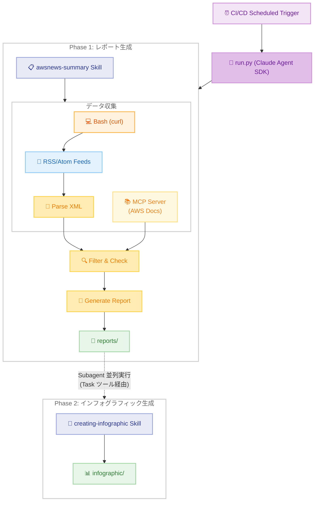
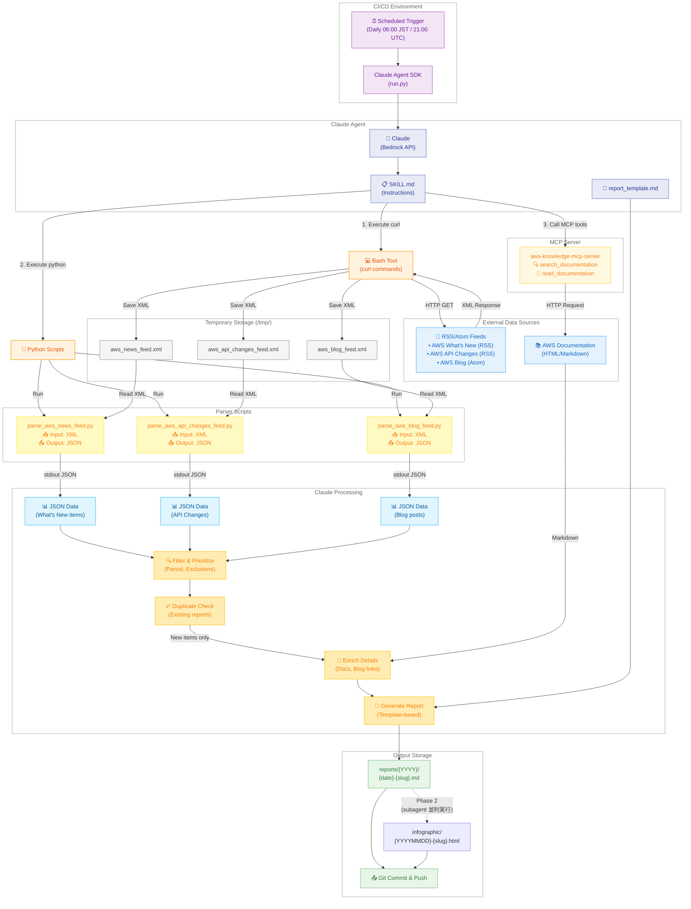
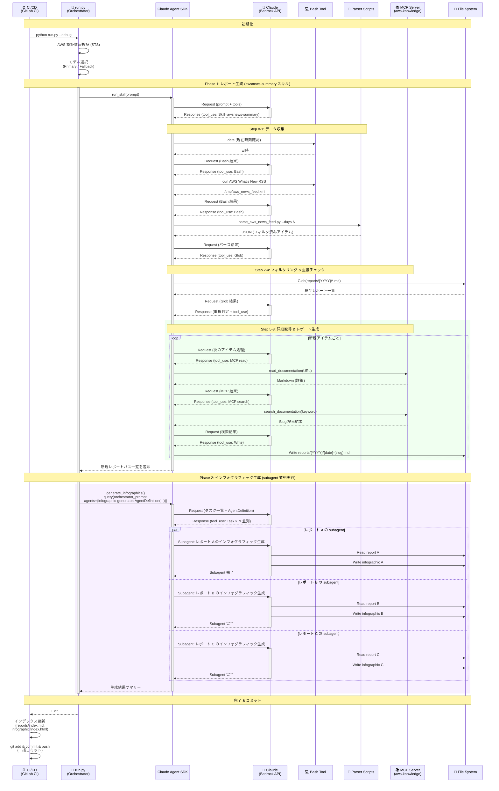
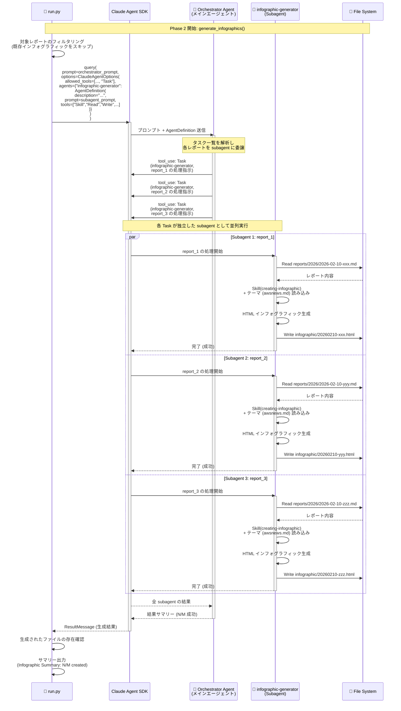

# AWS News Summary <!-- omit in toc -->

[English](README-en.md) | **日本語**

AWS What's New と AWS API Changes の情報を取得し、日本語で詳細な解説レポートを作成する Claude Agent SDK スキル。


- [アーキテクチャ](#アーキテクチャ)
  - [システム概要 (ハイレベル)](#システム概要-ハイレベル)
  - [システム概要 (詳細版)](#システム概要-詳細版)
  - [シーケンス図](#シーケンス図)
  - [シーケンス図 (Phase 2 詳細: Subagent 内部処理)](#シーケンス図-phase-2-詳細-subagent-内部処理)
- [プロジェクト構造](#プロジェクト構造)
- [MCP サーバー](#mcp-サーバー)
- [実行方法](#実行方法)
  - [CI/CD での実行 (Claude Agent SDK)](#cicd-での実行-claude-agent-sdk)
  - [ローカル開発](#ローカル開発)
- [情報ソース](#情報ソース)
- [出力](#出力)
- [参考資料](#参考資料)
  - [Claude Agent SDK](#claude-agent-sdk)
  - [CI/CD セットアップ](#cicd-セットアップ)
- [ライセンス](#ライセンス)


## アーキテクチャ

このスキルは Claude Agent SDK を使用し、GitHub Actions または GitLab CI からスケジュール実行される。`run.py` が 2 フェーズのオーケストレーターとして動作し、Phase 1 で Bedrock API 経由で Claude を呼び出して SKILL.md の定義に従い日本語レポートを自動生成し、Phase 2 では `AgentDefinition` で定義した `infographic-generator` subagent を Task ツール経由で並列に起動し、インフォグラフィックを生成する。

### システム概要 (ハイレベル)



**全体フロー:**

このスキルは CI/CD から定期実行され、`run.py` が 2 フェーズで処理を行います。

1. **Phase 1 - レポート生成**: RSS/Atom フィードと AWS ドキュメントから情報を取得し、テンプレートベースで構造化された日本語レポートを作成 (awsnews-summary スキル)
2. **Phase 2 - インフォグラフィック生成**: メインエージェントが `AgentDefinition` で定義された `infographic-generator` subagent を Task ツール経由で並列に起動し、各レポートの HTML インフォグラフィックを生成 (creating-infographic スキル)

### システム概要 (詳細版)

以下は実際の技術的な実装とデータフローを詳細に表現した図です。



**技術的な実装詳細:**

1. **データ収集フェーズ**
   - Claude Agent SDK が提供する Bash Tool 経由で `curl` コマンドを実行
   - RSS/Atom フィードを XML として `/tmp/` ディレクトリに保存
   - 3 つのフィード (What's New, API Changes, Blog) を並行取得

2. **パース処理フェーズ**
   - Python パーサースクリプト (`parse_*.py`) を実行
   - 各スクリプトが `/tmp/*.xml` を読み込み
   - 期間フィルタリングを適用し、JSON を stdout に出力

3. **詳細取得フェーズ**
   - MCP サーバー (`aws-knowledge-mcp-server`) 経由で追加情報を取得
   - `read_documentation`: What's New の詳細ページを Markdown で取得
   - `search_documentation`: 関連 Blog 記事を検索

4. **レポート生成フェーズ (Phase 1)**
   - 既存レポートとの重複チェック
   - テンプレート (`report_template.md`) ベースでレポート作成
   - `reports/{YYYY}/{date}-{slug}.md` に保存し Git にコミット

5. **インフォグラフィック生成フェーズ (Phase 2)**
   - `run.py` が 1 つの `query()` 呼び出しでオーケストレーターエージェントを起動
   - `AgentDefinition` で定義した `infographic-generator` subagent を Task ツール経由で並列に起動
   - 各 subagent が独立したコンテキストで `creating-infographic` スキルを使用して HTML インフォグラフィックを生成
   - `infographic/{YYYYMMDD}-{slug}.html` に保存

### シーケンス図

以下は、CI/CD パイプラインから run.py が Claude Agent SDK を実行し、2 フェーズでレポートとインフォグラフィックを生成する全体フローを示す。Phase 1 では awsnews-summary スキルを使用してレポートを生成し、Phase 2 では `AgentDefinition` で定義した `infographic-generator` subagent を Task ツール経由で並列に起動してインフォグラフィックを生成する。各フェーズのコンテキストが分離されることで、コンテキスト枯渇による生成漏れを防止する。



### シーケンス図 (Phase 2 詳細: Subagent 内部処理)

以下は、Phase 2 における subagent の内部処理フローの詳細を示す。`run.py` が 1 つの `query()` 呼び出しでオーケストレーターエージェントを起動し、`AgentDefinition` で定義された `infographic-generator` subagent を Task ツール経由で並列に起動する。各 subagent は独立したコンテキストでレポートを読み込み、creating-infographic スキルを使用して HTML インフォグラフィックを生成する。



## プロジェクト構造

```
awsnews-summary/
├── .claude/                           # Claude Code 設定
│   ├── settings.json                  # 権限と MCP 設定
│   └── skills/
│       ├── awsnews-summary/           # スキル定義 (レポート生成)
│       │   ├── SKILL.md               # スキル指示
│       │   ├── report_template.md     # レポートテンプレート
│       │   └── scripts/               # パーサースクリプト
│       │       ├── parse_aws_news_feed.py        # AWS What's New パーサー
│       │       ├── parse_aws_api_changes_feed.py # AWS API Changes パーサー
│       │       ├── parse_aws_blog_feed.py        # AWS Blog パーサー
│       │       └── parse_kiro_updates.py         # Kiro Updates パーサー
│       └── creating-infographic/      # スキル定義 (インフォグラフィック生成)
│           ├── SKILL.md               # スキル指示
│           └── themes/                # テーマ定義
├── .github/workflows/                 # GitHub Actions
├── .gitlab-ci.yml                     # GitLab CI パイプライン
├── .mcp.json                          # MCP サーバー設定
├── reports/                           # 生成されたレポート (年別)
│   ├── 2025/
│   └── 2026/
├── infographic/                       # 生成されたインフォグラフィック (HTML)
├── docs/                              # ドキュメント
│   ├── SETUP.md                       # CI/CD セットアップガイド (日本語)
│   └── SETUP-en.md                    # CI/CD セットアップガイド (英語)
├── CLAUDE.md                          # Claude Code 指示
├── README.md                          # 日本語ドキュメント
├── README-en.md                       # 英語ドキュメント
├── requirements.txt                   # Python 依存関係
└── run.py                             # CI/CD エントリポイント (2 フェーズオーケストレーター)
```

**注意**: スキルはプロジェクトレベル (`.claude/skills/`) で定義されている。これは、ユーザーレベルのスキル (`~/.claude/skills/`) が利用できない CI/CD 環境でも動作することを保証するため。`run.py` が Phase 1 (レポート生成) と Phase 2 (subagent 並列インフォグラフィック生成) をオーケストレーションする。

## MCP サーバー

このプロジェクトでは `.mcp.json` で設定された以下の MCP サーバーを使用する。

| サーバー | タイプ | 用途 |
|----------|--------|------|
| `aws-knowledge-mcp-server` | HTTP | AWS ドキュメント検索、ドキュメント読み込み、AWS Blog 検索 |

**注意**: RSS/Atom フィードの取得には MCP サーバーではなく、curl コマンドと外部 Python パーサースクリプト (scripts/) を使用している。これにより、RSS/Atom フィードのパース処理をスキル外で管理し、保守性を向上させている。

MCP 設定は Claude Agent SDK の `setting_sources=["project"]` により自動的に読み込まれる。

## 実行方法

### CI/CD での実行 (Claude Agent SDK)

このスキルは Claude Agent SDK を使用して GitHub Actions または GitLab CI から自動実行される。

**セットアップ**: 詳細な CI/CD 設定手順は [SETUP.md](docs/SETUP.md) を参照。

- AWS IAM OIDC プロバイダーのセットアップ
- IAM ロールと信頼ポリシーの設定
- GitHub Actions / GitLab CI 変数の設定

**GitHub Actions**:
```yaml
# .github/workflows/awsnews-summary.yml
- name: Configure AWS credentials
  uses: aws-actions/configure-aws-credentials@v4
  with:
    role-to-assume: ${{ vars.AWS_ROLE_ARN }}
    aws-region: ${{ vars.AWS_REGION }}

- name: Run AWS News Summary
  run: python run.py
```

**GitLab CI**:
```yaml
# .gitlab-ci.yml
aws_news_summary:
  id_tokens:
    GITLAB_OIDC_TOKEN:
      aud: https://gitlab.com
  script:
    - python run.py
```

### ローカル開発

**Claude Code CLI を使用**:
```bash
cd ~/.claude/skills/awsnews-summary
claude "AWS の最新ニュースをレポートして"
```

**run.py を使用**:
```bash
cd ~/.claude/skills/awsnews-summary
pip install -r requirements.txt

# デフォルトプロンプト (過去 1 週間)
python run.py

# カスタムプロンプト - 特定のサービスに絞る
python run.py "Run the awsnews-summary skill for Amazon Bedrock updates"

# カスタムプロンプト - 特定の期間を指定
python run.py "Run the awsnews-summary skill for AWS updates from the past 2 weeks"

# カスタムプロンプト - 特定の月を指定（実行時の現在日時が自動的に含まれます）
python run.py "Run the awsnews-summary skill for AWS updates launched in January 2026"
```

**注意**:
- `run.py` は Bedrock アクセス用の AWS 認証情報が設定されている必要がある
- プロンプトには「Run the awsnews-summary skill」を含めることで、スキルが確実に呼び出されます
- 実行時の現在日時が自動的にプロンプトに追加されるため、期間指定が正確に処理されます

## 情報ソース

| ソース | URL | フォーマット | 取得方法 |
|--------|-----|--------------|----------|
| AWS What's New | https://aws.amazon.com/new/feed/ | RSS/XML | curl + parse_aws_news_feed.py |
| AWS API Changes | https://awsapichanges.com/feed/feed.rss | RSS/XML | curl + parse_aws_api_changes_feed.py |
| AWS Blog | https://aws.amazon.com/blogs/aws/feed/ | Atom/XML | curl + parse_aws_blog_feed.py (補助) |
| AWS Blog | - | - | aws-knowledge-mcp-server search (推奨) |
| AWS Documentation | - | Markdown | aws-knowledge-mcp-server read_documentation |
| Kiro Blog | https://kiro.dev/blog/ | HTML | curl + parse_kiro_updates.py |
| Kiro Changelog | https://kiro.dev/changelog/ | HTML | curl + parse_kiro_updates.py |

## 出力

レポートとインフォグラフィックの 2 種類の成果物を生成する。

- **レポート**: 日本語 Markdown、`reports/{YYYY}/{YYYY}-{MM}-{DD}-{slug}.md`
- **インフォグラフィック**: HTML、`infographic/{YYYYMMDD}-{slug}.html`

## 参考資料

### Claude Agent SDK
- [Claude Agent SDK - Skills](https://platform.claude.com/docs/en/agent-sdk/skills) - SDK のエージェントスキル
- [Claude Agent SDK - Subagents](https://platform.claude.com/docs/en/agent-sdk/subagents) - SDK の Subagent (並列実行)
- [Claude Agent SDK - MCP](https://platform.claude.com/docs/en/agent-sdk/mcp) - SDK の MCP
- [Claude Agent SDK - Python](https://platform.claude.com/docs/en/agent-sdk/python) - Python SDK リファレンス
- [Agent Skills Overview](https://platform.claude.com/docs/en/agents-and-tools/agent-skills/overview) - 概念的な概要
- [Agent Skills Best Practices](https://platform.claude.com/docs/en/agents-and-tools/agent-skills/best-practices) - 作成ガイドライン
- [Claude Code Skills](https://code.claude.com/docs/en/skills) - スキル完全ガイド

### CI/CD セットアップ
- [aws-actions/configure-aws-credentials](https://github.com/aws-actions/configure-aws-credentials) - GitHub Actions で AWS 認証情報を設定するための公式アクション
- [GitHub Actions: AWS での OpenID Connect の設定](https://docs.github.com/en/actions/security-for-github-actions/security-hardening-your-deployments/configuring-openid-connect-in-amazon-web-services)
- [GitLab CI: AWS での OpenID Connect の設定](https://docs.gitlab.com/ci/cloud_services/aws/)

## ライセンス

MIT License - 詳細は [LICENSE](LICENSE) を参照。
