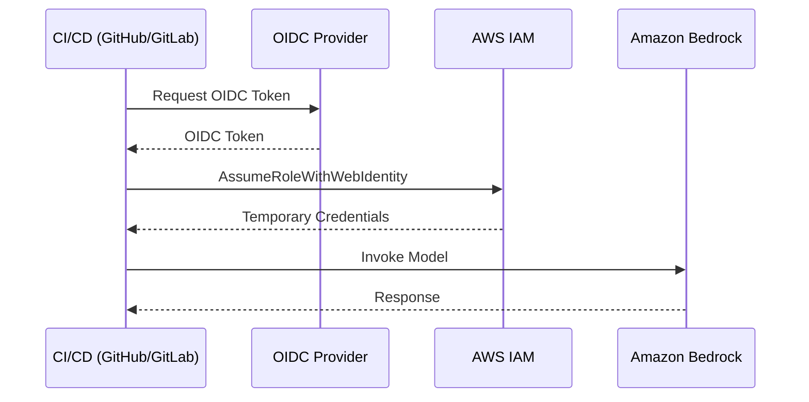

# CI/CD Setup Guide <!-- omit in toc -->

**English** | [日本語](SETUP.md)

[← Back to README](../README-en.md)

This guide explains how to configure GitHub Actions and GitLab CI to run the AWS News Summary automation using OpenID Connect (OIDC) authentication with AWS.

- [Overview](#overview)
- [Prerequisites](#prerequisites)
- [Part 1: AWS Setup (Common for Both)](#part-1-aws-setup-common-for-both)
    - [Enable Amazon Bedrock Model Access](#enable-amazon-bedrock-model-access)
- [Part 2: GitHub Actions Setup (AWS + Repository)](#part-2-github-actions-setup-aws--repository)
    - [Step 1: Create OIDC Provider and IAM Role](#step-1-create-oidc-provider-and-iam-role)
    - [Step 2: Configure GitHub Repository Variables](#step-2-configure-github-repository-variables)
    - [Step 3: Verify Workflow Configuration](#step-3-verify-workflow-configuration)
    - [Step 4: Test the Workflow](#step-4-test-the-workflow)
- [Part 3: GitLab CI Setup (AWS + Project)](#part-3-gitlab-ci-setup-aws--project)
    - [Step 1: Create OIDC Provider and IAM Role](#step-1-create-oidc-provider-and-iam-role-1)
    - [Step 2: Configure GitLab CI/CD Variables](#step-2-configure-gitlab-cicd-variables)
    - [Step 3: Configure Pipeline Schedule](#step-3-configure-pipeline-schedule)
    - [Step 4: Test the Pipeline](#step-4-test-the-pipeline)
- [Troubleshooting](#troubleshooting)
    - [Common Issues](#common-issues)
    - [Verify OIDC Token Claims](#verify-oidc-token-claims)
- [References](#references)
    - [GitHub Actions](#github-actions)
    - [GitLab CI](#gitlab-ci)
    - [AWS](#aws)


## Overview

Both GitHub Actions and GitLab CI support OIDC authentication with AWS, which allows your CI/CD pipelines to assume IAM roles without storing long-lived AWS credentials. This is the recommended approach for security.



## Prerequisites

- AWS Account with Amazon Bedrock access enabled
- Access to create IAM Identity Providers and Roles
- GitHub repository or GitLab project

## Part 1: AWS Setup (Common for Both)

### Enable Amazon Bedrock Model Access

1. Open the [Amazon Bedrock console](https://console.aws.amazon.com/bedrock/)
2. Navigate to **Model access** in the left sidebar
3. Click **Modify model access**
4. Enable access for:
   - `Anthropic Claude Opus 4.5`
   - `Anthropic Claude Sonnet 4.5` (fallback)
5. Click **Save changes**

## Part 2: GitHub Actions Setup (AWS + Repository)

### Step 1: Create OIDC Provider and IAM Role

Run the following script to create the GitHub OIDC provider, Bedrock IAM policy, and IAM role in one step.

```bash
./scripts/deploy-iam.sh -p github -o <OWNER> -r <REPO>
```

- `<OWNER>`: GitHub repository owner/org (e.g., `myorg`)
- `<REPO>`: GitHub repository name (e.g., `awsnews-summary`)

See `./scripts/deploy-iam.sh --help` for additional options.

The script creates the following resources via CloudFormation:

- GitHub OIDC provider
- IAM policy for Bedrock model invocation
- IAM role (with OIDC trust policy)

<details>
<summary>IAM policy details</summary>

This policy supports [Global cross-Region inference](https://docs.aws.amazon.com/bedrock/latest/userguide/global-cross-region-inference.html), allowing model invocation via `global.*` inference profiles.

```json
{
    "Version": "2012-10-17",
    "Statement": [
        {
            "Sid": "BedrockInvokeModel",
            "Effect": "Allow",
            "Action": [
                "bedrock:InvokeModel",
                "bedrock:InvokeModelWithResponseStream"
            ],
            "Resource": [
                "arn:aws:bedrock:*:*:inference-profile/global.anthropic.claude-*",
                "arn:aws:bedrock:*::foundation-model/anthropic.claude-*",
                "arn:aws:bedrock:*::foundation-model/us.anthropic.claude-*",
                "arn:aws:bedrock:::foundation-model/anthropic.claude-*"
            ]
        }
    ]
}
```

Each Resource ARN serves the following purpose:

- `inference-profile/global.anthropic.claude-*`: Access to the `global.*` inference profile itself
- `bedrock:*::foundation-model/anthropic.claude-*`: Access to Foundation Models in the requesting region
- `bedrock:*::foundation-model/us.anthropic.claude-*`: Access to US region-specific Foundation Models
- `bedrock:::foundation-model/anthropic.claude-*`: Access to Foundation Models for global routing (no region/account specified)

> **Reference**: [AWS documentation](https://docs.aws.amazon.com/bedrock/latest/userguide/global-cross-region-inference.html)

</details>

<details>
<summary>Manual setup instructions</summary>

#### Configure GitHub OIDC Provider

**Using AWS CLI:**

```bash
aws iam create-open-id-connect-provider \
    --url https://token.actions.githubusercontent.com \
    --client-id-list sts.amazonaws.com
```

**Using AWS Console:**

1. Open the [IAM console - Identity providers](https://console.aws.amazon.com/iam/home#/identity_providers)
2. Click **Add provider**
3. Configure:
   - **Provider type**: OpenID Connect
   - **Provider URL**: `https://token.actions.githubusercontent.com`
   - **Audience**: `sts.amazonaws.com`
4. Click **Get thumbprint**
5. Click **Add provider**

#### Create IAM Role for GitHub Actions

1. Open **[IAM console - Roles](https://console.aws.amazon.com/iam/home#/roles)** and click **[Create role](https://console.aws.amazon.com/iam/home#/roles/create)**
2. Select **Custom trust policy**
3. Paste the following trust policy (replace placeholders):

```json
{
    "Version": "2012-10-17",
    "Statement": [
        {
            "Effect": "Allow",
            "Principal": {
                "Federated": "arn:aws:iam::<AWS_ACCOUNT_ID>:oidc-provider/token.actions.githubusercontent.com"
            },
            "Action": "sts:AssumeRoleWithWebIdentity",
            "Condition": {
                "StringEquals": {
                    "token.actions.githubusercontent.com:aud": "sts.amazonaws.com"
                },
                "StringLike": {
                    "token.actions.githubusercontent.com:sub": "repo:<OWNER>/<REPO>:*"
                }
            }
        }
    ]
}
```

4. Click **Next** and attach a Bedrock IAM policy (see "IAM policy details" above) created manually
5. Name the role (e.g., `CICD-AWSNewsSummary`)
6. Click **Create role**

Replace:
- `<AWS_ACCOUNT_ID>`: Your AWS account ID
- `<OWNER>/<REPO>`: Your GitHub repository (e.g., `myorg/awsnews-summary`)

</details>

### Step 2: Configure GitHub Repository Variables

1. Go to your repository → **Settings** → **Secrets and variables** → **Actions**
2. Click **Variables** tab → **New repository variable**
3. Add the following variables:

| Name | Value | Description |
|------|-------|-------------|
| `AWS_ROLE_ARN` | `arn:aws:iam::<ACCOUNT_ID>:role/CICD-AWSNewsSummary` | IAM role ARN |
| `AWS_REGION` | `us-east-1` | AWS region for Bedrock |
| `INFOGRAPHIC_BASE_URL` | `https://<owner>.github.io/<repo>` | Base URL for infographic links |

### Step 3: Verify Workflow Configuration

The repository includes `.github/workflows/awsnews-summary.yml`. Key sections:

```yaml
permissions:
  id-token: write    # Required for OIDC
  contents: write    # Required to push reports

steps:
  - name: Configure AWS credentials
    uses: aws-actions/configure-aws-credentials@v4
    with:
      role-to-assume: ${{ vars.AWS_ROLE_ARN }}
      aws-region: ${{ vars.AWS_REGION }}
```

### Step 4: Test the Workflow

1. Go to **Actions** tab in your repository
2. Select **AWS News Summary** workflow
3. Click **Run workflow** → **Run workflow**

## Part 3: GitLab CI Setup (AWS + Project)

### Step 1: Create OIDC Provider and IAM Role

Run the following script to create the GitLab OIDC provider, Bedrock IAM policy, and IAM role in one step.

```bash
./scripts/deploy-iam.sh -p gitlab -g <GROUP> -r <PROJECT>
```

- `<GROUP>`: GitLab group/namespace (e.g., `mygroup`)
- `<PROJECT>`: GitLab project name (e.g., `awsnews-summary`)

See `./scripts/deploy-iam.sh --help` for additional options.

The script creates the following resources via CloudFormation:

- GitLab OIDC provider
- IAM policy for Bedrock model invocation
- IAM role (with OIDC trust policy)

<details>
<summary>IAM policy details</summary>

Same as the "IAM policy details" in Part 2 (GitHub Actions). See Part 2 for details.

</details>

<details>
<summary>Manual setup instructions</summary>

#### Add GitLab as OIDC Provider in AWS

**Using AWS CLI:**

```bash
aws iam create-open-id-connect-provider \
    --url https://gitlab.com \
    --client-id-list https://gitlab.com
```

**Using AWS Console:**

1. Open the [IAM console - Identity providers](https://console.aws.amazon.com/iam/home#/identity_providers)
2. Click **Add provider**
3. Configure:
   - **Provider type**: OpenID Connect
   - **Provider URL**: `https://gitlab.com`
   - **Audience**: `https://gitlab.com`
4. Click **Get thumbprint**
5. Click **Add provider**

#### Create IAM Role for GitLab CI

1. Open **[IAM console - Roles](https://console.aws.amazon.com/iam/home#/roles)** and click **[Create role](https://console.aws.amazon.com/iam/home#/roles/create)**
2. Select **Custom trust policy**
3. Paste the following trust policy (replace placeholders):

```json
{
    "Version": "2012-10-17",
    "Statement": [
        {
            "Effect": "Allow",
            "Principal": {
                "Federated": "arn:aws:iam::<AWS_ACCOUNT_ID>:oidc-provider/gitlab.com"
            },
            "Action": "sts:AssumeRoleWithWebIdentity",
            "Condition": {
                "StringEquals": {
                    "gitlab.com:aud": "https://gitlab.com"
                },
                "StringLike": {
                    "gitlab.com:sub": "project_path:<GROUP>/<PROJECT>:*"
                }
            }
        }
    ]
}
```

4. Click **Next** and attach a Bedrock IAM policy (see "IAM policy details" above) created manually
5. Name the role (e.g., `CICD-AWSNewsSummary`)
6. Click **Create role**

Replace:
- `<AWS_ACCOUNT_ID>`: Your AWS account ID
- `<GROUP>/<PROJECT>`: Your GitLab project path (e.g., `mygroup/awsnews-summary`)

</details>

### Step 2: Configure GitLab CI/CD Variables

#### Create Personal Access Token

1. Go to your project → **Settings** → **Access Tokens**
2. Click **Add new token**
3. Configure:
   - **Token name**: `CI_PUSH_TOKEN` (or any name you prefer)
   - **Expiration date**: Set an appropriate expiration (e.g., 1 year)
   - **Select a role**: ⭐ **Maintainer** (required to push to protected branches)
   - **Select scopes**: Check `write_repository`
4. Click **Create project access token**
5. Copy the displayed token (it will not be shown again after closing this page)

**Important**: 
- **Select Maintainer role**. Developer role cannot push to protected branches (such as main)
- The token is only displayed once, so make sure to copy and store it securely

#### Configure CI/CD Variables

1. Go to your project → **Settings** → **CI/CD**
2. Expand **Variables** section
3. Click **Add variable** and add:

| Key | Value | Flags | Required |
|-----|-------|-------|----------|
| `AWS_ROLE_ARN` | `arn:aws:iam::<ACCOUNT_ID>:role/CICD-AWSNewsSummary` | Protected, Masked | ✅ |
| `AWS_DEFAULT_REGION` | `us-east-1` | - | ⚠️ Recommended |
| `CI_PUSH_TOKEN` | `<Copied Personal Access Token>` | Protected, Masked | ✅ |
| `INFOGRAPHIC_BASE_URL` | `https://<owner>.gitlab.io/<project>` | - | ⚠️ Recommended |

**Note**: 
- `AWS_DEFAULT_REGION` has a default value of `us-east-1` in `.gitlab-ci.yml`, but you can override it if using a different region
- For gitlab.com, the OIDC audience defaults to `https://gitlab.com` and does not need to be configured
- `INFOGRAPHIC_BASE_URL` is used for infographic link URLs in reports. Set this to your GitLab Pages or GitHub Pages URL

### Step 3: Configure Pipeline Schedule

**Note**: The `.gitlab-ci.yml` file defines the pipeline behavior when triggered by a schedule, but the actual schedule timing (cron expression) must be configured separately in the GitLab UI.

1. Go to **Build** → **Pipeline schedules**
2. Click **New schedule**
3. Configure:
   - **Description**: Daily AWS News Summary
   - **Interval Pattern**: `0 6 * * *` (06:00 daily)
   - **Cron Timezone**: `[UTC+9] Tokyo`
   - **Target branch**: `main`
4. Click **Save pipeline schedule**

### Step 4: Test the Pipeline

1. Go to **Build** → **Pipelines**
2. Click **Run pipeline**
3. Select branch and click **Run pipeline**

## Troubleshooting

### Common Issues

#### "Not authorized to perform sts:AssumeRoleWithWebIdentity"

- Verify the trust policy conditions match your repository/project path exactly
- Check that the OIDC provider URL matches (no trailing slash)
- Ensure the audience is configured correctly

#### "Access denied" for Bedrock

- Verify the IAM role has the `BedrockInvokePolicy` attached
- Check that model access is enabled in the Bedrock console
- Ensure you're using a supported region (e.g., `us-east-1`)

#### GitLab: "CI_PUSH_TOKEN" errors

- Create a Project Access Token or Personal Access Token with `write_repository` scope
- **Important**: Select **Maintainer** role (not Developer) to push to protected branches
- Add it as a CI/CD variable with Protected and Masked flags

#### "You are not allowed to push code to protected branches"

This error occurs when the `CI_PUSH_TOKEN` has insufficient permissions.

**Solution**:
1. Go to **Settings** → **Access Tokens**
2. Check the role of your existing token
3. If it's "Developer", create a new token with **Maintainer** role
4. Update the `CI_PUSH_TOKEN` CI/CD variable with the new token

**Reference**: [GitLab CI/CD で commit を追加する方法](https://zenn.dev/offiter/articles/gitlab_cicd_add_commit)

### Verify OIDC Token Claims

**GitHub Actions**:
```yaml
- name: Debug OIDC
  run: |
    echo "Subject: $GITHUB_REPOSITORY:$GITHUB_REF"
```

**GitLab CI**:
```yaml
debug_oidc:
  script:
    - echo "Subject: project_path:$CI_PROJECT_PATH:ref_type:$CI_COMMIT_REF_TYPE:ref:$CI_COMMIT_REF_NAME"
```

## References

### GitHub Actions
- [aws-actions/configure-aws-credentials](https://github.com/aws-actions/configure-aws-credentials) - Official action to configure AWS credentials in GitHub Actions
- [Configuring OpenID Connect in Amazon Web Services](https://docs.github.com/en/actions/security-for-github-actions/security-hardening-your-deployments/configuring-openid-connect-in-amazon-web-services)
- [Workflow syntax for GitHub Actions](https://docs.github.com/en/actions/reference/workflow-syntax-for-github-actions)
- [Store information in variables](https://docs.github.com/en/actions/how-tos/write-workflows/choose-what-workflows-do/use-variables)

### GitLab CI
- [Configure OpenID Connect in AWS to retrieve temporary credentials](https://docs.gitlab.com/ci/cloud_services/aws/)
- [Configure OpenID Connect between GitLab and AWS (Guided Exploration)](https://gitlab.com/guided-explorations/aws/configure-openid-connect-in-aws)

### AWS
- [Creating OpenID Connect (OIDC) identity providers](https://docs.aws.amazon.com/IAM/latest/UserGuide/id_roles_providers_create_oidc.html)
- [Amazon Bedrock User Guide](https://docs.aws.amazon.com/bedrock/latest/userguide/)
- [IAM JSON policy elements: Condition](https://docs.aws.amazon.com/IAM/latest/UserGuide/reference_policies_elements_condition.html)
