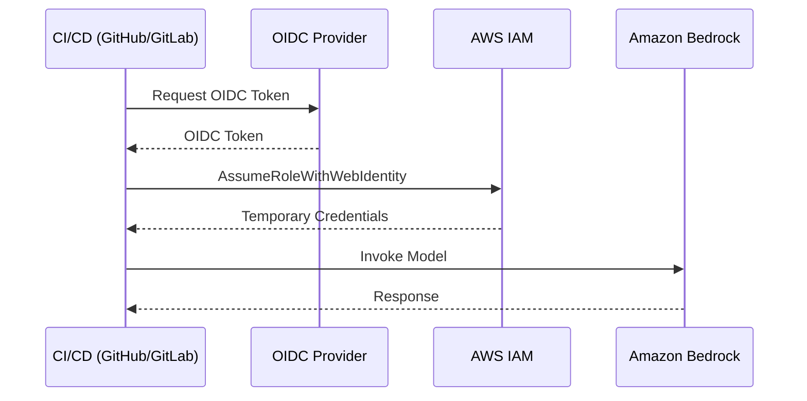

# CI/CD セットアップガイド <!-- omit in toc -->

[English](SETUP-en.md) | **日本語**

[← README に戻る](../README.md)

このガイドでは、OpenID Connect (OIDC) 認証を使用して GitHub Actions と GitLab CI で AWS News Summary の自動化を設定する方法を説明する。

- [概要](#概要)
- [前提条件](#前提条件)
- [パート 1: AWS セットアップ (共通)](#パート-1-aws-セットアップ-共通)
  - [Amazon Bedrock モデルアクセスを有効化](#amazon-bedrock-モデルアクセスを有効化)
- [パート 2: GitHub Actions 向けセットアップ (AWS + リポジトリ)](#パート-2-github-actions-向けセットアップ-aws--リポジトリ)
  - [ステップ 1: OIDC プロバイダーと IAM ロールを作成](#ステップ-1-oidc-プロバイダーと-iam-ロールを作成)
  - [ステップ 2: GitHub リポジトリ変数を設定](#ステップ-2-github-リポジトリ変数を設定)
  - [ステップ 3: ワークフロー設定を確認](#ステップ-3-ワークフロー設定を確認)
  - [ステップ 4: ワークフローをテスト](#ステップ-4-ワークフローをテスト)
- [パート 3: GitLab CI 向けセットアップ (AWS + プロジェクト)](#パート-3-gitlab-ci-向けセットアップ-aws--プロジェクト)
  - [ステップ 1: OIDC プロバイダーと IAM ロールを作成](#ステップ-1-oidc-プロバイダーと-iam-ロールを作成-1)
  - [ステップ 2: GitLab CI/CD 変数を設定](#ステップ-2-gitlab-cicd-変数を設定)
    - [Personal Access Token の作成](#personal-access-token-の作成)
    - [CI/CD 変数の設定](#cicd-変数の設定)
  - [ステップ 3: パイプラインスケジュールを設定](#ステップ-3-パイプラインスケジュールを設定)
  - [ステップ 4: パイプラインをテスト](#ステップ-4-パイプラインをテスト)
- [トラブルシューティング](#トラブルシューティング)
  - [よくある問題](#よくある問題)
    - ["Not authorized to perform sts:AssumeRoleWithWebIdentity"](#not-authorized-to-perform-stsassumerolewithwebidentity)
    - [Bedrock で "Access denied"](#bedrock-で-access-denied)
    - [GitLab: "CI\_PUSH\_TOKEN" エラー](#gitlab-ci_push_token-エラー)
    - ["You are not allowed to push code to protected branches"](#you-are-not-allowed-to-push-code-to-protected-branches)
  - [OIDC トークンクレームの確認](#oidc-トークンクレームの確認)
- [参考資料](#参考資料)
  - [GitHub Actions](#github-actions)
  - [GitLab CI](#gitlab-ci)
  - [AWS](#aws)


## 概要

GitHub Actions と GitLab CI は両方とも AWS との OIDC 認証をサポートしており、長期間有効な AWS 認証情報を保存せずに CI/CD パイプラインで IAM ロールを引き受けることができる。これはセキュリティ上推奨されるアプローチである。



## 前提条件

- Amazon Bedrock アクセスが有効な AWS アカウント
- IAM ID プロバイダーとロールを作成する権限
- GitHub リポジトリまたは GitLab プロジェクト

## パート 1: AWS セットアップ (共通)

### Amazon Bedrock モデルアクセスを有効化

1. [Amazon Bedrock コンソール](https://console.aws.amazon.com/bedrock/)を開く
2. 左サイドバーで **Model access** に移動
3. **Modify model access** をクリック
4. 以下のモデルへのアクセスを有効化する。
   - `Anthropic Claude Opus 4.5`
   - `Anthropic Claude Sonnet 4.5` (フォールバック用)
5. **Save changes** をクリック

## パート 2: GitHub Actions 向けセットアップ (AWS + リポジトリ)

### ステップ 1: OIDC プロバイダーと IAM ロールを作成

以下のスクリプトで、GitHub OIDC プロバイダー、Bedrock 用 IAM ポリシー、IAM ロールを一括作成できる。

```bash
./scripts/deploy-iam.sh -p github -o <OWNER> -r <REPO>
```

- `<OWNER>`: GitHub リポジトリのオーナー/org (例: `myorg`)
- `<REPO>`: GitHub リポジトリ名 (例: `awsnews-summary`)

オプションの詳細は `./scripts/deploy-iam.sh --help` を参照。

スクリプトにより、以下のリソースが CloudFormation で一括作成される。

- GitHub OIDC プロバイダー
- Bedrock モデル呼び出し用 IAM ポリシー
- IAM ロール (OIDC 信頼ポリシー付き)

<details>
<summary>作成される IAM ポリシーの内容</summary>

このポリシーは [Global cross-Region inference](https://docs.aws.amazon.com/bedrock/latest/userguide/global-cross-region-inference.html) に対応しており、`global.*` inference profile 経由でのモデル呼び出しを許可する。

```json
{
    "Version": "2012-10-17",
    "Statement": [
        {
            "Sid": "BedrockInvokeModel",
            "Effect": "Allow",
            "Action": [
                "bedrock:InvokeModel",
                "bedrock:InvokeModelWithResponseStream"
            ],
            "Resource": [
                "arn:aws:bedrock:*:*:inference-profile/global.anthropic.claude-*",
                "arn:aws:bedrock:*::foundation-model/anthropic.claude-*",
                "arn:aws:bedrock:*::foundation-model/us.anthropic.claude-*",
                "arn:aws:bedrock:::foundation-model/anthropic.claude-*"
            ]
        }
    ]
}
```

各 Resource ARN の役割は以下の通り。

- `inference-profile/global.anthropic.claude-*`: `global.*` inference profile 自体へのアクセス
- `bedrock:*::foundation-model/anthropic.claude-*`: リクエスト元リージョンの Foundation Model へのアクセス
- `bedrock:*::foundation-model/us.anthropic.claude-*`: US リージョン固有の Foundation Model へのアクセス
- `bedrock:::foundation-model/anthropic.claude-*`: グローバルルーティング先の Foundation Model へのアクセス (リージョン・アカウント指定なし)

> **参考**: [AWS 公式ドキュメント](https://docs.aws.amazon.com/bedrock/latest/userguide/global-cross-region-inference.html)

</details>

<details>
<summary>手動で設定する場合</summary>

#### OIDC プロバイダーの作成

**AWS CLI を使用する場合:**

```bash
aws iam create-open-id-connect-provider \
    --url https://token.actions.githubusercontent.com \
    --client-id-list sts.amazonaws.com
```

**AWS コンソールを使用する場合:**

1. [IAM コンソール - Identity providers](https://console.aws.amazon.com/iam/home#/identity_providers) を開く
2. **Add provider** をクリック
3. 以下を設定する。
   - **Provider type**: OpenID Connect
   - **Provider URL**: `https://token.actions.githubusercontent.com`
   - **Audience**: `sts.amazonaws.com`
4. **Get thumbprint** をクリック
5. **Add provider** をクリック

#### IAM ロールの作成

1. [IAM コンソール - Roles](https://console.aws.amazon.com/iam/home#/roles) を開き、[Create role](https://console.aws.amazon.com/iam/home#/roles/create) をクリック
2. **Custom trust policy** を選択
3. 以下の信頼ポリシーを貼り付ける (プレースホルダーを置換)。

```json
{
    "Version": "2012-10-17",
    "Statement": [
        {
            "Effect": "Allow",
            "Principal": {
                "Federated": "arn:aws:iam::<AWS_ACCOUNT_ID>:oidc-provider/token.actions.githubusercontent.com"
            },
            "Action": "sts:AssumeRoleWithWebIdentity",
            "Condition": {
                "StringEquals": {
                    "token.actions.githubusercontent.com:aud": "sts.amazonaws.com"
                },
                "StringLike": {
                    "token.actions.githubusercontent.com:sub": "repo:<OWNER>/<REPO>:*"
                }
            }
        }
    ]
}
```

4. **Next** をクリックし、Bedrock 用 IAM ポリシー (上記「作成される IAM ポリシーの内容」参照) を手動で作成してアタッチ
5. ロール名を入力 (例: `CICD-AWSNewsSummary`)
6. **Create role** をクリック

置換する値は以下の通り。
- `<AWS_ACCOUNT_ID>`: AWS アカウント ID
- `<OWNER>/<REPO>`: GitHub リポジトリ (例: `myorg/awsnews-summary`)

</details>

### ステップ 2: GitHub リポジトリ変数を設定

1. リポジトリ → **Settings** → **Secrets and variables** → **Actions** に移動
2. **Variables** タブ → **New repository variable** をクリック
3. 以下の変数を追加する。

| 名前 | 値 | 説明 |
|------|-----|------|
| `AWS_ROLE_ARN` | `arn:aws:iam::<ACCOUNT_ID>:role/CICD-AWSNewsSummary` | IAM ロール ARN |
| `AWS_REGION` | `us-east-1` | Bedrock 用 AWS リージョン |
| `INFOGRAPHIC_BASE_URL` | `https://<owner>.github.io/<repo>` | インフォグラフィックのリンク用ベース URL |

### ステップ 3: ワークフロー設定を確認

リポジトリには `.github/workflows/awsnews-summary.yml` が含まれている。主要なセクションは以下の通り。

```yaml
permissions:
  id-token: write    # OIDC に必要
  contents: write    # レポートのプッシュに必要

steps:
  - name: Configure AWS credentials
    uses: aws-actions/configure-aws-credentials@v4
    with:
      role-to-assume: ${{ vars.AWS_ROLE_ARN }}
      aws-region: ${{ vars.AWS_REGION }}
```

### ステップ 4: ワークフローをテスト

1. リポジトリの **Actions** タブに移動
2. **AWS News Summary** ワークフローを選択
3. **Run workflow** → **Run workflow** をクリック

## パート 3: GitLab CI 向けセットアップ (AWS + プロジェクト)

### ステップ 1: OIDC プロバイダーと IAM ロールを作成

以下のスクリプトで、GitLab OIDC プロバイダー、Bedrock 用 IAM ポリシー、IAM ロールを一括作成できる。

```bash
./scripts/deploy-iam.sh -p gitlab -g <GROUP> -r <PROJECT>
```

- `<GROUP>`: GitLab グループ/namespace (例: `mygroup`)
- `<PROJECT>`: GitLab プロジェクト名 (例: `awsnews-summary`)

オプションの詳細は `./scripts/deploy-iam.sh --help` を参照。

スクリプトにより、以下のリソースが CloudFormation で一括作成される。

- GitLab OIDC プロバイダー
- Bedrock モデル呼び出し用 IAM ポリシー
- IAM ロール (OIDC 信頼ポリシー付き)

<details>
<summary>作成される IAM ポリシーの内容</summary>

GitHub Actions セクションの「作成される IAM ポリシーの内容」と同一。詳細はパート 2 を参照。

</details>

<details>
<summary>手動で設定する場合</summary>

#### OIDC プロバイダーの作成

**AWS CLI を使用する場合:**

```bash
aws iam create-open-id-connect-provider \
    --url https://gitlab.com \
    --client-id-list https://gitlab.com
```

**AWS コンソールを使用する場合:**

1. [IAM コンソール - Identity providers](https://console.aws.amazon.com/iam/home#/identity_providers) を開く
2. **Add provider** をクリック
3. 以下を設定する。
   - **Provider type**: OpenID Connect
   - **Provider URL**: `https://gitlab.com`
   - **Audience**: `https://gitlab.com`
4. **Get thumbprint** をクリック
5. **Add provider** をクリック

#### IAM ロールの作成

1. **[Roles](https://console.aws.amazon.com/iam/home#/roles)** → **[Create role](https://console.aws.amazon.com/iam/home#/roles/create)** に移動
2. **Custom trust policy** を選択
3. 以下の信頼ポリシーを貼り付ける (プレースホルダーを置換)。

```json
{
    "Version": "2012-10-17",
    "Statement": [
        {
            "Effect": "Allow",
            "Principal": {
                "Federated": "arn:aws:iam::<AWS_ACCOUNT_ID>:oidc-provider/gitlab.com"
            },
            "Action": "sts:AssumeRoleWithWebIdentity",
            "Condition": {
                "StringEquals": {
                    "gitlab.com:aud": "https://gitlab.com"
                },
                "StringLike": {
                    "gitlab.com:sub": "project_path:<GROUP>/<PROJECT>:*"
                }
            }
        }
    ]
}
```

4. **Next** をクリックし、Bedrock 用 IAM ポリシー (上記「作成される IAM ポリシーの内容」参照) を手動で作成してアタッチ
5. ロール名を入力 (例: `CICD-AWSNewsSummary`)
6. **Create role** をクリック

置換する値は以下の通り。
- `<AWS_ACCOUNT_ID>`: AWS アカウント ID
- `<GROUP>/<PROJECT>`: GitLab プロジェクトパス (例: `mygroup/awsnews-summary`)

</details>

### ステップ 2: GitLab CI/CD 変数を設定

#### Personal Access Token の作成

1. プロジェクト → **Settings** → **Access Tokens** に移動
2. **Add new token** をクリック
3. 以下を設定する。
   - **Token name**: `CI_PUSH_TOKEN` (任意の名前)
   - **Expiration date**: 適切な有効期限を設定 (例: 1 年後)
   - **Select a role**: ⭐ **Maintainer** (保護されたブランチへのプッシュに必要)
   - **Select scopes**: `write_repository` にチェック
4. **Create project access token** をクリック
5. 表示されたトークンをコピー (この画面を閉じると二度と表示されない)

**重要**: 
- **Role は Maintainer を選択してください**。Developer ロールでは保護されたブランチ (main など) へのプッシュができません
- トークンは一度しか表示されないため、必ずコピーして安全に保管してください

#### CI/CD 変数の設定

1. プロジェクト → **Settings** → **CI/CD** に移動
2. **Variables** セクションを展開
3. **Add variable** をクリックして以下を追加する。

| キー | 値 | フラグ | 必須 |
|------|-----|--------|------|
| `AWS_ROLE_ARN` | `arn:aws:iam::<ACCOUNT_ID>:role/CICD-AWSNewsSummary` | Protected, Masked | ✅ |
| `AWS_DEFAULT_REGION` | `us-east-1` | - | ⚠️ 推奨 |
| `CI_PUSH_TOKEN` | `<コピーした Personal Access Token>` | Protected, Masked | ✅ |
| `INFOGRAPHIC_BASE_URL` | `https://<owner>.gitlab.io/<project>` | - | ⚠️ 推奨 |

**注意**: 
- `AWS_DEFAULT_REGION` は `.gitlab-ci.yml` でデフォルト値 `us-east-1` が設定されていますが、別のリージョンを使用する場合は上書きしてください
- gitlab.com の場合、OIDC audience はデフォルトで `https://gitlab.com` に設定されるため、設定不要
- `INFOGRAPHIC_BASE_URL` はレポート内のインフォグラフィックリンク URL に使用される。GitLab Pages または GitHub Pages の URL を設定する

### ステップ 3: パイプラインスケジュールを設定

**注意**: `.gitlab-ci.yml` にはスケジュール実行時の動作が定義されていますが、実行タイミング（cron 式）は GitLab UI で別途設定する必要があります。

1. **Build** → **Pipeline schedules** に移動
2. **New schedule** をクリック
3. 以下を設定する。
   - **Description**: Daily AWS News Summary
   - **Interval Pattern**: `0 6 * * *` (毎日 06:00)
   - **Cron Timezone**: `[UTC+9] Tokyo`
   - **Target branch**: `main`
4. **Save pipeline schedule** をクリック

### ステップ 4: パイプラインをテスト

1. **Build** → **Pipelines** に移動
2. **Run pipeline** をクリック
3. ブランチを選択し、**Run pipeline** をクリック

## トラブルシューティング

### よくある問題

#### "Not authorized to perform sts:AssumeRoleWithWebIdentity"

- 信頼ポリシーの条件がリポジトリ/プロジェクトパスと正確に一致していることを確認
- OIDC プロバイダー URL が一致していることを確認 (末尾のスラッシュなし)
- Audience が正しく設定されていることを確認

#### Bedrock で "Access denied"

- IAM ロールに `BedrockInvokePolicy` がアタッチされていることを確認
- Bedrock コンソールでモデルアクセスが有効になっていることを確認
- サポートされているリージョン (例: `us-east-1`) を使用していることを確認

#### GitLab: "CI_PUSH_TOKEN" エラー

- `write_repository` スコープを持つ Project Access Token または Personal Access Token を作成
- **重要**: 保護されたブランチへのプッシュには **Maintainer** ロールが必要 (Developer では不可)
- Protected と Masked フラグを付けて CI/CD 変数として追加

#### "You are not allowed to push code to protected branches"

このエラーは、`CI_PUSH_TOKEN` の権限が不足している場合に発生します。

**解決方法**:
1. **Settings** → **Access Tokens** に移動
2. 既存のトークンのロールを確認
3. "Developer" の場合は、**Maintainer** ロールで新しいトークンを作成
4. 新しいトークンで `CI_PUSH_TOKEN` CI/CD 変数を更新

**参考**: [GitLab CI/CD で commit を追加する方法](https://zenn.dev/offiter/articles/gitlab_cicd_add_commit)

### OIDC トークンクレームの確認

**GitHub Actions**:
```yaml
- name: Debug OIDC
  run: |
    echo "Subject: $GITHUB_REPOSITORY:$GITHUB_REF"
```

**GitLab CI**:
```yaml
debug_oidc:
  script:
    - echo "Subject: project_path:$CI_PROJECT_PATH:ref_type:$CI_COMMIT_REF_TYPE:ref:$CI_COMMIT_REF_NAME"
```

## 参考資料

### GitHub Actions
- [aws-actions/configure-aws-credentials](https://github.com/aws-actions/configure-aws-credentials) - GitHub Actions で AWS 認証情報を設定するための公式アクション
- [AWS での OpenID Connect の設定](https://docs.github.com/en/actions/security-for-github-actions/security-hardening-your-deployments/configuring-openid-connect-in-amazon-web-services)
- [GitHub Actions のワークフロー構文](https://docs.github.com/en/actions/reference/workflow-syntax-for-github-actions)
- [変数に情報を格納](https://docs.github.com/en/actions/how-tos/write-workflows/choose-what-workflows-do/use-variables)

### GitLab CI
- [AWS での OpenID Connect の設定による一時認証情報の取得](https://docs.gitlab.com/ci/cloud_services/aws/)
- [GitLab と AWS 間の OpenID Connect の設定 (ガイド付き探索)](https://gitlab.com/guided-explorations/aws/configure-openid-connect-in-aws)

### AWS
- [OpenID Connect (OIDC) ID プロバイダーの作成](https://docs.aws.amazon.com/IAM/latest/UserGuide/id_roles_providers_create_oidc.html)
- [Amazon Bedrock ユーザーガイド](https://docs.aws.amazon.com/bedrock/latest/userguide/)
- [IAM JSON ポリシー要素: Condition](https://docs.aws.amazon.com/IAM/latest/UserGuide/reference_policies_elements_condition.html)
