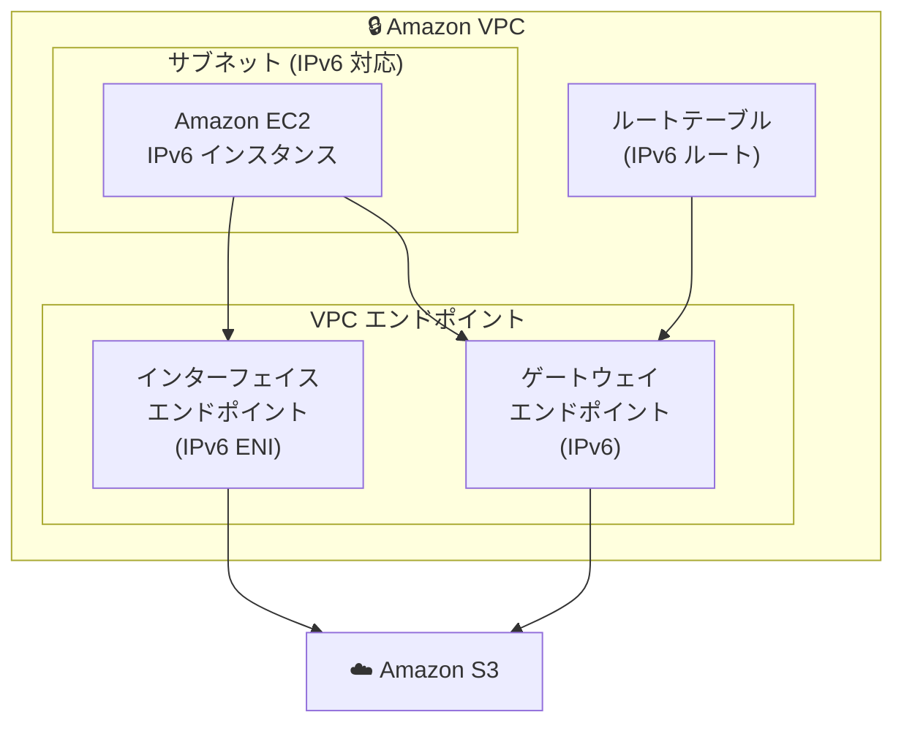

# Amazon S3 - VPC エンドポイントの IPv6 サポート

**リリース日**: 2025 年 11 月 10 日
**サービス**: Amazon S3 / Amazon VPC
**機能**: ゲートウェイおよびインターフェイス VPC エンドポイントの IPv6 サポート

## 概要

AWS は Amazon S3 が AWS PrivateLink ゲートウェイおよびインターフェイス VPC エンドポイントで IPv6 アドレスをサポートすることを発表しました。この機能により、VPC 内から S3 へのプライベート接続で IPv6 を使用できるようになり、アドレス空間の管理が大幅に簡素化されます。

インターネットの継続的な成長により、利用可能な IPv4 アドレスが枯渇しつつあります。IPv6 は利用可能なアドレス数を数桁増加させ、VPC 内で重複するアドレス空間を管理する必要がなくなります。

**アップデート前の課題**

- VPC エンドポイント経由の S3 アクセスは IPv4 のみに制限されていた
- IPv4 アドレスの枯渇により、大規模な VPC 設計が困難になっていた
- 複数の VPC 間で重複するアドレス空間の管理が必要だった
- IPv6 ネイティブなワークロードから S3 へのプライベートアクセスが制限されていた

**アップデート後の改善**

- ゲートウェイ VPC エンドポイントで IPv6 アドレスをサポート
- インターフェイス VPC エンドポイントで IPv6 アドレスをサポート
- デュアルスタック（IPv4/IPv6）構成のサポート
- 重複するアドレス空間の管理が不要に

## アーキテクチャ図



VPC 内の IPv6 対応インスタンスから、ゲートウェイまたはインターフェイス VPC エンドポイント経由で S3 にプライベートアクセスできます。

## サービスアップデートの詳細

### 主要機能

1. **ゲートウェイ VPC エンドポイントの IPv6 サポート**
   - ルートテーブルに IPv6 アドレスを自動追加
   - 追加コストなしで利用可能
   - 既存のゲートウェイエンドポイントにも適用可能

2. **インターフェイス VPC エンドポイントの IPv6 サポート**
   - IPv6 アドレスを持つ Elastic Network Interface (ENI) を自動設定
   - AWS PrivateLink 経由のプライベート接続
   - DNS 解決による透過的なアクセス

3. **デュアルスタックサポート**
   - IPv4 と IPv6 の両方をサポート
   - 既存の IPv4 ワークロードとの互換性を維持
   - 段階的な IPv6 移行が可能

## 技術仕様

### IP アドレスタイプの設定

| 設定値 | 説明 |
|--------|------|
| IPv4 | IPv4 アドレスのみを使用 |
| IPv6 | IPv6 アドレスのみを使用 |
| Dualstack | IPv4 と IPv6 の両方を使用 |

### エンドポイントタイプ別の動作

| エンドポイントタイプ | IPv6 有効時の動作 |
|---------------------|------------------|
| ゲートウェイ | ルートテーブルに IPv6 ルートを自動追加 |
| インターフェイス | IPv6 アドレスを持つ ENI を自動設定 |

## 設定方法

### 前提条件

1. AWS アカウント
2. IPv6 CIDR ブロックが割り当てられた VPC
3. IPv6 対応のサブネット
4. 適切な IAM 権限

### 手順

#### ステップ 1: VPC の IPv6 CIDR ブロック割り当て

VPC に IPv6 CIDR ブロックを割り当てます。

```bash
# VPC に IPv6 CIDR ブロックを割り当て
aws ec2 associate-vpc-cidr-block \
    --vpc-id vpc-12345678 \
    --amazon-provided-ipv6-cidr-block
```

VPC に Amazon 提供の IPv6 CIDR ブロックを割り当てます。

#### ステップ 2: サブネットへの IPv6 CIDR ブロック割り当て

サブネットに IPv6 CIDR ブロックを割り当てます。

```bash
# サブネットに IPv6 CIDR ブロックを割り当て
aws ec2 associate-subnet-cidr-block \
    --subnet-id subnet-12345678 \
    --ipv6-cidr-block 2600:1f18:xxxx:xxxx::/64
```

サブネットに IPv6 CIDR ブロックを割り当てて、IPv6 対応にします。

#### ステップ 3: ゲートウェイ VPC エンドポイントの作成（IPv6）

IPv6 対応のゲートウェイ VPC エンドポイントを作成します。

```bash
# ゲートウェイ VPC エンドポイントの作成（IPv6）
aws ec2 create-vpc-endpoint \
    --vpc-id vpc-12345678 \
    --service-name com.amazonaws.us-east-1.s3 \
    --vpc-endpoint-type Gateway \
    --route-table-ids rtb-12345678 \
    --ip-address-type dualstack
```

デュアルスタック（IPv4/IPv6）対応のゲートウェイ VPC エンドポイントを作成します。

#### ステップ 4: インターフェイス VPC エンドポイントの作成（IPv6）

IPv6 対応のインターフェイス VPC エンドポイントを作成します。

```bash
# インターフェイス VPC エンドポイントの作成（IPv6）
aws ec2 create-vpc-endpoint \
    --vpc-id vpc-12345678 \
    --service-name com.amazonaws.us-east-1.s3 \
    --vpc-endpoint-type Interface \
    --subnet-ids subnet-12345678 \
    --security-group-ids sg-12345678 \
    --ip-address-type ipv6
```

IPv6 専用のインターフェイス VPC エンドポイントを作成します。

#### ステップ 5: 既存エンドポイントの IP アドレスタイプ変更

既存のエンドポイントの IP アドレスタイプを変更します。

```bash
# 既存エンドポイントの IP アドレスタイプを変更
aws ec2 modify-vpc-endpoint \
    --vpc-endpoint-id vpce-12345678 \
    --ip-address-type dualstack
```

既存のエンドポイントをデュアルスタックに変更します。

## メリット

### ビジネス面

- **スケーラビリティ**: IPv6 の広大なアドレス空間により、大規模な VPC 設計が可能
- **コスト削減**: 重複するアドレス空間の管理コストを削減
- **将来性**: IPv6 への移行を段階的に進められる

### 技術面

- **アドレス空間の拡大**: IPv4 アドレス枯渇の問題を解決
- **シンプルな設計**: 重複するアドレス空間の管理が不要
- **互換性**: デュアルスタックにより既存ワークロードとの互換性を維持
- **追加コストなし**: 機能自体は追加コストなしで利用可能

## デメリット・制約事項

### 制限事項

- VPC に IPv6 CIDR ブロックが割り当てられている必要がある
- サブネットが IPv6 対応である必要がある
- 一部の古いアプリケーションは IPv6 に対応していない可能性がある

### 考慮すべき点

- セキュリティグループとネットワーク ACL の IPv6 ルールを適切に設定する必要がある
- DNS 解決が IPv6 アドレスを返すように設定する必要がある
- アプリケーションが IPv6 に対応していることを確認する必要がある

## ユースケース

### ユースケース 1: 大規模マルチ VPC 環境

**シナリオ**: 複数の VPC を持つ大規模な環境で、IPv4 アドレスの重複を避けたい。

**実装例**:
```bash
# 各 VPC に IPv6 CIDR ブロックを割り当て
aws ec2 associate-vpc-cidr-block \
    --vpc-id vpc-prod \
    --amazon-provided-ipv6-cidr-block

aws ec2 associate-vpc-cidr-block \
    --vpc-id vpc-dev \
    --amazon-provided-ipv6-cidr-block
```

**効果**: 各 VPC に一意の IPv6 アドレス空間を割り当て、アドレス重複の問題を解消

### ユースケース 2: IPv6 ネイティブワークロード

**シナリオ**: IPv6 ネイティブなコンテナワークロードから S3 にプライベートアクセスしたい。

**実装例**:
```bash
# IPv6 専用インターフェイスエンドポイントの作成
aws ec2 create-vpc-endpoint \
    --vpc-id vpc-12345678 \
    --service-name com.amazonaws.us-east-1.s3 \
    --vpc-endpoint-type Interface \
    --subnet-ids subnet-12345678 \
    --ip-address-type ipv6
```

**効果**: IPv6 ネイティブなワークロードから S3 へのプライベートアクセスを実現

### ユースケース 3: 段階的な IPv6 移行

**シナリオ**: 既存の IPv4 ワークロードを維持しながら、段階的に IPv6 に移行したい。

**実装例**:
```bash
# デュアルスタックエンドポイントの作成
aws ec2 create-vpc-endpoint \
    --vpc-id vpc-12345678 \
    --service-name com.amazonaws.us-east-1.s3 \
    --vpc-endpoint-type Gateway \
    --route-table-ids rtb-12345678 \
    --ip-address-type dualstack
```

**効果**: IPv4 と IPv6 の両方をサポートし、段階的な移行を実現

## 料金

この機能は追加コストなしで利用可能です。

### 料金例

| 項目 | 料金 |
|------|------|
| ゲートウェイ VPC エンドポイント | 無料 |
| インターフェイス VPC エンドポイント | 時間あたりの料金 + データ処理料金 |
| IPv6 サポート | 追加コストなし |

## 利用可能リージョン

この機能は、すべての AWS 商用リージョンおよび AWS GovCloud (US) リージョンで利用可能です。

## 関連サービス・機能

- **Amazon VPC**: 仮想プライベートクラウド
- **AWS PrivateLink**: プライベート接続サービス
- **Amazon S3**: オブジェクトストレージサービス
- **Elastic Network Interface (ENI)**: 仮想ネットワークインターフェイス

## 参考リンク

- [公式発表 (What's New)](https://aws.amazon.com/about-aws/whats-new/2025/11/ipv6-amazon-s3-gateway-interface-vpc-endpoints/)
- [S3 VPC エンドポイントドキュメント](https://docs.aws.amazon.com/AmazonS3/latest/userguide/privatelink-interface-endpoints.html)
- [VPC エンドポイントユーザーガイド](https://docs.aws.amazon.com/vpc/latest/privatelink/)

## まとめ

Amazon S3 の VPC エンドポイントにおける IPv6 サポートにより、大規模な VPC 環境でのアドレス管理が大幅に簡素化されます。IPv6 への移行を検討している組織や、IPv4 アドレスの枯渇に直面している組織は、この機能を活用してネットワーク設計を最適化することを推奨します。
