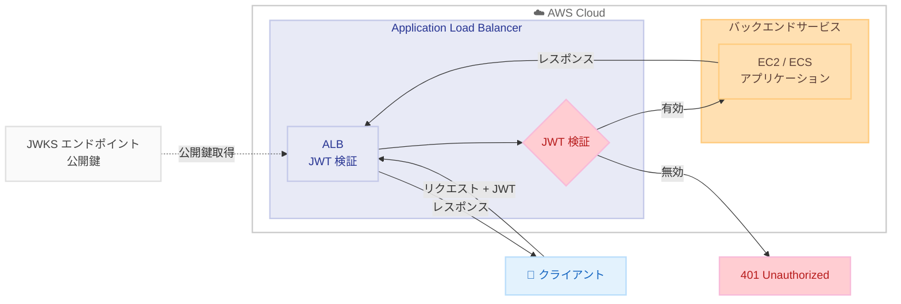

# Application Load Balancer - JWT 検証サポート

**リリース日**: 2025 年 11 月 17 日  
**サービス**: Elastic Load Balancing  
**機能**: Application Load Balancer のクライアント認証情報フローと JWT 検証


## 概要

Application Load Balancer (ALB) は、クライアント認証情報フローと JWT 検証をサポートしました。この機能により、マシン間 (M2M) およびサービス間 (S2S) 通信のセキュアなデプロイが簡素化されます。

ALB が JWT を検証する機能を提供することで、アーキテクチャの複雑さを軽減し、セキュリティ実装を簡素化します。

**アップデート前の課題**

- M2M や S2S 通信の JWT 検証は、各バックエンドサービスで個別に実装する必要があった
- 認証ロジックが分散し、一貫したセキュリティポリシーの適用が困難だった
- バックエンドサービスごとに JWT 検証ライブラリの管理が必要だった

**アップデート後の改善**

- ALB で JWT 検証を一元的に行えるようになり、バックエンドでの実装が不要になった
- 認証ロジックを ALB に集約し、一貫したセキュリティポリシーを適用できるようになった
- JWKS エンドポイントからの公開鍵自動取得とキャッシュにより、運用負担が軽減された

## アーキテクチャ図



この図は、ALB が JWT を検証するフローを示しています。クライアントからのリクエストに含まれる JWT を ALB が検証し、有効な場合のみバックエンドに転送します。

## サービスアップデートの詳細

### 主要機能

1. **JWT 検証**
   - ALB での JWT トークン検証
   - 署名検証と有効期限チェック
   - クレーム検証のサポート

2. **クライアント認証情報フロー**
   - OAuth 2.0 クライアント認証情報フローのサポート
   - M2M 通信の認証
   - S2S 通信のセキュリティ

3. **アーキテクチャの簡素化**
   - バックエンドでの JWT 検証が不要
   - 認証ロジックの一元化
   - セキュリティ実装の標準化


## 技術仕様

### JWT 検証の設定

| 項目 | 詳細 |
|------|------|
| サポートアルゴリズム | RS256, RS384, RS512, ES256, ES384, ES512 |
| JWKS エンドポイント | 自動取得とキャッシュ |
| クレーム検証 | iss, aud, exp, nbf など |
| トークン位置 | Authorization ヘッダー |

### 設定例

```json
{
  "Type": "authenticate-jwt",
  "AuthenticateJwtConfig": {
    "Issuer": "https://auth.example.com",
    "Audience": "api.example.com",
    "JwksUri": "https://auth.example.com/.well-known/jwks.json",
    "OnUnauthenticatedRequest": "deny"
  }
}
```

この設定例は、ALB の JWT 認証アクションを定義しています。`Issuer` で JWT の発行者を指定し、`Audience` で対象オーディエンスを検証します。`JwksUri` は公開鍵を取得するエンドポイントで、`OnUnauthenticatedRequest` を `deny` に設定することで、無効な JWT を持つリクエストを拒否します。


## 設定方法

### 前提条件

1. ALB が作成済み
2. JWT を発行する認証サーバー
3. JWKS エンドポイントが公開されていること

### 手順

#### ステップ 1: リスナールールの設定

```bash
aws elbv2 create-rule \
  --listener-arn arn:aws:elasticloadbalancing:us-east-1:123456789012:listener/app/my-alb/xxxxx/xxxxx \
  --conditions Field=path-pattern,Values='/api/*' \
  --actions Type=authenticate-jwt,AuthenticateJwtConfig='{...}' Type=forward,TargetGroupArn=arn:aws:elasticloadbalancing:us-east-1:123456789012:targetgroup/my-targets/xxxxx \
  --priority 10
```

このコマンドは、ALB リスナーに JWT 認証ルールを作成します。`/api/*` パスへのリクエストに対して JWT 検証を行い、認証成功後にターゲットグループに転送します。


## メリット

### ビジネス面

- **セキュリティ強化**: 一貫した認証の適用
- **開発効率**: バックエンドでの認証実装が不要
- **コンプライアンス**: 標準的な認証フローの採用

### 技術面

- **アーキテクチャ簡素化**: 認証ロジックの一元化
- **パフォーマンス**: ALB での高速な JWT 検証
- **スケーラビリティ**: 認証処理のオフロード


## デメリット・制約事項

### 制限事項

- 対称鍵アルゴリズム (HS256 など) はサポートされていない
- カスタムクレーム検証には制限がある

### 考慮すべき点

- 既存の認証フローとの統合
- JWKS エンドポイントの可用性


## ユースケース

### ユースケース 1: マイクロサービス間認証

**シナリオ**: マイクロサービス間の通信を認証したい

**効果**: ALB での JWT 検証により、各サービスでの認証実装が不要

### ユースケース 2: API ゲートウェイ

**シナリオ**: 外部 API へのアクセスを認証したい

**効果**: ALB で JWT を検証し、認証済みリクエストのみをバックエンドに転送

### ユースケース 3: サードパーティ統合

**シナリオ**: サードパーティサービスからの API 呼び出しを認証

**効果**: クライアント認証情報フローで安全な M2M 通信を実現


## 料金

ALB の標準料金が適用されます。JWT 検証に追加料金はありません。


## 利用可能リージョン

ALB が利用可能なすべてのリージョンで利用可能です。


## 関連サービス・機能

- **Elastic Load Balancing**: ロードバランシングサービス
- **Amazon Cognito**: ユーザー認証サービス
- **AWS IAM**: アイデンティティ管理


## 参考リンク

- [公式発表](https://aws.amazon.com/about-aws/whats-new/2025/11/application-load-balancer-jwt-verification/)
- [ALB 認証ドキュメント](https://docs.aws.amazon.com/elasticloadbalancing/latest/application/listener-authenticate-users.html)


## まとめ

Application Load Balancer の JWT 検証サポートにより、M2M および S2S 通信のセキュリティ実装が大幅に簡素化されました。バックエンドでの認証ロジックをオフロードし、一貫したセキュリティポリシーを適用できます。
