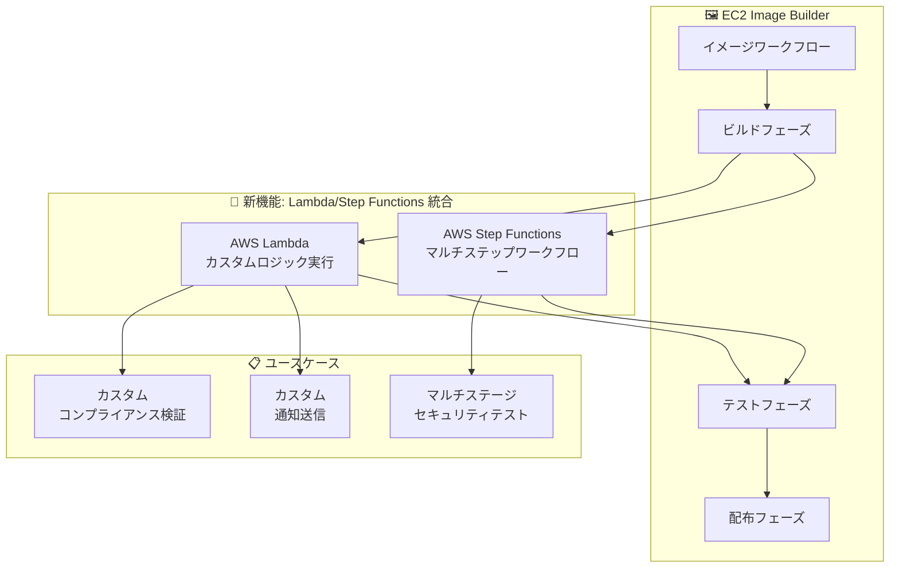

# EC2 Image Builder - Lambda および Step Functions のサポート

**リリース日**: 2025 年 11 月 17 日
**サービス**: Amazon EC2 Image Builder
**機能**: Lambda 関数および Step Functions ステートマシンの呼び出しサポート

## 概要

AWS は EC2 Image Builder で Lambda 関数の呼び出しと Step Functions ステートマシンの実行をサポートすることを発表しました。この機能により、イメージワークフロー内で複雑なマルチステップワークフローやカスタム検証ロジックを組み込むことができ、イメージ作成プロセスに対する柔軟性と制御が大幅に向上します。

EC2 Image Builder は、Amazon EC2 および Amazon EC2 互換の仮想マシンイメージの作成、テスト、配布を自動化するサービスです。今回のアップデートにより、イメージビルドプロセス中にカスタムロジックを実行したり、複雑なワークフローをオーケストレーションしたりすることが可能になりました。

**アップデート前の課題**

- Lambda や Step Functions をイメージワークフローに統合するには、カスタムコードの作成と複雑な回避策の実装が必要だった
- セットアップに時間がかかり、メンテナンスが困難で、エラーが発生しやすかった
- カスタムコンプライアンス検証や通知送信などのユースケースを実装するのが煩雑だった

**アップデート後の改善**

- Lambda 関数をシームレスに呼び出してカスタムロジックを実行可能
- Step Functions ステートマシンをオーケストレーションして複雑なマルチステップワークフローを実行可能
- カスタムコンプライアンス検証、カスタム通知送信、マルチステージセキュリティテストなどを Image Builder ワークフロー内で直接実装可能

## アーキテクチャ図



EC2 Image Builder のワークフロー内から Lambda 関数と Step Functions を呼び出し、カスタムロジックやマルチステップワークフローを実行できます。

## サービスアップデートの詳細

### 主要機能

1. **Lambda 関数の呼び出し**
   - イメージワークフロー内から Lambda 関数を直接呼び出し
   - カスタムロジックの実行（検証、通知、データ処理など）
   - 同期および非同期呼び出しのサポート

2. **Step Functions ステートマシンの実行**
   - 複雑なマルチステップワークフローのオーケストレーション
   - 条件分岐、並列処理、エラーハンドリングの活用
   - 長時間実行ワークフローのサポート

3. **ネイティブ統合**
   - カスタムコードや回避策なしで統合可能
   - Image Builder コンソール、CLI、API、CloudFormation、CDK からの設定
   - 追加コストなしで利用可能

## 技術仕様

### サポートされる統合タイプ

| 統合タイプ | 説明 | ユースケース |
|-----------|------|-------------|
| Lambda 関数呼び出し | カスタムロジックの実行 | 検証、通知、データ処理 |
| Step Functions 実行 | マルチステップワークフロー | 複雑な検証、承認フロー |

### ワークフローアクション

| アクション | 説明 |
|-----------|------|
| InvokeLambdaFunction | Lambda 関数を呼び出してカスタムロジックを実行 |
| ExecuteStepFunction | Step Functions ステートマシンを実行 |

## 設定方法

### 前提条件

1. AWS アカウント
2. EC2 Image Builder へのアクセス
3. Lambda 関数または Step Functions ステートマシン（呼び出す場合）
4. 適切な IAM 権限

### 手順

#### ステップ 1: Lambda 関数の作成（オプション）

カスタムロジックを実行する Lambda 関数を作成します。

```python
# lambda_function.py
import json
import boto3

def lambda_handler(event, context):
    """
    Image Builder ワークフローから呼び出されるカスタム検証関数
    """
    image_arn = event.get('imageArn')
    
    # カスタム検証ロジック
    validation_result = perform_custom_validation(image_arn)
    
    if validation_result['success']:
        return {
            'statusCode': 200,
            'body': json.dumps({'message': 'Validation passed'})
        }
    else:
        raise Exception(f"Validation failed: {validation_result['error']}")

def perform_custom_validation(image_arn):
    # カスタム検証ロジックを実装
    return {'success': True}
```

イメージ ARN を受け取り、カスタム検証を実行する Lambda 関数の例です。

#### ステップ 2: Image Builder ワークフローの設定

Image Builder コンソールまたは CLI でワークフローを設定します。

```yaml
# workflow.yaml
name: CustomValidationWorkflow
version: 1.0.0
steps:
  - name: BuildImage
    action: Build
  - name: CustomValidation
    action: InvokeLambdaFunction
    inputs:
      functionArn: arn:aws:lambda:us-east-1:123456789012:function:ImageValidation
  - name: TestImage
    action: Test
  - name: DistributeImage
    action: Distribute
```

Lambda 関数を呼び出すステップを含むワークフロー定義の例です。

#### ステップ 3: IAM 権限の設定

Image Builder が Lambda 関数を呼び出すための IAM 権限を設定します。

```json
{
    "Version": "2012-10-17",
    "Statement": [
        {
            "Effect": "Allow",
            "Action": [
                "lambda:InvokeFunction"
            ],
            "Resource": "arn:aws:lambda:us-east-1:123456789012:function:ImageValidation"
        },
        {
            "Effect": "Allow",
            "Action": [
                "states:StartExecution",
                "states:DescribeExecution"
            ],
            "Resource": "arn:aws:states:us-east-1:123456789012:stateMachine:ImageWorkflow"
        }
    ]
}
```

Lambda 関数の呼び出しと Step Functions の実行に必要な IAM ポリシーの例です。

## メリット

### ビジネス面

- **開発効率の向上**: カスタムコードや回避策なしで統合可能
- **メンテナンスコストの削減**: ネイティブ統合によりメンテナンスが容易
- **コンプライアンスの強化**: カスタム検証ロジックの組み込みが容易

### 技術面

- **柔軟性**: Lambda 関数で任意のカスタムロジックを実行可能
- **スケーラビリティ**: Step Functions で複雑なワークフローをオーケストレーション
- **エラーハンドリング**: Step Functions の組み込みエラーハンドリング機能を活用
- **追加コストなし**: 機能自体は追加コストなしで利用可能

## デメリット・制約事項

### 制限事項

- Lambda 関数と Step Functions の実行には別途料金が発生
- Lambda 関数のタイムアウト制限（最大 15 分）に注意が必要
- Step Functions の実行時間制限に注意が必要

### 考慮すべき点

- Lambda 関数のエラーハンドリングを適切に実装する必要がある
- Step Functions のステートマシン設計には専門知識が必要
- IAM 権限の適切な設定が必要

## ユースケース

### ユースケース 1: カスタムコンプライアンス検証

**シナリオ**: イメージビルド後に組織固有のコンプライアンス要件を検証する必要がある。

**実装例**:
```python
# コンプライアンス検証 Lambda 関数
def lambda_handler(event, context):
    image_arn = event['imageArn']
    
    # CIS ベンチマーク検証
    cis_result = check_cis_compliance(image_arn)
    
    # 組織固有のセキュリティポリシー検証
    policy_result = check_security_policies(image_arn)
    
    if cis_result and policy_result:
        return {'status': 'PASSED'}
    else:
        raise Exception('Compliance check failed')
```

**効果**: 組織固有のコンプライアンス要件を自動的に検証し、非準拠イメージの配布を防止

### ユースケース 2: カスタム通知送信

**シナリオ**: イメージビルドの各フェーズで関係者に通知を送信する必要がある。

**実装例**:
```python
# 通知送信 Lambda 関数
def lambda_handler(event, context):
    sns = boto3.client('sns')
    
    message = f"Image build completed: {event['imageArn']}"
    
    sns.publish(
        TopicArn='arn:aws:sns:us-east-1:123456789012:ImageBuildNotifications',
        Message=message,
        Subject='Image Build Notification'
    )
    
    return {'status': 'NOTIFIED'}
```

**効果**: イメージビルドの進捗を関係者にリアルタイムで通知

### ユースケース 3: マルチステージセキュリティテスト

**シナリオ**: イメージに対して複数のセキュリティテストを順次実行する必要がある。

**実装例**:
```json
{
  "Comment": "Multi-stage security testing workflow",
  "StartAt": "VulnerabilityScan",
  "States": {
    "VulnerabilityScan": {
      "Type": "Task",
      "Resource": "arn:aws:lambda:us-east-1:123456789012:function:VulnerabilityScan",
      "Next": "MalwareScan"
    },
    "MalwareScan": {
      "Type": "Task",
      "Resource": "arn:aws:lambda:us-east-1:123456789012:function:MalwareScan",
      "Next": "ConfigurationAudit"
    },
    "ConfigurationAudit": {
      "Type": "Task",
      "Resource": "arn:aws:lambda:us-east-1:123456789012:function:ConfigurationAudit",
      "End": true
    }
  }
}
```

**効果**: 複数のセキュリティテストを順次実行し、包括的なセキュリティ検証を実現

## 料金

この機能自体は追加コストなしで利用可能です。ただし、Lambda 関数の実行と Step Functions の実行には通常の料金が適用されます。

### 料金例

| 項目 | 料金 |
|------|------|
| EC2 Image Builder | 無料（EC2 インスタンス料金のみ） |
| Lambda 関数実行 | リクエスト数と実行時間に基づく |
| Step Functions 実行 | 状態遷移数に基づく |

## 利用可能リージョン

この機能は、AWS 中国（北京）リージョン、AWS 中国（寧夏）リージョン、AWS GovCloud (US) リージョンを含むすべての AWS リージョンで利用可能です。

## 関連サービス・機能

- **AWS Lambda**: サーバーレスコンピューティングサービス
- **AWS Step Functions**: ワークフローオーケストレーションサービス
- **Amazon EC2**: 仮想サーバーサービス
- **AWS Systems Manager**: 運用管理サービス

## 参考リンク

- [公式発表 (What's New)](https://aws.amazon.com/about-aws/whats-new/2025/11/ec2-image-builder-lambda-step-functions/)
- [EC2 Image Builder ドキュメント](https://docs.aws.amazon.com/imagebuilder/latest/userguide/manage-image-workflows.html)
- [EC2 Image Builder ユーザーガイド](https://docs.aws.amazon.com/imagebuilder/latest/userguide/)

## まとめ

EC2 Image Builder の Lambda および Step Functions サポートにより、イメージ作成プロセスにカスタムロジックや複雑なワークフローを簡単に組み込めるようになりました。カスタムコンプライアンス検証、通知送信、マルチステージセキュリティテストなどのユースケースを持つ組織は、この機能を活用してイメージ作成プロセスを強化することを推奨します。
