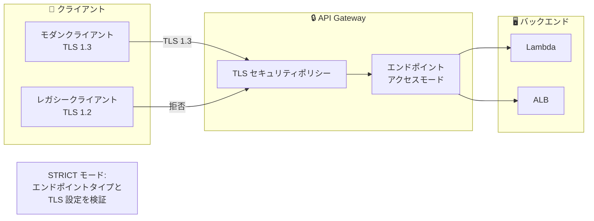

# Amazon API Gateway - 拡張 TLS セキュリティポリシー

**リリース日**: 2025 年 11 月 19 日
**サービス**: Amazon API Gateway
**機能**: REST API 向け拡張 TLS セキュリティポリシー

## 概要

Amazon API Gateway が REST API とカスタムドメイン名に対して拡張 TLS セキュリティポリシーをサポートしました。これにより、API のセキュリティ体制をより細かく制御でき、進化するセキュリティ要件への対応、厳格な規制への準拠、API 接続の暗号化強化が可能になります。

**アップデート前の課題**

- TLS 設定の制御が限定的だった
- PCI DSS、Open Banking、FIPS などの厳格な規制への対応が困難
- ポスト量子暗号への対応ができなかった
- エンドポイントアクセス制御が不十分だった

**アップデート後の改善**

- TLS 1.3 のみ、Perfect Forward Secrecy、FIPS、ポスト量子暗号などのポリシーを選択可能
- Regional、Edge-optimized、Private すべてのエンドポイントタイプで設定可能
- エンドポイントアクセスモード（BASIC/STRICT）による追加のガバナンス
- API とカスタムドメイン名の両方で一貫した TLS 設定

## アーキテクチャ図



拡張 TLS セキュリティポリシーにより、厳格な暗号化要件を満たすことができます。

## サービスアップデートの詳細

### 主要機能

1. **拡張セキュリティポリシー**
   - TLS 1.3 のみを要求するポリシー
   - Perfect Forward Secrecy (PFS) の実装
   - Federal Information Processing Standard (FIPS) 準拠
   - ポスト量子暗号 (PQC) のサポート

2. **エンドポイントアクセスモード**
   - BASIC モード: 標準的な API Gateway 動作
   - STRICT モード: エンドポイントタイプと TLS 設定の追加検証
   - リクエストの発信元とネゴシエーションの整合性を確認

3. **一貫した設定**
   - REST API エンドポイントとカスタムドメイン名の両方で設定可能
   - Regional、Edge-optimized、Private エンドポイントをサポート
   - 統一された命名規則でポリシーを識別

## 技術仕様

### セキュリティポリシーの種類

| ポリシータイプ | 説明 | ユースケース |
|---------------|------|-------------|
| TLS 1.3 Only | TLS 1.3 のみを許可 | 最新のセキュリティ要件 |
| Perfect Forward Secrecy | 前方秘匿性を保証 | 長期的なデータ保護 |
| FIPS | 連邦情報処理標準準拠 | 政府・金融機関 |
| Post Quantum Cryptography | 量子コンピュータ耐性 | 将来のセキュリティ対策 |

### ポリシー命名規則

```
SecurityPolicy_TLS13_1_3_2025_09
```

| 要素 | 説明 |
|------|------|
| TLS13 | サポートする最小 TLS バージョン |
| 1_3 | TLS バージョン番号 |
| 2025_09 | ポリシーのリリース日 |

### エンドポイントアクセスモード

| モード | 説明 |
|--------|------|
| BASIC | 標準的な API Gateway 動作 |
| STRICT | エンドポイントタイプと TLS ネゴシエーションの検証を追加 |

## 設定方法

### 前提条件

1. REST API の作成
2. カスタムドメイン名（オプション）
3. 適切な IAM 権限

### 手順

#### ステップ 1: REST API にセキュリティポリシーを設定

```bash
aws apigateway create-rest-api \
    --name "Secure API" \
    --endpoint-configuration '{
        "types": ["REGIONAL"]
    }' \
    --security-policy "SecurityPolicy_TLS13_1_3_2025_09" \
    --endpoint-access-mode "STRICT"
```

REST API に TLS 1.3 のみを許可するセキュリティポリシーを設定します。

#### ステップ 2: カスタムドメイン名にセキュリティポリシーを設定

```bash
aws apigateway create-domain-name \
    --domain-name "api.example.com" \
    --regional-certificate-arn "arn:aws:acm:region:account:certificate/cert-id" \
    --security-policy "SecurityPolicy_TLS13_1_3_2025_09" \
    --endpoint-access-mode "STRICT"
```

カスタムドメイン名にも同じセキュリティポリシーを適用します。

#### ステップ 3: 既存 API の更新

```bash
aws apigateway update-rest-api \
    --rest-api-id "api-id" \
    --patch-operations '[
        {
            "op": "replace",
            "path": "/securityPolicy",
            "value": "SecurityPolicy_TLS13_1_3_2025_09"
        },
        {
            "op": "replace",
            "path": "/endpointAccessMode",
            "value": "STRICT"
        }
    ]'
```

既存の API を新しいセキュリティポリシーに更新します。

## メリット

### ビジネス面

- **規制準拠**: PCI DSS、Open Banking、FIPS などの要件を満たす
- **将来対応**: ポスト量子暗号で将来の脅威に備える
- **信頼性向上**: 厳格なセキュリティ設定で顧客信頼を獲得

### 技術面

- **細かな制御**: TLS バージョンと暗号スイートを詳細に設定
- **一貫性**: API とドメイン名で統一されたセキュリティ設定
- **検証強化**: STRICT モードで追加のセキュリティ検証

## デメリット・制約事項

### 制限事項

- レガシークライアント（TLS 1.2 以下）との互換性が失われる可能性
- 一部のリージョンでは利用不可
- STRICT モードへの移行には慎重なテストが必要

### 考慮すべき点

- クライアントの TLS サポート状況を事前に確認
- 段階的な移行（BASIC → STRICT）を推奨
- アクセスログと CloudWatch メトリクスでモニタリング

## ユースケース

### ユースケース 1: 金融機関の API セキュリティ

**シナリオ**: PCI DSS 準拠が必要な決済 API

**実装例**:
```bash
aws apigateway update-rest-api \
    --rest-api-id "payment-api" \
    --patch-operations '[
        {"op": "replace", "path": "/securityPolicy", "value": "SecurityPolicy_TLS13_FIPS_2025_09"}
    ]'
```

**効果**: FIPS 準拠のセキュリティポリシーで規制要件を満たす

### ユースケース 2: 政府機関向け API

**シナリオ**: 連邦政府の厳格なセキュリティ要件を満たす API

**効果**: FIPS 準拠ポリシーと STRICT モードで最高レベルのセキュリティを実現

### ユースケース 3: 将来対応のセキュリティ設計

**シナリオ**: 量子コンピュータ時代に備えたセキュリティ設計

**効果**: ポスト量子暗号ポリシーで将来の脅威に対応

## 料金

拡張 TLS セキュリティポリシーの追加料金はありません。標準の API Gateway 料金が適用されます。

## 利用可能リージョン

以下の AWS 商用リージョンで利用可能です。

- 米国: N. Virginia、Ohio、N. California、Oregon
- アジアパシフィック: 東京、大阪、ソウル、シンガポール、シドニー、ムンバイ、香港、ジャカルタ、メルボルン、マレーシア
- ヨーロッパ: フランクフルト、アイルランド、ロンドン、パリ、ストックホルム、ミラノ、チューリッヒ、スペイン
- その他: カナダ、サンパウロ、ケープタウン、イスラエル、UAE

## 関連サービス・機能

- **AWS Certificate Manager**: TLS 証明書の管理
- **Amazon CloudWatch**: TLS メトリクスのモニタリング
- **AWS WAF**: Web アプリケーションファイアウォール

## 参考リンク

- [公式発表 (What's New)](https://aws.amazon.com/about-aws/whats-new/2025/11/amazon-api-gateway-tls-security-rest-apis/)
- [AWS Blog](https://aws.amazon.com/blogs/compute/enhancing-api-security-with-amazon-api-gateway-tls-security-policies/)
- [ドキュメント](https://docs.aws.amazon.com/apigateway/latest/developerguide/apigateway-security-policies.html)

## まとめ

Amazon API Gateway の拡張 TLS セキュリティポリシーにより、TLS 1.3 のみ、FIPS 準拠、ポスト量子暗号などの厳格なセキュリティ要件を満たすことができます。STRICT エンドポイントアクセスモードと組み合わせることで、金融機関や政府機関向けの高セキュリティ API を構築できます。
