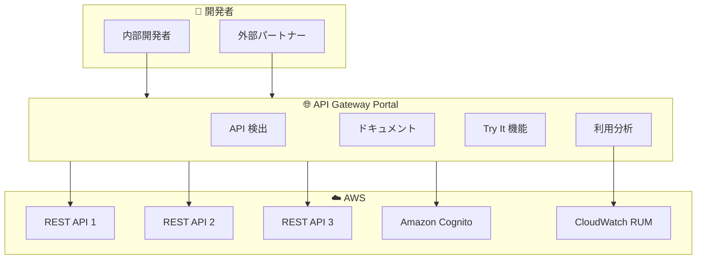

# Amazon API Gateway - Developer Portal (Portals)

**リリース日**: 2025 年 11 月 19 日
**サービス**: Amazon API Gateway
**機能**: Developer Portal (Portals)

## 概要

Amazon API Gateway に Portals 機能が追加されました。これにより、フルマネージドの AWS ネイティブ開発者ポータルを作成し、REST API の発見、ドキュメント化、ガバナンス、収益化を一元管理できます。Portals は既存の API を自動的に検出し、ドキュメントを生成し、カスタムドキュメントの追加も可能です。

**アップデート前の課題**

- API ドキュメントの管理にサードパーティソリューションが必要だった
- 開発者のオンボーディングに数週間かかることがあった
- API の発見と再利用が困難だった
- セキュリティリスクを伴う外部ツールへの依存

**アップデート後の改善**

- AWS ネイティブのフルマネージド開発者ポータルを提供
- 自動的な API 検出とドキュメント生成
- 開発者オンボーディング時間を数分に短縮
- CloudWatch RUM による利用状況分析

## アーキテクチャ図



Portals は複数の API を一元管理し、開発者に統一されたアクセスポイントを提供します。

## サービスアップデートの詳細

### 主要機能

1. **自動 API 検出とドキュメント生成**
   - 複数アカウントにまたがる既存 API を自動検出
   - OpenAPI 仕様からドキュメントを自動生成
   - カスタムドキュメントの追加も可能
   - API の進化に合わせてドキュメントを自動更新

2. **API プロダクト管理**
   - API を論理的なプロダクトに整理
   - 異なるオーディエンス向けにカスタマイズ
   - ブランディング（ロゴ、カラーテーマ）のカスタマイズ
   - アクセス制御の設定

3. **インタラクティブな API 探索**
   - 「Try It」ボタンで API を直接テスト
   - 開発者がポータル上で API を探索
   - リアルタイムのレスポンス確認

4. **分析とモニタリング**
   - CloudWatch RUM による利用状況分析
   - ユーザーエンゲージメントの可視化
   - 開発者ポータルの使用状況追跡

## 技術仕様

### 機能一覧

| 機能 | 説明 |
|------|------|
| API 検出 | 複数アカウントの API を自動検出 |
| ドキュメント | 自動生成 + カスタム追加 |
| アクセス制御 | Amazon Cognito 統合 |
| ブランディング | ロゴ、カラーテーマのカスタマイズ |
| 分析 | CloudWatch RUM 統合 |
| Try It | インタラクティブな API テスト |

### セキュリティ機能

| 項目 | 詳細 |
|------|------|
| 認証 | Amazon Cognito 統合 |
| アクセス制御 | 内部/外部オーディエンス向け設定 |
| データ保護 | AWS 境界内でのデータ管理 |

## 設定方法

### 前提条件

1. REST API の作成
2. Amazon Cognito ユーザープール（オプション）
3. 適切な IAM 権限

### 手順

#### ステップ 1: ポータルプロダクトの作成

```bash
aws apigateway create-portal-product \
    --name "My API Product" \
    --description "API プロダクトの説明" \
    --api-ids api-id-1 api-id-2
```

API をグループ化してポータルプロダクトを作成します。

#### ステップ 2: ポータルの設定

```bash
aws apigateway create-portal \
    --name "Developer Portal" \
    --description "開発者向けポータル" \
    --domain-configuration '{
        "domainName": "api.example.com"
    }' \
    --access-control '{
        "cognitoUserPoolId": "user-pool-id"
    }'
```

ポータルの基本設定とアクセス制御を構成します。

#### ステップ 3: ブランディングのカスタマイズ

```bash
aws apigateway update-portal \
    --portal-id portal-id \
    --branding '{
        "logoUrl": "https://example.com/logo.png",
        "primaryColor": "#FF9900"
    }'
```

企業ロゴとカラーテーマでポータルをカスタマイズします。

## メリット

### ビジネス面

- **オンボーディング時間短縮**: 数週間から数分に短縮
- **API 再利用促進**: 開発チーム間での API 発見と再利用
- **セキュリティ向上**: サードパーティソリューションへの依存排除

### 技術面

- **フルマネージド**: インフラストラクチャ管理不要
- **自動更新**: API 変更時にドキュメントを自動更新
- **AWS ネイティブ**: Cognito、CloudWatch との統合

## デメリット・制約事項

### 制限事項

- AWS GovCloud (US) および中国リージョンでは利用不可
- REST API のみサポート（HTTP API は対象外）
- カスタマイズには一定の制限がある

### 考慮すべき点

- 既存のサードパーティポータルからの移行計画
- Cognito ユーザープールの設計
- ブランディングガイドラインとの整合性

## ユースケース

### ユースケース 1: 社内 API カタログ

**シナリオ**: 大企業で複数チームが開発した API を一元管理

**実装例**:
```yaml
Portal:
  Name: "Internal API Catalog"
  AccessControl:
    Type: "Internal"
    CognitoUserPool: "internal-users"
  Products:
    - Name: "Payment APIs"
      APIs: [payment-api, billing-api]
    - Name: "User APIs"
      APIs: [auth-api, profile-api]
```

**効果**: 開発者が必要な API を素早く発見し、重複開発を防止

### ユースケース 2: パートナー向け API ポータル

**シナリオ**: 外部パートナーに API を公開し、オンボーディングを効率化

**効果**: パートナーが自己サービスで API を探索・テストし、統合時間を短縮

### ユースケース 3: API 収益化

**シナリオ**: API を製品として外部に提供し、利用状況を追跡

**効果**: CloudWatch RUM で利用状況を分析し、ビジネス意思決定に活用

## 料金

Portals の料金は API Gateway の標準料金に含まれます。

| 項目 | 料金 |
|------|------|
| ポータルホスティング | 追加料金なし |
| API リクエスト | 標準の API Gateway 料金 |
| CloudWatch RUM | 別途 RUM 料金 |

## 利用可能リージョン

AWS GovCloud (US) および中国リージョンを除くすべての AWS リージョンで利用可能です。

## 関連サービス・機能

- **Amazon Cognito**: ユーザー認証とアクセス制御
- **CloudWatch RUM**: リアルユーザーモニタリング
- **AWS Resource Access Manager**: クロスアカウント API 共有

## 参考リンク

- [公式発表 (What's New)](https://aws.amazon.com/about-aws/whats-new/2025/11/api-gateway-developer-portal-capabilities/)
- [AWS Blog](https://aws.amazon.com/blogs/compute/improve-api-discoverability-with-the-new-amazon-api-gateway-portal/)
- [ドキュメント](https://docs.aws.amazon.com/apigateway/latest/developerguide/apigateway-portals.html)
- [料金ページ](https://aws.amazon.com/api-gateway/pricing/)

## まとめ

Amazon API Gateway Portals により、フルマネージドの開発者ポータルを AWS ネイティブで構築できるようになりました。API の自動検出、ドキュメント生成、インタラクティブなテスト機能により、開発者のオンボーディング時間を大幅に短縮し、API の発見と再利用を促進します。
