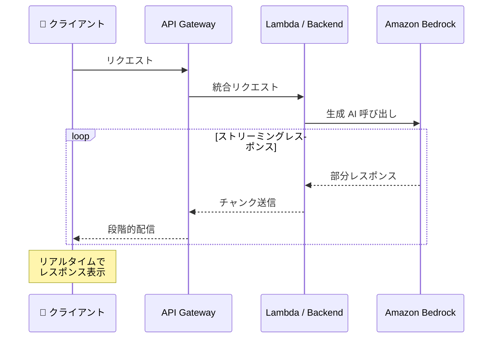

# Amazon API Gateway - REST API レスポンスストリーミング

**リリース日**: 2025 年 11 月 19 日
**サービス**: Amazon API Gateway
**機能**: REST API レスポンスストリーミング

## 概要

Amazon API Gateway が REST API でレスポンスストリーミングをサポートしました。この機能により、レスポンスペイロードをクライアントに段階的に送信できるようになり、完全なレスポンスをバッファリングしてから送信する必要がなくなりました。Lambda 関数、HTTP プロキシ統合、プライベート統合など、ストリーミングをサポートするバックエンドで利用できます。

**アップデート前の課題**

- レスポンス全体をバッファリングしてから送信する必要があった
- 統合タイムアウトが 29 秒に制限されていた
- ペイロードサイズが 10 MB に制限されていた
- 生成 AI アプリケーションでリアルタイムのレスポンス表示が困難だった

**アップデート後の改善**

- レスポンスを段階的にストリーミングして Time-to-First-Byte (TTFB) を改善
- 統合タイムアウトを最大 15 分まで延長可能
- 10 MB を超える大容量ペイロードをサポート
- 生成 AI アプリケーションでリアルタイムのレスポンス表示が可能

## アーキテクチャ図



レスポンスストリーミングにより、生成 AI アプリケーションでリアルタイムのレスポンス表示が可能になります。

## サービスアップデートの詳細

### 主要機能

1. **Time-to-First-Byte (TTFB) の改善**
   - レスポンスを段階的にクライアントに送信
   - 生成 AI アプリケーションでリアルタイム表示
   - ユーザー体験の大幅な向上

2. **統合タイムアウトの延長**
   - 最大 15 分までのタイムアウトをサポート
   - 複雑な推論モデルの処理に対応
   - 長時間実行タスクの完了を待機可能

3. **大容量ペイロードサポート**
   - 10 MB を超えるペイロードの直接ストリーミング
   - メディアファイルや大規模データセットの配信
   - 署名付き S3 URL などの回避策が不要

## 技術仕様

### サポートされる統合タイプ

| 統合タイプ | ストリーミングサポート |
|-----------|----------------------|
| Lambda 関数 | ✅ |
| HTTP プロキシ | ✅ |
| プライベート統合 | ✅ |

### 制限と仕様

| 項目 | 値 |
|------|-----|
| 最大統合タイムアウト | 15 分 |
| ペイロードサイズ | 10 MB 超対応 |
| エンドポイントタイプ | Regional、Private、Edge-optimized |

## 設定方法

### 前提条件

1. REST API の作成
2. ストリーミング対応のバックエンド（Lambda など）
3. 適切な IAM 権限

### 手順

#### ステップ 1: Lambda 関数でストリーミングを有効化

```python
import json

def lambda_handler(event, context):
    # ストリーミングレスポンスを返す
    def generate():
        for i in range(10):
            yield json.dumps({"chunk": i}) + "\n"
    
    return {
        'statusCode': 200,
        'headers': {
            'Content-Type': 'application/json',
            'Transfer-Encoding': 'chunked'
        },
        'body': generate(),
        'isBase64Encoded': False
    }
```

Lambda 関数でジェネレータを使用してストリーミングレスポンスを返します。

#### ステップ 2: API Gateway でレスポンス転送モードを設定

```bash
aws apigateway put-integration \
    --rest-api-id <api-id> \
    --resource-id <resource-id> \
    --http-method POST \
    --type AWS_PROXY \
    --integration-http-method POST \
    --uri arn:aws:apigateway:<region>:lambda:path/2015-03-31/functions/<function-arn>/invocations \
    --content-handling CONVERT_TO_TEXT
```

API Gateway の統合設定でストリーミングを有効にします。

## メリット

### ビジネス面

- **ユーザー体験向上**: リアルタイムレスポンスでエンゲージメント向上
- **生成 AI 対応**: ChatGPT のようなストリーミング UI を実現
- **大容量データ配信**: メディアファイルの直接配信が可能

### 技術面

- **レイテンシ削減**: TTFB の大幅な改善
- **タイムアウト延長**: 複雑な処理に対応
- **アーキテクチャ簡素化**: S3 署名付き URL などの回避策が不要

## デメリット・制約事項

### 制限事項

- すべてのバックエンドがストリーミングをサポートしているわけではない
- クライアント側でストリーミング処理の実装が必要
- 一部のプロキシやファイアウォールがストリーミングをブロックする可能性

### 考慮すべき点

- エラーハンドリングの複雑化
- 部分的なレスポンスの処理ロジックが必要
- モニタリングとデバッグの考慮

## ユースケース

### ユースケース 1: 生成 AI チャットボット

**シナリオ**: Amazon Bedrock を使用したチャットボットでリアルタイムレスポンスを表示

**実装例**:
```javascript
const response = await fetch('/api/chat', {
    method: 'POST',
    body: JSON.stringify({ message: 'Hello' })
});

const reader = response.body.getReader();
while (true) {
    const { done, value } = await reader.read();
    if (done) break;
    // 部分レスポンスを UI に表示
    displayChunk(new TextDecoder().decode(value));
}
```

**効果**: ユーザーがリアルタイムでレスポンスを確認でき、待ち時間の体感を大幅に削減

### ユースケース 2: 大容量ファイルのストリーミング配信

**シナリオ**: 動画や大容量データセットを API 経由で配信

**効果**: S3 署名付き URL を使用せずに、API Gateway 経由で直接ストリーミング配信が可能

### ユースケース 3: 長時間実行の推論タスク

**シナリオ**: 複雑な ML モデルの推論結果を段階的に返す

**効果**: 15 分までのタイムアウトで、複雑な推論タスクの完了を待機可能

## 料金

レスポンスストリーミングの追加料金はありません。標準の API Gateway 料金が適用されます。

| 項目 | 料金 |
|------|------|
| REST API リクエスト | 100 万リクエストあたり $3.50 |
| データ転送 | 標準のデータ転送料金 |

## 利用可能リージョン

すべての AWS リージョン（AWS GovCloud (US) を含む）で利用可能です。

## 関連サービス・機能

- **AWS Lambda**: ストリーミングレスポンスをサポートするサーバーレスコンピューティング
- **Amazon Bedrock**: 生成 AI モデルのストリーミング推論
- **Application Load Balancer**: プライベート統合でのストリーミング

## 参考リンク

- [公式発表 (What's New)](https://aws.amazon.com/about-aws/whats-new/2025/11/api-gateway-response-streaming-rest-apis/)
- [AWS Blog](https://aws.amazon.com/blogs/compute/building-responsive-apis-with-amazon-api-gateway-response-streaming/)
- [ドキュメント](https://docs.aws.amazon.com/apigateway/latest/developerguide/response-transfer-mode.html)
- [料金ページ](https://aws.amazon.com/api-gateway/pricing/)

## まとめ

Amazon API Gateway の REST API レスポンスストリーミングにより、生成 AI アプリケーションでのリアルタイムレスポンス表示、15 分までの統合タイムアウト、10 MB 超の大容量ペイロードサポートが可能になりました。ChatGPT のようなストリーミング UI を実現したい場合に最適な機能です。
