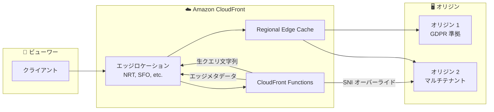

# Amazon CloudFront Functions - 3 つの新機能

**リリース日**: 2025 年 11 月 20 日
**サービス**: Amazon CloudFront
**機能**: CloudFront Functions の 3 つの新機能（エッジロケーションメタデータ、生クエリ文字列、高度なオリジンオーバーライド）

## 概要

Amazon CloudFront Functions に 3 つの新機能が追加されました。エッジロケーションおよび Regional Edge Cache (REC) メタデータ、生クエリ文字列の取得、高度なオリジンオーバーライドです。これらの機能により、開発者は CloudFront のインフラストラクチャに対するより高い可視性と、オリジン接続に対する精密で詳細な制御を持つ、より洗練されたエッジコンピューティングロジックを構築できます。

CloudFront Functions は、CloudFront エッジロケーションで軽量な JavaScript コードを実行し、サブミリ秒の実行時間でコンテンツ配信のカスタマイズやセキュリティポリシーの実装を可能にします。

**アップデート前の課題**

- エッジロケーションの情報を取得する手段が限られていた
- クエリ文字列が標準パース時に変更される可能性があった
- マルチテナント環境での SSL/TLS ハンドシェイクのカスタマイズが困難だった


**アップデート後の改善**

- エッジロケーションの 3 文字空港コードと REC 情報を取得可能
- 生のクエリ文字列にアクセスし、特殊文字やエンコーディングを保持
- SNI を含む SSL/TLS ハンドシェイクパラメータのカスタマイズが可能

## アーキテクチャ図



CloudFront Functions が新機能を使用してリクエストを処理し、適切なオリジンにルーティングします。

## サービスアップデートの詳細

### 主要機能

1. **エッジロケーションメタデータ**
   - サービング中のエッジロケーションの 3 文字空港コード
   - 予想される Regional Edge Cache (REC) の情報
   - 地理固有のコンテンツルーティングに活用
   - GDPR 準拠オリジンへのルーティングなどのコンプライアンス要件に対応

2. **生クエリ文字列の取得**
   - ビューワーから受信した完全な未処理のクエリ文字列にアクセス
   - 標準パース時に変更される可能性のある特殊文字やエンコーディングを保持
   - 署名付き URL やトークン検証に有用

3. **高度なオリジンオーバーライド**
   - SSL/TLS ハンドシェイクパラメータのカスタマイズ
   - Server Name Indication (SNI) のオーバーライド
   - CNAME チェーンを通じて異なる証明書ドメインを持つサーバーに接続するマルチテナント環境に対応

## 技術仕様

### エッジロケーションメタデータ

| プロパティ | 説明 | 例 |
|-----------|------|-----|
| edgeLocation | エッジロケーションの 3 文字空港コード | NRT, SFO, FRA |
| expectedREC | 予想される Regional Edge Cache | NRT50-C1 |

### 生クエリ文字列

| 項目 | 標準パース | 生クエリ文字列 |
|------|-----------|---------------|
| 特殊文字 | デコードされる | 保持される |
| エンコーディング | 正規化される | 元のまま |

## 設定方法

### 前提条件

1. CloudFront ディストリビューションの作成
2. CloudFront Functions の作成権限
3. JavaScript の基本知識

### 手順

#### ステップ 1: エッジロケーションメタデータの使用

```javascript
function handler(event) {
    var request = event.request;
    var context = event.context;
    
    // エッジロケーションの取得
    var edgeLocation = context.distributionDomainName;
    var edgeCode = context.edgeLocation; // 例: NRT
    
    // ヨーロッパのエッジからのリクエストを GDPR 準拠オリジンにルーティング
    if (edgeCode.startsWith('FRA') || edgeCode.startsWith('LHR')) {
        request.origin.custom.domainName = 'gdpr-compliant-origin.example.com';
    }
    
    return request;
}
```

エッジロケーション情報を使用して、地理的な要件に基づいたルーティングを実装します。

#### ステップ 2: 生クエリ文字列の使用

```javascript
function handler(event) {
    var request = event.request;
    
    // 生のクエリ文字列を取得（特殊文字を保持）
    var rawQueryString = request.rawQueryString;
    
    // 署名検証などに使用
    if (rawQueryString.includes('signature=')) {
        // 署名検証ロジック
    }
    
    return request;
}
```

生のクエリ文字列を使用して、署名付き URL の検証などを実装します。

#### ステップ 3: 高度なオリジンオーバーライドの使用

```javascript
function handler(event) {
    var request = event.request;
    
    // マルチテナント環境での SNI オーバーライド
    request.origin.custom.sslProtocols = ['TLSv1.2'];
    request.origin.custom.sniHostname = 'tenant-specific.example.com';
    
    return request;
}
```

マルチテナント環境で SNI をオーバーライドして、適切な証明書ドメインに接続します。

## メリット

### ビジネス面

- **コンプライアンス対応**: 地理的要件に基づいたルーティングで規制要件を満たす
- **マルチテナント対応**: 複雑なマルチテナントアーキテクチャをサポート
- **柔軟性向上**: より洗練されたエッジロジックの実装が可能

### 技術面

- **可視性向上**: エッジインフラストラクチャの詳細情報にアクセス
- **精密な制御**: オリジン接続パラメータの詳細なカスタマイズ
- **データ整合性**: クエリ文字列の元のエンコーディングを保持

## デメリット・制約事項

### 制限事項

- CloudFront Functions の実行時間制限（サブミリ秒）
- JavaScript のみサポート
- 一部の高度な機能は Lambda@Edge が必要な場合がある

### 考慮すべき点

- エッジロケーションコードは変更される可能性がある
- SNI オーバーライドは証明書の設定と整合性を確認する必要がある

## ユースケース

### ユースケース 1: GDPR 準拠ルーティング

**シナリオ**: ヨーロッパのユーザーを GDPR 準拠のオリジンにルーティングしたい

**実装例**:
```javascript
if (context.edgeLocation.startsWith('FRA') || context.edgeLocation.startsWith('LHR')) {
    request.origin.custom.domainName = 'eu-origin.example.com';
}
```

**効果**: エッジロケーション情報を使用して、ヨーロッパからのリクエストを自動的に GDPR 準拠オリジンにルーティング

### ユースケース 2: 署名付き URL の検証

**シナリオ**: 署名付き URL の署名を正確に検証したい

**効果**: 生のクエリ文字列を使用して、エンコーディングの変更なしに署名を検証

### ユースケース 3: マルチテナント SaaS

**シナリオ**: 複数のテナントが異なる証明書ドメインを使用する SaaS アプリケーション

**効果**: SNI オーバーライドを使用して、テナントごとに適切な証明書ドメインに接続

## 料金

これらの新機能は追加料金なしで利用できます。CloudFront Functions の標準料金のみが適用されます。

| 項目 | 料金 |
|------|------|
| CloudFront Functions 呼び出し | 100 万リクエストあたり $0.10 |

## 利用可能リージョン

すべての CloudFront エッジロケーションで利用可能です。

## 関連サービス・機能

- **CloudFront Functions**: 軽量なエッジコンピューティング
- **Lambda@Edge**: より複雑なエッジコンピューティング
- **CloudFront ディストリビューション**: コンテンツ配信ネットワーク

## 参考リンク

- [公式発表 (What's New)](https://aws.amazon.com/about-aws/whats-new/2025/11/amazon-cloudfront-3-functions-capabilities/)
- [CloudFront Functions 開発者ガイド](https://docs.aws.amazon.com/AmazonCloudFront/latest/DeveloperGuide/cloudfront-functions.html)
- [CloudFront Functions の例](https://docs.aws.amazon.com/AmazonCloudFront/latest/DeveloperGuide/functions-example-code.html)

## まとめ

Amazon CloudFront Functions に 3 つの新機能が追加されました。エッジロケーションメタデータ、生クエリ文字列の取得、高度なオリジンオーバーライドにより、より洗練されたエッジコンピューティングロジックを構築できます。GDPR 準拠ルーティング、署名検証、マルチテナント SaaS など、様々なユースケースに対応可能です。
