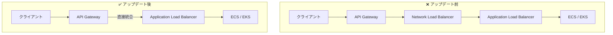

# Amazon API Gateway - Application Load Balancer プライベート統合

**リリース日**: 2025 年 11 月 21 日
**サービス**: Amazon API Gateway
**機能**: REST API の Application Load Balancer (ALB) プライベート統合

## 概要

Amazon API Gateway REST API が Application Load Balancer (ALB) との直接プライベート統合をサポートしました。これにより、VPC 内の内部 ALB への接続が可能になり、従来 Network Load Balancer (NLB) を経由する必要があったアーキテクチャを簡素化できます。

**アップデート前の課題**

- ALB への接続には NLB を経由する必要があった
- 追加のネットワークホップによるレイテンシ増加
- NLB のインフラストラクチャコストが発生
- アーキテクチャの複雑化

**アップデート後の改善**

- ALB への直接接続が可能に
- NLB を経由しないためレイテンシが削減
- インフラストラクチャコストの削減
- Layer 7 機能（HTTP/HTTPS ヘルスチェック、リクエストベースルーティング）を直接活用

## アーキテクチャ図



NLB を経由せずに ALB に直接接続することで、アーキテクチャが簡素化されます。

## サービスアップデートの詳細

### 主要機能

1. **直接 ALB 統合**
   - VPC Link v2 を使用した ALB への直接接続
   - NLB を経由しないシンプルなアーキテクチャ
   - 複数の ALB/NLB との 1 対多の関係をサポート

2. **レイテンシ削減**
   - NLB を経由する追加のネットワークホップを排除
   - エンドツーエンドのレイテンシを改善
   - リアルタイムアプリケーションに最適

3. **Layer 7 機能の活用**
   - HTTP/HTTPS ヘルスチェック
   - 高度なリクエストベースルーティング
   - ネイティブコンテナサービス統合
   - 認証・認可機能

## 技術仕様

### 統合オプションの比較

| 項目 | ALB 直接統合 | NLB 経由 |
|------|-------------|----------|
| レイテンシ | 低い | 高い（追加ホップ） |
| コスト | 低い | 高い（NLB 料金） |
| ヘルスチェック | HTTP/HTTPS | TCP |
| ルーティング | Layer 7 | Layer 4 |
| 認証機能 | ALB 認証利用可 | 別途実装必要 |

### VPC Link v2 の仕様

| 項目 | 詳細 |
|------|------|
| 接続タイプ | プライベート統合 |
| サポート LB | ALB、NLB |
| 関係性 | 1 対多（複数 LB 接続可） |

## 設定方法

### 前提条件

1. VPC 内の Application Load Balancer
2. REST API の作成
3. 適切な IAM 権限

### 手順

#### ステップ 1: VPC Link v2 の作成

```bash
aws apigateway create-vpc-link \
    --name "my-alb-vpc-link" \
    --target-arns "arn:aws:elasticloadbalancing:region:account:loadbalancer/app/my-alb/1234567890"
```

ALB を指定して VPC Link v2 を作成します。

#### ステップ 2: REST API の作成

```bash
aws apigateway create-rest-api \
    --name "ALB Integration API" \
    --endpoint-configuration '{"types": ["REGIONAL"]}'
```

REST API を作成します。

#### ステップ 3: プライベート統合の設定

```bash
aws apigateway put-integration \
    --rest-api-id "api-id" \
    --resource-id "resource-id" \
    --http-method GET \
    --type HTTP_PROXY \
    --integration-http-method GET \
    --uri "http://my-alb-dns.region.elb.amazonaws.com/path" \
    --connection-type VPC_LINK \
    --connection-id "vpc-link-id"
```

VPC Link を使用して ALB へのプライベート統合を設定します。

#### ステップ 4: デプロイ

```bash
aws apigateway create-deployment \
    --rest-api-id "api-id" \
    --stage-name "prod"
```

API をデプロイして変更を反映します。

## メリット

### ビジネス面

- **コスト削減**: NLB の時間料金と NLCU 料金を削減
- **運用簡素化**: 管理するコンポーネントが減少
- **パフォーマンス向上**: レイテンシ削減でユーザー体験向上

### 技術面

- **アーキテクチャ簡素化**: NLB レイヤーを排除
- **Layer 7 機能**: ALB の高度なルーティング機能を活用
- **スケーラビリティ**: 1 対多の関係で柔軟なスケーリング

## デメリット・制約事項

### 制限事項

- Layer 4 の機能が必要な場合は NLB 統合を継続使用
- 一部のリージョンでは利用不可
- 既存の NLB 統合からの移行には計画が必要

### 考慮すべき点

- ALB のセキュリティグループ設定
- ヘルスチェックの設定変更
- 既存アーキテクチャからの移行計画

## ユースケース

### ユースケース 1: マイクロサービス on ECS/EKS

**シナリオ**: コンテナベースのマイクロサービスを API Gateway 経由で公開

**実装例**:
```yaml
# CloudFormation
VPCLink:
  Type: AWS::ApiGateway::VpcLink
  Properties:
    Name: ecs-alb-link
    TargetArns:
      - !Ref ApplicationLoadBalancer

Integration:
  Type: HTTP_PROXY
  ConnectionType: VPC_LINK
  ConnectionId: !Ref VPCLink
  Uri: !Sub "http://${ApplicationLoadBalancer.DNSName}/{proxy}"
```

**効果**: ECS/EKS サービスへの低レイテンシアクセスを実現

### ユースケース 2: ハイブリッドクラウドアーキテクチャ

**シナリオ**: オンプレミスとクラウドのサービスを統合

**効果**: ALB の高度なルーティング機能でトラフィックを適切に振り分け

### ユースケース 3: エンタープライズモダナイゼーション

**シナリオ**: レガシーアプリケーションを API Gateway 経由で公開

**効果**: ALB の認証機能と組み合わせてセキュアなアクセスを提供

## 料金

ALB 直接統合により、NLB の料金を削減できます。

| 項目 | ALB 直接統合 | NLB 経由 |
|------|-------------|----------|
| API Gateway | 標準料金 | 標準料金 |
| ALB | 標準料金 | 標準料金 |
| NLB | 不要 | 時間料金 + NLCU |

### コスト削減例

| 項目 | 月額（概算） |
|------|-------------|
| NLB 時間料金削減 | 約 $16/月 |
| NLCU 料金削減 | 使用量に依存 |

## 利用可能リージョン

AWS GovCloud (US) および以下の商用リージョンで利用可能です。

- 米国: N. Virginia、Ohio、N. California、Oregon
- アジアパシフィック: 東京、大阪、ソウル、シンガポール、シドニー、ムンバイ、香港、ジャカルタ、メルボルン、マレーシア
- ヨーロッパ: フランクフルト、アイルランド、ロンドン、パリ、ストックホルム、ミラノ、チューリッヒ、スペイン
- その他: カナダ、サンパウロ、ケープタウン、イスラエル、バーレーン、UAE

## 関連サービス・機能

- **Application Load Balancer**: Layer 7 ロードバランシング
- **Amazon ECS**: コンテナオーケストレーション
- **Amazon EKS**: Kubernetes マネージドサービス

## 参考リンク

- [公式発表 (What's New)](https://aws.amazon.com/about-aws/whats-new/2025/11/api-gateway-rest-apis-integration-load-balancer/)
- [AWS Blog](https://aws.amazon.com/blogs/compute/build-scalable-rest-apis-using-amazon-api-gateway-private-integration-with-application-load-balancer/)
- [ドキュメント](https://docs.aws.amazon.com/apigateway/latest/developerguide/private-integration.html)

## まとめ

Amazon API Gateway REST API の ALB プライベート統合により、NLB を経由せずに ALB に直接接続できるようになりました。これにより、レイテンシの削減、インフラストラクチャコストの削減、アーキテクチャの簡素化が実現します。ECS/EKS ベースのマイクロサービスを API Gateway 経由で公開する場合に特に有効です。
