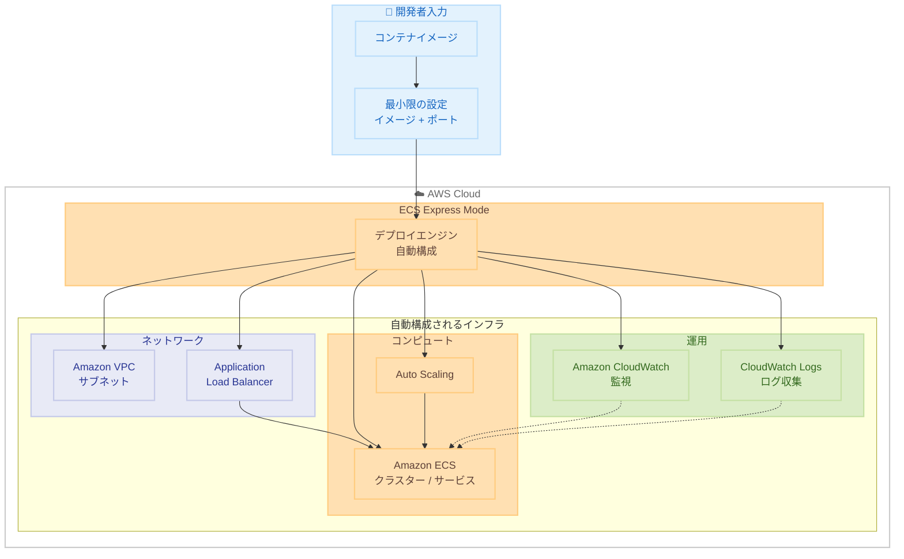

# Amazon ECS Express Mode - インフラ複雑性なしの本番アプリケーション構築

**リリース日**: 2025 年 11 月 24 日  
**サービス**: Amazon ECS  
**機能**: ECS Express Mode


## 概要

Amazon ECS は、Express Mode を発表しました。この機能により、インフラストラクチャの複雑性なしに本番対応のアプリケーションを構築できます。

コンテナアプリケーションのデプロイと運用を大幅に簡素化し、開発者がアプリケーションロジックに集中できるようにします。

**アップデート前の課題**

- 以前は ECS でコンテナアプリケーションをデプロイする際、VPC、サブネット、ロードバランサー、セキュリティグループなどのインフラ設定を手動で行う必要があった
- 以前は本番対応のインフラを構築するために、AWS のベストプラクティスに関する深い知識が必要だった
- 以前は自動スケーリング、監視、ログ収集などの運用設定を個別に構成する必要があった

**アップデート後の改善**

- 今回のアップデートにより、コンテナイメージとポート番号を指定するだけで、インフラが自動的に構成されるようになった
- 今回のアップデートにより、AWS のベストプラクティスが自動適用され、本番対応のアプリケーションを素早く構築できるようになった
- 今回のアップデートにより、自動スケーリング、ヘルスチェック、監視、ログ収集が自動設定されるようになった

## アーキテクチャ図



この図は、ECS Express Mode が最小限の設定から本番対応のインフラを自動構成する様子を示しています。

## サービスアップデートの詳細

### 主要機能

1. **簡素化されたデプロイ**
   - インフラ設定の自動化
   - ベストプラクティスの自動適用
   - ワンクリックデプロイ

2. **本番対応**
   - 自動スケーリング
   - ヘルスチェック
   - ロードバランシング

3. **運用の簡素化**
   - 監視の自動設定
   - ログ収集の自動化
   - アラートの自動設定


## 技術仕様

### Express Mode の機能

| 機能 | 説明 |
|------|------|
| 自動 VPC 設定 | ネットワーク設定の自動化 |
| 自動スケーリング | 需要に応じた自動スケール |
| 自動ロードバランシング | トラフィック分散の自動化 |
| 自動監視 | CloudWatch 統合 |

### 設定例

```yaml
# ecs-express.yaml
application:
  name: my-app
  image: 123456789012.dkr.ecr.us-east-1.amazonaws.com/my-app:latest
  port: 8080
  scaling:
    min: 2
    max: 10
    targetCPU: 70
```

この YAML 設定は、ECS Express Mode でデプロイするアプリケーションを定義しています。コンテナイメージ、ポート番号、スケーリング設定 (最小 2 タスク、最大 10 タスク、CPU 使用率 70% でスケール) を指定するだけで、VPC、ロードバランサー、監視などのインフラは自動的に構成されます。


## 設定方法

### 前提条件

1. AWS アカウント
2. コンテナイメージが ECR にプッシュ済み
3. 適切な IAM 権限

### 手順

#### ステップ 1: Express Mode でのデプロイ

```bash
aws ecs deploy-express \
  --application-name my-app \
  --image 123456789012.dkr.ecr.us-east-1.amazonaws.com/my-app:latest \
  --port 8080
```

#### ステップ 2: アプリケーションの確認

```bash
aws ecs describe-express-application --application-name my-app
```

このコマンドは、Express Mode でデプロイしたアプリケーションの詳細情報を取得します。アプリケーションのステータス、エンドポイント URL、スケーリング設定などを確認できます。


## メリット

### ビジネス面

- **開発速度向上**: インフラ設定時間の削減
- **運用コスト削減**: 自動化による運用負担軽減
- **信頼性向上**: ベストプラクティスの自動適用

### 技術面

- **簡素化**: 複雑なインフラ設定が不要
- **自動化**: スケーリング、監視の自動化
- **一貫性**: 標準化されたデプロイ


## デメリット・制約事項

### 制限事項

- 高度なカスタマイズには制限がある
- 一部の複雑なネットワーク構成はサポートされない

### 考慮すべき点

- 既存の ECS クラスターとの統合
- カスタマイズ要件の評価


## ユースケース

### ユースケース 1: 新規アプリケーションのデプロイ

**シナリオ**: 新しいコンテナアプリケーションを素早くデプロイしたい

**効果**: Express Mode で数分でデプロイ完了

### ユースケース 2: プロトタイピング

**シナリオ**: アイデアを素早く検証したい

**効果**: インフラ設定なしで即座にデプロイ

### ユースケース 3: 小規模チーム

**シナリオ**: インフラ専門家がいない小規模チームでコンテナを運用

**効果**: Express Mode で本番対応のインフラを自動構築


## 料金

ECS の標準料金が適用されます。Express Mode に追加料金はありません。


## 利用可能リージョン

Amazon ECS が利用可能なすべてのリージョンで利用可能です。


## 関連サービス・機能

- **Amazon ECS**: コンテナオーケストレーション
- **AWS Fargate**: サーバーレスコンテナ
- **Amazon ECR**: コンテナレジストリ


## 参考リンク

- [公式発表 (What's New)](https://aws.amazon.com/about-aws/whats-new/2025/11/announcing-amazon-ecs-express-mode/)
- [AWS Blog](https://aws.amazon.com/blogs/aws/build-production-ready-applications-without-infrastructure-complexity-using-amazon-ecs-express-mode/)
- [ECS ドキュメント](https://docs.aws.amazon.com/ecs/)


## まとめ

Amazon ECS Express Mode により、コンテナアプリケーションのデプロイと運用が大幅に簡素化されました。インフラの複雑性を気にせず、本番対応のアプリケーションを素早く構築できます。
