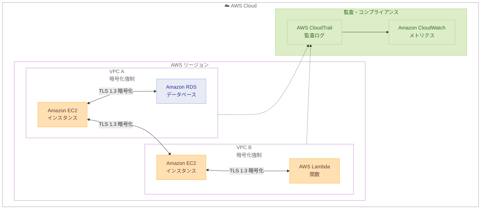

# Amazon VPC - 暗号化コントロール

**リリース日**: 2025 年 11 月 24 日  
**サービス**: Amazon VPC  
**機能**: VPC 暗号化コントロール - リージョン内および VPC 間の転送中暗号化の強制


## 概要

Amazon VPC は、暗号化コントロールを発表しました。この機能により、リージョン内および VPC 間の転送中暗号化を強制できます。

ネットワークトラフィックのセキュリティを強化し、コンプライアンス要件への対応を簡素化します。

**アップデート前の課題**

- 以前は VPC 内やVPC 間のトラフィック暗号化をアプリケーションレベルで実装する必要があり、一貫した暗号化の適用が困難だった
- 以前は転送中暗号化のコンプライアンス要件を満たすために、各アプリケーションで個別に TLS を設定する必要があった
- 以前は非暗号化トラフィックを検出・ブロックする標準的な方法がなかった

**アップデート後の改善**

- 今回のアップデートにより、VPC レベルで転送中暗号化を強制でき、アプリケーション変更なしで暗号化を適用できるようになった
- 今回のアップデートにより、ポリシーベースの制御で非暗号化トラフィックを自動的にブロックできるようになった
- 今回のアップデートにより、CloudTrail 統合で暗号化状態の監査とコンプライアンス証明が容易になった

## アーキテクチャ図



この図は、VPC 暗号化コントロールにより VPC 内および VPC 間のトラフィックが自動的に TLS 1.3 で暗号化される様子を示しています。

## サービスアップデートの詳細

### 主要機能

1. **転送中暗号化の強制**
   - VPC 内トラフィックの暗号化
   - VPC 間トラフィックの暗号化
   - リージョン内通信の保護

2. **ポリシーベースの制御**
   - 暗号化ポリシーの定義
   - 非暗号化トラフィックのブロック
   - 監査とコンプライアンス

3. **透過的な実装**
   - アプリケーション変更不要
   - 自動暗号化
   - パフォーマンスへの最小限の影響


## 技術仕様

### 暗号化コントロールの仕様

| 項目 | 詳細 |
|------|------|
| 暗号化プロトコル | TLS 1.3 |
| 適用範囲 | VPC 内、VPC 間 |
| パフォーマンス影響 | 最小限 |
| 監査 | CloudTrail 統合 |

### 設定オプション

| オプション | 説明 |
|----------|------|
| Enforce | 暗号化を強制 |
| Audit | 非暗号化トラフィックを監査 |
| Off | 暗号化コントロール無効 |


## 設定方法

### 前提条件

1. VPC が作成済み
2. 適切な IAM 権限
3. ネットワーク構成の理解

### 手順

#### ステップ 1: 暗号化コントロールの有効化

```bash
aws ec2 modify-vpc-attribute \
  --vpc-id vpc-xxxxxxxxxxxxxxxxx \
  --encryption-control Mode=Enforce
```

#### ステップ 2: 設定の確認

```bash
aws ec2 describe-vpc-attribute \
  --vpc-id vpc-xxxxxxxxxxxxxxxxx \
  --attribute encryptionControl
```

このコマンドは、VPC の暗号化コントロール設定を確認します。現在の暗号化モード（Enforce、Audit、Off）と設定状態を取得できます。


## メリット

### ビジネス面

- **コンプライアンス**: 規制要件への対応
- **セキュリティ強化**: データ保護の強化
- **監査対応**: 暗号化状態の可視化

### 技術面

- **透過的**: アプリケーション変更不要
- **自動化**: 暗号化の自動適用
- **一貫性**: 組織全体での暗号化ポリシー


## デメリット・制約事項

### 制限事項

- 一部のレガシーアプリケーションとの互換性
- わずかなレイテンシー増加の可能性

### 考慮すべき点

- 既存アプリケーションへの影響評価
- 段階的な導入計画


## ユースケース

### ユースケース 1: 金融サービス

**シナリオ**: 金融データの転送中暗号化が必要

**効果**: VPC 暗号化コントロールで自動的に暗号化を強制

### ユースケース 2: ヘルスケア

**シナリオ**: HIPAA 準拠のためのデータ保護

**効果**: 転送中暗号化でコンプライアンスを確保

### ユースケース 3: マルチ VPC アーキテクチャ

**シナリオ**: 複数の VPC 間でセキュアな通信を確保

**効果**: VPC 間トラフィックの自動暗号化


## 料金

VPC の標準料金が適用されます。暗号化コントロールに追加料金はありません。


## 利用可能リージョン

Amazon VPC が利用可能なすべてのリージョンで利用可能です。


## 関連サービス・機能

- **Amazon VPC**: 仮想プライベートクラウド
- **AWS PrivateLink**: プライベート接続
- **AWS Transit Gateway**: VPC 間接続


## 参考リンク

- [公式発表 (What's New)](https://aws.amazon.com/about-aws/whats-new/2025/11/aws-vpc-encryption-controls/)
- [AWS Blog](https://aws.amazon.com/blogs/aws/introducing-vpc-encryption-controls-enforce-encryption-in-transit-within-and-across-vpcs-in-a-region/)
- [VPC ドキュメント](https://docs.aws.amazon.com/vpc/)


## まとめ

Amazon VPC の暗号化コントロールにより、ネットワークトラフィックのセキュリティが大幅に強化されました。アプリケーション変更なしで転送中暗号化を強制でき、コンプライアンス要件への対応が簡素化されます。
