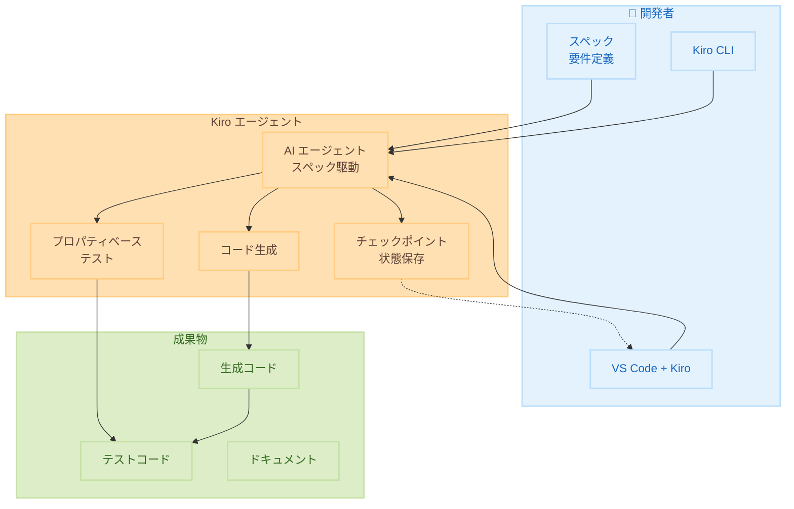

# Kiro - 一般提供開始

**リリース日**: 2025 年 11 月 24 日  
**サービス**: Kiro  
**機能**: スペック駆動開発 AI コーディングツールの一般提供


## 概要

Kiro は、スペック駆動開発を中心に構築された初の AI コーディングツールとして一般提供を開始しました。プレビューリリース以来、25 万人以上の開発者に採用されており、エージェントワークフローにより明確さと構造をもたらすツールとして評価されています。

GA リリースでは、4 つの新機能が導入されました。

**アップデート前の課題**

- 以前は AI コーディングツールでスペック (仕様) から実装への一貫したワークフローを実現することが困難だった
- 以前は AI が生成したコードが仕様に準拠しているかを自動検証する方法がなかった
- 以前は AI コーディングツールでの作業状態を保存・復元する機能がなく、実験的な変更にリスクがあった

**アップデート後の改善**

- 今回のアップデートにより、プロパティベーステストでコードが仕様に一致しているかを自動検証できるようになった
- 今回のアップデートにより、チェックポイント機能で作業状態を保存・復元し、安全に実験できるようになった
- 今回のアップデートにより、Kiro CLI でターミナルからエージェント操作が可能になり、ワークフロー統合が容易になった

## アーキテクチャ図



この図は、Kiro のスペック駆動開発ワークフローを示しています。スペックから AI エージェントがコードとテストを生成し、チェックポイントで作業状態を管理します。

## サービスアップデートの詳細

### 主要機能

1. **プロパティベーステスト**
   - スペックの正確性を測定
   - コードが仕様に一致しているかを検証
   - 自動テスト生成

2. **チェックポイント機能**
   - 進捗の保存と復元
   - 作業状態のスナップショット
   - 安全な実験環境

3. **Kiro CLI**
   - ターミナルでのエージェント操作
   - コマンドラインからの開発支援
   - スクリプト統合

4. **エンタープライズチームプラン**
   - 集中管理機能
   - チーム全体での設定共有
   - 管理者向けダッシュボード


## 技術仕様

### Kiro の機能

| 機能 | 説明 |
|------|------|
| スペック駆動開発 | 仕様から実装への自動変換 |
| エージェントワークフロー | AI による自動タスク実行 |
| プロパティベーステスト | 仕様準拠の自動検証 |
| チェックポイント | 作業状態の保存と復元 |

### サポートされる言語

| 言語 | サポートレベル |
|------|--------------|
| TypeScript | フルサポート |
| JavaScript | フルサポート |
| Python | フルサポート |
| Java | フルサポート |
| Go | フルサポート |
| Rust | フルサポート |


## 設定方法

### 前提条件

1. VS Code または互換 IDE
2. Kiro 拡張機能のインストール
3. AWS アカウント (オプション)

### 手順

#### ステップ 1: Kiro のインストール

VS Code の拡張機能マーケットプレイスから Kiro をインストールします。

#### ステップ 2: 初期設定

```bash
# Kiro CLI のインストール
npm install -g @kiro/cli

# 初期化
kiro init
```

#### ステップ 3: スペックの作成

```markdown
# requirements.md
## ユーザー認証機能
- ユーザーはメールアドレスとパスワードでログインできる
- パスワードは 8 文字以上必要
- ログイン失敗は 5 回までに制限
```

このスペックファイルは、Kiro がコードを生成する際の要件定義として使用されます。Markdown 形式で機能要件を記述することで、Kiro のエージェントが仕様に基づいた実装を自動生成します。


## メリット

### ビジネス面

- **開発速度向上**: スペックから実装への自動変換
- **品質向上**: プロパティベーステストによる検証
- **チーム協業**: エンタープライズ機能による管理

### 技術面

- **仕様準拠**: スペック駆動による一貫性
- **安全な実験**: チェックポイントによる復元
- **自動化**: CLI によるワークフロー統合


## デメリット・制約事項

### 制限事項

- 複雑なレガシーコードベースでは効果が限定的
- AI 生成コードのレビューは依然として必要

### 考慮すべき点

- チームのスペック駆動開発への適応
- 既存ワークフローとの統合


## ユースケース

### ユースケース 1: 新規プロジェクト開発

**シナリオ**: 新しいプロジェクトをスペックから開始したい

**効果**: 要件定義から実装まで一貫したワークフローを実現

### ユースケース 2: テスト自動化

**シナリオ**: コードが仕様に準拠しているか自動検証したい

**効果**: プロパティベーステストで継続的な検証を実現

### ユースケース 3: チーム開発

**シナリオ**: チーム全体で一貫した開発プラクティスを適用したい

**効果**: エンタープライズプランで設定と標準を共有


## 料金

| プラン | 料金 | 機能 |
|--------|------|------|
| Free | 無料 | 基本機能 |
| Pro | 月額制 | 高度な機能 |
| Enterprise | カスタム | チーム管理、SSO など |

詳細は Kiro 公式サイトを参照してください。


## 利用可能リージョン

グローバルに利用可能です。


## 関連サービス・機能

- **Amazon Q Developer**: AI コーディングアシスタント
- **AWS CodeWhisperer**: コード補完サービス
- **Amazon Bedrock**: 基盤モデルサービス


## 参考リンク

- [Kiro 公式サイト](https://kiro.dev/)
- [GA 発表ブログ](https://kiro.dev/blog/general-availability/)
- [プロパティベーステスト](https://kiro.dev/blog/property-based-testing/)
- [Kiro CLI](https://kiro.dev/blog/introducing-kiro-cli/)


## まとめ

Kiro の一般提供開始により、スペック駆動開発が本格的に利用可能になりました。プロパティベーステスト、チェックポイント、CLI、エンタープライズ機能の追加により、個人開発者からエンタープライズチームまで幅広く活用できます。
