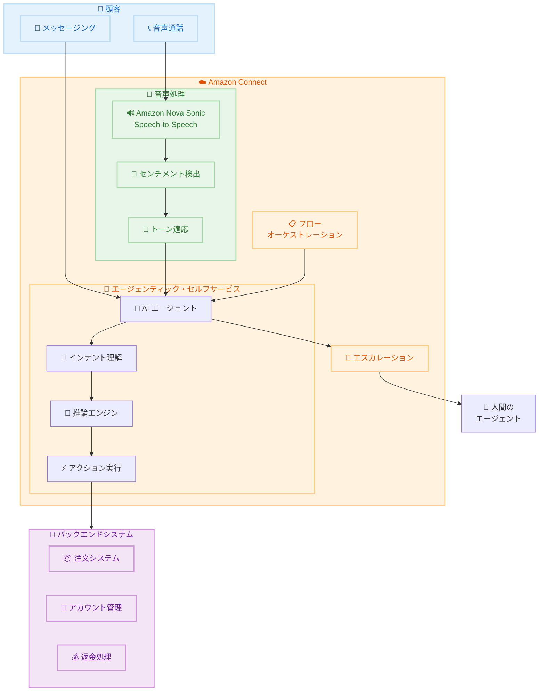

# Amazon Connect - エージェンティック・セルフサービスと Nova Sonic による自然な音声対話

**リリース日**: 2025 年 11 月 30 日
**サービス**: Amazon Connect
**機能**: エージェンティック・セルフサービス、Amazon Nova Sonic Speech-to-Speech 統合

## 概要

Amazon Connect は、AI エージェントが音声およびメッセージングチャネル全体で理解、推論、アクションを実行できるエージェンティック・セルフサービス機能を発表しました。Amazon Nova Sonic の高度な音声モデルとの統合により、より自然で適応的な音声セルフサービス体験を提供します。

この AI エージェントは、顧客が「何を言ったか」だけでなく「どのように言ったか」も理解し、顧客のトーンやセンチメントに合わせて音声応答を適応させながら、複数の言語やアクセントで自然な会話ペースを維持します。例えば、顧客が注文の問題について電話した場合、AI エージェントは名前で挨拶し、明確化のための質問をし、注文状況を確認し、返金を処理することができます。会話全体を通じて、顧客のトーンに適応し、表現豊かに応答します。

**アップデート前の課題**

- 従来の IVR システムは固定的なスクリプトベースで、自然な会話体験を提供できなかった
- 音声セルフサービスは顧客のトーンやセンチメントに適応できず、機械的な応答に限定されていた
- 複雑なタスク (トラブルシューティング、アカウント管理など) は人間のエージェントへのエスカレーションが必要だった

**アップデート後の改善**

- AI エージェントが顧客のトーンとセンチメントを理解し、適応的に応答
- Nova Sonic による人間のような自然で表現豊かな音声対話を実現
- 複雑なトラブルシューティング、アカウント管理、コンサルティング対話を自動化可能
- 必要に応じていつでも人間のエージェントにエスカレーション可能

## アーキテクチャ図

Nova Sonic が音声を処理し、センチメントとトーンを検出して AI エージェントに渡します。AI エージェントは推論を行い、バックエンドシステムと連携してアクションを実行します。

## サービスアップデートの詳細

### 主要機能

1. **エージェンティック・セルフサービス**
   - AI エージェントが音声とメッセージングチャネルで理解、推論、アクションを実行
   - ルーティンタスクから複雑なカスタマーサービスタスクまで自動化
   - 決定論的体験とエージェンティック体験のブレンドが可能
   - スケーラブルで信頼性が高く安全なデプロイメント

2. **Amazon Nova Sonic Speech-to-Speech 統合**
   - 顧客の音声を直接、自然で表現豊かな音声応答に変換
   - 顧客のトーンとセンチメントに適応した応答
   - 複数の言語とアクセントで自然な会話ペースを維持
   - 人間のような音声対話を実現

3. **適応的な音声対話**
   - 顧客が「何を言ったか」と「どのように言ったか」の両方を理解
   - リアルタイムでトーンとセンチメントを検出
   - 会話全体を通じて表現豊かに応答
   - 自然な会話の流れを維持

## 技術仕様

### サポートされる Nova Sonic 音声

| 音声名 | 言語/ロケール | 性別 |
|--------|--------------|------|
| Matthew | en-US (米国英語) | 男性 |
| Amy | en-GB (英国英語) | 女性 |
| Olivia | en-AU (オーストラリア英語) | 女性 |
| Lupe | es-US (米国スペイン語) | 女性 |

### 言語サポート

| 言語 | ステータス |
|------|----------|
| 英語 | 一般提供 (GA) |
| スペイン語 | 一般提供 (GA) |
| フランス語 | プレビュー |
| イタリア語 | プレビュー |
| ドイツ語 | プレビュー |

### 利用可能リージョン (Nova Sonic)

| リージョン | ステータス |
|-----------|----------|
| US East (N. Virginia) - us-east-1 | 利用可能 |
| US West (Oregon) - us-west-2 | 利用可能 |

## 設定方法

### 前提条件

1. Amazon Connect インスタンスが作成済みであること
2. Conversational AI ボットが存在すること
3. 使用するロケールが作成済みであること
4. ボット設定の編集権限があること

### 手順

#### ステップ 1: Speech-to-Speech の設定

1. Amazon Connect 管理コンソールにサインイン
2. **Bots** を選択し、**Configuration** タブを開く
3. 設定するロケールを選択
4. Speech model セクションで **Edit** を選択
5. Model type ドロップダウンで **Speech-to-Speech** を選択
6. Voice provider で **Amazon Nova Sonic** を選択
7. **Confirm** を選択

#### ステップ 2: ロケールのビルドとアクティベート

ロケールに **Unbuilt changes** が表示されている場合は、**Build language** を選択します。ビルドが成功すると、新しい設定がアクティブになります。

#### ステップ 3: フローで Nova Sonic 互換音声を設定

1. フローデザイナーで対象のフローを開く
2. **Set voice** ブロックを追加または開く
3. Other settings で **Override speaking style** を選択し、**Generative** を選択
4. Voice provider を **Amazon** に設定
5. Language で対応するロケールを選択
6. Voice で Nova Sonic 互換の音声を選択 (Matthew, Amy, Olivia, Lupe)
7. **Save** して **Publish** を選択

## メリット

### ビジネス面

- **コスト削減**: 複雑なタスクの自動化により、人間のエージェントへのエスカレーションを削減
- **顧客満足度向上**: 自然で適応的な音声対話により、顧客体験が向上
- **24/7 対応**: AI エージェントによる常時対応が可能
- **スケーラビリティ**: 需要に応じて自動的にスケール

### 技術面

- **自然な音声対話**: Nova Sonic による人間のような音声応答
- **センチメント適応**: 顧客の感情に合わせた応答調整
- **マルチチャネル対応**: 音声とメッセージングの両方をサポート
- **柔軟なエスカレーション**: いつでも人間のエージェントに転送可能

## デメリット・制約事項

### 制限事項

- Nova Sonic は現在 US East (N. Virginia) と US West (Oregon) の 2 リージョンのみで利用可能
- 東京リージョン (ap-northeast-1) では Nova Sonic は未対応
- フランス語、イタリア語、ドイツ語はプレビュー段階
- Nova Sonic 専用音声を使用する場合、Amazon Polly プロンプトとの音声の一貫性が失われる可能性がある

### 考慮すべき点

- Nova Sonic 互換音声は現在 4 種類に限定 (Matthew, Amy, Olivia, Lupe)
- 日本語は現時点でサポートされていない
- ベータ音声を使用する場合はセッション属性での設定が必要

## ユースケース

### ユースケース 1: 注文問題の自動解決

**シナリオ**: 顧客が注文の問題について電話

**AI エージェントの動作**:

1. 顧客を名前で挨拶
2. 問題について明確化のための質問
3. 注文状況を自動検索
4. 返金処理を実行
5. 会話全体を通じて顧客のトーンに適応した応答

**効果**: 人間のエージェントを介さずに問題を完全に解決

### ユースケース 2: 複雑なトラブルシューティング

**シナリオ**: 顧客が技術的な問題について問い合わせ

**AI エージェントの動作**:

1. 問題の症状を詳細にヒアリング
2. 推論エンジンで原因を特定
3. ステップバイステップの解決策を提示
4. 顧客のフラストレーションを検出した場合はトーンを調整
5. 解決できない場合は人間のエージェントにエスカレーション

**効果**: 複雑な問題でも自動対応を試み、必要に応じてシームレスにエスカレーション

### ユースケース 3: アカウント管理

**シナリオ**: 顧客がアカウント情報の変更を希望

**AI エージェントの動作**:

1. 本人確認を実施
2. 変更内容を確認
3. バックエンドシステムで変更を実行
4. 変更完了を確認
5. 追加のサポートが必要か確認

**効果**: セキュアなアカウント管理タスクを自動化

## 料金

Amazon Connect の標準料金に加え、Nova Sonic の使用量に基づく課金が適用されます。詳細は [Amazon Connect 料金ページ](https://aws.amazon.com/connect/pricing/) を参照してください。

## 利用可能リージョン

エージェンティック・セルフサービス機能は Amazon Connect が提供されているリージョンで利用可能ですが、Nova Sonic Speech-to-Speech は以下のリージョンに限定されます。

- US East (N. Virginia) - us-east-1
- US West (Oregon) - us-west-2

**注意**: 東京リージョン (ap-northeast-1) では Nova Sonic は現時点で利用できません。

## 関連サービス・機能

- **Amazon Nova Sonic**: 高度な Speech-to-Speech モデル
- **Amazon Lex**: 会話型 AI ボットサービス
- **Amazon Polly**: テキスト読み上げサービス
- **Amazon Connect AI エージェント**: エージェント支援機能

## 参考リンク

- [公式発表 (What's New)](https://aws.amazon.com/about-aws/whats-new/2025/11/amazon-connect-agentic-self-service/)
- [Nova Sonic Speech-to-Speech 設定ガイド](https://docs.aws.amazon.com/connect/latest/adminguide/nova-sonic-speech-to-speech.html)
- [Amazon Connect 料金ページ](https://aws.amazon.com/connect/pricing/)
- [Amazon Connect セルフサービス](https://aws.amazon.com/connect/self-service/)
- [AWS Blog - Conversational AI in Amazon Connect](https://aws.amazon.com/blogs/contact-center/leading-the-conversation-with-conversational-ai-in-amazon-connect/)

## まとめ

Amazon Connect のエージェンティック・セルフサービス機能と Nova Sonic 統合は、コンタクトセンターのセルフサービス体験を大幅に進化させます。AI エージェントが顧客のトーンとセンチメントを理解し、自然で表現豊かな音声対話を提供することで、複雑なタスクの自動化と顧客満足度の向上を実現します。現時点では Nova Sonic は米国リージョンのみで利用可能ですが、今後のリージョン拡大と日本語サポートに期待が持てます。
