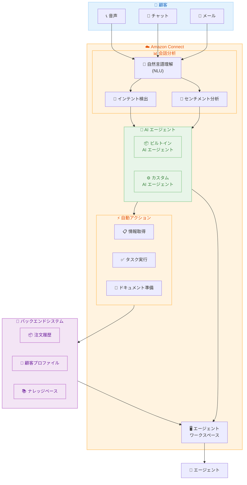

# Amazon Connect - AI エージェントによるエージェント支援機能の強化

**リリース日**: 2025 年 11 月 30 日
**サービス**: Amazon Connect
**機能**: AI エージェントによるエージェント支援 (Agentic Assistance)

## 概要

Amazon Connect は、カスタマーサービス担当者 (エージェント) を支援する新しい AI エージェント機能を発表しました。この AI エージェントは、顧客とのやり取りの中でエージェントをガイドし、アクションの推奨、情報の取得、タスクの代行実行を行います。

例えば、製品返品の処理において、AI エージェントは注文履歴の自動取得、返金額の計算、返品プロセスの開始などを自動的に行い、エージェントをサポートします。これらの AI エージェントは会話のコンテキストと顧客のセンチメントをリアルタイムで分析し、ドキュメントの準備やルーティン処理などのタスクを能動的に完了させます。

これにより、エージェントは顧客との関係構築や複雑な状況への対応に集中でき、AI がバックグラウンド作業を管理することで、生産性の向上と一貫した成果を実現します。

**アップデート前の課題**

- エージェントは顧客対応中に複数のシステムを手動で操作し、情報を検索する必要があった
- 返品処理や注文確認などのルーティン作業に時間を取られ、顧客対応の質が低下していた
- 会話のコンテキストを把握しながら適切なアクションを判断するのに認知的負荷がかかっていた

**アップデート後の改善**

- AI エージェントが会話コンテキストを分析し、適切なアクションを自動的に推奨・実行
- ルーティン作業 (情報取得、計算、プロセス開始) を AI が代行し、エージェントの負担を軽減
- すぐに使えるビルトイン AI エージェントの提供と、ビジネスニーズに合わせたカスタマイズが可能

## アーキテクチャ図

AI エージェントは会話分析を通じてインテントとセンチメントを検出し、バックエンドシステムと連携してエージェントを支援します。

## サービスアップデートの詳細

### 主要機能

1. **リアルタイム会話分析**
   - 会話のコンテキストをリアルタイムで分析
   - 顧客のセンチメント (感情) を検出
   - 自然言語理解 (NLU) による顧客インテントの自動検出

2. **AI エージェントによる自動タスク実行**
   - 注文履歴の自動取得
   - 返金額の計算
   - 返品プロセスの開始
   - ドキュメントの準備
   - ルーティンプロセスの処理

3. **カスタマイズ可能な AI エージェント**
   - すぐに使えるビルトイン AI エージェントを提供
   - ビジネスニーズに合わせた AI エージェントの動作とアクションのカスタマイズ
   - ステップバイステップガイドとの統合
   - AI プロンプト、AI ガードレール、AI エージェント設定のカスタマイズ

### Amazon Q in Connect との関係

この機能は Amazon Q in Connect の進化版として位置づけられています。Amazon Q in Connect は Amazon Connect Wisdom の LLM 強化版であり、以下の機能を提供します。

- 通話、チャット、メールでの顧客インテントの自動検出
- リアルタイムの生成 AI レスポンスと推奨アクション
- 関連ドキュメントや記事へのリンク提供
- 自然言語またはキーワードによる直接クエリ

## 技術仕様

### 対応チャネル

| チャネル | サポート状況 | 備考 |
|---------|-------------|------|
| 音声通話 | ✅ | Contact Lens 会話分析が必要 |
| チャット | ✅ | Contact Lens 不要 |
| メール | ✅ | Contact Lens 不要 |

### 前提条件

| 要件 | 詳細 |
|------|------|
| Contact Lens | 音声通話での利用には Contact Lens 会話分析のリアルタイム分析が必要 |
| Amazon Bedrock | AI 機能は Amazon Bedrock 上に構築 |
| コンプライアンス | GDPR 準拠、HIPAA 対象 |

### カスタマイズオプション

| コンポーネント | カスタマイズ内容 |
|---------------|-----------------|
| AI プロンプト | 生成 AI システムのプロンプトをカスタマイズ |
| AI ガードレール | AI の動作制限を設定 |
| AI エージェント | エージェントの動作とアクションを定義 |
| ステップバイステップガイド | ワークフローとの統合 |

## 設定方法

### 前提条件

1. Amazon Connect インスタンスが設定済みであること
2. Amazon Q in Connect が有効化されていること
3. 音声通話で使用する場合は Contact Lens 会話分析が有効化されていること

### 手順

#### ステップ 1: Amazon Q in Connect の有効化

Amazon Connect 管理コンソールから Amazon Q in Connect を有効化します。詳細な手順は [Amazon Q in Connect ドキュメント](https://docs.aws.amazon.com/connect/latest/adminguide/amazon-q-connect.html) を参照してください。

#### ステップ 2: AI エージェントの設定

ビルトイン AI エージェントを使用するか、カスタム AI エージェントを作成します。カスタマイズには以下のコンポーネントを設定します。

- AI プロンプト: 生成 AI の動作を制御するプロンプト
- AI ガードレール: AI の応答範囲を制限するルール
- AI エージェント: 特定のタスクを実行するエージェント定義

#### ステップ 3: ステップバイステップガイドとの統合 (オプション)

AI エージェントをステップバイステップガイドと統合することで、エージェントがより迅速にソリューションに到達できるようになります。

## メリット

### ビジネス面

- **生産性向上**: ルーティン作業の自動化により、エージェントの処理能力が向上
- **顧客満足度向上**: エージェントが顧客との関係構築に集中できることで、サービス品質が向上
- **一貫した成果**: AI による標準化されたプロセスにより、対応品質のばらつきを低減

### 技術面

- **リアルタイム分析**: 会話中にコンテキストとセンチメントを即座に分析
- **柔軟なカスタマイズ**: ビジネスニーズに合わせた AI エージェントの動作調整が可能
- **マルチチャネル対応**: 音声、チャット、メールの全チャネルで利用可能

## デメリット・制約事項

### 制限事項

- 音声通話での利用には Contact Lens 会話分析の有効化が必須
- AI エージェントの動作は設定されたガードレールの範囲内に制限される
- 複雑なビジネスロジックには追加のカスタマイズが必要な場合がある

### 考慮すべき点

- AI エージェントの推奨アクションは最終的にエージェントが確認・承認する必要がある
- 初期設定とカスタマイズには一定の学習コストが発生する
- Contact Lens の追加コストが発生する可能性がある (音声通話利用時)

## ユースケース

### ユースケース 1: 製品返品処理の自動化

**シナリオ**: 顧客が製品の返品を希望してコンタクトセンターに連絡

**AI エージェントの動作**:

1. 会話から返品インテントを検出
2. 顧客の注文履歴を自動取得
3. 返品ポリシーに基づいて返金額を計算
4. 返品プロセスを開始
5. エージェントに推奨アクションを提示

**効果**: エージェントは複数システムの操作なしに、顧客対応に集中できる

### ユースケース 2: 技術サポートの効率化

**シナリオ**: 顧客が製品の技術的な問題について問い合わせ

**AI エージェントの動作**:

1. 問題の内容を分析してインテントを特定
2. ナレッジベースから関連する解決策を検索
3. 顧客のセンチメントを監視
4. 適切なドキュメントとガイドを提示
5. 必要に応じてエスカレーションを推奨

**効果**: 初回解決率の向上と対応時間の短縮

### ユースケース 3: 注文状況の確認

**シナリオ**: 顧客が注文の配送状況を確認したい

**AI エージェントの動作**:

1. 顧客情報から注文を特定
2. 配送状況をリアルタイムで取得
3. 予想到着日を計算
4. エージェントに情報を自動表示
5. 必要に応じて追加アクションを提案

**効果**: 情報検索時間の削減と顧客待ち時間の短縮

## 料金

Amazon Q in Connect の料金は、Amazon Connect の料金体系に含まれます。詳細な料金情報については、[Amazon Connect 料金ページ](https://aws.amazon.com/connect/pricing/) を参照してください。

### 料金に影響する要素

| 要素 | 説明 |
|------|------|
| Amazon Q in Connect | 使用量に基づく課金 |
| Contact Lens | 音声通話分析を使用する場合に追加課金 |
| Amazon Bedrock | AI 機能の基盤として使用 |

## 利用可能リージョン

Amazon Q in Connect は以下のリージョンで利用可能です。

- US East (N. Virginia) - us-east-1
- US West (Oregon) - us-west-2
- Asia Pacific (Seoul) - ap-northeast-2
- Asia Pacific (Singapore) - ap-southeast-1
- Asia Pacific (Sydney) - ap-southeast-2
- Asia Pacific (Tokyo) - ap-northeast-1 ✅
- Canada (Central) - ca-central-1
- Europe (Frankfurt) - eu-central-1
- Europe (London) - eu-west-2

## 関連サービス・機能

- **Amazon Bedrock**: AI エージェント機能の基盤となる生成 AI サービス
- **Contact Lens**: 会話分析とリアルタイムインサイトを提供
- **Amazon Connect Wisdom**: Amazon Q in Connect の前身となるナレッジ管理機能
- **ステップバイステップガイド**: エージェントワークフローの自動化

## 参考リンク

- [公式発表 (What's New)](https://aws.amazon.com/about-aws/whats-new/2025/11/amazon-connect-enhances-agent-assistance-capabilities/)
- [AWS Blog - Amazon Connect at re:Invent 2025](https://aws.amazon.com/blogs/contact-center/amazon-connect-at-reinvent-2025-creating-the-future-of-customer-experience-with-ai/)
- [Amazon Q in Connect ドキュメント](https://docs.aws.amazon.com/connect/latest/adminguide/amazon-q-connect.html)
- [Amazon Connect AI エージェント](https://aws.amazon.com/connect/ai-agents/)
- [Amazon Connect 料金ページ](https://aws.amazon.com/connect/pricing/)
- [リージョン別機能の利用可能状況](https://docs.aws.amazon.com/connect/latest/adminguide/regions.html)

## まとめ

Amazon Connect の AI エージェント機能強化は、コンタクトセンターのエージェント支援を大幅に進化させるアップデートです。リアルタイムの会話分析と自動タスク実行により、エージェントはルーティン作業から解放され、顧客との関係構築に集中できるようになります。東京リージョンを含む主要リージョンで利用可能であり、既存の Amazon Connect 環境に統合して活用することを推奨します。
