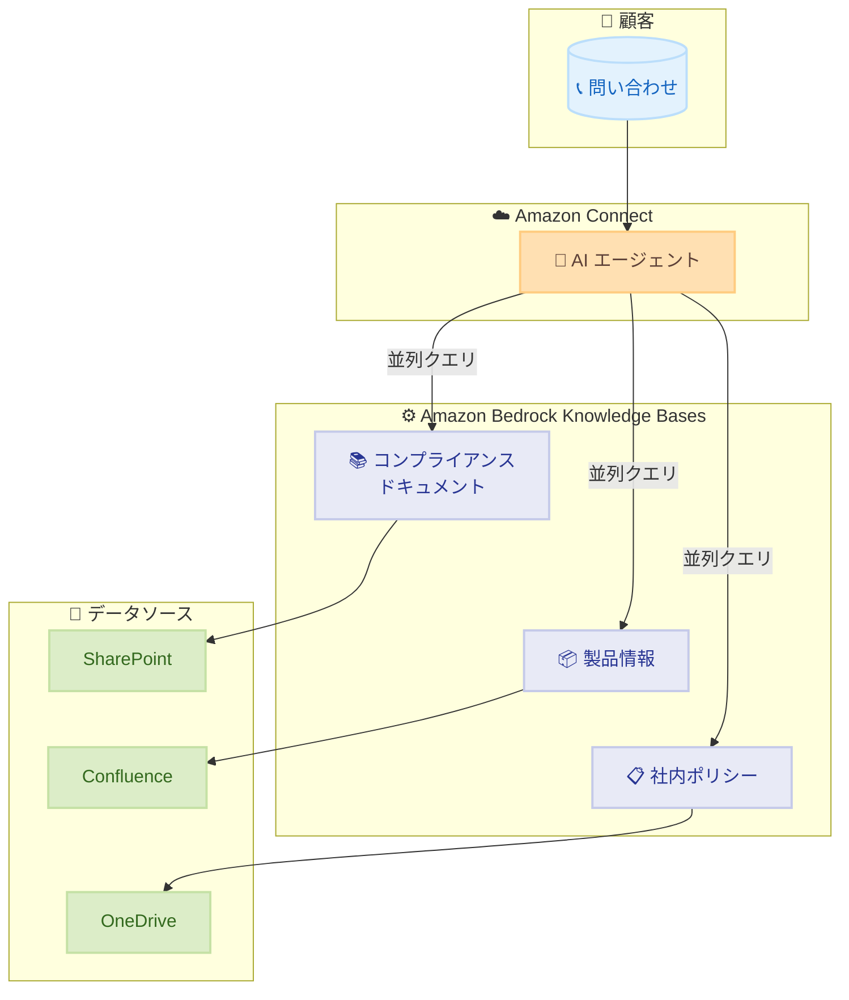

# Amazon Connect - 複数ナレッジベースのサポートと Amazon Bedrock Knowledge Bases との統合

**リリース日**: 2025年11月30日
**サービス**: Amazon Connect
**機能**: 複数ナレッジベースのサポート、Amazon Bedrock Knowledge Bases 統合

## 概要

Amazon Connect が、Amazon Bedrock Knowledge Bases との直接統合と、AI エージェントあたり複数のナレッジベースのサポートを開始しました。この機能により、既存の Bedrock Knowledge Bases を数クリックで Amazon Connect AI エージェントに接続でき、追加のセットアップやデータの複製は不要です。

この統合により、Adobe Experience Manager、Confluence、SharePoint、OneDrive などの Amazon Bedrock Knowledge Base コネクタを通じて、既存のコンテンツリポジトリを活用できます。複数のナレッジベースを並列でクエリすることで、より包括的な回答を提供できるようになります。

**アップデート前の課題**

- Amazon Connect AI エージェントで使用できるナレッジベースは限定的だった
- 既存の Bedrock Knowledge Bases を Connect で利用するには追加のセットアップが必要だった
- 複数のデータソースから情報を取得するには個別の設定が必要だった

**アップデート後の改善**

- 既存の Amazon Bedrock Knowledge Bases を数クリックで直接接続可能
- AI エージェントあたり複数のナレッジベースをサポート
- 複数のナレッジベースを並列でクエリし、包括的な回答を生成

## アーキテクチャ図

Amazon Connect AI エージェントが複数の Bedrock Knowledge Bases に並列でクエリを実行し、各ナレッジベースは異なるデータソースと連携します。

## サービスアップデートの詳細

### 主要機能

1. **Amazon Bedrock Knowledge Bases との直接統合**
   - 既存の Bedrock Knowledge Bases を数クリックで Amazon Connect AI エージェントに接続
   - 追加のセットアップやデータの複製が不要
   - 既存のデータソースとコネクタをそのまま活用

2. **複数ナレッジベースのサポート**
   - AI エージェントあたり複数のナレッジベースを設定可能
   - 複数のソースを並列でクエリして包括的な回答を生成
   - 用途別にナレッジベースを分離して管理可能

3. **豊富なコネクタサポート**
   - Adobe Experience Manager
   - Confluence
   - SharePoint
   - OneDrive
   - その他の Amazon Bedrock Knowledge Base コネクタ

## 技術仕様

### サポートされるコネクタ

| コネクタ | 用途 |
|----------|------|
| Adobe Experience Manager | コンテンツ管理システム |
| Confluence | ドキュメント・Wiki |
| SharePoint | ファイル共有・コラボレーション |
| OneDrive | クラウドストレージ |

### 設定要件

| 項目 | 詳細 |
|------|------|
| Amazon Connect インスタンス | AI エージェント機能が有効 |
| Amazon Bedrock Knowledge Bases | 事前に作成済み |
| IAM 権限 | Connect から Bedrock へのアクセス権限 |

## 設定方法

### 前提条件

1. Amazon Connect インスタンスが作成済みであること
2. Amazon Bedrock Knowledge Bases が作成済みであること
3. 適切な IAM 権限が設定されていること

### 手順

#### ステップ 1: Amazon Connect コンソールにアクセス

Amazon Connect コンソールにログインし、対象のインスタンスを選択します。

#### ステップ 2: AI エージェントの設定

AI エージェントの設定画面で、ナレッジベースの追加オプションを選択します。

#### ステップ 3: Bedrock Knowledge Bases の接続

既存の Amazon Bedrock Knowledge Bases を選択し、AI エージェントに関連付けます。複数のナレッジベースを追加する場合は、この手順を繰り返します。

## メリット

### ビジネス面

- **運用効率の向上**: 既存のナレッジベースをそのまま活用でき、データの複製や再構築が不要
- **包括的な顧客対応**: 複数のソースから情報を取得し、より完全な回答を提供
- **柔軟なナレッジ管理**: 用途別にナレッジベースを分離して管理可能

### 技術面

- **シームレスな統合**: 数クリックで既存の Bedrock Knowledge Bases を接続
- **並列クエリ処理**: 複数のナレッジベースを同時にクエリして応答時間を最適化
- **既存インフラの活用**: SharePoint、Confluence などの既存コンテンツリポジトリをそのまま利用

## デメリット・制約事項

### 制限事項

- Amazon Connect AI エージェントと Amazon Bedrock Knowledge Bases の両方が利用可能なリージョンでのみ使用可能
- 各ナレッジベースのクエリ制限は Amazon Bedrock の制限に準拠

### 考慮すべき点

- 複数のナレッジベースを使用する場合、回答の一貫性を確保するためのコンテンツ管理が重要
- ナレッジベースの数が増えると、クエリコストも増加する可能性がある

## ユースケース

### ユースケース 1: 金融サービス企業

**シナリオ**: 金融サービス企業が、コンプライアンスドキュメント、製品情報、社内ポリシーを別々のナレッジベースで管理

**効果**: AI エージェントが顧客対応時に、すべての関連コンテンツから包括的なガイダンスを提供。コンプライアンス要件を満たしながら、正確な製品情報と社内ポリシーに基づいた回答が可能。

### ユースケース 2: IT サポートセンター

**シナリオ**: IT サポートセンターが、製品マニュアル (SharePoint)、トラブルシューティングガイド (Confluence)、FAQ (OneDrive) を統合

**効果**: サポートエージェントが複数のソースから情報を取得し、より迅速で正確な問題解決を実現。

### ユースケース 3: ヘルスケア企業

**シナリオ**: ヘルスケア企業が、医療情報、保険プラン、予約システム情報を別々のナレッジベースで管理

**効果**: 患者からの問い合わせに対して、医療情報と保険情報を組み合わせた包括的な回答を提供。

## 料金

Amazon Connect AI エージェントと Amazon Bedrock Knowledge Bases の標準料金が適用されます。

- Amazon Connect: 使用量に基づく従量課金
- Amazon Bedrock Knowledge Bases: クエリ数とストレージに基づく課金

詳細は各サービスの料金ページを参照してください。

## 利用可能リージョン

Amazon Connect AI エージェントと Amazon Bedrock Knowledge Bases の両方が提供されているすべての AWS リージョンで利用可能です。詳細は [Amazon Connect リージョンガイド](https://docs.aws.amazon.com/connect/latest/adminguide/regions.html) を参照してください。

## 関連サービス・機能

- **Amazon Bedrock Knowledge Bases**: RAG (Retrieval Augmented Generation) を実現するマネージドナレッジベースサービス
- **Amazon Connect AI エージェント**: AI を活用した自動応答エージェント
- **Amazon Bedrock Agents**: 複雑なタスクを実行できる AI エージェント

## 参考リンク

- [公式発表 (What's New)](https://aws.amazon.com/about-aws/whats-new/2025/11/amazon-connect-multiple-knowledge-bases-integrates-amazon-bedrock-knowledge-bases/)
- [Amazon Connect Administrator Guide](https://docs.aws.amazon.com/connect/latest/adminguide/amazon-connect-get-started.html)
- [Amazon Connect Website](https://aws.amazon.com/connect/)
- [Amazon Bedrock Knowledge Bases ドキュメント](https://docs.aws.amazon.com/bedrock/latest/userguide/knowledge-base.html)

## まとめ

Amazon Connect と Amazon Bedrock Knowledge Bases の統合により、コンタクトセンターの AI エージェントがより包括的で正確な回答を提供できるようになりました。既存のナレッジベースをそのまま活用でき、複数のソースを並列でクエリすることで、顧客対応の品質と効率が大幅に向上します。既に Bedrock Knowledge Bases を使用している組織は、この機能を活用して Amazon Connect との統合を検討することをお勧めします。
