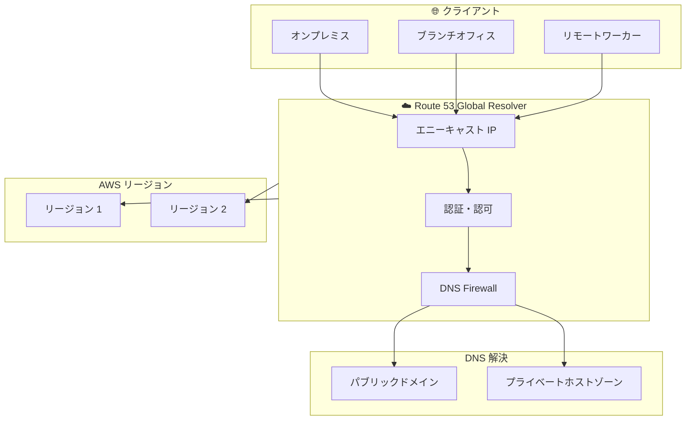

# Amazon Route 53 Global Resolver - セキュアなエニーキャスト DNS 解決 (プレビュー)

**リリース日**: 2025 年 11 月 30 日
**サービス**: Amazon Route 53
**機能**: Global Resolver (プレビュー)

## 概要

AWS は Amazon Route 53 Global Resolver のプレビューを発表しました。これは、インターネットからアクセス可能な新しい DNS リゾルバーで、認可されたクライアントからのクエリに対して、どこからでも簡単、安全、信頼性の高い DNS 解決を提供します。

Global Resolver により、組織内の認可されたクライアントは、インターネット上のパブリックドメインと Route 53 プライベートホストゾーンに関連付けられたプライベートドメインの両方を、どこからでも解決できるスプリット DNS 解決を実現できます。

**アップデート前の課題**

- オンプレミス、ブランチオフィス、リモートロケーションからの DNS 解決には、個別のスプリット DNS フォワーディング設定が必要だった
- 分散環境全体で DNS 解決を管理する運用の複雑さがあった
- DNS ベースのデータ流出攻撃に対する一元的な保護が困難だった
- 複数のリージョンにまたがる DNS 解決の高可用性確保が複雑だった

**アップデート後の改善**

- 認可されたクライアントからどこからでもパブリックおよびプライベートドメインを解決可能
- DNS Firewall ルールによる DNS ベースの脅威からの保護
- 複数リージョンでのエニーキャスト DNS 解決と自動フェイルオーバーによる高可用性
- すべてのクエリの一元的なログ記録による監査の簡素化

## アーキテクチャ図



Global Resolver は、認可されたクライアントからのクエリをエニーキャスト IP で受信し、DNS Firewall でフィルタリング後、パブリックまたはプライベートドメインを解決します。

## サービスアップデートの詳細

### 主要機能

1. **スプリット DNS 解決**
   - インターネット上のパブリックドメインの解決
   - Route 53 プライベートホストゾーンに関連付けられたプライベートドメインの解決
   - 認可されたクライアントからどこからでもアクセス可能

2. **DNS Firewall 統合**
   - 脅威カテゴリ (マルウェア、スパム) に基づくフィルタリング
   - Web コンテンツカテゴリ (アダルト、ギャンブル) に基づくフィルタリング
   - 高度な DNS 脅威 (DNS トンネリング、ドメイン生成アルゴリズム) の検出とブロック

3. **高可用性**
   - 2 つ以上のリージョンでのエニーキャスト DNS 解決
   - 最も近い利用可能なリージョンへの自動フェイルオーバー
   - グローバルな DNS 解決の信頼性向上

4. **セキュリティと監査**
   - すべてのクエリの一元的なログ記録
   - IP および CIDR 許可リストの設定
   - トークンベースの認証

## 技術仕様

### サポートされるプロトコル

| プロトコル | 説明 |
|-----------|------|
| DNS over UDP (Do53) | 従来の DNS プロトコル |
| DNS-over-HTTPS (DoH) | HTTPS 経由の暗号化 DNS |
| DNS-over-TLS (DoT) | TLS 経由の暗号化 DNS |

### 認証方式

| 方式 | 説明 |
|------|------|
| IP ベースアクセス | IP/CIDR 許可リストによるアクセス制御 |
| トークンベース認証 | アクセストークンによる認証 |

### DNS Firewall 脅威カテゴリ

| カテゴリ | 説明 |
|---------|------|
| マルウェア | マルウェア配布サイトへのアクセスをブロック |
| スパム | スパム関連ドメインへのアクセスをブロック |
| DNS トンネリング | DNS プロトコルを悪用したデータ流出を検出 |
| DGA | ドメイン生成アルゴリズムによる攻撃を検出 |

## 設定方法

### 前提条件

1. AWS アカウント
2. Route 53 プライベートホストゾーン (プライベートドメイン解決を使用する場合)
3. DNS Firewall ルールグループ (オプション)

### 手順

#### ステップ 1: Global Resolver の作成

AWS Management Console または AWS CLI を使用して Global Resolver を作成します。

```bash
# Global Resolver の作成 (CLI 例)
aws route53resolver create-global-resolver \
    --name "my-global-resolver" \
    --regions us-east-1 us-west-2
```

Global Resolver を作成し、エニーキャスト DNS 解決を行うリージョンを指定します。

#### ステップ 2: クライアント認証の設定

IP ベースまたはトークンベースの認証を設定します。

```bash
# IP 許可リストの設定
aws route53resolver create-global-resolver-access-source \
    --global-resolver-id gr-xxxxxxxxx \
    --source-type IP_ALLOWLIST \
    --ip-addresses "10.0.0.0/8" "192.168.0.0/16"
```

認可されたクライアントのみが Global Resolver にアクセスできるように設定します。

#### ステップ 3: DNS ビューの作成とプライベートホストゾーンの関連付け

```bash
# DNS ビューの作成とプライベートホストゾーンの関連付け
aws route53resolver create-global-resolver-dns-view \
    --global-resolver-id gr-xxxxxxxxx \
    --name "my-dns-view" \
    --private-hosted-zone-ids Z1234567890ABC
```

プライベートドメインを解決するために、プライベートホストゾーンを関連付けます。

#### ステップ 4: クライアントの設定

クライアントを Global Resolver のエニーキャスト IP アドレスに向けて設定します。

## メリット

### ビジネス面

- **運用の簡素化**: 分散環境全体で DNS 解決を一元管理
- **セキュリティ強化**: DNS ベースの脅威からの保護を一元的に適用
- **コンプライアンス**: すべての DNS クエリの一元的なログ記録による監査対応

### 技術面

- **高可用性**: 複数リージョンでのエニーキャスト解決と自動フェイルオーバー
- **暗号化サポート**: DoH、DoT による DNS クエリの暗号化
- **DNSSEC 検証**: DNS 応答の整合性検証
- **EDNS Client Subnet**: クライアントの地理的位置に基づく最適化

## デメリット・制約事項

### 制限事項

- プレビュー期間中は一部のリージョンでのみ利用可能
- 一般提供時の料金体系は未定
- 既存の Route 53 VPC Resolver との統合には追加設定が必要

### 考慮すべき点

- クライアント認証の設定が必要
- DNS Firewall ルールの適切な設計が重要
- 既存の DNS インフラストラクチャとの移行計画

## ユースケース

### ユースケース 1: ハイブリッド環境での統一 DNS 解決

**シナリオ**: オンプレミスデータセンター、ブランチオフィス、リモートワーカーが混在する環境で、AWS のプライベートリソースとインターネットリソースの両方にアクセスする必要がある。

**実装例**:
- Global Resolver を作成し、複数のリージョンでエニーキャスト解決を有効化
- プライベートホストゾーンを関連付けて AWS リソースへのアクセスを提供
- すべてのクライアントを Global Resolver のエニーキャスト IP に向けて設定

**効果**: 分散環境全体で一貫した DNS 解決を実現し、運用の複雑さを軽減

### ユースケース 2: DNS セキュリティの強化

**シナリオ**: 組織全体で DNS ベースの脅威 (マルウェア、フィッシング、データ流出) から保護する必要がある。

**実装例**:
- DNS Firewall ルールを作成し、脅威カテゴリに基づくフィルタリングを設定
- DNS トンネリングと DGA 検出を有効化
- すべてのクエリのログ記録を有効化して監査に対応

**効果**: 組織全体で一貫した DNS セキュリティポリシーを適用し、脅威からの保護を強化

### ユースケース 3: グローバル展開での低レイテンシー DNS 解決

**シナリオ**: グローバルに分散したユーザーに対して、低レイテンシーで信頼性の高い DNS 解決を提供する必要がある。

**実装例**:
- 複数のリージョンで Global Resolver を設定
- エニーキャスト解決により、ユーザーは最も近いリージョンから応答を受信
- 自動フェイルオーバーにより、リージョン障害時も継続的なサービスを提供

**効果**: グローバルユーザーに対して低レイテンシーで高可用性の DNS 解決を実現

## 料金

プレビュー期間中は追加料金なしで利用可能です。一般提供時の料金体系については、[サービスページ](https://aws.amazon.com/route53/global-resolver/) を参照してください。

## 利用可能リージョン

プレビュー期間中は一部のリージョンで利用可能です。詳細は [ドキュメント](https://docs.aws.amazon.com/Route53/latest/DeveloperGuide/gr-what-is-global-resolver.html) を参照してください。

## 関連サービス・機能

- **Route 53 VPC Resolver**: VPC 内の DNS 解決 (旧 Route 53 Resolver)
- **Route 53 Resolver DNS Firewall**: DNS クエリのフィルタリング
- **Route 53 プライベートホストゾーン**: プライベート DNS ドメインの管理
- **AWS Organizations**: 組織全体での DNS 設定の管理

## 参考リンク

- [公式発表 (What's New)](https://aws.amazon.com/about-aws/whats-new/2025/11/amazon-route-53-global-resolver-secure-anycast-dns-resolution-preview/)
- [AWS Blog](https://aws.amazon.com/blogs/aws/introducing-amazon-route-53-global-resolver-for-secure-anycast-dns-resolution-preview/)
- [サービスページ](https://aws.amazon.com/route53/global-resolver/)
- [ドキュメント](https://docs.aws.amazon.com/Route53/latest/DeveloperGuide/gr-what-is-global-resolver.html)

## まとめ

Amazon Route 53 Global Resolver は、分散環境全体で安全で信頼性の高い DNS 解決を提供する新しいサービスです。ハイブリッド環境やグローバル展開において、DNS 管理の簡素化とセキュリティ強化を実現したい組織は、プレビュー期間中に評価を開始することを推奨します。
