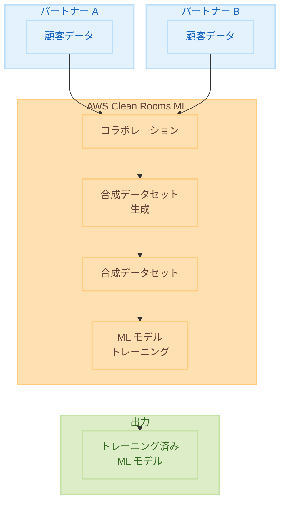

# AWS Clean Rooms ML - プライバシー保護合成データセット生成による ML モデルトレーニング

**リリース日**: 2025 年 11 月 30 日
**サービス**: AWS Clean Rooms ML
**機能**: Synthetic Dataset Generation for Custom ML Training

## 概要

AWS は AWS Clean Rooms ML に、プライバシーを保護しながら機械学習モデルをトレーニングするための合成データセット生成機能を追加しました。この機能により、パートナーと共同でデータを活用しながら、元のデータを直接共有することなく回帰モデルや分類モデルをトレーニングできます。

合成データセット生成は、元のデータと同様の統計的特性を持つトレーニングデータセットを作成し、トレーニングコードが実際のレコードにアクセスすることなくモデルを構築できるようにします。これにより、キャンペーン最適化、不正検出、医療研究など、プライバシーの懸念から制限されていた ML ユースケースが可能になります。

**アップデート前の課題**

- パートナーとの ML コラボレーションでは生データの共有が必要だった
- プライバシー規制により、個人データを使用した ML トレーニングが制限されていた
- モデルが個人情報を記憶するリスクがあった

**アップデート後の改善**

- 合成データセットにより、生データを共有せずに ML モデルをトレーニング可能
- 元データの統計的特性を維持しながら個人を特定できないデータを生成
- プライバシーを保護しながら新しい ML ユースケースを実現

## アーキテクチャ図



この図は、複数のパートナーがデータを提供し、AWS Clean Rooms ML で合成データセットを生成して ML モデルをトレーニングする流れを示しています。

## サービスアップデートの詳細

### 主要機能

1. **合成データセット生成**
   - 元データと同様の統計的特性を持つ合成データを生成
   - 個人を特定できる情報を除去（de-identification）
   - 回帰モデルと分類モデルのトレーニングに対応

2. **プライバシー保護**
   - トレーニングコードが実際のレコードにアクセスしない
   - モデルが個人情報を記憶するリスクを軽減
   - プライバシーパラメータによるノイズレベルの制御

3. **パートナーコラボレーション**
   - 複数のパートナーが共同でデータを活用
   - 生データを共有せずに ML モデルを構築
   - 各パートナーのデータプライバシーを保護

## 技術仕様

### サポートされる ML モデルタイプ

| モデルタイプ | サポート |
|-------------|---------|
| 分類モデル | ✅ |
| 回帰モデル | ✅ |
| その他 | 今後対応予定 |

### 合成データセットの特性

| 特性 | 説明 |
|------|------|
| スキーマ | 元データと同一 |
| 統計的特性 | 元データと類似 |
| 個人識別情報 | 除去済み |
| データ形式 | 表形式データ |

### プライバシーパラメータ

| パラメータ | 説明 |
|-----------|------|
| ノイズレベル | 適用するノイズの量を制御 |
| メンバーシップ推論保護 | メンバーシップ推論攻撃からの保護レベル |

## 設定方法

### 前提条件

1. AWS Clean Rooms コラボレーションの作成
2. パートナーの招待と承認
3. データソースの設定

### 手順

#### ステップ 1: コラボレーションの作成

AWS Clean Rooms コンソールでコラボレーションを作成します。

```bash
aws cleanrooms create-collaboration \
    --name "ML-Training-Collaboration" \
    --description "ML モデルトレーニング用コラボレーション" \
    --creator-member-abilities CAN_QUERY CAN_RECEIVE_RESULTS \
    --creator-display-name "Partner-A" \
    --query-log-status ENABLED
```

このコマンドは、ML トレーニング用のコラボレーションを作成します。

#### ステップ 2: 合成データセット生成ジョブの設定

合成データセット生成ジョブを設定します。

```bash
aws cleanrooms-ml create-training-dataset \
    --name "synthetic-training-dataset" \
    --role-arn "arn:aws:iam::123456789012:role/CleanRoomsMLRole" \
    --training-data '{
        "inputConfig": {
            "s3Uri": "s3://my-bucket/input-data/"
        },
        "targetColumn": "purchase_likelihood"
    }'
```

このコマンドは、合成データセット生成のためのトレーニングデータセットを作成します。

#### ステップ 3: ML モデルのトレーニング

生成された合成データセットを使用して ML モデルをトレーニングします。

```bash
aws cleanrooms-ml start-trained-model-export-job \
    --name "trained-model-export" \
    --trained-model-arn "arn:aws:cleanrooms-ml:us-east-1:123456789012:trained-model/abc123" \
    --output-configuration '{
        "s3Destination": {
            "s3Uri": "s3://my-bucket/trained-models/"
        }
    }'
```

トレーニング済みモデルを S3 にエクスポートします。

## メリット

### ビジネス面

- **新しいユースケースの実現**: プライバシー規制で制限されていた ML ユースケースが可能に
- **パートナーシップの強化**: 生データを共有せずにコラボレーション
- **コンプライアンス対応**: プライバシー規制に準拠した ML トレーニング

### 技術面

- **プライバシー保護**: 個人を特定できないデータでモデルをトレーニング
- **統計的精度**: 元データの統計的特性を維持
- **スケーラビリティ**: 大規模データセットに対応

## デメリット・制約事項

### 制限事項

- 現在は表形式データのみサポート
- 回帰モデルと分類モデルに限定
- 一部のリージョンでのみ利用可能

### 考慮すべき点

- 合成データの品質は元データの品質に依存
- プライバシーパラメータの適切な設定が必要
- モデルの精度と プライバシー保護のトレードオフ

## ユースケース

### ユースケース 1: 共同マーケティングキャンペーン

**シナリオ**: 航空会社とホテルブランドが共同プロモーションを実施したい

**実装例**:
```
1. 航空会社とホテルブランドが Clean Rooms コラボレーションを作成
2. 各社が顧客データを提供（生データは共有しない）
3. 合成データセットを生成
4. 高価値顧客を予測する ML モデルをトレーニング
5. モデルを使用してターゲティングを最適化
```

**効果**: 顧客プライバシーを保護しながら、より正確なプロモーションターゲティングを実現

### ユースケース 2: 不正検出モデルの構築

**シナリオ**: 複数の金融機関が協力して不正検出モデルを構築したい

**実装例**:
```
1. 複数の金融機関が Clean Rooms コラボレーションを作成
2. 各機関が取引データを提供
3. 合成データセットを生成（個人情報を除去）
4. 不正取引を検出する分類モデルをトレーニング
5. 各機関がモデルを自社システムに適用
```

**効果**: 機密性の高い金融データを共有せずに、より精度の高い不正検出モデルを構築

### ユースケース 3: 医療研究

**シナリオ**: 複数の医療機関が協力して疾患予測モデルを開発したい

**実装例**:
```
1. 医療機関が Clean Rooms コラボレーションを作成
2. 各機関が患者データを提供（HIPAA 準拠）
3. 合成データセットを生成（患者を特定できない）
4. 疾患リスクを予測する回帰モデルをトレーニング
5. 研究成果を共有
```

**効果**: 患者プライバシーを保護しながら、より大規模なデータセットで医療研究を実施

## 料金

AWS Clean Rooms ML の合成データセット生成は、使用量に基づいて課金されます。

| 項目 | 料金 |
|------|------|
| 合成データセット生成 | 処理データ量に基づく |
| ML モデルトレーニング | コンピューティング時間に基づく |
| ストレージ | S3 標準料金 |

詳細は [AWS Clean Rooms 料金ページ](https://aws.amazon.com/clean-rooms/pricing/) を参照してください。

## 利用可能リージョン

AWS Clean Rooms ML は、以下のリージョンで利用可能です。

- 米国東部 (バージニア北部)
- 米国西部 (オレゴン)
- 欧州 (アイルランド)
- アジアパシフィック (東京)
- その他のリージョン

詳細は [AWS リージョン表](https://docs.aws.amazon.com/general/latest/gr/clean-rooms-ml.html) を参照してください。

## 関連サービス・機能

- **AWS Clean Rooms**: プライバシー保護データコラボレーション
- **AWS Clean Rooms Differential Privacy**: 差分プライバシー
- **Amazon SageMaker**: ML モデルの構築とデプロイ
- **AWS Entity Resolution**: エンティティ解決

## 参考リンク

- [公式発表 (What's New)](https://aws.amazon.com/about-aws/whats-new/2025/11/aws-clean-rooms-synthetic-dataset-generation-custom-ml/)
- [AWS Blog](https://aws.amazon.com/blogs/aws/aws-clean-rooms-launches-privacy-enhancing-synthetic-dataset-generation-for-ml-model-training/)
- [AWS Clean Rooms ML](https://aws.amazon.com/clean-rooms/ml/)
- [AWS Clean Rooms ドキュメント](https://docs.aws.amazon.com/clean-rooms/)

## まとめ

AWS Clean Rooms ML の合成データセット生成機能により、プライバシーを保護しながらパートナーと協力して ML モデルをトレーニングできるようになりました。生データを共有せずに統計的に類似したデータを生成することで、キャンペーン最適化、不正検出、医療研究など、これまでプライバシーの懸念から制限されていたユースケースが実現可能になります。
