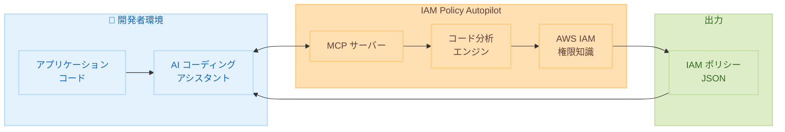

# AWS IAM Policy Autopilot - コードから IAM ポリシーを自動生成するオープンソースツール

**リリース日**: 2025 年 11 月 30 日
**サービス**: AWS Identity and Access Management (IAM)
**機能**: IAM Policy Autopilot

## 概要

AWS は IAM Policy Autopilot を発表しました。これは、AI コーディングアシスタントがアプリケーションコードを分析して IAM ポリシーを自動生成できるようにするオープンソースの Model Context Protocol (MCP) サーバーおよびコマンドラインツールです。

IAM Policy Autopilot は、Python、TypeScript、Go アプリケーションをサポートし、Kiro、Claude Code、Cursor などの AI コーディングアシスタントと統合できます。開発者はコードを書きながら、必要な IAM 権限を自動的に特定し、ベースラインポリシーを生成できます。

**アップデート前の課題**

- IAM ポリシーの作成には AWS サービスと API に関する深い知識が必要だった
- 開発者は IAM ポリシーの作成とアクセス問題のトラブルシューティングに多くの時間を費やしていた
- AI コーディングアシスタントは IAM の複雑さを適切に処理できなかった

**アップデート後の改善**

- AI コーディングアシスタントがコードを分析して必要な IAM 権限を自動特定
- 最新の AWS サービスと機能に対応した IAM 権限知識を提供
- 開発者はアプリケーション開発に集中でき、IAM ポリシー作成の負担が軽減

## アーキテクチャ図



この図は、IAM Policy Autopilot がアプリケーションコードを分析し、AI コーディングアシスタントを通じて IAM ポリシーを生成するワークフローを示しています。

## サービスアップデートの詳細

### 主要機能

1. **コード分析による IAM ポリシー生成**
   - アプリケーションコードをローカルで分析
   - AWS SDK 呼び出しを検出して必要な権限を特定
   - アイデンティティベースのポリシーを自動生成

2. **AI コーディングアシスタント統合**
   - Kiro、Claude Code、Cursor などと統合
   - MCP プロトコルによるシームレスな連携
   - 開発ワークフローに自然に組み込み可能

3. **最新 AWS サービス対応**
   - 最新の AWS サービスと機能に対応
   - 継続的に更新される IAM 権限知識
   - 新しい API 操作にも迅速に対応

## 技術仕様

### サポート言語

| 言語 | サポート状況 |
|------|-------------|
| Python | ✅ フルサポート |
| TypeScript | ✅ フルサポート |
| Go | ✅ フルサポート |

### 対応 AI コーディングアシスタント

| ツール | 統合方法 |
|--------|---------|
| Kiro | MCP サーバー |
| Claude Code | MCP サーバー |
| Cursor | MCP サーバー |
| CLI | スタンドアロン |

### 生成されるポリシータイプ

| ポリシータイプ | サポート |
|---------------|---------|
| アイデンティティベースポリシー | ✅ |
| リソースベースポリシー | ❌ |
| 権限境界 | ❌ |
| SCP/RCP | ❌ |

## 設定方法

### 前提条件

1. Python 3.8 以上、Node.js 18 以上、または Go 1.21 以上
2. MCP 対応の AI コーディングアシスタント
3. Git

### 手順

#### ステップ 1: リポジトリのクローン

```bash
git clone https://github.com/awslabs/iam-policy-autopilot.git
cd iam-policy-autopilot
```

GitHub から IAM Policy Autopilot のリポジトリをクローンします。

#### ステップ 2: MCP サーバーの設定

AI コーディングアシスタントの MCP 設定ファイルに以下を追加します。

```json
{
  "mcpServers": {
    "iam-policy-autopilot": {
      "command": "python",
      "args": ["-m", "iam_policy_autopilot.server"],
      "env": {}
    }
  }
}
```

この設定により、AI コーディングアシスタントが IAM Policy Autopilot と通信できるようになります。

#### ステップ 3: ポリシー生成の実行

AI コーディングアシスタントで以下のようなプロンプトを使用します。

```
このアプリケーションに必要な IAM ポリシーを生成してください
```

IAM Policy Autopilot がコードを分析し、必要な権限を含む IAM ポリシーを生成します。

## メリット

### ビジネス面

- **開発速度向上**: IAM ポリシー作成にかかる時間を大幅に削減
- **コスト削減**: アクセス問題のトラブルシューティング時間を短縮
- **セキュリティ向上**: 適切な権限設定により過剰な権限付与を防止

### 技術面

- **自動化**: コード分析による自動ポリシー生成
- **最新対応**: 最新の AWS サービスと API に対応
- **統合性**: 既存の開発ワークフローにシームレスに統合

## デメリット・制約事項

### 制限事項

- アイデンティティベースポリシーのみ生成（リソースベースポリシーは非対応）
- 生成されるポリシーは機能優先であり、最小権限ではない場合がある
- Python、TypeScript、Go のみサポート

### 考慮すべき点

- 生成されたポリシーはセキュリティ要件に応じてレビューと調整が必要
- 本番環境への適用前に IAM Access Analyzer での検証を推奨
- 静的コード分析のため、動的に決定される権限は検出できない場合がある

## ユースケース

### ユースケース 1: 新規アプリケーション開発

**シナリオ**: 新しい Lambda 関数を開発し、S3 と DynamoDB にアクセスする必要がある

**実装例**:
```python
# アプリケーションコード
import boto3

s3 = boto3.client('s3')
dynamodb = boto3.resource('dynamodb')

def handler(event, context):
    s3.get_object(Bucket='my-bucket', Key='data.json')
    table = dynamodb.Table('my-table')
    table.put_item(Item={'id': '1', 'data': 'value'})
```

**効果**: IAM Policy Autopilot が自動的に s3:GetObject と dynamodb:PutItem 権限を含むポリシーを生成

### ユースケース 2: アクセス拒否エラーのトラブルシューティング

**シナリオ**: アプリケーションで AccessDenied エラーが発生している

**実装例**:
```
IAM Policy Autopilot でコードを分析し、不足している権限を特定してください
```

**効果**: 必要な権限を特定し、既存のポリシーに追加すべき権限を提案

### ユースケース 3: マイクロサービスの権限管理

**シナリオ**: 複数のマイクロサービスそれぞれに最適な IAM ロールを作成したい

**実装例**:
```bash
# 各サービスディレクトリで実行
iam-policy-autopilot analyze --path ./service-a
iam-policy-autopilot analyze --path ./service-b
```

**効果**: 各サービスに必要な最小限の権限を持つポリシーを個別に生成

## 料金

IAM Policy Autopilot は無料で利用できます。オープンソースツールとして GitHub で公開されており、追加コストなしで使用できます。

## 利用可能リージョン

IAM Policy Autopilot はローカルで実行されるツールのため、リージョンに依存しません。生成されたポリシーは任意の AWS リージョンで使用できます。

## 関連サービス・機能

- **IAM Access Analyzer**: ポリシーの検証と最小権限の実現
- **AWS CloudTrail**: 実際の API 呼び出しの監査
- **Amazon Q Developer**: AI を活用した開発支援
- **Kiro**: スペック駆動開発 AI コーディングツール

## 参考リンク

- [公式発表 (What's New)](https://aws.amazon.com/about-aws/whats-new/2025/11/iam-policy-autopilot-generate-iam-policies-code/)
- [AWS Blog](https://aws.amazon.com/blogs/aws/simplify-iam-policy-creation-with-iam-policy-autopilot-a-new-open-source-mcp-server-for-builders)
- [GitHub リポジトリ](https://github.com/awslabs/iam-policy-autopilot)
- [AWS Security Blog](https://aws.amazon.com/blogs/security/iam-policy-autopilot-an-open-source-tool-that-brings-iam-policy-expertise-to-builders-and-ai-coding-assistants/)

## まとめ

IAM Policy Autopilot は、開発者が IAM ポリシー作成に費やす時間を大幅に削減し、アプリケーション開発に集中できるようにするオープンソースツールです。AI コーディングアシスタントとの統合により、コードを書きながら必要な権限を自動的に特定し、セキュアなアプリケーション開発を支援します。
