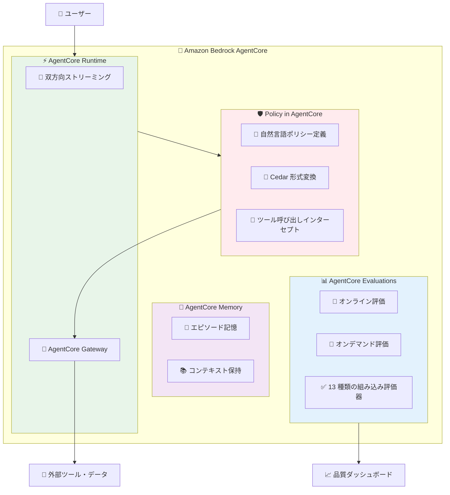
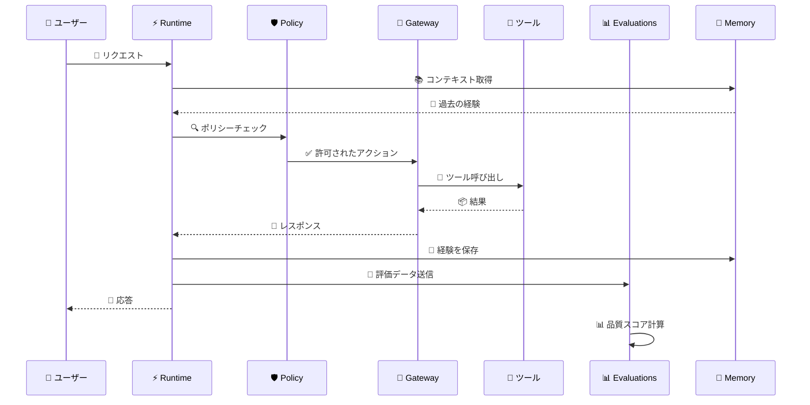

# Amazon Bedrock AgentCore - Policy と Evaluations による信頼性の高い AI エージェント展開

**リリース日**: 2025 年 12 月 1 日
**サービス**: Amazon Bedrock AgentCore
**機能**: Policy、Evaluations、Memory、Runtime の機能強化

## 概要

Amazon Bedrock AgentCore に、エンタープライズ規模で信頼性の高い AI エージェントを展開するための新機能が追加されました。Policy in AgentCore によるきめ細かなアクセス制御、AgentCore Evaluations による品質監視、エピソード記憶機能を備えた AgentCore Memory、双方向ストリーミングをサポートする AgentCore Runtime が含まれます。

これらの機能により、組織は AI エージェントが定義された境界内で動作することを保証しながら、エージェントの品質を継続的に監視・改善できるようになります。

**アップデート前の課題**

- AI エージェントのアクションに対するきめ細かな制御が困難だった
- エージェントの品質を本番環境で継続的に監視する手段が限られていた
- エージェントが過去の経験から学習する仕組みがなかった
- 自然な会話体験を実現するためのストリーミング機能が不足していた

**アップデート後の改善**

- Policy in AgentCore により、自然言語でポリシーを定義し、Cedar 形式に自動変換
- AgentCore Evaluations により、13 種類の組み込み評価器で品質を継続的に監視
- エピソード記憶により、エージェントが経験から学習し適応可能に
- 双方向ストリーミングにより、より自然な会話体験を実現

## アーキテクチャ図



Policy in AgentCore は AgentCore Gateway と統合し、ツール呼び出しをリアルタイムでインターセプトしてポリシーを適用します。

### エージェント実行フロー



エージェントの各インタラクションは Policy でチェックされ、Evaluations で品質が監視されます。

## サービスアップデートの詳細

### 主要機能

1. **Policy in AgentCore**
   - 自然言語でポリシーを定義し、Cedar 形式に自動変換
   - AgentCore Gateway と統合してツール呼び出しをリアルタイムでインターセプト
   - 開発、コンプライアンス、セキュリティチームが協力してポリシーを管理可能
   - エージェントの動作を遅延させることなく境界を適用

2. **AgentCore Evaluations (プレビュー)**
   - 本番トラフィックを使用してエージェント品質を継続的に監視
   - 正確性、有用性、安全性など 13 種類の組み込み評価器
   - カスタムモデルベースのスコアリングシステムも利用可能
   - オンライン評価とオンデマンド評価の 2 種類をサポート

3. **AgentCore Memory のエピソード記憶**
   - エージェントが過去の経験から学習し適応
   - コンテキストを長期間保持
   - より個人化された応答を実現

4. **AgentCore Runtime の双方向ストリーミング**
   - より自然な会話体験を実現
   - リアルタイムの応答生成
   - 低レイテンシーのインタラクション

## 技術仕様

### 評価タイプ

| 評価タイプ | 説明 | ユースケース |
|-----------|------|-------------|
| オンライン評価 | 本番トラフィックを継続的に監視 | 品質の継続的な監視、トレンド追跡 |
| オンデマンド評価 | 特定のインタラクションを分析 | カスタム評価器のテスト、問題調査 |

### 組み込み評価器

AgentCore Evaluations には以下の品質次元をカバーする 13 種類の組み込み評価器が含まれます。

- 正確性 (Correctness)
- 有用性 (Helpfulness)
- 安全性 (Safety)
- その他の品質次元

### リージョン可用性

| 機能 | 利用可能リージョン |
|------|-------------------|
| Policy in AgentCore | すべての AWS リージョン |
| AgentCore Evaluations (プレビュー) | US East (N. Virginia)、US West (Oregon)、Asia Pacific (Sydney)、Europe (Frankfurt) |

## 設定方法

### 前提条件

1. AWS アカウント
2. Amazon Bedrock へのアクセス権限
3. AgentCore を使用した既存のエージェント

### Policy in AgentCore の設定

#### ステップ 1: ポリシーの定義

自然言語でポリシーを定義します。

```
ユーザーは自分のアカウント情報のみを照会できる。
管理者ロールを持つユーザーのみがデータを削除できる。
```

AgentCore は自然言語を Cedar 形式に自動変換します。

#### ステップ 2: AgentCore Gateway との統合

AgentCore Gateway を設定して、ツール呼び出しをインターセプトするようにします。

### AgentCore Evaluations の設定

#### ステップ 1: 評価の有効化

AgentCore コンソールで評価を有効化し、サンプリングルールを設定します。

#### ステップ 2: 評価器の選択

組み込み評価器から必要なものを選択するか、カスタム評価器を作成します。

## メリット

### ビジネス面

- **コンプライアンス強化**: ポリシーによりエージェントが規制要件を遵守
- **品質保証**: 継続的な評価により顧客体験を向上
- **リスク軽減**: エージェントの動作を制御し、予期しない動作を防止

### 技術面

- **開発効率向上**: 自然言語でポリシーを定義可能
- **運用負荷軽減**: 品質監視の自動化
- **スケーラビリティ**: エンタープライズ規模での展開をサポート

## デメリット・制約事項

### 制限事項

- AgentCore Evaluations は現在プレビュー段階で、4 リージョンのみで利用可能
- カスタム評価器の作成には追加の設定が必要
- エピソード記憶の容量には制限がある可能性

### 考慮すべき点

- ポリシーの設計には、セキュリティとユーザビリティのバランスが必要
- 評価結果の解釈には AI/ML の知識が有用

## ユースケース

### ユースケース 1: カスタマーサービスエージェント

**シナリオ**: 顧客サポート用の AI エージェントを展開し、顧客データへのアクセスを制御しながら品質を監視

**実装例**:
```
Policy: ユーザーは自分の注文履歴のみを照会できる
Evaluations: 正確性と有用性の評価器を有効化
```

**効果**: 顧客データの保護と高品質なサポート体験の両立

### ユースケース 2: 社内ナレッジアシスタント

**シナリオ**: 社内文書を検索・要約する AI エージェントを展開し、部門ごとのアクセス制御を実装

**実装例**:
```
Policy: ユーザーは所属部門の文書のみにアクセス可能
Memory: エピソード記憶で過去の質問パターンを学習
```

**効果**: 情報セキュリティを維持しながら、個人化された検索体験を提供

### ユースケース 3: 自動車業界での活用

**シナリオ**: Toyota Motor North America のように、Amazon Bedrock AgentCore を使用してエージェント AI プラットフォームを構築

**実装例**:
```
AgentCore Runtime: 双方向ストリーミングで自然な会話
AgentCore Policy: 車両データへのアクセス制御
AgentCore Evaluations: 応答品質の継続的監視
```

**効果**: 信頼性の高い AI エージェントをエンタープライズ規模で展開

## 料金

AgentCore は従量課金制で、前払い費用はありません。

### 料金例

| コンポーネント | 料金体系 |
|---------------|---------|
| AgentCore Runtime | 使用量に基づく課金 |
| AgentCore Gateway | ツール呼び出し数に基づく課金 |
| AgentCore Evaluations | 評価数に基づく課金 |

詳細な料金については、[Amazon Bedrock 料金ページ](https://aws.amazon.com/bedrock/pricing/)を参照してください。

## 利用可能リージョン

- **Policy in AgentCore**: すべての AWS リージョン
- **AgentCore Evaluations (プレビュー)**: US East (N. Virginia)、US West (Oregon)、Asia Pacific (Sydney)、Europe (Frankfurt)
- **AgentCore Memory、Runtime**: AgentCore が利用可能なすべてのリージョン

## 関連サービス・機能

- **Amazon Bedrock**: 基盤モデルへのアクセスを提供
- **Amazon Bedrock Agents**: エージェントの構築と管理
- **Amazon CloudWatch**: エージェントの監視とログ
- **AWS IAM**: アクセス制御と認証

## 参考リンク

- [公式発表 (What's New)](https://aws.amazon.com/about-aws/whats-new/2025/12/amazon-bedrock-agentcore-policy-evaluations-preview/)
- [AWS Blog](https://aws.amazon.com/blogs/aws/amazon-bedrock-agentcore-adds-quality-evaluations-and-policy-controls-for-deploying-trusted-ai-agents/)
- [Amazon Bedrock AgentCore 製品ページ](https://aws.amazon.com/bedrock/agentcore/)
- [ドキュメント](https://docs.aws.amazon.com/bedrock-agentcore/latest/devguide/)

## まとめ

Amazon Bedrock AgentCore の新機能により、エンタープライズは信頼性の高い AI エージェントを大規模に展開できるようになりました。Policy in AgentCore でエージェントの動作を制御し、AgentCore Evaluations で品質を継続的に監視することで、AI エージェントの信頼性と安全性を確保しながらビジネス価値を最大化できます。
