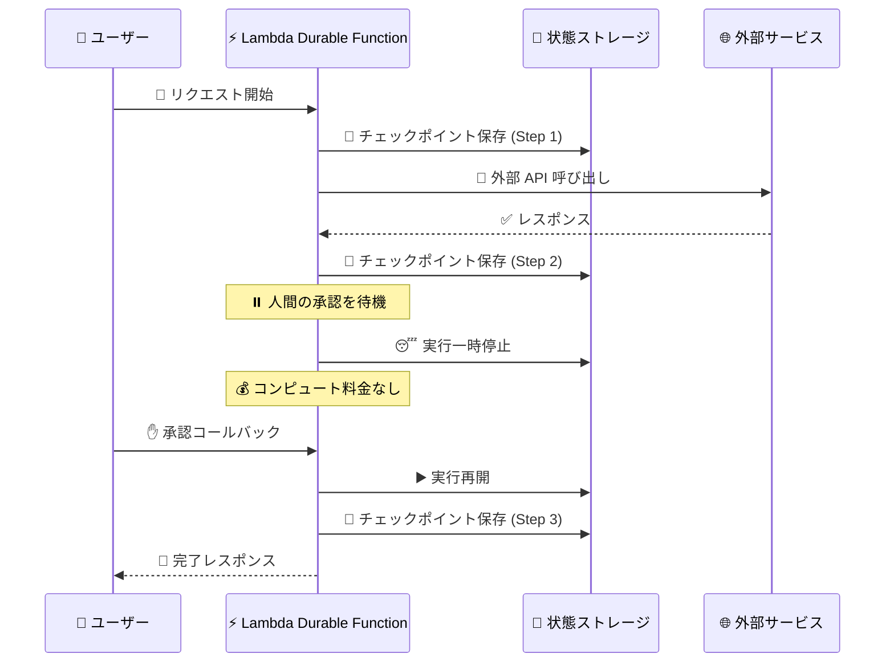
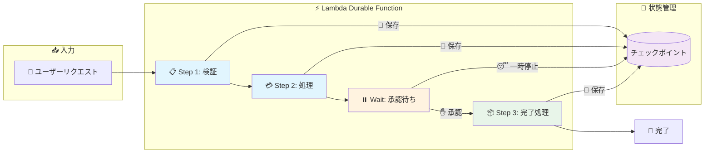

# AWS Lambda Durable Functions - マルチステップアプリケーションと AI ワークフローの構築

**リリース日**: 2025 年 12 月 1 日
**サービス**: AWS Lambda
**機能**: Durable Functions (耐久性のある関数)

## 概要

AWS Lambda に Durable Functions が追加され、マルチステップアプリケーションや AI ワークフローを Lambda の開発体験内で直接構築できるようになりました。Durable Functions は状態管理を自動化し、長時間実行タスク中に最大 1 年間実行を一時停止でき、追加のインフラストラクチャやカスタムコードなしで障害から回復します。

この機能により、注文処理や AI アシスタントワークフローなどの複雑なマルチステップアプリケーションを、カスタム状態管理や外部オーケストレーションサービスなしで構築できます。

**アップデート前の課題**

- 複雑なマルチステップアプリケーションにはカスタム状態管理が必要だった
- 長時間実行タスクには外部オーケストレーションサービス (Step Functions など) が必要だった
- 障害からの回復には独自のリトライロジックの実装が必要だった
- 待機中もコンピュート料金が発生していた

**アップデート後の改善**

- Lambda 内で直接マルチステップワークフローを構築可能
- 最大 1 年間の実行一時停止をサポート (待機中はコンピュート料金なし)
- 自動チェックポイントと障害回復
- steps と waits の新しいプリミティブで状態管理を簡素化

## アーキテクチャ図



Durable Functions はチェックポイントとリプレイのメカニズムを使用して、中断や長時間実行プロセス中も進行状況を維持します。

### ワークフロー概要図



各ステップでチェックポイントが自動保存され、障害発生時は最後のチェックポイントから自動再開されます。

## サービスアップデートの詳細

### 主要機能

1. **チェックポイントとリプレイ (Durable Execution)**
   - ユーザー定義の一時停止ポイントでチェックポイントを自動保存
   - 障害発生時に最後のチェックポイントから自動再開
   - 状態管理の複雑さを SDK が抽象化

2. **Steps プリミティブ**
   - ワークフローの各ステップを定義
   - 各ステップでチェックポイントを自動保存
   - エラーハンドリングとリトライ戦略をカスタマイズ可能

3. **Waits プリミティブ**
   - 外部イベントや人間の承認を待機
   - 最大 1 年間の待機をサポート
   - 待機中はコンピュート料金が発生しない

4. **自動リトライと障害回復**
   - 一時的な障害からの自動回復
   - カスタムリトライ戦略の定義
   - 補償トランザクション (ロールバック) のサポート

## 技術仕様

### サポートされるランタイム

| ランタイム | バージョン |
|-----------|-----------|
| Python | 3.13、3.14 |
| Node.js (JavaScript/TypeScript) | 22、24 |

### 利用可能リージョン

| リージョン | 可用性 |
|-----------|--------|
| US East (Ohio) | 一般提供 |

### SDK

Durable Execution SDK はオープンソースで提供されています。

- [JavaScript/TypeScript SDK](https://github.com/aws/aws-lambda-durable-functions-js)
- [Python SDK](https://github.com/aws/aws-lambda-durable-functions-python)

## 設定方法

### 前提条件

1. AWS アカウント
2. AWS CLI または AWS Management Console へのアクセス
3. Python 3.13/3.14 または Node.js 22/24 の開発環境

### 手順

#### ステップ 1: Durable Function の作成

AWS Management Console で新しい Lambda 関数を作成し、Durable Functions を有効化します。

```bash
# AWS CLI を使用した関数作成
aws lambda create-function \
  --function-name my-durable-function \
  --runtime python3.14 \
  --handler handler.handler \
  --role arn:aws:iam::123456789012:role/lambda-role \
  --durable-execution-enabled
```

Durable Functions を有効化すると、Lambda は状態管理とチェックポイントを自動的に処理します。

#### ステップ 2: Durable Execution SDK のインストール

```bash
# Python
pip install aws-lambda-durable

# Node.js
npm install @aws-lambda/durable
```

SDK をインストールすることで、steps と waits のプリミティブを使用できます。

#### ステップ 3: ワークフローの実装

Python での実装例:

```python
from aws_lambda_durable import durable, step, wait

@durable
async def order_workflow(event, context):
    # Step 1: 注文の検証
    order = await step("validate_order", validate_order, event["order_id"])
    
    # Step 2: 支払い処理
    payment = await step("process_payment", process_payment, order)
    
    # Step 3: 人間の承認を待機 (最大 7 日間)
    approval = await wait("wait_for_approval", timeout_days=7)
    
    if approval["approved"]:
        # Step 4: 注文の発送
        await step("ship_order", ship_order, order)
        return {"status": "completed"}
    else:
        # 補償: 支払いの返金
        await step("refund_payment", refund_payment, payment)
        return {"status": "cancelled"}
```

各 step でチェックポイントが保存され、障害発生時は最後のチェックポイントから再開されます。

## メリット

### ビジネス面

- **開発速度向上**: 状態管理のボイラープレートコードが不要
- **コスト最適化**: 待機中はコンピュート料金が発生しない
- **信頼性向上**: 自動障害回復により SLA を維持

### 技術面

- **シンプルなプログラミングモデル**: Lambda の開発体験を維持
- **自動状態管理**: チェックポイントとリプレイを SDK が処理
- **柔軟なエラーハンドリング**: カスタムリトライ戦略と補償トランザクション

## デメリット・制約事項

### 制限事項

- 現在 US East (Ohio) リージョンのみで利用可能
- Python 3.13/3.14 と Node.js 22/24 のみサポート
- 決定論的なコードを書く必要がある (リプレイ時に同じ実行パスを辿る必要)

### 考慮すべき点

- 非決定論的な操作 (乱数生成、外部 API 呼び出し) は step でラップする必要
- 大きなペイロードは Amazon S3 や DynamoDB に保存することを推奨
- 既存の Step Functions ワークフローとの使い分けを検討

## ユースケース

### ユースケース 1: 注文処理ワークフロー

**シナリオ**: E コマースサイトで注文の検証、支払い処理、在庫確保、発送を順次実行

**実装例**:
```python
@durable
async def order_processing(event, context):
    order = await step("validate", validate_order, event)
    payment = await step("payment", process_payment, order)
    inventory = await step("inventory", allocate_inventory, order)
    await step("ship", ship_order, order)
    return {"status": "completed", "order_id": order["id"]}
```

**効果**: 各ステップで障害が発生しても自動回復し、注文処理の信頼性を向上

### ユースケース 2: 人間参加型の承認ワークフロー

**シナリオ**: 経費申請の自動処理と管理者承認を組み合わせたワークフロー

**実装例**:
```python
@durable
async def expense_approval(event, context):
    expense = await step("validate", validate_expense, event)
    
    # 管理者の承認を最大 7 日間待機
    approval = await wait("manager_approval", timeout_days=7)
    
    if approval["approved"]:
        await step("reimburse", process_reimbursement, expense)
        return {"status": "approved"}
    else:
        return {"status": "rejected", "reason": approval["reason"]}
```

**効果**: 待機中はコンピュート料金が発生せず、コスト効率の良い承認ワークフローを実現

### ユースケース 3: AI アシスタントワークフロー

**シナリオ**: 複数の AI モデルを順次呼び出し、結果を統合する AI ワークフロー

**実装例**:
```python
@durable
async def ai_workflow(event, context):
    # Step 1: ドキュメントの分析
    analysis = await step("analyze", analyze_document, event["document"])
    
    # Step 2: 要約の生成
    summary = await step("summarize", generate_summary, analysis)
    
    # Step 3: 推奨アクションの生成
    recommendations = await step("recommend", generate_recommendations, summary)
    
    return {"summary": summary, "recommendations": recommendations}
```

**効果**: AI モデル呼び出しの障害から自動回復し、信頼性の高い AI ワークフローを実現

## 料金

Durable Functions の料金は、通常の Lambda 料金に加えて、チェックポイントの保存と読み取りに対する料金が発生します。

### 料金例

| 項目 | 料金 |
|------|------|
| Lambda 実行時間 | 通常の Lambda 料金 |
| チェックポイント保存 | リクエストあたりの料金 |
| 待機中 | 料金なし |

詳細な料金については、[AWS Lambda 料金ページ](https://aws.amazon.com/lambda/pricing/)を参照してください。

## 利用可能リージョン

現在、US East (Ohio) リージョンで一般提供されています。他のリージョンへの展開は今後予定されています。

## 関連サービス・機能

- **AWS Step Functions**: より複雑なオーケストレーションが必要な場合
- **Amazon EventBridge**: Durable Functions の実行監視
- **Lambda Managed Instances**: EC2 コンピュートで Lambda を実行
- **Amazon DynamoDB**: 大きな状態データの保存

## 参考リンク

- [公式発表 (What's New)](https://aws.amazon.com/about-aws/whats-new/2025/12/lambda-durable-multi-step-applications-ai-workflows/)
- [AWS Blog](https://aws.amazon.com/blogs/aws/build-multi-step-applications-and-ai-workflows-with-aws-lambda-durable-functions/)
- [Lambda Durable Functions ドキュメント](https://docs.aws.amazon.com/lambda/latest/dg/durable-functions.html)
- [ベストプラクティス](https://docs.aws.amazon.com/lambda/latest/dg/durable-best-practices.html)

## まとめ

AWS Lambda Durable Functions により、マルチステップアプリケーションや AI ワークフローを Lambda の開発体験内で直接構築できるようになりました。自動状態管理、障害回復、待機中のコスト最適化により、信頼性の高いワークフローを効率的に構築できます。Step Functions との使い分けを検討しながら、ユースケースに応じて適切なサービスを選択してください。
