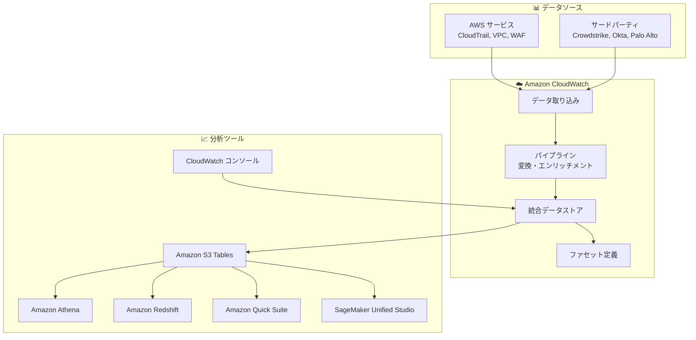

# Amazon CloudWatch - 統合データ管理と分析機能

**リリース日**: 2025 年 12 月 2 日
**サービス**: Amazon CloudWatch
**機能**: 統合データ管理と分析 (Unified Management and Analytics)

## 概要

Amazon CloudWatch に新しいデータ管理と分析機能が追加され、運用、セキュリティ、コンプライアンスデータを AWS 環境とサードパーティソースから統合できるようになりました。DevOps チーム、セキュリティアナリスト、コンプライアンス担当者は、すべてのデータに単一の場所からアクセスでき、複数の個別データストアや複雑な ETL パイプラインを維持する必要がなくなります。

CloudWatch は、データへのインサイトを得る場所と方法について、より大きな柔軟性を提供します。CloudWatch 内でネイティブに分析するか、Apache Iceberg 互換のツールを使用して分析できます。

**アップデート前の課題**

- 運用、セキュリティ、コンプライアンスデータが複数のデータストアに分散していた
- 複雑な ETL パイプラインの構築と維持が必要だった
- 異なるソースからのログを統合するために手動での設定が必要だった
- セキュリティ分析のための標準フォーマットへの変換が困難だった

**アップデート後の改善**

- AWS とサードパーティソースからのデータを単一の場所に統合
- AWS Organizations 全体でのログ収集を簡単に有効化
- OCSF などの標準フォーマットへの自動変換
- Amazon S3 Tables への追加ストレージ料金なしでのデータエクスポート

## アーキテクチャ図



CloudWatch の統合データストアは、複数のソースからデータを収集し、変換後に CloudWatch 内または Apache Iceberg 互換ツールで分析できます。

## サービスアップデートの詳細

### 主要機能

1. **統合データ収集**
   - AWS Organizations 全体でのログ収集の有効化
   - AWS CloudTrail、Amazon VPC、Amazon WAF などの AWS ソースをサポート
   - Crowdstrike、Okta、Palo Alto Networks などのサードパーティソース用マネージドコレクター
   - 地理的境界、ビジネスユニット、ペルソナ固有の要件に合わせたログ集約

2. **データ変換とエンリッチメント**
   - パイプラインによるログの変換とエンリッチメント
   - Open Cybersecurity Schema Framework (OCSF) への標準フォーマット変換
   - セキュリティ分析のための自動正規化
   - ファセット定義によるインサイトの高速化

3. **柔軟な分析オプション**
   - CloudWatch コンソールでのネイティブ分析
   - Amazon S3 Tables へのデータエクスポート (追加ストレージ料金なし)
   - Apache Iceberg 互換ツールでの分析
   - Amazon SageMaker Unified Studio、Amazon Quick Suite、Amazon Athena、Amazon Redshift との統合

## 技術仕様

### サポートされる AWS ソース

| ソース | 説明 |
|--------|------|
| AWS CloudTrail | API アクティビティログ |
| Amazon VPC | VPC フローログ |
| Amazon WAF | Web アプリケーションファイアウォールログ |

### サポートされるサードパーティソース

| ソース | 説明 |
|--------|------|
| Crowdstrike | エンドポイントセキュリティ |
| Okta | ID 管理 |
| Palo Alto Networks | ネットワークセキュリティ |

### データフォーマット

| フォーマット | 説明 |
|-------------|------|
| OCSF | Open Cybersecurity Schema Framework - セキュリティ分析用標準フォーマット |
| OTel | Open Telemetry - オブザーバビリティデータ用標準フォーマット |
| Apache Iceberg | オープンテーブルフォーマット - 分析ツールとの互換性 |

## 設定方法

### 前提条件

1. AWS アカウント
2. CloudWatch へのアクセス権限
3. AWS Organizations (組織全体での有効化を使用する場合)

### 手順

#### ステップ 1: データソースの追加

CloudWatch コンソールの Ingestion ページからデータソースを追加します。

```bash
# AWS CLI でのデータソース設定例
aws cloudwatch-logs create-log-group \
    --log-group-name "/aws/unified-store/my-logs"
```

CloudWatch コンソールの Ingestion ページにアクセスし、1 つ以上のデータソースを追加します。

#### ステップ 2: パイプラインの設定

データ変換とエンリッチメントのためのパイプラインを設定します。

```json
{
  "pipeline": {
    "name": "security-logs-pipeline",
    "transformations": [
      {
        "type": "OCSF_CONVERSION",
        "enabled": true
      }
    ]
  }
}
```

OCSF などの標準フォーマットへの変換を有効にして、セキュリティ分析を簡素化します。

#### ステップ 3: ファセットの定義

インサイトを高速化するためのファセットを定義します。

```json
{
  "facets": [
    {
      "name": "source",
      "field": "source.type"
    },
    {
      "name": "region",
      "field": "cloud.region"
    }
  ]
}
```

ソース、アプリケーション、アカウント、リージョン、ログタイプなどでフィルタリングできるファセットを定義します。

#### ステップ 4: S3 Tables へのエクスポート設定

外部分析ツールでデータを使用するために、S3 Tables へのエクスポートを設定します。

## メリット

### ビジネス面

- **運用コスト削減**: 複数のデータストアと ETL パイプラインの維持が不要
- **コンプライアンス対応**: 一元化されたログ管理による監査の簡素化
- **迅速なインサイト**: 統合データからの迅速な分析と意思決定

### 技術面

- **データ統合の簡素化**: AWS とサードパーティソースからのデータを自動収集
- **標準フォーマット対応**: OCSF、OTel への自動変換
- **柔軟な分析**: CloudWatch 内または Apache Iceberg 互換ツールでの分析
- **追加ストレージ料金なし**: S3 Tables へのエクスポートに追加料金なし

## デメリット・制約事項

### 制限事項

- AWS GovCloud (US) および中国リージョンでは利用不可
- サードパーティソースのサポートは限定的 (Crowdstrike、Okta、Palo Alto Networks)
- 一部の高度な変換には追加設定が必要

### 考慮すべき点

- 既存のログ管理ソリューションからの移行計画
- データ保持ポリシーの設計
- アクセス制御とセキュリティの設定

## ユースケース

### ユースケース 1: セキュリティ運用の統合

**シナリオ**: セキュリティチームが AWS サービスとサードパーティセキュリティツールからのログを統合して、脅威検出と対応を行う必要がある。

**実装例**:
- CloudTrail、VPC フローログ、WAF ログを CloudWatch に統合
- Crowdstrike、Okta からのログをマネージドコレクターで収集
- OCSF フォーマットへの自動変換を有効化
- ファセットを定義して迅速なフィルタリングを実現

**効果**: セキュリティイベントの一元的な可視化と迅速な脅威対応

### ユースケース 2: マルチアカウント環境でのログ集約

**シナリオ**: AWS Organizations を使用する大規模組織が、すべてのアカウントからのログを一元管理する必要がある。

**実装例**:
- AWS Organizations 全体でのログ収集を有効化
- 地理的境界やビジネスユニットに基づいてログを集約
- 統合データストアで一元的に分析

**効果**: 組織全体のログの一元管理と運用の簡素化

### ユースケース 3: 高度な分析とレポーティング

**シナリオ**: データアナリストが CloudWatch のログデータを使用して、カスタム分析とレポートを作成する必要がある。

**実装例**:
- CloudWatch データを S3 Tables にエクスポート
- Amazon Athena または Amazon Redshift でクエリを実行
- Amazon Quick Suite でダッシュボードを作成

**効果**: 柔軟な分析ツールを使用したカスタムインサイトの取得

## 料金

CloudWatch の標準料金が適用されます。S3 Tables へのデータエクスポートには追加ストレージ料金はかかりません。詳細は [CloudWatch 料金ページ](https://aws.amazon.com/cloudwatch/pricing/) を参照してください。

- 前払いコミットメントなし
- 最低料金なし

## 利用可能リージョン

AWS GovCloud (US) および中国リージョンを除くすべての AWS リージョンで利用可能です。詳細は [AWS Builder Center](https://builder.aws.com/build/capabilities) を参照してください。

## 関連サービス・機能

- **Amazon S3 Tables**: Apache Iceberg 形式でのデータストレージ
- **Amazon Athena**: サーバーレス SQL クエリ
- **Amazon Redshift**: データウェアハウス分析
- **Amazon Quick Suite**: ビジネスインテリジェンス
- **Amazon SageMaker Unified Studio**: ML 開発環境

## 参考リンク

- [公式発表 (What's New)](https://aws.amazon.com/about-aws/whats-new/2025/12/amazon-cloudwatch-unified-management-analytics/)
- [AWS Blog](https://aws.amazon.com/blogs/aws/amazon-cloudwatch-introduces-unified-data-management-and-analytics-for-operations-security-and-compliance/)
- [製品ページ](https://aws.amazon.com/cloudwatch/features/unified-data-and-telemetry/)
- [料金ページ](https://aws.amazon.com/cloudwatch/pricing/)
- [ドキュメント](https://docs.aws.amazon.com/cloudwatch/)

## まとめ

Amazon CloudWatch の統合データ管理と分析機能は、運用、セキュリティ、コンプライアンスデータを一元化し、分析を簡素化する重要なアップデートです。複数のデータストアや ETL パイプラインの管理に課題を感じている組織は、この機能を活用してデータ管理を効率化することを推奨します。
