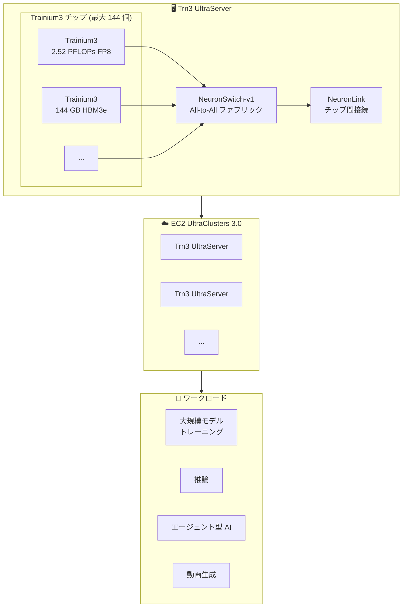

# Amazon EC2 Trn3 UltraServers - 高速・低コストの生成 AI トレーニング

**リリース日**: 2025 年 12 月 2 日
**サービス**: Amazon EC2
**機能**: Trn3 UltraServers (一般提供)

## 概要

AWS は Amazon EC2 Trn3 UltraServers の一般提供を発表しました。これは第 4 世代の AWS AI チップ Trainium3 を搭載した、次世代のエージェント型、推論、動画生成アプリケーション向けに最適なトークンエコノミクスを提供する初の 3nm AWS AI チップです。

Trn3 UltraServers は、最大 144 個の Trainium3 チップにスケールアップでき、EC2 UltraClusters 3.0 で数十万個のチップにスケールアウトできます。Trn2 UltraServers と比較して、最大 4.4 倍の性能向上、3.9 倍のメモリ帯域幅、4 倍の電力効率を実現します。

**アップデート前の課題**

- 大規模な生成 AI モデルのトレーニングには高いコストと時間がかかっていた
- 推論やエージェント型 AI ワークロードに最適化されたインフラストラクチャが限られていた
- メモリ容量と帯域幅の制約により、大規模モデルの効率的な処理が困難だった
- 電力効率の課題により、持続可能性目標の達成が困難だった

**アップデート後の改善**

- Trn2 比で最大 4.4 倍の性能向上
- 3.9 倍のメモリ帯域幅と 1.5 倍のメモリ容量
- 4 倍の電力効率 (performance/watt)
- Amazon Bedrock で Trainium2 比 3 倍の高速化と 5 倍以上の出力トークン/メガワット

## アーキテクチャ図



Trn3 UltraServer は NeuronSwitch-v1 と NeuronLink により高帯域幅・低レイテンシーのチップ間接続を実現し、大規模 AI ワークロードを効率的に処理します。

## サービスアップデートの詳細

### 主要機能

1. **Trainium3 チップ**
   - 2.52 ペタフロップス (PFLOPs) の FP8 コンピュート
   - 144 GB の HBM3e メモリ (Trainium2 比 1.5 倍)
   - 4.9 TB/s のメモリ帯域幅 (Trainium2 比 1.7 倍)
   - 3nm プロセス技術による高効率

2. **スケーラビリティ**
   - 単一 UltraServer で最大 144 個の Trainium3 チップ
   - 362 FP8 PFLOPs の総コンピュート能力
   - 20.7 TB の HBM3e メモリ
   - 706 TB/s の総メモリ帯域幅

3. **NeuronSwitch-v1**
   - All-to-All ファブリックによる高効率通信
   - Trn2 UltraServer 比 2 倍のチップ間インターコネクト帯域幅
   - 密集型およびエキスパート並列ワークロードに最適化

4. **高度なデータ型サポート**
   - MXFP8 および MXFP4 データ型
   - リアルタイム、マルチモーダル、推論タスクに最適化されたメモリ対コンピュートバランス

## 技術仕様

### Trainium3 チップ仕様

| 項目 | 仕様 |
|------|------|
| コンピュート | 2.52 PFLOPs (FP8) |
| メモリ容量 | 144 GB HBM3e |
| メモリ帯域幅 | 4.9 TB/s |
| プロセス技術 | 3nm |
| データ型 | MXFP8, MXFP4 |

### Trn3 UltraServer 仕様 (フル構成)

| 項目 | 仕様 |
|------|------|
| Trainium3 チップ数 | 最大 144 個 |
| 総コンピュート | 362 FP8 PFLOPs |
| 総メモリ | 20.7 TB HBM3e |
| 総メモリ帯域幅 | 706 TB/s |
| インターコネクト | NeuronSwitch-v1 (All-to-All) |

### 性能比較 (vs Trn2 UltraServers)

| 項目 | 向上率 |
|------|--------|
| 性能 | 最大 4.4 倍 |
| メモリ帯域幅 | 3.9 倍 |
| 電力効率 | 4 倍 |

### Amazon Bedrock での性能

| 項目 | 向上率 |
|------|--------|
| 性能 (vs Trainium2) | 最大 3 倍 |
| 出力トークン/メガワット | 5 倍以上 |

## 設定方法

### 前提条件

1. AWS アカウント
2. AWS Neuron SDK
3. PyTorch または JAX フレームワーク

### 手順

#### ステップ 1: Trn3 UltraServer の起動

EC2 Capacity Blocks for ML を使用して Trn3 UltraServer を予約・起動します。

```bash
# EC2 Capacity Blocks の予約 (例)
aws ec2 create-capacity-reservation \
    --instance-type trn3.ultraserver \
    --instance-platform Linux/UNIX \
    --availability-zone us-east-1a \
    --instance-count 1
```

Trn3 UltraServer は EC2 Capacity Blocks for ML を通じて利用可能です。

#### ステップ 2: AWS Neuron SDK のセットアップ

```bash
# Neuron SDK のインストール
pip install torch-neuronx neuronx-cc

# 環境変数の設定
export NEURON_RT_NUM_CORES=32
```

AWS Neuron SDK をインストールし、Trainium3 チップを活用するための環境を設定します。

#### ステップ 3: モデルのトレーニング

```python
import torch
import torch_neuronx

# モデルの定義
model = YourModel()

# Neuron 用にコンパイル
model_neuron = torch_neuronx.trace(model, example_inputs)

# 分散トレーニングの実行
trainer = NeuronTrainer(model_neuron)
trainer.train(dataset)
```

PyTorch との ネイティブ統合により、モデルコードを変更せずにトレーニングとデプロイが可能です。

## メリット

### ビジネス面

- **コスト削減**: 最高の価格性能比でフロンティアスケールモデルのトレーニングとサービング
- **市場投入時間の短縮**: 高速なトレーニングによる AI 製品開発の加速
- **持続可能性**: 4 倍の電力効率による環境負荷の軽減

### 技術面

- **高性能**: Trn2 比 4.4 倍の性能向上
- **大容量メモリ**: 144 GB HBM3e による大規模モデルのサポート
- **高帯域幅**: 4.9 TB/s のメモリ帯域幅
- **スケーラビリティ**: EC2 UltraClusters 3.0 で数十万チップにスケール

## デメリット・制約事項

### 制限事項

- 利用可能なリージョンが限定的
- EC2 Capacity Blocks for ML を通じた予約が必要
- 一部のモデルアーキテクチャでは最適化が必要な場合がある

### 考慮すべき点

- AWS Neuron SDK への習熟が必要
- 既存の GPU ベースワークロードからの移行計画
- コスト最適化のためのキャパシティプランニング

## ユースケース

### ユースケース 1: 大規模言語モデル (LLM) のトレーニング

**シナリオ**: 数兆パラメータの大規模言語モデルをトレーニングする必要がある。

**実装例**:
- Trn3 UltraServers を EC2 UltraClusters 3.0 で構成
- NeuronSwitch-v1 による効率的な分散トレーニング
- MXFP8 データ型による高速化

**効果**: トレーニング時間の大幅短縮とコスト削減

### ユースケース 2: エージェント型 AI アプリケーション

**シナリオ**: リアルタイムの推論と意思決定を行うエージェント型 AI システムを構築する必要がある。

**実装例**:
- Trainium3 の高速推論能力を活用
- 低レイテンシーでの応答生成
- Amazon Bedrock との統合

**効果**: 高速で効率的なエージェント型 AI の実現

### ユースケース 3: 動画生成モデル

**シナリオ**: 高品質な動画生成モデルをトレーニングおよびサービングする必要がある。

**実装例**:
- 大容量 HBM3e メモリによる大規模モデルのサポート
- 高帯域幅メモリによる効率的なデータ処理
- マルチモーダルワークロードの最適化

**効果**: 高品質な動画生成の実現とコスト効率の向上

## 料金

Trn3 UltraServers は EC2 Capacity Blocks for ML を通じて利用可能です。詳細な料金については、[Amazon EC2 Trn3 インスタンスページ](https://aws.amazon.com/ec2/instance-types/trn3/) を参照してください。

## 利用可能リージョン

EC2 UltraClusters 3.0 が利用可能なリージョンで提供されます。詳細は AWS ドキュメントを参照してください。

## 関連サービス・機能

- **AWS Neuron SDK**: Trainium および Inferentia 向け ML フレームワーク
- **Amazon SageMaker**: ML モデルの構築、トレーニング、デプロイ
- **Amazon Bedrock**: フルマネージド生成 AI サービス
- **EC2 UltraClusters 3.0**: 大規模 AI クラスター

## 参考リンク

- [公式発表 (What's New)](https://aws.amazon.com/about-aws/whats-new/2025/12/amazon-ec2-trn3-ultraservers/)
- [Amazon EC2 Trn3 インスタンス](https://aws.amazon.com/ec2/instance-types/trn3/)
- [AWS Trainium](https://aws.amazon.com/ai/machine-learning/trainium/)
- [AWS Neuron SDK](https://aws.amazon.com/ai/machine-learning/neuron/)

## まとめ

Amazon EC2 Trn3 UltraServers は、生成 AI のトレーニングと推論において、性能、コスト効率、電力効率のすべてで大幅な改善を実現します。大規模な AI ワークロードを持つ組織は、Trn3 UltraServers を評価し、AI インフラストラクチャの最適化を検討することを推奨します。
