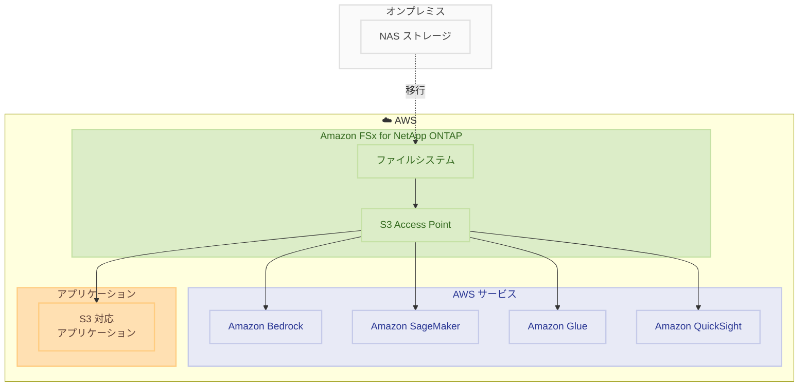

# Amazon FSx for NetApp ONTAP - Amazon S3 アクセスのサポート

**リリース日**: 2025 年 12 月 2 日
**サービス**: Amazon FSx for NetApp ONTAP
**機能**: Amazon S3 Access Points 統合

## 概要

AWS は Amazon FSx for NetApp ONTAP に Amazon S3 Access Points を接続できる新機能を発表しました。これにより、FSx for NetApp ONTAP に保存されたファイルデータを S3 のように扱い、AI、機械学習、分析サービスやアプリケーションから直接アクセスできるようになります。

この機能により、オンプレミスから移行したデータを再配置することなく、Amazon Bedrock、Amazon SageMaker、Amazon Glue などの S3 対応サービスで活用できます。ファイルデータは引き続き FSx for NetApp ONTAP ファイルシステムに保存されたまま、S3 API を通じてアクセス可能になります。

**アップデート前の課題**

- FSx for NetApp ONTAP のファイルデータを S3 対応サービスで使用するにはデータのコピーが必要だった
- NAS から移行したデータを AI/ML ワークロードで活用するには追加の ETL 処理が必要だった
- ファイルストレージとオブジェクトストレージ間でデータを同期する運用負荷があった

**アップデート後の改善**

- S3 Access Points を通じてファイルデータに直接アクセス可能
- データのコピーや移動なしに AI/ML サービスでファイルデータを活用
- ファイルプロトコル (NFS/SMB) と S3 API の両方でデータにアクセス可能

## アーキテクチャ図



この図は、FSx for NetApp ONTAP のファイルデータが S3 Access Point を通じて様々な AWS サービスからアクセスされる構成を示しています。

## サービスアップデートの詳細

### 主要機能

1. **S3 Access Points の接続**
   - FSx for NetApp ONTAP ファイルシステムに S3 Access Point を作成・接続
   - S3 API を通じてファイルデータにアクセス
   - ファイルデータは FSx for NetApp ONTAP に保存されたまま

2. **AI/ML サービスとの統合**
   - Amazon Bedrock Knowledge Bases でのデータ活用
   - Amazon SageMaker での機械学習モデルトレーニング
   - Amazon Glue での ETL 処理

3. **デュアルアクセス**
   - ファイルプロトコル (NFS、SMB、iSCSI) でのアクセスを維持
   - S3 API でのオブジェクトアクセスを追加
   - 同じデータに対して両方のアクセス方法を使用可能

## 技術仕様

### サポートされる操作

| S3 操作 | サポート |
|---------|---------|
| GetObject | ✅ |
| PutObject | ✅ |
| ListObjects | ✅ |
| DeleteObject | ✅ |
| HeadObject | ✅ |

### 統合可能な AWS サービス

| サービス | ユースケース |
|---------|-------------|
| Amazon Bedrock | 生成 AI アプリケーションのデータ拡張 |
| Amazon SageMaker | ML モデルのトレーニングデータ |
| Amazon Glue | ETL 処理とデータカタログ |
| Amazon QuickSight | ビジネスインテリジェンス分析 |
| Amazon Athena | インタラクティブクエリ |

## 設定方法

### 前提条件

1. Amazon FSx for NetApp ONTAP ファイルシステム
2. 適切な IAM 権限
3. VPC 設定

### 手順

#### ステップ 1: S3 Access Point の作成

AWS コンソールで FSx for NetApp ONTAP ファイルシステムに S3 Access Point を作成します。

```bash
aws fsx create-data-repository-association \
    --file-system-id fs-0123456789abcdef0 \
    --file-system-path /vol1 \
    --data-repository-path s3://my-access-point \
    --s3 "AutoImportPolicy={Events=[NEW,CHANGED,DELETED]},AutoExportPolicy={Events=[NEW,CHANGED,DELETED]}"
```

このコマンドは、FSx for NetApp ONTAP ファイルシステムに S3 Access Point を関連付けます。

#### ステップ 2: アクセスポリシーの設定

S3 Access Point のアクセスポリシーを設定します。

```json
{
    "Version": "2012-10-17",
    "Statement": [
        {
            "Effect": "Allow",
            "Principal": {
                "AWS": "arn:aws:iam::123456789012:role/MyRole"
            },
            "Action": [
                "s3:GetObject",
                "s3:PutObject",
                "s3:ListBucket"
            ],
            "Resource": [
                "arn:aws:s3:us-east-1:123456789012:accesspoint/my-access-point",
                "arn:aws:s3:us-east-1:123456789012:accesspoint/my-access-point/object/*"
            ]
        }
    ]
}
```

このポリシーにより、指定した IAM ロールが S3 Access Point を通じてデータにアクセスできます。

#### ステップ 3: サービスからのアクセス

Amazon Bedrock Knowledge Base などのサービスから S3 Access Point を指定してデータにアクセスします。

```python
import boto3

s3 = boto3.client('s3')

# S3 Access Point を通じてファイルデータにアクセス
response = s3.get_object(
    Bucket='arn:aws:s3:us-east-1:123456789012:accesspoint/my-access-point',
    Key='data/document.pdf'
)
```

S3 API を使用して FSx for NetApp ONTAP のファイルデータにアクセスします。

## メリット

### ビジネス面

- **データ活用の加速**: 移行したデータを即座に AI/ML ワークロードで活用
- **コスト削減**: データのコピーや同期が不要
- **イノベーション促進**: 既存データから新しい洞察を迅速に獲得

### 技術面

- **シームレスな統合**: S3 対応サービスとの直接統合
- **データ一元管理**: ファイルデータを単一の場所で管理
- **柔軟なアクセス**: ファイルプロトコルと S3 API の両方をサポート

## デメリット・制約事項

### 制限事項

- 新規ファイルシステムでのみ利用可能（既存ファイルシステムは今後のメンテナンスウィンドウで対応予定）
- 一部のリージョンでのみ利用可能
- S3 Access Point 経由のリクエストとデータ転送に追加コストが発生

### 考慮すべき点

- ファイルシステムのパフォーマンスへの影響を監視
- アクセスポリシーの適切な設定が必要
- 大量のオブジェクト操作時のスループット制限

## ユースケース

### ユースケース 1: 生成 AI アプリケーションのデータ拡張

**シナリオ**: オンプレミスから移行した企業ドキュメントを Amazon Bedrock Knowledge Base で活用

**実装例**:
```
1. FSx for NetApp ONTAP にドキュメントを移行
2. S3 Access Point を作成
3. Bedrock Knowledge Base のデータソースとして S3 Access Point を指定
4. 生成 AI アプリケーションでドキュメントを検索・参照
```

**効果**: データのコピーなしに企業ナレッジを生成 AI で活用

### ユースケース 2: 機械学習モデルのトレーニング

**シナリオ**: 製造業の品質検査データを SageMaker でモデルトレーニングに使用

**実装例**:
```python
from sagemaker import TrainingInput

# S3 Access Point を通じてトレーニングデータを指定
training_input = TrainingInput(
    s3_data='s3://arn:aws:s3:us-east-1:123456789012:accesspoint/my-access-point/training-data/',
    content_type='application/x-image'
)
```

**効果**: 既存のファイルストレージから直接 ML トレーニングを実行

### ユースケース 3: データ分析とビジネスインテリジェンス

**シナリオ**: 財務データを Amazon QuickSight で可視化

**実装例**:
```
1. FSx for NetApp ONTAP に財務データを保存
2. S3 Access Point を作成
3. Amazon Athena で S3 Access Point をデータソースとして設定
4. QuickSight で Athena をデータソースとしてダッシュボードを作成
```

**効果**: ファイルストレージのデータを直接 BI ツールで分析

## 料金

S3 Access Point を通じたアクセスには、以下の料金が発生します。

- FSx for NetApp ONTAP の標準料金
- S3 Access Point 経由のリクエスト料金
- データ転送料金

詳細は [Amazon FSx for NetApp ONTAP 料金ページ](https://aws.amazon.com/fsx/netapp-ontap/pricing/) を参照してください。

## 利用可能リージョン

この機能は、FSx for NetApp ONTAP と S3 Access Points の両方が利用可能な一部のリージョンで提供されています。詳細は [ドキュメント](https://docs.aws.amazon.com/fsx/latest/ONTAPGuide/accessing-data-via-s3-access-points.html#access-points-for-fsx-ontap-supported-regions) を参照してください。

## 関連サービス・機能

- **Amazon S3 Access Points**: データアクセスの簡素化と制御
- **Amazon Bedrock**: 生成 AI アプリケーション構築
- **Amazon SageMaker**: 機械学習モデルの構築とトレーニング
- **Amazon Glue**: ETL とデータカタログ

## 参考リンク

- [公式発表 (What's New)](https://aws.amazon.com/about-aws/whats-new/2025/12/amazon-fsx-netapp-ontap-s3-access/)
- [AWS Blog](https://aws.amazon.com/blogs/aws/amazon-fsx-for-netapp-ontap-now-integrates-with-amazon-s3-for-seamless-data-access/)
- [Amazon FSx for NetApp ONTAP](https://aws.amazon.com/fsx/netapp-ontap/)
- [Amazon S3 Access Points](https://aws.amazon.com/s3/features/access-points/)

## まとめ

Amazon FSx for NetApp ONTAP の S3 Access Points サポートにより、ファイルストレージに保存されたデータを S3 対応の AI/ML サービスから直接活用できるようになりました。データのコピーや移動が不要になり、オンプレミスから移行したデータの価値を最大限に引き出すことができます。
