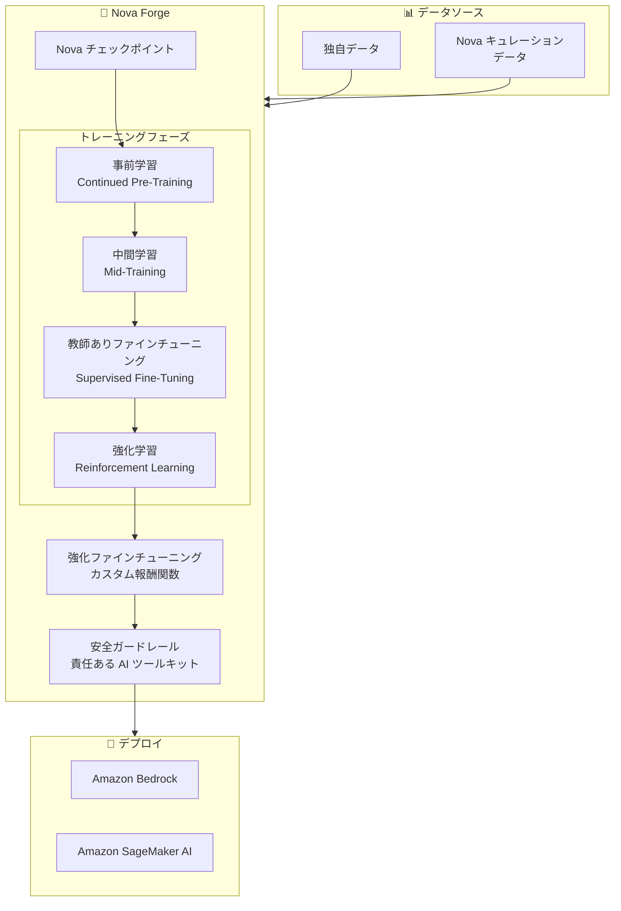

# Amazon Nova Forge - カスタムフロンティアモデルの構築

**リリース日**: 2025 年 12 月 2 日
**サービス**: Amazon Nova / Amazon SageMaker AI
**機能**: Nova Forge (一般提供)

## 概要

AWS は Nova Forge の一般提供を発表しました。Nova Forge は、Amazon Nova を使用して独自のフロンティアモデルを構築できる新しいサービスです。

Nova Forge では、SageMaker AI 上で事前学習、中間学習、事後学習の各フェーズにわたる早期の Nova チェックポイントからモデル開発を開始できます。独自のデータと Amazon Nova がキュレーションしたデータをブレンドしてモデルをトレーニングでき、組織固有の知識を深く理解しながら、推論などの一般的な能力を維持し、壊滅的忘却などのリスクを最小限に抑えたモデルを構築できます。

**アップデート前の課題**

- 既存のカスタマイズアプローチでは、壊滅的忘却により基礎的なスキルが失われることがあった
- 独自のドメイン知識を組み込みながら一般的な能力を維持することが困難だった
- 強化学習のためのカスタム報酬関数の実行が制限されていた
- 安全ガードレールのカスタマイズオプションが限られていた

**アップデート後の改善**

- 事前学習から事後学習まで、任意のフェーズからモデル開発を開始可能
- 独自データと Nova キュレーションデータのブレンドによる効果的なトレーニング
- カスタム報酬関数による強化ファインチューニング (RFT) の実行
- 責任ある AI ツールキットによるカスタム安全ガードレールの実装
- Nova 2 Pro、Nova 2 Omni への早期アクセス

## アーキテクチャ図



Nova Forge は、複数のトレーニングフェーズを通じて独自データと Nova データをブレンドし、カスタムフロンティアモデルを構築します。

## サービスアップデートの詳細

### 主要機能

1. **柔軟なチェックポイント選択**
   - 事前学習、中間学習、事後学習の各フェーズからモデル開発を開始
   - 早期チェックポイントからの開始により、新しいドメインの学習に最適なタイミングでデータを導入
   - Nova 2 Pro、Nova 2 Omni への早期アクセス

2. **データブレンディング**
   - 独自データと Amazon Nova キュレーションデータのブレンド
   - Continued Pre-Training (CPT) による大量の非構造化データの導入
   - 教師ありファインチューニング (SFT) でのラベル付きデータの活用

3. **強化ファインチューニング (RFT)**
   - カスタム環境での報酬関数の実行
   - 独自ツールと検証器からのフィードバックによるモデルの調整
   - 複雑なエージェントワークフローのためのマルチターンロールアウト管理

4. **責任ある AI ツールキット**
   - カスタム安全ガードレールの実装
   - 事実の正確性向上とハルシネーションの削減
   - 組織のポリシーに合わせたモデル動作の調整

## 技術仕様

### トレーニングフェーズ

| フェーズ | 説明 | ユースケース |
|---------|------|-------------|
| Continued Pre-Training (CPT) | 大量の非構造化データの導入 | 新しいドメイン知識の学習 |
| Mid-Training | 独自データと Nova データのブレンド | ドメイン固有知識の吸収 |
| Supervised Fine-Tuning (SFT) | ラベル付きデータによる応答パターンの学習 | 特定のクエリパターンへの対応 |
| Reinforcement Learning (RL) | 報酬シグナルとフィードバックによる調整 | モデル動作の最適化 |

### 利用可能なモデル

| モデル | 説明 |
|--------|------|
| Nova Micro | 軽量モデル |
| Nova Lite | コスト効率の高いモデル |
| Nova Pro | 高性能モデル |
| Nova 2 Pro (早期アクセス) | 次世代高性能モデル |
| Nova 2 Omni (早期アクセス) | マルチモーダル推論・画像生成モデル |

## 設定方法

### 前提条件

1. AWS アカウント
2. Amazon SageMaker AI へのアクセス
3. トレーニングデータ (独自データまたは既存データセット)

### 手順

#### ステップ 1: チェックポイントの選択

Nova Forge コンソールから使用するチェックポイントを選択します。

```bash
# SageMaker AI コンソールから Nova Forge にアクセス
# https://us-east-1.console.aws.amazon.com/sagemaker/home?region=us-east-1#/nova-forge
```

事前学習、中間学習、事後学習のいずれかのフェーズからモデル開発を開始するチェックポイントを選択します。

#### ステップ 2: データセットのアップロードとブレンド

独自データセットをアップロードし、Nova キュレーションデータとブレンドします。

```python
# データセット設定例
training_config = {
    "proprietary_data": "s3://my-bucket/proprietary-data/",
    "nova_curated_data": True,
    "blend_ratio": 0.7  # 独自データ 70%、Nova データ 30%
}
```

独自データと Nova キュレーションデータの比率を設定してトレーニングデータを準備します。

#### ステップ 3: 強化ファインチューニングの設定 (オプション)

カスタム報酬関数を使用して RFT を設定します。

```python
# RFT 設定例
rft_config = {
    "reward_function": "custom_reward_function",
    "environment": "my-custom-environment",
    "multi_turn_rollouts": True
}
```

特定のドメインでの事実の正確性向上とハルシネーション削減のために RFT を使用します。

#### ステップ 4: モデルのトレーニングとデプロイ

トレーニングが完了したら、Amazon Bedrock にモデルをインポートして使用を開始します。

```bash
# モデルのインポート (Bedrock)
aws bedrock import-model \
    --model-name "my-custom-nova-model" \
    --source-model-arn "arn:aws:sagemaker:us-east-1:123456789012:model/nova-forge-model"
```

## メリット

### ビジネス面

- **競争優位性**: 組織固有の知識を深く理解するカスタム AI モデルの構築
- **ドメイン特化**: 製造、研究開発、コンテンツ、専門産業向けの特化モデル
- **早期アクセス**: 最新の Nova モデル (Nova 2 Pro、Nova 2 Omni) への早期アクセス

### 技術面

- **壊滅的忘却の軽減**: 基礎的なスキルを維持しながら専門知識を組み込み
- **柔軟なカスタマイズ**: 任意のトレーニングフェーズからの開発開始
- **強化学習**: カスタム報酬関数による高度なモデル調整
- **安全性**: 責任ある AI ツールキットによるカスタムガードレール

## デメリット・制約事項

### 制限事項

- 現在は US East (N. Virginia) リージョンでのみ利用可能
- 年間サブスクリプション料金が必要
- 大量のトレーニングデータと計算リソースが必要

### 考慮すべき点

- トレーニングデータの品質と量がモデル性能に大きく影響
- 強化学習の報酬関数設計には専門知識が必要
- モデル開発には時間とリソースの投資が必要

## ユースケース

### ユースケース 1: 製造・自動化

**シナリオ**: 製造プロセスの最適化や品質管理のための専門 AI モデルを構築する必要がある。

**実装例**:
- 製造データと品質管理データを使用して CPT を実行
- 製造固有の用語と概念を学習
- カスタム報酬関数で品質予測の精度を最適化

**効果**: 製造プロセスに特化した高精度な AI モデルの実現

### ユースケース 2: 創薬・研究開発

**シナリオ**: 創薬プロセスを支援する統合 AI アシスタントを構築する必要がある。

**実装例**:
- 分子データ、臨床試験データ、文献データをブレンド
- 創薬固有のタスクに対する SFT を実行
- 安全ガードレールで医療規制への準拠を確保

**効果**: 創薬プロセスの効率化と精度向上

### ユースケース 3: コンテンツモデレーション

**シナリオ**: プラットフォーム固有のコンテンツポリシーに基づくモデレーション AI を構築する必要がある。

**実装例**:
- プラットフォームのコンテンツポリシーとモデレーション履歴データを使用
- カスタム安全ガードレールでポリシー準拠を確保
- RFT でモデレーション精度を最適化

**効果**: プラットフォーム固有のコンテンツモデレーションの自動化

## 料金

Nova Forge は年間サブスクリプションサービスです。詳細な料金については、[Nova Forge コンソール](https://us-east-1.console.aws.amazon.com/sagemaker/home?region=us-east-1#/nova-forge) を参照してください。

## 利用可能リージョン

現在は US East (N. Virginia) リージョンで利用可能です。今後数ヶ月で追加リージョンに拡大予定です。

## 関連サービス・機能

- **Amazon SageMaker AI**: ML モデルの構築、トレーニング、デプロイ
- **Amazon Bedrock**: フルマネージド生成 AI サービス
- **Amazon Nova**: フロンティアインテリジェンスモデルファミリー
- **SageMaker HyperPod**: 大規模 AI モデル開発

## 参考リンク

- [公式発表 (What's New)](https://aws.amazon.com/about-aws/whats-new/2025/12/amazon-nova-forge-frontier-models-nova/)
- [AWS Blog](https://aws.amazon.com/blogs/aws/introducing-amazon-nova-forge-build-your-own-frontier-models-using-nova/)
- [製品ページ](https://aws.amazon.com/nova/forge/)
- [ユーザーガイド](https://docs.aws.amazon.com/sagemaker/latest/dg/nova-forge.html)
- [Nova Forge コンソール](https://us-east-1.console.aws.amazon.com/sagemaker/home?region=us-east-1#/nova-forge)

## まとめ

Amazon Nova Forge は、組織固有のフロンティアモデルを構築するための強力なサービスです。独自のドメイン知識を深く理解しながら、一般的な能力を維持するカスタム AI モデルを必要とする組織は、Nova Forge を評価し、AI 戦略の一部として検討することを推奨します。
