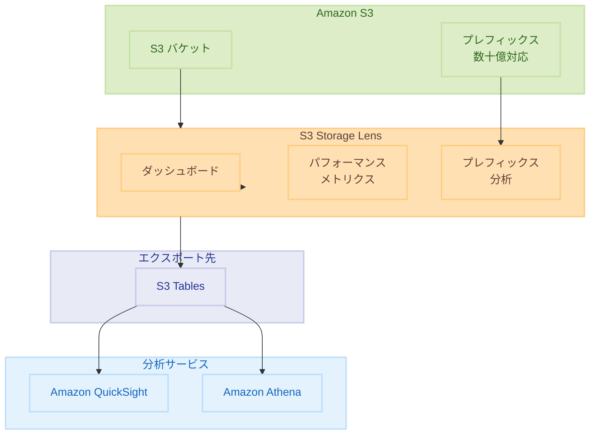

# Amazon S3 Storage Lens - パフォーマンスメトリクス、数十億プレフィックス対応、S3 Tables エクスポート

**リリース日**: 2025 年 12 月 2 日
**サービス**: Amazon S3 Storage Lens
**機能**: Performance Metrics, Expanded Prefix Analytics, Export to S3 Tables

## 概要

AWS は Amazon S3 Storage Lens に 3 つの新機能を追加しました。パフォーマンスメトリクス、数十億プレフィックスの分析サポート、S3 Tables への直接エクスポートです。これらの機能により、S3 ストレージの使用状況とアプリケーションパフォーマンスについてより深い洞察を得ることができます。

パフォーマンスメトリクスは、アクセスパターン、リクエスト元、オブジェクトアクセス数などの情報を提供し、コスト最適化とパフォーマンス改善に役立ちます。プレフィックス分析の拡張により、バケットあたり数十億のプレフィックスを分析できるようになりました。また、メトリクスを S3 Tables に直接エクスポートすることで、AWS 分析サービスでの即座のクエリが可能になります。

**アップデート前の課題**

- アプリケーションが S3 データとどのように相互作用しているかの詳細な洞察が限られていた
- プレフィックス分析は最大サイズと深さのしきい値を満たすプレフィックスに限定されていた
- メトリクスの分析には追加の ETL 処理やインフラストラクチャが必要だった

**アップデート後の改善**

- アクセスパターン、リクエスト元、オブジェクトアクセス数などの詳細なパフォーマンスメトリクスを取得可能
- バケットあたり数十億のプレフィックスを分析し、すべてのプレフィックスの使用状況を可視化
- S3 Tables への直接エクスポートにより、追加処理なしで即座にクエリ可能

## アーキテクチャ図



この図は、S3 Storage Lens がバケットとプレフィックスからメトリクスを収集し、S3 Tables にエクスポートして分析サービスで活用する流れを示しています。

## サービスアップデートの詳細

### 主要機能

1. **パフォーマンスメトリクス**
   - アクセスパターンメトリクス: 非効率なリクエスト（小さすぎるリクエストなど）を特定
   - リクエスト元メトリクス: クロスリージョンリクエスト数などを表示
   - オブジェクトアクセス数メトリクス: 頻繁にアクセスされるオブジェクトを特定

2. **拡張プレフィックス分析**
   - バケットあたり数十億のプレフィックスを分析
   - 以前の最小サイズ・深さ制限を撤廃
   - すべてのプレフィックスのストレージ使用量とアクティビティを可視化

3. **S3 Tables へのエクスポート**
   - マネージド S3 Tables への直接エクスポート
   - Apache Iceberg サポートによる即座のクエリ
   - 追加の処理インフラストラクチャが不要

## 技術仕様

### 新しいパフォーマンスメトリクス

| メトリクスカテゴリ | 説明 |
|------------------|------|
| 読み取りリクエストサイズ | リクエストサイズの分布を分析 |
| 書き込みリクエストサイズ | 書き込み操作のサイズパターン |
| ストレージサイズ | オブジェクトサイズの分布 |
| 同時 PUT 503 エラー | スロットリングの発生状況 |
| クロスリージョンデータ転送 | リージョン間転送量 |
| ユニークオブジェクトアクセス数 | アクセスされたユニークオブジェクト数 |
| FirstByteLatency | 最初のバイトまでのレイテンシ |
| TotalRequestLatency | リクエスト全体のレイテンシ |

### メトリクスレベル

| レベル | 説明 |
|--------|------|
| 組織 | AWS Organizations 全体 |
| アカウント | 個別の AWS アカウント |
| バケット | 個別の S3 バケット |
| プレフィックス | 個別のプレフィックス |

### S3 Tables エクスポート設定

| 項目 | 詳細 |
|------|------|
| エクスポート頻度 | 日次 |
| データ形式 | Apache Iceberg |
| 保持期間 | カスタマイズ可能 |
| 暗号化 | カスタマイズ可能 |

## 設定方法

### 前提条件

1. Amazon S3 バケット
2. S3 Storage Lens ダッシュボード
3. S3 Tables（エクスポート機能を使用する場合）

### 手順

#### ステップ 1: パフォーマンスメトリクスの有効化

S3 コンソールで Storage Lens ダッシュボードの設定を更新します。

```bash
aws s3control put-storage-lens-configuration \
    --account-id 123456789012 \
    --config-id my-dashboard \
    --storage-lens-configuration '{
        "Id": "my-dashboard",
        "AccountLevel": {
            "BucketLevel": {
                "PrefixLevel": {
                    "StorageMetrics": {
                        "IsEnabled": true
                    }
                }
            },
            "AdvancedCostOptimizationMetrics": {
                "IsEnabled": true
            },
            "AdvancedDataProtectionMetrics": {
                "IsEnabled": true
            },
            "DetailedStatusCodesMetrics": {
                "IsEnabled": true
            }
        },
        "IsEnabled": true
    }'
```

このコマンドは、Storage Lens ダッシュボードで詳細メトリクスを有効にします。

#### ステップ 2: 拡張プレフィックス分析の有効化

ダッシュボード設定で拡張プレフィックスメトリクスレポートを有効にします。

```bash
aws s3control put-storage-lens-configuration \
    --account-id 123456789012 \
    --config-id my-dashboard \
    --storage-lens-configuration '{
        "Id": "my-dashboard",
        "AccountLevel": {
            "BucketLevel": {
                "PrefixLevel": {
                    "StorageMetrics": {
                        "IsEnabled": true,
                        "SelectionCriteria": {
                            "MaxDepth": 10,
                            "MinStorageBytesPercentage": 0
                        }
                    }
                }
            }
        },
        "IsEnabled": true
    }'
```

MinStorageBytesPercentage を 0 に設定することで、すべてのプレフィックスを分析対象にします。

#### ステップ 3: S3 Tables へのエクスポート設定

メトリクスを S3 Tables にエクスポートするよう設定します。

```bash
aws s3control put-storage-lens-configuration \
    --account-id 123456789012 \
    --config-id my-dashboard \
    --storage-lens-configuration '{
        "Id": "my-dashboard",
        "DataExport": {
            "S3BucketDestination": {
                "Format": "Parquet",
                "OutputSchemaVersion": "V_1",
                "AccountId": "123456789012",
                "Arn": "arn:aws:s3:::my-metrics-bucket",
                "Prefix": "storage-lens-metrics"
            }
        },
        "IsEnabled": true
    }'
```

エクスポートされたメトリクスは S3 Tables で即座にクエリ可能になります。

## メリット

### ビジネス面

- **コスト最適化**: 非効率なアクセスパターンを特定してコストを削減
- **パフォーマンス改善**: ボトルネックを特定してアプリケーションパフォーマンスを向上
- **データドリブンな意思決定**: 詳細なメトリクスに基づいたストレージ戦略の策定

### 技術面

- **包括的な可視性**: すべてのプレフィックスのストレージ使用状況を把握
- **即座の分析**: S3 Tables への直接エクスポートで追加処理が不要
- **スケーラビリティ**: 数十億のプレフィックスに対応

## デメリット・制約事項

### 制限事項

- AWS China リージョンと AWS GovCloud (US) リージョンでは利用不可
- S3 Tables へのエクスポートは S3 Tables が利用可能なリージョンのみ
- 詳細メトリクスには追加コストが発生

### 考慮すべき点

- 大規模環境では詳細メトリクスのコストを事前に見積もる
- プレフィックス分析の深さと範囲を適切に設定
- エクスポートデータの保持期間とストレージコストを管理

## ユースケース

### ユースケース 1: アクセスパターンの最適化

**シナリオ**: アプリケーションが小さすぎるリクエストを大量に発行している

**実装例**:
```sql
-- S3 Tables でアクセスパターンを分析
SELECT 
    bucket_name,
    prefix,
    avg_request_size_bytes,
    request_count
FROM storage_lens_metrics
WHERE avg_request_size_bytes < 1024
ORDER BY request_count DESC
LIMIT 100;
```

**効果**: 非効率なリクエストパターンを特定し、バッチ処理やマルチパートアップロードに最適化

### ユースケース 2: クロスリージョンアクセスの削減

**シナリオ**: クロスリージョンリクエストによるレイテンシとコストの増加

**実装例**:
```sql
-- クロスリージョンリクエストを分析
SELECT 
    bucket_name,
    source_region,
    cross_region_request_count,
    cross_region_bytes_transferred
FROM storage_lens_metrics
WHERE cross_region_request_count > 0
ORDER BY cross_region_bytes_transferred DESC;
```

**効果**: クロスリージョンアクセスを特定し、データ配置やキャッシュ戦略を最適化

### ユースケース 3: ホットスポットの特定

**シナリオ**: 特定のオブジェクトへのアクセス集中によるパフォーマンス低下

**実装例**:
```sql
-- 頻繁にアクセスされるオブジェクトを特定
SELECT 
    bucket_name,
    prefix,
    unique_objects_accessed,
    total_request_count
FROM storage_lens_metrics
WHERE unique_objects_accessed < 100 
  AND total_request_count > 10000
ORDER BY total_request_count DESC;
```

**効果**: ホットスポットを特定し、キャッシュ層の追加や高パフォーマンスストレージへの移行を検討

## 料金

パフォーマンスメトリクスと拡張プレフィックス分析は、S3 Storage Lens の Advanced Metrics として課金されます。

| 機能 | 料金 |
|------|------|
| Free Metrics | 無料 |
| Advanced Metrics | オブジェクトあたり月額料金 |
| S3 Tables エクスポート | S3 Tables の標準料金 |

詳細は [Amazon S3 料金ページ](https://aws.amazon.com/s3/pricing/) を参照してください。

## 利用可能リージョン

パフォーマンスメトリクスと拡張プレフィックス分析は、AWS China リージョンと AWS GovCloud (US) リージョンを除くすべてのリージョンで利用可能です。S3 Tables へのエクスポートは、S3 Tables が利用可能なリージョンで利用できます。

## 関連サービス・機能

- **Amazon S3 Tables**: Apache Iceberg 形式のマネージドテーブル
- **Amazon QuickSight**: ビジネスインテリジェンスと可視化
- **Amazon Athena**: インタラクティブクエリサービス
- **S3 Intelligent-Tiering**: 自動ストレージクラス最適化

## 参考リンク

- [公式発表 (What's New)](https://aws.amazon.com/about-aws/whats-new/2025/12/amazon-s3-storage-lens-performance-metrics-prefixes-export-tables/)
- [AWS Blog](https://aws.amazon.com/blogs/aws/amazon-s3-storage-lens-adds-performance-metrics-support-for-billions-of-prefixes-and-export-to-s3-tables/)
- [S3 Storage Lens 概要](https://aws.amazon.com/s3/storage-lens/)
- [S3 Storage Lens ドキュメント](https://docs.aws.amazon.com/AmazonS3/latest/userguide/storage_lens.html)

## まとめ

Amazon S3 Storage Lens の新機能により、S3 ストレージの使用状況とアプリケーションパフォーマンスについてより深い洞察を得ることができます。パフォーマンスメトリクス、数十億プレフィックス対応、S3 Tables エクスポートを活用して、コスト最適化とパフォーマンス改善を実現できます。
