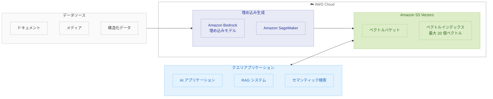

# Amazon S3 Vectors - ベクトルストレージの一般提供開始

**リリース日**: 2025 年 12 月 2 日  
**サービス**: Amazon S3  
**機能**: Amazon S3 Vectors (一般提供)


## 概要

AWS は Amazon S3 Vectors の一般提供を発表しました。これは、ベクトルデータの保存とクエリをネイティブにサポートする初のクラウドオブジェクトストレージサービスです。プレビュー以来、ユーザーは 25 万以上のベクトルインデックスを作成し、400 億以上のベクトルを取り込み、10 億以上のクエリを実行しています。

S3 Vectors は、AI アプリケーション、RAG (Retrieval Augmented Generation)、セマンティック検索、推論のためのコスト最適化されたベクトルストレージを提供します。専用のベクトルデータベースと比較して、ベクトルストレージコストを最大 90% 削減できます。

**アップデート前の課題**

- 専用ベクトルデータベースは、コンピュート、ストレージ、API 使用量に基づく予測不可能で上昇するコストが発生
- ベクトルデータベースインフラの管理に多くの時間を費やし、アプリケーション開発に集中できなかった
- ベクトルコレクションの成長と多様化に伴い、キャパシティプランニングが複雑化

**アップデート後の改善**

- 単一インデックスで最大 20 億ベクトルをサポート (プレビューから 40 倍増加)
- 頻繁なクエリで約 100ms、まれなクエリでも 1 秒未満のレイテンシー
- フルサーバーレスアーキテクチャでインフラ管理のオーバーヘッドを排除

## アーキテクチャ図



この図は、S3 Vectors を使用したベクトルストレージと検索のアーキテクチャを示しています。

## サービスアップデートの詳細

### 主要機能

1. **大規模ベクトルストレージ**
   - 単一インデックスで最大 20 億ベクトルをサポート
   - バケットあたり最大 10,000 インデックス
   - Amazon S3 と同等の弾力性、耐久性、可用性

2. **最適化されたクエリパフォーマンス**
   - 頻繁なクエリ: 約 100ms のレイテンシー
   - まれなクエリ: 1 秒未満のレイテンシー
   - 単一ベクトル更新のストリーミングで最大 1,000 PUT/秒

3. **サーバーレスアーキテクチャ**
   - インフラプロビジョニング不要
   - 自動スケーリング
   - 使用量に基づく課金

4. **AWS サービス統合**
   - Amazon Bedrock Knowledge Bases との統合
   - Amazon OpenSearch Service との統合
   - Amazon SageMaker Unified Studio との統合

5. **セキュリティ機能**
   - S3 マネージドキー (SSE-S3) によるサーバーサイド暗号化
   - AWS KMS (SSE-KMS) によるカスタマーマネージドキー
   - タグによるアクセス制御とコスト追跡


## 技術仕様

### スケールとパフォーマンス

| 項目 | 仕様 |
|------|------|
| 最大ベクトル数/インデックス | 20 億 |
| 最大インデックス数/バケット | 10,000 |
| 頻繁なクエリレイテンシー | 約 100ms |
| まれなクエリレイテンシー | 1 秒未満 |
| 書き込みスループット | 最大 1,000 PUT/秒 |
| メタデータサイズ | 最大 40KB/ベクトル |

### プレビューからの改善

| 項目 | プレビュー | 一般提供 |
|------|-----------|---------|
| 最大ベクトル数/インデックス | 5,000 万 | 20 億 (40 倍) |
| クエリパフォーマンス | - | 大幅に最適化 |
| 利用可能リージョン | 5 | 14 |


## 設定方法

### 前提条件

1. AWS アカウント
2. S3 Vectors が利用可能なリージョン

### 手順

#### ステップ 1: ベクトルバケットの作成

```python
import boto3

s3_vectors = boto3.client('s3vectors')

# ベクトルバケットの作成
response = s3_vectors.create_vector_bucket(
    BucketName='my-vector-bucket'
)
```

#### ステップ 2: ベクトルインデックスの作成

```python
# ベクトルインデックスの作成
response = s3_vectors.create_vector_index(
    BucketName='my-vector-bucket',
    IndexName='my-index',
    Dimensions=1536,  # 埋め込みモデルの次元数
    DistanceMetric='cosine'
)
```

#### ステップ 3: ベクトルの追加

```python
# ベクトルの追加
response = s3_vectors.put_vectors(
    BucketName='my-vector-bucket',
    IndexName='my-index',
    Vectors=[
        {
            'VectorId': 'doc-1',
            'Vector': [0.1, 0.2, ...],  # 1536 次元
            'Metadata': {'category': 'tech', 'date': '2025-12-02'}
        }
    ]
)
```

#### ステップ 4: 類似検索の実行

```python
# 類似検索
response = s3_vectors.query_vectors(
    BucketName='my-vector-bucket',
    IndexName='my-index',
    QueryVector=[0.1, 0.2, ...],
    TopK=10,
    Filter={'category': 'tech'}
)
```


## メリット

### ビジネス面

- **コスト削減**: 専用ベクトルデータベースと比較して最大 90% のコスト削減
- **予測可能なコスト**: PUT、ストレージ、クエリに基づくシンプルな料金体系
- **迅速な開発**: インフラ管理なしで AI アプリケーション開発に集中

### 技術面

- **大規模スケール**: 20 億ベクトルまでシームレスにスケール
- **低レイテンシー**: 頻繁なクエリで 100ms のパフォーマンス
- **統合の容易さ**: Bedrock、OpenSearch、SageMaker とネイティブ統合


## デメリット・制約事項

### 制限事項

- 超低レイテンシー (10ms 未満) が必要なユースケースには OpenSearch の方が適切
- リアルタイムクエリが頻繁なワークロードでは追加のコスト検討が必要

### 考慮すべき点

- まれなクエリワークロードに最適化されている
- 高頻度クエリには OpenSearch との階層化戦略を検討


## ユースケース

### ユースケース 1: RAG アプリケーション

**シナリオ**: 企業ナレッジベースを使用した生成 AI アプリケーション

**実装例**:
```
1. ドキュメントを埋め込みベクトルに変換
2. S3 Vectors に保存
3. Amazon Bedrock Knowledge Bases と統合
4. ユーザークエリに対して関連ドキュメントを検索
```

**効果**: RAG アプリケーションのベクトルストレージコストを最大 90% 削減

### ユースケース 2: セマンティック検索

**シナリオ**: メディア企業の大規模ビデオライブラリ検索

**実装例**:
```
1. ビデオコンテンツを埋め込みベクトルに変換
2. S3 Vectors に数百万のベクトルを保存
3. 自然言語クエリで類似コンテンツを検索
```

**効果**: 長期的なベクトルストレージコストを気にせず、あらゆるビデオデータを検索可能に

### ユースケース 3: 階層化検索戦略

**シナリオ**: コストとパフォーマンスのバランスが必要な検索システム

**実装例**:
```
1. 長期保存ベクトル: S3 Vectors (低コスト)
2. 高頻度クエリベクトル: OpenSearch (低レイテンシー)
3. S3 Vectors から OpenSearch へのワンクリックエクスポート
```

**効果**: コストとパフォーマンスの最適なバランスを実現


## 料金

| 項目 | 説明 |
|------|------|
| PUT 料金 | ベクトルの追加・更新 |
| ストレージ料金 | 保存されたベクトルデータ |
| クエリ料金 | 類似検索の実行 |

詳細は [Amazon S3 料金ページ](https://aws.amazon.com/s3/pricing/) を参照してください。


## 利用可能リージョン

14 の AWS リージョンで利用可能:
- US East (N. Virginia)
- US East (Ohio)
- US West (Oregon)
- Europe (Frankfurt)
- Europe (Ireland)
- Europe (London)
- Asia Pacific (Tokyo)
- Asia Pacific (Sydney)
- Asia Pacific (Singapore)
- その他 5 リージョン


## 関連サービス・機能

- **Amazon Bedrock Knowledge Bases**: RAG アプリケーション構築
- **Amazon OpenSearch Service**: 高頻度クエリワークロード
- **Amazon SageMaker**: ML モデル開発とデプロイ
- **Amazon S3**: オブジェクトストレージ


## 参考リンク

- [公式発表](https://aws.amazon.com/blogs/aws/amazon-s3-vectors-now-generally-available-with-increased-scale-and-performance/)
- [What's New](https://aws.amazon.com/about-aws/whats-new/2025/12/amazon-s3-vectors-generally-available/)
- [Amazon S3 Vectors 製品ページ](https://aws.amazon.com/s3/features/vectors/)
- [Amazon S3 料金ページ](https://aws.amazon.com/s3/pricing/)


## まとめ

Amazon S3 Vectors は、AI アプリケーションのためのコスト最適化されたベクトルストレージを提供する革新的なサービスです。20 億ベクトルまでのスケール、100ms のクエリレイテンシー、最大 90% のコスト削減により、RAG、セマンティック検索、AI エージェントなどのユースケースに最適です。re:Invent 2025 で一般提供が発表されたこのサービスは、AI 開発の民主化を加速します。
