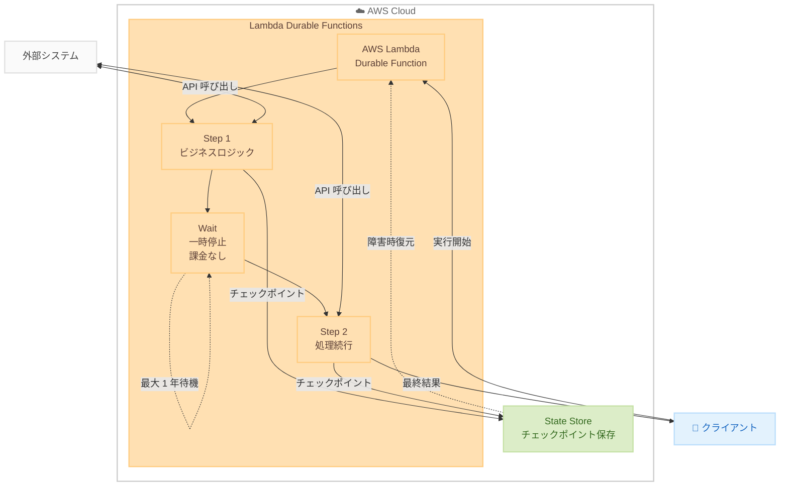

# AWS Lambda - Durable Functions（耐久性関数）

**リリース日**: 2025 年 12 月 2 日  
**サービス**: AWS Lambda  
**機能**: Durable Functions（マルチステップアプリケーションと AI ワークフロー向け耐久性関数）


## 概要

AWS Lambda が Durable Functions（耐久性関数）を発表しました。この新機能により、開発者は Lambda の開発体験の中で、信頼性の高いマルチステップアプリケーションや AI ワークフローを構築できるようになります。

Durable Functions は、進行状況を自動的にチェックポイントし、長時間実行タスク中に最大 1 年間実行を一時停止し、障害から自動的に回復します。追加のインフラストラクチャを管理したり、カスタムの状態管理やエラーハンドリングコードを記述する必要はありません。

Lambda のプログラミングモデルを「steps」や「waits」といった新しい操作で拡張し、コンピューティング料金を発生させずに進行状況をチェックポイントして実行を一時停止できます。サービスが状態管理、エラー回復、長時間実行タスクの効率的な一時停止と再開を処理するため、開発者はコアビジネスロジックに集中できます。

**アップデート前の課題**

- 複雑なマルチステップアプリケーション（注文処理、ユーザーオンボーディング、AI 支援ワークフローなど）を構築するには、カスタムの状態管理ロジックを実装する必要があった
- 外部のオーケストレーションサービス（AWS Step Functions など）との統合が必要だった
- 長時間実行タスクの待機中もコンピューティング料金が発生していた
- 障害からの回復には独自のエラーハンドリングコードが必要だった

**アップデート後の改善**

- Lambda 内で直接、マルチステップアプリケーションと AI ワークフローを構築可能に
- 「steps」と「waits」プリミティブにより、チェックポイントと一時停止が簡単に実装可能
- 待機中はコンピューティング料金が発生せず、実際の処理時間のみ課金
- 自動的な状態管理、リトライ、障害回復により、カスタムコードが不要に

## アーキテクチャ図



この図は、Durable Functions のチェックポイントとリプレイメカニズムを示しています。各ステップで状態が保存され、障害発生時や待機後に自動的に再開されます。

## サービスアップデートの詳細

### 主要機能

1. **チェックポイントとリプレイメカニズム**
   - 進行状況を自動的にチェックポイント
   - 中断やリトライ後、コードは最初から実行されるが、完了したチェックポイントはスキップ
   - 保存された結果を使用して一貫性を確保

2. **Durable Operations（耐久性操作）**
   - **Steps**: ビジネスロジックを実行し、組み込みのリトライと進行状況追跡を提供
   - **Waits**: コンピューティング料金なしで実行を一時停止、最大 1 年間の待機が可能
   - 人間参加型ワークフローや外部依存関係のポーリングに最適

3. **Durable Execution SDK**
   - JavaScript、TypeScript、Python で利用可能
   - チェックポイントとリプレイの複雑さを抽象化
   - 既存の Lambda 開発ワークフローとシームレスに統合


## 技術仕様

### サポートされるランタイム

| ランタイム | バージョン |
|-----------|-----------|
| Python | 3.13、3.14 |
| Node.js | 22、24 |

### 主要な制限

| 項目 | 詳細 |
|------|------|
| 最大実行期間 | 1 年間 |
| 待機中の課金 | なし（コンピューティング料金は発生しない） |
| SDK | オープンソース（JavaScript/TypeScript、Python） |

### コード例（Python）

```python
from aws_lambda_durable import durable_handler, DurableContext

@durable_handler
def handler(event, context, durable: DurableContext):
    # Step 1: 注文の検証
    order = durable.step("validate_order", lambda: validate_order(event))
    
    # Step 2: 支払い処理
    payment = durable.step("process_payment", lambda: process_payment(order))
    
    # Step 3: 承認待ち（最大 7 日間）
    approval = durable.wait("wait_for_approval", timeout_seconds=604800)
    
    # Step 4: 注文の完了
    result = durable.step("complete_order", lambda: complete_order(order, approval))
    
    return result
```

このコードは、Durable Functions を使用した注文処理ワークフローの例です。各 `step` でチェックポイントが作成され、`wait` で承認を待機します。障害が発生しても、完了したステップは再実行されません。


## 設定方法

### 前提条件

1. AWS アカウント
2. Python 3.13/3.14 または Node.js 22/24 ランタイム
3. Lambda 関数の作成権限

### 手順

#### ステップ 1: Durable Functions を有効化した Lambda 関数の作成

```bash
aws lambda create-function \
    --function-name my-durable-function \
    --runtime python3.14 \
    --handler app.handler \
    --role arn:aws:iam::123456789012:role/lambda-role \
    --durable-execution-config '{"enabled": true}'
```

このコマンドは、Durable Functions を有効化した新しい Lambda 関数を作成します。`--durable-execution-config` パラメータで耐久性実行を有効にします。

#### ステップ 2: Durable Execution SDK のインストール

```bash
# Python の場合
pip install aws-lambda-durable

# Node.js の場合
npm install @aws-lambda/durable
```

#### ステップ 3: 関数コードの実装

Durable Execution SDK を使用して、steps と waits を含む関数コードを実装します。


## メリット

### ビジネス面

- **開発効率の向上**: 状態管理やエラーハンドリングのカスタムコードが不要
- **コスト最適化**: 待機中はコンピューティング料金が発生しない
- **信頼性の向上**: 自動的な障害回復により、ビジネスプロセスの中断を最小化

### 技術面

- **シンプルなプログラミングモデル**: 馴染みのある言語で順次コードを記述
- **自動チェックポイント**: 進行状況が自動的に保存され、障害時に復元
- **スケーラビリティ**: Lambda のサーバーレスモデルにより、自動スケーリングとゼロへのスケールダウンが可能


## デメリット・制約事項

### 制限事項

- 初期リリース時は US East (Ohio) リージョンのみで利用可能（その後 14 リージョンに拡大）
- Python 3.13/3.14 および Node.js 22/24 のみサポート
- 決定論的なコードを記述する必要がある（リプレイ時に同じ結果を返す必要がある）

### 考慮すべき点

- 既存の Step Functions ワークフローとの使い分けを検討
- リプレイメカニズムを理解した上でコードを設計
- 本番環境では Lambda バージョンの使用を推奨


## ユースケース

### ユースケース 1: 注文処理ワークフロー

**シナリオ**: EC サイトで注文の検証、支払い処理、在庫確保、配送手配を順次実行

**実装例**:
```python
@durable_handler
def order_workflow(event, context, durable):
    order = durable.step("validate", lambda: validate_order(event))
    payment = durable.step("payment", lambda: process_payment(order))
    inventory = durable.step("inventory", lambda: allocate_inventory(order))
    shipping = durable.step("shipping", lambda: arrange_shipping(order))
    return {"status": "completed", "order_id": order["id"]}
```

**効果**: 各ステップでチェックポイントが作成され、障害発生時も完了したステップから再開可能

### ユースケース 2: 人間参加型承認ワークフロー

**シナリオ**: ローン申請の自動審査後、人間による最終承認を待機

**実装例**:
```python
@durable_handler
def loan_approval(event, context, durable):
    application = durable.step("review", lambda: auto_review(event))
    
    # 最大 7 日間、人間の承認を待機
    approval = durable.wait("human_approval", timeout_seconds=604800)
    
    if approval["approved"]:
        return durable.step("disburse", lambda: disburse_loan(application))
    else:
        return {"status": "rejected"}
```

**効果**: 待機中はコンピューティング料金が発生せず、承認後に自動的に再開

### ユースケース 3: AI エージェントワークフロー

**シナリオ**: 複数の AI モデル呼び出しを連鎖させ、人間のフィードバックを組み込む

**実装例**:
```python
@durable_handler
def ai_workflow(event, context, durable):
    analysis = durable.step("analyze", lambda: call_llm_analysis(event))
    summary = durable.step("summarize", lambda: call_llm_summary(analysis))
    
    # 人間のレビューを待機
    feedback = durable.wait("human_review", timeout_seconds=86400)
    
    final = durable.step("finalize", lambda: generate_final_output(summary, feedback))
    return final
```

**効果**: AI モデル呼び出しの障害時も自動リトライ、人間のフィードバック待機中は課金なし


## 料金

Durable Functions の料金は、標準の Lambda 料金に加えて、耐久性実行に関連する追加料金が発生します。

### 料金体系

| 項目 | 料金 |
|------|------|
| リクエスト | 標準 Lambda 料金 |
| コンピューティング時間 | 標準 Lambda 料金（待機中は課金なし） |
| 状態ストレージ | 追加料金（詳細は料金ページ参照） |

詳細は [AWS Lambda 料金ページ](https://aws.amazon.com/lambda/pricing/) を参照してください。


## 利用可能リージョン

初期リリース時は US East (Ohio) で利用可能。その後、以下の 14 リージョンに拡大。

- US East (N. Virginia)
- US West (Oregon)
- Europe (Ireland)
- Europe (Frankfurt)
- Europe (Milan)
- Europe (Stockholm)
- Europe (Spain)
- Asia Pacific (Sydney)
- Asia Pacific (Hong Kong)
- Asia Pacific (Tokyo)
- Asia Pacific (Singapore)
- Asia Pacific (Mumbai)
- Asia Pacific (Malaysia)
- Asia Pacific (Thailand)

最新のリージョン情報は [AWS Capabilities by Region](https://builder.aws.com/build/capabilities) を参照してください。


## 関連サービス・機能

- **AWS Step Functions**: より複雑なワークフローオーケストレーション向け
- **Amazon EventBridge**: Durable Functions の実行監視に使用可能
- **Amazon Bedrock**: AI ワークフローでの LLM 呼び出しに活用


## 参考リンク

- [公式発表](https://aws.amazon.com/about-aws/whats-new/2025/12/lambda-durable-multi-step-applications-ai-workflows/)
- [AWS Lambda Developer Guide - Durable Functions](https://docs.aws.amazon.com/lambda/latest/dg/durable-functions.html)
- [ブログ記事](https://aws.amazon.com/blogs/aws/build-multi-step-applications-and-ai-workflows-with-aws-lambda-durable-functions/)
- [料金ページ](https://aws.amazon.com/lambda/pricing/)


## まとめ

AWS Lambda Durable Functions は、マルチステップアプリケーションと AI ワークフローの構築を大幅に簡素化する画期的な機能です。自動チェックポイント、障害回復、待機中の課金なしという特徴により、開発者はインフラストラクチャや状態管理を気にせずビジネスロジックに集中できます。東京リージョンでも利用可能なため、日本のお客様も早期に活用を検討することをお勧めします。
