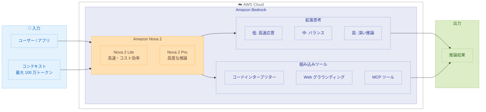

# Amazon Bedrock - Amazon Nova 2 基盤モデルの提供開始

**リリース日**: 2025 年 12 月 2 日  
**サービス**: Amazon Bedrock  
**機能**: Amazon Nova 2 Lite、Amazon Nova 2 Pro (プレビュー)


## 概要

AWS は Amazon Nova 2 を発表しました。これは、業界をリードする価格性能比で推論機能を提供する次世代の汎用モデルです。Amazon Bedrock で利用可能な新しいモデルは、Amazon Nova 2 Lite（高速でコスト効率の良い推論モデル）と Amazon Nova 2 Pro (プレビュー)（高度に複雑なマルチステップタスク向けの最もインテリジェントなモデル）です。

これらのモデルは、ステップバイステップの推論とタスク分解による拡張思考をサポートし、3 つの思考強度レベル（低、中、高）を提供します。また、コードインタープリターや Web グラウンディングなどの組み込みツール、リモート MCP ツールのサポート、100 万トークンのコンテキストウィンドウを備えています。

**アップデート前の課題**

- 複雑な推論タスクには高コストなモデルが必要で、日常的なワークロードには過剰だった
- 思考プロセスの制御が限られており、速度・知性・コストのバランス調整が困難だった
- コンテキストウィンドウの制限により、長いドキュメントや複雑な会話の処理に制約があった

**アップデート後の改善**

- Nova 2 Lite により、日常的なワークロードに最適な価格・性能・速度のバランスを実現
- 3 つの思考強度レベルで、ユースケースに応じた速度・知性・コストの調整が可能に
- 100 万トークンのコンテキストウィンドウで、より豊かなインタラクションを実現

## アーキテクチャ図



この図は、Amazon Nova 2 の拡張思考機能と組み込みツールを活用した推論フローを示しています。

## サービスアップデートの詳細

### 主要機能

1. **Amazon Nova 2 Lite**
   - 高速でコスト効率の良い推論モデル
   - 日常的なワークロードに最適
   - カスタマーサービスチャットボット、ドキュメント処理、ビジネスプロセス自動化に活用
   - Amazon Bedrock と Amazon SageMaker での教師ありファインチューニング (SFT) をサポート
   - Amazon SageMaker でのフルファインチューニングも利用可能

2. **Amazon Nova 2 Pro (プレビュー)**
   - 高度に複雑なエージェントタスク向けの最もインテリジェントなモデル
   - マルチドキュメント分析、ビデオ推論、ソフトウェア移行に最適
   - Amazon Nova Forge 顧客向けに早期アクセス提供

3. **共通機能**
   - 拡張思考: ステップバイステップの推論とタスク分解
   - 3 つの思考強度レベル（低、中、高）
   - 組み込みツール: コードインタープリター、Web グラウンディング
   - リモート MCP ツールのサポート
   - 100 万トークンのコンテキストウィンドウ


## 技術仕様

### モデル比較

| 項目 | Nova 2 Lite | Nova 2 Pro (プレビュー) |
|------|-------------|------------------------|
| 用途 | 日常的なワークロード | 高度に複雑なタスク |
| 特徴 | 価格・性能・速度のバランス | 最高の知性 |
| ユースケース | チャットボット、ドキュメント処理 | マルチドキュメント分析、ビデオ推論 |
| カスタマイズ | SFT、フルファインチューニング | プレビュー段階 |

### 思考強度レベル

| レベル | 説明 |
|--------|------|
| 低 (Low) | 高速応答、シンプルなタスク向け |
| 中 (Medium) | バランスの取れた推論 |
| 高 (High) | 深い推論、複雑なタスク向け |


## 設定方法

### 前提条件

1. AWS アカウント
2. Amazon Bedrock へのアクセス権限
3. Nova 2 Pro の場合は Nova Forge 顧客であること

### 手順

#### ステップ 1: Amazon Bedrock コンソールでモデルを有効化

Amazon Bedrock コンソールにアクセスし、Nova 2 Lite または Nova 2 Pro を有効化します。

#### ステップ 2: API 呼び出し

```python
import boto3

bedrock_runtime = boto3.client('bedrock-runtime')

response = bedrock_runtime.invoke_model(
    modelId='amazon.nova-2-lite-v1:0',
    body={
        "messages": [
            {"role": "user", "content": "複雑な問題を分析してください"}
        ],
        "inferenceConfig": {
            "thinkingIntensity": "medium"  # low, medium, high
        }
    }
)
```

このコードは、Nova 2 Lite モデルを呼び出し、思考強度を「中」に設定して推論を実行します。


## メリット

### ビジネス面

- **コスト最適化**: 日常的なワークロードに Nova 2 Lite を使用してコストを削減
- **柔軟性**: 思考強度レベルでコストと品質のトレードオフを制御
- **スケーラビリティ**: グローバルクロスリージョン推論で世界中から利用可能

### 技術面

- **拡張思考**: ステップバイステップの推論で複雑な問題を解決
- **大規模コンテキスト**: 100 万トークンで長いドキュメントや会話を処理
- **ツール統合**: コードインタープリター、Web グラウンディング、MCP ツールをネイティブサポート


## デメリット・制約事項

### 制限事項

- Nova 2 Pro はプレビュー段階で、Nova Forge 顧客のみ早期アクセス可能
- 一部の高度な機能は特定のリージョンでのみ利用可能

### 考慮すべき点

- 思考強度レベルの選択がコストと応答時間に影響
- 大規模コンテキストの使用はコストに影響する可能性


## ユースケース

### ユースケース 1: カスタマーサービスチャットボット

**シナリオ**: 顧客からの問い合わせに自動応答するチャットボット

**実装例**:
```python
response = bedrock_runtime.invoke_model(
    modelId='amazon.nova-2-lite-v1:0',
    body={
        "messages": [{"role": "user", "content": "注文状況を確認したい"}],
        "inferenceConfig": {"thinkingIntensity": "low"}
    }
)
```

**効果**: 低い思考強度で高速応答、コスト効率の良いカスタマーサポート

### ユースケース 2: 複雑なドキュメント分析

**シナリオ**: 複数の法的文書を分析し、リスクを特定

**実装例**:
```python
response = bedrock_runtime.invoke_model(
    modelId='amazon.nova-2-pro-v1:0',
    body={
        "messages": [{"role": "user", "content": "これらの契約書のリスクを分析してください"}],
        "inferenceConfig": {"thinkingIntensity": "high"}
    }
)
```

**効果**: 高い思考強度で深い分析、複雑な法的リスクを特定

### ユースケース 3: ビジネスプロセス自動化

**シナリオ**: 請求書処理の自動化

**実装例**:
```python
# コードインタープリターを活用
response = bedrock_runtime.invoke_model(
    modelId='amazon.nova-2-lite-v1:0',
    body={
        "messages": [{"role": "user", "content": "この請求書データを処理してください"}],
        "tools": ["code_interpreter"]
    }
)
```

**効果**: 組み込みツールで請求書データを自動処理


## 料金

Amazon Nova 2 は従量課金制で、入力トークンと出力トークンに基づいて課金されます。

詳細は [Amazon Bedrock 料金ページ](https://aws.amazon.com/bedrock/pricing/) を参照してください。


## 利用可能リージョン

Amazon Nova 2 Lite と Nova 2 Pro (プレビュー) は、グローバルクロスリージョン推論を通じて複数のロケーションで利用可能です。

詳細は [Amazon Nova モデル製品ページ](https://aws.amazon.com/nova/models) を参照してください。


## 関連サービス・機能

- **Amazon Bedrock**: 基盤モデルのホスティングプラットフォーム
- **Amazon SageMaker**: モデルのファインチューニング
- **Amazon Nova Forge**: カスタムモデルの構築


## 参考リンク

- [公式発表](https://aws.amazon.com/about-aws/whats-new/2025/12/nova-2-foundation-models-amazon-bedrock/)
- [AWS News Blog](https://aws.amazon.com/blogs/aws/introducing-amazon-nova-2-lite-a-fast-cost-effective-reasoning-model/)
- [Amazon Nova モデル製品ページ](https://aws.amazon.com/nova/models)
- [Amazon Nova ユーザーガイド](https://docs.aws.amazon.com/nova/latest/userguide/what-is-nova.html)


## まとめ

Amazon Nova 2 は、拡張思考機能と 100 万トークンのコンテキストウィンドウを備えた次世代の基盤モデルです。Nova 2 Lite は日常的なワークロードに最適なコスト効率を提供し、Nova 2 Pro は複雑なエージェントタスクに対応します。re:Invent 2025 で発表されたこのモデルは、AI アプリケーション開発の新たな可能性を開きます。
