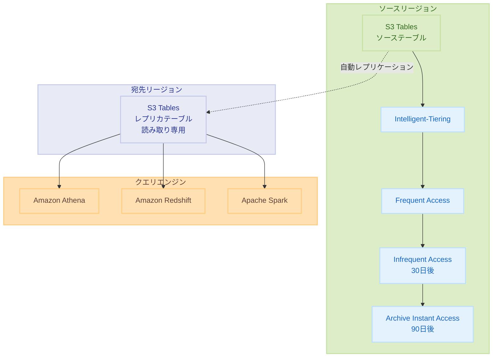

# Amazon S3 Tables - Intelligent-Tiering ストレージクラスとレプリケーションサポート

**リリース日**: 2025 年 12 月 2 日
**サービス**: Amazon S3 Tables
**機能**: Intelligent-Tiering Storage Class, Automatic Replication

## 概要

AWS は Amazon S3 Tables に 2 つの重要な新機能を追加しました。Intelligent-Tiering ストレージクラスと Apache Iceberg テーブルの自動レプリケーションです。これらの機能により、分析ワークロードのコスト最適化とグローバルなデータアクセシビリティが向上します。

Intelligent-Tiering は、アクセスパターンに基づいてデータを自動的に最適なストレージ層に移動し、最大 80% のストレージコスト削減を実現します。レプリケーション機能は、AWS リージョンやアカウント間で Apache Iceberg テーブルを自動的に複製し、グローバル分析ワークロードのクエリレイテンシを削減します。

**アップデート前の課題**

- S3 Tables のストレージコストを手動で最適化する必要があった
- グローバル分析ワークロードでは、リージョン間のデータアクセスにレイテンシが発生していた
- 複数リージョンでのテーブル同期には手動での設定と管理が必要だった

**アップデート後の改善**

- Intelligent-Tiering により、アクセスパターンに基づいた自動コスト最適化が可能
- 自動レプリケーションにより、リージョン間でテーブルを自動同期
- メンテナンス操作（コンパクション、スナップショット期限切れなど）がストレージ層に影響しない

## アーキテクチャ図



この図は、S3 Tables の Intelligent-Tiering によるストレージ層の自動移行と、リージョン間の自動レプリケーションを示しています。

## サービスアップデートの詳細

### 主要機能

1. **Intelligent-Tiering ストレージクラス**
   - アクセスパターンに基づく自動ストレージ層移行
   - 3 つの低レイテンシアクセス層（Frequent、Infrequent、Archive Instant）
   - メンテナンス操作がストレージ層に影響しない

2. **自動レプリケーション**
   - AWS リージョンおよびアカウント間でのテーブル複製
   - 完全なテーブル構造（スナップショット、メタデータ含む）を複製
   - 読み取り専用レプリカテーブルの自動作成と同期

3. **柔軟な設定**
   - レプリカテーブルに独立したスナップショット保持ポリシーを設定可能
   - レプリカテーブルに独立した暗号化キーを設定可能
   - テーブル作成時またはバケットレベルでストレージクラスを指定

## 技術仕様

### Intelligent-Tiering ストレージ層

| ストレージ層 | 移行条件 | コスト削減 |
|-------------|---------|-----------|
| Frequent Access | デフォルト | 基準 |
| Infrequent Access | 30 日間アクセスなし | 40% 削減 |
| Archive Instant Access | 90 日間アクセスなし | 68% 削減 |

### レプリケーション仕様

| 項目 | 詳細 |
|------|------|
| レプリケーション範囲 | クロスリージョン、クロスアカウント |
| テーブル形式 | Apache Iceberg V2、V3 |
| レプリカタイプ | 読み取り専用 |
| 同期頻度 | 継続的（通常数分以内） |

### 対応クエリエンジン

| エンジン | サポート |
|---------|---------|
| Amazon Athena | ✅ |
| Amazon Redshift | ✅ |
| Amazon SageMaker Unified Studio | ✅ |
| Apache Spark | ✅ |
| DuckDB | ✅ |

## 設定方法

### 前提条件

1. Amazon S3 Tables が有効なテーブルバケット
2. 適切な IAM 権限
3. レプリケーション用の宛先テーブルバケット（レプリケーション使用時）

### 手順

#### ステップ 1: Intelligent-Tiering の有効化

テーブルバケットのデフォルトストレージクラスを Intelligent-Tiering に設定します。

```bash
aws s3tables put-table-bucket-storage-class \
    --table-bucket-arn arn:aws:s3tables:us-east-1:123456789012:bucket/my-table-bucket \
    --storage-class INTELLIGENT_TIERING
```

このコマンドは、テーブルバケット内の新しいテーブルのデフォルトストレージクラスを Intelligent-Tiering に設定します。

#### ステップ 2: 個別テーブルでの Intelligent-Tiering 設定

特定のテーブルに Intelligent-Tiering を設定することもできます。

```bash
aws s3tables create-table \
    --table-bucket-arn arn:aws:s3tables:us-east-1:123456789012:bucket/my-table-bucket \
    --namespace my-namespace \
    --name my-table \
    --format ICEBERG \
    --storage-class INTELLIGENT_TIERING
```

テーブル作成時にストレージクラスを指定します。

#### ステップ 3: レプリケーションの設定

テーブルのレプリケーションを設定します。

```bash
aws s3tables put-table-replication \
    --table-bucket-arn arn:aws:s3tables:us-east-1:123456789012:bucket/my-table-bucket \
    --namespace my-namespace \
    --name my-table \
    --replication-configuration '{
        "destinationTableBucketArn": "arn:aws:s3tables:eu-west-1:123456789012:bucket/my-replica-bucket"
    }'
```

このコマンドは、ソーステーブルから宛先テーブルバケットへのレプリケーションを設定します。

#### ステップ 4: レプリカテーブルのクエリ

レプリカテーブルは任意の Iceberg 互換エンジンでクエリできます。

```sql
-- Amazon Athena でレプリカテーブルをクエリ
SELECT * FROM "my-replica-bucket"."my-namespace"."my-table"
WHERE date_column >= '2025-01-01'
LIMIT 100;
```

レプリカテーブルは読み取り専用ですが、通常のテーブルと同様にクエリできます。

## メリット

### ビジネス面

- **コスト削減**: Intelligent-Tiering により最大 80% のストレージコスト削減
- **グローバル展開**: レプリケーションによりグローバル分析ワークロードをサポート
- **運用効率**: 自動化されたストレージ最適化とレプリケーション

### 技術面

- **パフォーマンス維持**: Intelligent-Tiering でもクエリパフォーマンスに影響なし
- **低レイテンシ**: レプリカテーブルによりリージョン間クエリレイテンシを削減
- **柔軟性**: 独立したスナップショット保持ポリシーと暗号化設定

## デメリット・制約事項

### 制限事項

- レプリカテーブルは読み取り専用
- Intelligent-Tiering には小額の月額モニタリング料金が発生
- S3 Tables が利用可能なリージョンのみで使用可能

### 考慮すべき点

- クロスリージョンレプリケーションにはデータ転送料金が発生
- レプリケーションの同期には通常数分かかる
- アクセスパターンによっては Intelligent-Tiering が最適でない場合がある

## ユースケース

### ユースケース 1: グローバル分析プラットフォーム

**シナリオ**: 複数リージョンのチームが同じデータセットを分析する必要がある

**実装例**:
```
1. 米国東部リージョンにソーステーブルを作成
2. 欧州、アジアリージョンにレプリケーションを設定
3. 各リージョンのチームがローカルレプリカをクエリ
4. クエリレイテンシを大幅に削減
```

**効果**: グローバルチームが低レイテンシでデータにアクセス可能

### ユースケース 2: コスト最適化されたデータレイク

**シナリオ**: 大量の履歴データを保持しながらコストを最適化したい

**実装例**:
```
1. テーブルバケットで Intelligent-Tiering を有効化
2. 新しいテーブルは自動的に Intelligent-Tiering を使用
3. アクセス頻度の低いデータは自動的に低コスト層に移行
4. 必要時にはミリ秒単位でアクセス可能
```

**効果**: 履歴データのストレージコストを最大 80% 削減

### ユースケース 3: ディザスタリカバリ

**シナリオ**: 分析データのリージョン間バックアップが必要

**実装例**:
```
1. プライマリリージョンにソーステーブルを作成
2. セカンダリリージョンにレプリケーションを設定
3. 独立したスナップショット保持ポリシーを設定
4. 障害時にはセカンダリリージョンのレプリカを使用
```

**効果**: リージョン障害時のデータ可用性を確保

## 料金

### Intelligent-Tiering

| 項目 | 料金 |
|------|------|
| Frequent Access | S3 標準料金 |
| Infrequent Access | 40% 削減 |
| Archive Instant Access | 68% 削減 |
| モニタリング料金 | オブジェクトあたり小額 |

### レプリケーション

| 項目 | 料金 |
|------|------|
| 宛先ストレージ | S3 Tables 標準料金 |
| レプリケーション PUT リクエスト | S3 リクエスト料金 |
| テーブル更新（コミット） | S3 Tables 料金 |
| クロスリージョンデータ転送 | データ転送料金 |

詳細は [Amazon S3 料金ページ](https://aws.amazon.com/s3/pricing/) を参照してください。

## 利用可能リージョン

Intelligent-Tiering とレプリケーションは、S3 Tables が利用可能なすべての AWS リージョンで利用できます。詳細は [S3 Tables リージョンとクォータ](https://docs.aws.amazon.com/AmazonS3/latest/userguide/s3-tables-regions-quotas.html) を参照してください。

## 関連サービス・機能

- **Amazon S3 Intelligent-Tiering**: 汎用バケット向けの自動ストレージ最適化
- **Amazon Athena**: サーバーレスインタラクティブクエリ
- **Amazon Redshift**: データウェアハウス
- **Amazon SageMaker Unified Studio**: 統合分析環境

## 参考リンク

- [公式発表 - Intelligent-Tiering (What's New)](https://aws.amazon.com/about-aws/whats-new/2025/12/s3-tables-intelligent-tiering-storage-class/)
- [公式発表 - Replication (What's New)](https://aws.amazon.com/about-aws/whats-new/2025/12/s3-tables-automatic-replication-apache-iceberg-tables/)
- [AWS Blog](https://aws.amazon.com/blogs/aws/announcing-replication-support-and-intelligent-tiering-for-amazon-s3-tables/)
- [S3 Tables 製品ページ](https://aws.amazon.com/s3/features/tables/)
- [S3 Tables ドキュメント](https://docs.aws.amazon.com/AmazonS3/latest/userguide/s3-tables.html)

## まとめ

Amazon S3 Tables の Intelligent-Tiering ストレージクラスと自動レプリケーション機能により、分析ワークロードのコスト最適化とグローバルなデータアクセシビリティが大幅に向上しました。Intelligent-Tiering は最大 80% のストレージコスト削減を実現し、レプリケーションはリージョン間でのシームレスなデータ同期を提供します。
