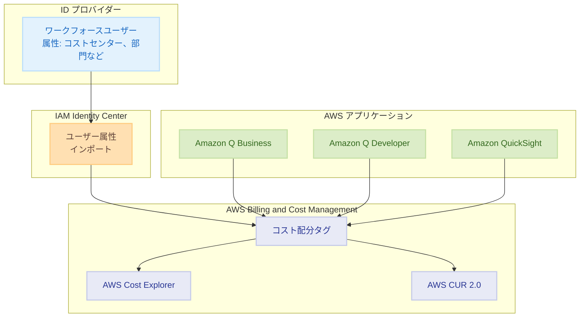
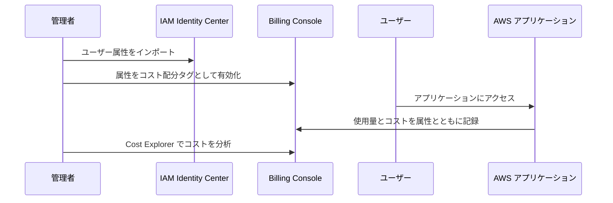

# AWS Cost Management - ユーザー属性によるコスト配分

**リリース日**: 2025 年 12 月 15 日
**サービス**: AWS Billing and Cost Management
**機能**: ユーザー属性によるコスト配分

## 概要

AWS で、既存のワークフォースユーザー属性（コストセンター、部門、組織など）を使用して AWS アプリケーションの使用量とコストを追跡・分析できる新しいコスト配分機能がリリースされました。

この機能により、Amazon Q Business、Amazon Q Developer、Amazon QuickSight などの AWS アプリケーションのユーザーごとの月額サブスクリプション料金やオンデマンド料金を、それぞれの社内ビジネスユニットに配分できるようになります。

**アップデート前の課題**

- AWS アプリケーションのコストをユーザーや部門ごとに配分することが困難だった
- FinOps チームがチームごとの AWS 使用状況を把握するのに手間がかかっていた
- コストセンターや部門ごとのチャージバックが複雑だった

**アップデート後の改善**

- IAM Identity Center のユーザー属性を使用した自動コスト配分
- AWS Cost Explorer と AWS CUR 2.0 でのチーム別コスト分析
- ユーザーアクセス時に自動的にコストが属性とともに記録

## アーキテクチャ図



ユーザー属性が IAM Identity Center にインポートされ、AWS アプリケーションの使用時に自動的にコスト配分タグとして記録されます。

## サービスアップデートの詳細

### 主要機能

1. **ユーザー属性によるコスト配分**
   - コストセンター、部門、組織などの属性を使用
   - ユーザーごとの月額サブスクリプション料金を配分
   - オンデマンド料金も同様に配分

2. **IAM Identity Center との統合**
   - ワークフォースユーザー属性を IAM Identity Center にインポート
   - 属性をコスト配分タグとして有効化
   - 自動的なコスト記録

3. **コスト分析ツールとの統合**
   - AWS Cost Explorer でのチーム別コスト分析
   - AWS CUR 2.0 での詳細なコストレポート
   - FinOps ワークフローとの統合

### 対応する AWS アプリケーション

| アプリケーション | 説明 |
|-----------------|------|
| Amazon Q Business | エンタープライズ向け生成 AI アシスタント |
| Amazon Q Developer | 開発者向け AI コーディングアシスタント |
| Amazon QuickSight | ビジネスインテリジェンスサービス |

## 技術仕様

### サポートされるユーザー属性

| 属性 | 説明 |
|------|------|
| Cost Center | コストセンターコード |
| Division | 事業部門 |
| Organization | 組織 |
| Department | 部門 |

### 設定フロー



## 設定方法

### 前提条件

1. IAM Identity Center の設定
2. ワークフォースユーザー属性のインポート
3. AWS Billing and Cost Management へのアクセス権限

### 手順

#### ステップ 1: ユーザー属性の IAM Identity Center へのインポート

1. IAM Identity Center コンソールを開く
2. 「Settings」→「Attributes for access control」を選択
3. ユーザー属性（コストセンター、部門など）をマッピング

#### ステップ 2: コスト配分タグの有効化

1. AWS Billing and Cost Management コンソールを開く
2. 「Cost allocation tags」を選択
3. ユーザー属性を選択して「Activate」をクリック

```bash
# AWS CLI でコスト配分タグを有効化
aws ce update-cost-allocation-tags-status \
    --cost-allocation-tags-status \
        TagKey=aws:identitycenter:costcenter,Status=Active \
        TagKey=aws:identitycenter:department,Status=Active
```

コスト配分タグを有効化して、ユーザー属性によるコスト追跡を開始します。

#### ステップ 3: コスト分析

```bash
# Cost Explorer でコストセンター別のコストを取得
aws ce get-cost-and-usage \
    --time-period Start=2025-12-01,End=2025-12-31 \
    --granularity MONTHLY \
    --metrics "UnblendedCost" \
    --group-by Type=TAG,Key=aws:identitycenter:costcenter
```

Cost Explorer API を使用して、コストセンター別のコストを分析します。

## メリット

### ビジネス面

- **正確なチャージバック**: ユーザー属性に基づいた正確なコスト配分
- **コスト可視性の向上**: チームや部門ごとの AWS 使用状況を把握
- **予算管理の改善**: 部門ごとの予算追跡と管理が容易に

### 技術面

- **自動化**: ユーザーアクセス時に自動的にコストが記録
- **既存インフラの活用**: IAM Identity Center の属性を再利用
- **標準ツールとの統合**: Cost Explorer、CUR 2.0 との統合

## デメリット・制約事項

### 制限事項

- GovCloud (US) リージョンでは利用不可
- 中国 (北京) および中国 (寧夏) リージョンでは利用不可
- IAM Identity Center の設定が必要

### 考慮すべき点

- ユーザー属性の正確性がコスト配分の精度に影響
- 属性の変更は将来のコストにのみ反映される

## ユースケース

### ユースケース 1: 部門別チャージバック

**シナリオ**: 各部門の Amazon Q Developer 使用コストを部門予算に配分

**実装例**:
1. 部門属性を IAM Identity Center にインポート
2. 部門をコスト配分タグとして有効化
3. Cost Explorer で部門別コストを分析
4. 月次で各部門にチャージバック

**効果**: 正確な部門別コスト配分により、予算管理を改善

### ユースケース 2: プロジェクト別コスト追跡

**シナリオ**: プロジェクトごとの Amazon QuickSight 使用コストを追跡

**実装例**:
1. プロジェクトコードをユーザー属性として設定
2. プロジェクトをコスト配分タグとして有効化
3. CUR 2.0 でプロジェクト別の詳細レポートを生成

**効果**: プロジェクトの ROI 分析が可能に

### ユースケース 3: FinOps ダッシュボード

**シナリオ**: 組織全体の AWS アプリケーションコストを可視化

**実装例**:
1. 複数の属性（コストセンター、部門、組織）を有効化
2. Cost Explorer でカスタムダッシュボードを作成
3. 定期的なコストレポートを自動生成

**効果**: FinOps チームがコスト最適化の機会を特定

## 料金

この機能は追加料金なしで利用可能です。AWS Billing and Cost Management の標準機能として提供されます。

## 利用可能リージョン

すべての AWS リージョンで利用可能です（GovCloud (US) リージョンおよび中国リージョンを除く）。

## 関連サービス・機能

- **IAM Identity Center**: ワークフォースユーザー管理
- **AWS Cost Explorer**: コスト分析と可視化
- **AWS Cost and Usage Report (CUR) 2.0**: 詳細なコストレポート
- **AWS Budgets**: 予算管理とアラート

## 参考リンク

- [公式発表 (What's New)](https://aws.amazon.com/about-aws/whats-new/2025/12/cost-allocation-using-users-attributes/)
- [AWS コスト配分タグ ドキュメント](https://docs.aws.amazon.com/awsaccountbilling/latest/aboutv2/cost-alloc-tags.html)
- [IAM Identity Center ドキュメント](https://docs.aws.amazon.com/singlesignon/latest/userguide/what-is.html)

## まとめ

ユーザー属性によるコスト配分機能により、AWS アプリケーションのコストを部門やコストセンターごとに正確に追跡・配分できるようになりました。IAM Identity Center との統合により、既存のユーザー属性を活用した自動的なコスト記録が可能です。FinOps チームは Cost Explorer や CUR 2.0 を使用して、チームごとの AWS 使用状況を詳細に分析し、コスト最適化の機会を特定できます。
