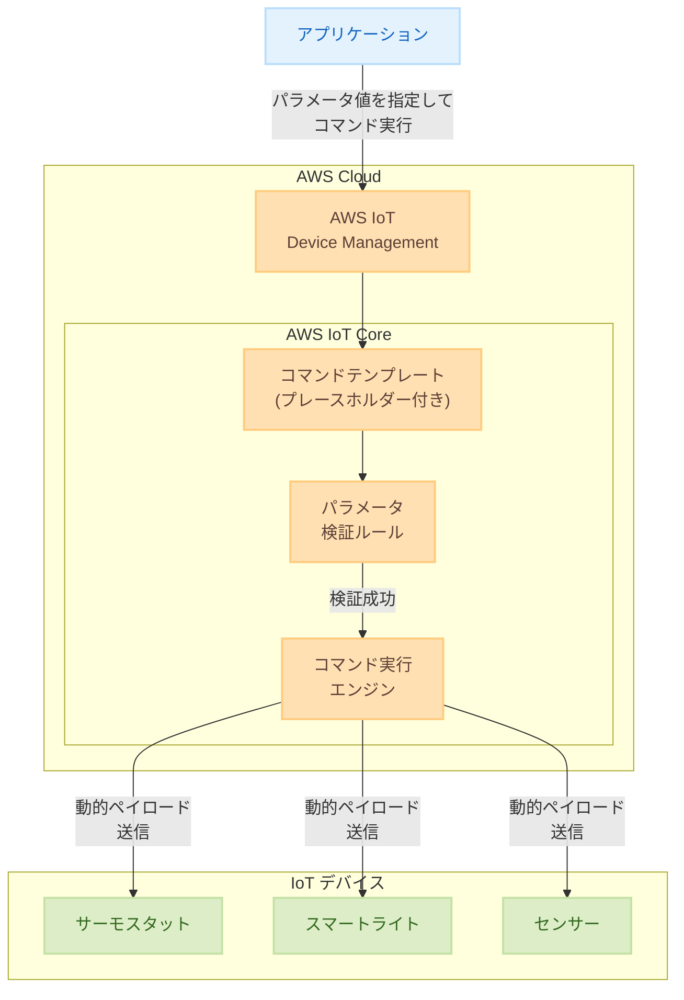

# AWS IoT Device Management - Commands 動的ペイロード

**リリース日**: 2025年12月16日
**サービス**: AWS IoT Device Management
**機能**: Commands 動的ペイロード

## 概要

AWS IoT Device Management Commands は、動的ペイロード機能をサポートしました。この機能により、開発者はプレースホルダーを含む再利用可能なコマンドテンプレートを作成し、コマンド実行時に異なる値で置き換えることができます。また、パラメータ検証ルールも含まれており、実行前にパラメータ値が指定された基準に適合しているかを検証できます。

この機能は、IoT デバイスに異なるパラメータ値で類似のコマンドを送信する必要があるシナリオに最適です。例えば、サーモスタットの温度を設定するために個別のコマンドを作成する代わりに、温度プレースホルダーを含む 1 つのテンプレートを作成し、実行時に実際の値を指定できます。

**アップデート前の課題**

- 異なるパラメータ値でコマンドを送信するには、個別のコマンドを作成する必要があった
- コマンドの再利用性が低く、管理が煩雑になっていた
- パラメータ値の検証を手動で実装する必要があった

**アップデート後の改善**

- プレースホルダーを使用した再利用可能なコマンドテンプレートを作成可能
- 実行時にパラメータ値を動的に設定可能
- パラメータ検証ルールにより、不正な値の送信を防止

## アーキテクチャ図



コマンドテンプレートにプレースホルダーを定義し、実行時にパラメータ値を指定することで、複数のデバイスに動的なコマンドを送信できます。

## サービスアップデートの詳細

### 主要機能

1. **動的ペイロードテンプレート**
   - プレースホルダーを含むコマンドテンプレートの作成
   - 実行時のパラメータ値置換
   - 複数のプレースホルダーのサポート

2. **パラメータ検証ルール**
   - 実行前のパラメータ値検証
   - データ型、範囲、パターンの検証
   - 不正な値の送信防止

3. **コマンド再利用性**
   - 1 つのテンプレートで複数のユースケースに対応
   - コマンド管理の簡素化
   - 開発効率の向上

## 技術仕様

### テンプレート構文

| 要素 | 説明 | 例 |
|------|------|-----|
| プレースホルダー | `${parameterName}` 形式で定義 | `${temperature}` |
| デフォルト値 | オプションでデフォルト値を指定可能 | `${temperature:25}` |
| 必須パラメータ | 検証ルールで必須指定 | `required: true` |

### 検証ルールタイプ

| ルールタイプ | 説明 | 例 |
|-------------|------|-----|
| type | データ型の検証 | `integer`, `string`, `boolean` |
| minimum/maximum | 数値の範囲検証 | `minimum: 16, maximum: 30` |
| pattern | 正規表現パターン検証 | `pattern: "^[A-Z]{3}$"` |
| enum | 許可値リスト | `enum: ["on", "off", "auto"]` |

## 設定方法

### 前提条件

1. AWS IoT Core が設定済みであること
2. IoT デバイスが登録済みであること
3. 適切な IAM 権限

### 手順

#### ステップ 1: コマンドテンプレートの作成

動的パラメータを含むコマンドテンプレートを作成します。

```bash
aws iot create-command \
  --command-id "set-thermostat-temperature" \
  --display-name "Set Thermostat Temperature" \
  --namespace "AWS-IoT" \
  --payload '{
    "contentType": "application/json",
    "content": "{\"action\": \"setTemperature\", \"value\": ${temperature}, \"unit\": \"${unit}\"}"
  }' \
  --mandatory-parameters '[
    {
      "name": "temperature",
      "defaultValue": {"S": "22"},
      "description": "Target temperature"
    },
    {
      "name": "unit",
      "defaultValue": {"S": "celsius"},
      "description": "Temperature unit"
    }
  ]'
```

`${temperature}` と `${unit}` がプレースホルダーとして定義され、実行時に値が置換されます。

#### ステップ 2: パラメータ検証ルールの追加

パラメータの検証ルールを定義します。

```json
{
  "parameters": {
    "temperature": {
      "type": "integer",
      "minimum": 16,
      "maximum": 30,
      "description": "Temperature must be between 16 and 30"
    },
    "unit": {
      "type": "string",
      "enum": ["celsius", "fahrenheit"],
      "description": "Temperature unit"
    }
  }
}
```

温度は 16〜30 の整数、単位は celsius または fahrenheit のみ許可されます。

#### ステップ 3: コマンドの実行

パラメータ値を指定してコマンドを実行します。

```bash
aws iot-jobs-data start-command-execution \
  --command-arn "arn:aws:iot:us-east-1:123456789012:command/set-thermostat-temperature" \
  --target-arn "arn:aws:iot:us-east-1:123456789012:thing/my-thermostat" \
  --parameters '{
    "temperature": {"S": "24"},
    "unit": {"S": "celsius"}
  }'
```

指定されたパラメータ値でコマンドが実行され、デバイスに送信されます。

#### ステップ 4: 実行結果の確認

コマンドの実行状態を確認します。

```bash
aws iot-jobs-data get-command-execution \
  --execution-id "execution-id-xxxxx" \
  --target-arn "arn:aws:iot:us-east-1:123456789012:thing/my-thermostat"
```

## メリット

### ビジネス面

- **開発効率向上**: コマンドテンプレートの再利用により、開発時間を短縮
- **運用コスト削減**: コマンド管理の簡素化により、運用負荷を軽減
- **エラー削減**: パラメータ検証により、不正なコマンド送信を防止

### 技術面

- **コード再利用性**: 1 つのテンプレートで複数のシナリオに対応
- **型安全性**: パラメータ検証によるデータ整合性の確保
- **柔軟性**: 実行時のパラメータ指定による動的な制御

## デメリット・制約事項

### 制限事項

- テンプレート内のプレースホルダー数に制限がある可能性
- 複雑な検証ロジックは Lambda 関数との連携が必要
- 一部の古いデバイスファームウェアでは対応が必要

### 考慮すべき点

- 既存のコマンドからテンプレートへの移行計画が必要
- パラメータ検証ルールの設計には十分なテストが必要
- デバイス側でのペイロード解析ロジックの確認

## ユースケース

### ユースケース 1: スマートホーム温度制御

**シナリオ**: 複数の部屋のサーモスタットを異なる温度に設定

**実装例**:
```json
{
  "template": {
    "action": "setTemperature",
    "room": "${roomId}",
    "temperature": "${targetTemp}",
    "schedule": "${scheduleTime}"
  },
  "validation": {
    "roomId": {"type": "string", "pattern": "^room-[0-9]+$"},
    "targetTemp": {"type": "integer", "minimum": 16, "maximum": 30},
    "scheduleTime": {"type": "string", "pattern": "^[0-9]{2}:[0-9]{2}$"}
  }
}
```

**効果**: 1 つのテンプレートで全部屋のサーモスタットを制御可能

### ユースケース 2: 産業用センサー設定

**シナリオ**: 工場内の複数のセンサーのサンプリングレートを動的に調整

**実装例**:
```json
{
  "template": {
    "command": "configureSensor",
    "sensorType": "${sensorType}",
    "samplingRate": "${rate}",
    "threshold": "${alertThreshold}"
  },
  "validation": {
    "sensorType": {"type": "string", "enum": ["temperature", "pressure", "humidity"]},
    "rate": {"type": "integer", "minimum": 1, "maximum": 1000},
    "alertThreshold": {"type": "number", "minimum": 0}
  }
}
```

**効果**: センサータイプに応じた柔軟な設定変更が可能

### ユースケース 3: フリート管理

**シナリオ**: 車両フリートのファームウェア更新設定を一括管理

**実装例**:
```json
{
  "template": {
    "action": "scheduleUpdate",
    "firmwareVersion": "${version}",
    "updateWindow": "${window}",
    "priority": "${priority}"
  },
  "validation": {
    "version": {"type": "string", "pattern": "^v[0-9]+\\.[0-9]+\\.[0-9]+$"},
    "window": {"type": "string", "enum": ["immediate", "overnight", "weekend"]},
    "priority": {"type": "string", "enum": ["low", "medium", "high", "critical"]}
  }
}
```

**効果**: 車両ごとに異なる更新スケジュールを 1 つのテンプレートで管理

## 料金

AWS IoT Device Management Commands の使用には、標準の AWS IoT 料金が適用されます。

### 料金構成

| 項目 | 料金 |
|------|------|
| コマンド実行 | 実行あたりの料金 |
| メッセージング | メッセージあたりの料金 |
| デバイス接続 | 接続分あたりの料金 |

### 料金例

| 使用量 | 月額料金（概算） |
|--------|------------------|
| 10,000 コマンド実行/月 | 約 $10〜20 USD |
| 100,000 コマンド実行/月 | 約 $50〜100 USD |

※ 実際の料金はリージョンや使用状況により異なります。

## 利用可能リージョン

AWS IoT Device Management Commands の動的ペイロード機能は、AWS IoT Device Management が利用可能なすべてのリージョンで利用できます。

## 関連サービス・機能

- **AWS IoT Core**: デバイス接続とメッセージング
- **AWS IoT Jobs**: 大規模なデバイス更新
- **AWS Lambda**: カスタム検証ロジックの実装
- **Amazon CloudWatch**: コマンド実行の監視

## 参考リンク

- [公式発表 (What's New)](https://aws.amazon.com/about-aws/whats-new/2025/12/aws-iot-device-management-commands-dynamic-payload/)
- [ドキュメント - Device Management Commands Developer Guide](https://docs.aws.amazon.com/iot/latest/developerguide/iot-remote-command.html)
- [AWS IoT Device Management](https://aws.amazon.com/iot-device-management/)

## まとめ

AWS IoT Device Management Commands の動的ペイロード機能は、IoT デバイス管理の効率を大幅に向上させます。再利用可能なコマンドテンプレートとパラメータ検証により、開発者は少ないコードで多様なデバイス制御シナリオに対応できます。スマートホーム、産業用 IoT、フリート管理など、多数のデバイスを管理する環境では、この機能を活用してコマンド管理を簡素化することをお勧めします。
