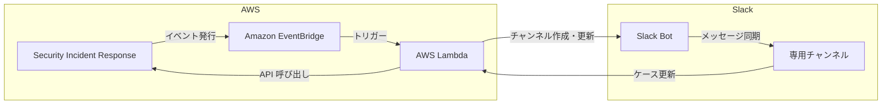

# AWS Security Incident Response - Slack 連携機能

**リリース日**: 2025 年 12 月 16 日
**サービス**: AWS Security Incident Response
**機能**: Slack 連携 (双方向統合)

## 概要

AWS Security Incident Response に Slack との双方向連携機能が追加されました。この統合により、セキュリティインシデントへの準備、対応、復旧をより迅速かつ効果的に行えるようになります。

Security Incident Response コンソールと Slack の両方でケースの作成・更新が可能で、データは自動的に同期されます。各ケースは専用の Slack チャンネルとして表現され、コメントや添付ファイルは即座に同期されます。

**アップデート前の課題**

- セキュリティインシデント対応時に複数のツール間で情報を手動で同期する必要があった
- チーム間のコミュニケーションが分散し、対応速度が低下していた
- インシデント情報へのアクセスにコンソールへのログインが必要だった
- 既存の通知・コミュニケーションワークフローとの統合が困難だった

**アップデート後の改善**

- Security Incident Response と Slack 間で双方向のデータ同期
- 各ケースに専用 Slack チャンネルを自動作成
- ウォッチャーを自動的に対応する Slack チャンネルに追加
- オープンソースソリューションとしてカスタマイズ・拡張が可能

## アーキテクチャ図



EventBridge を活用した双方向統合により、既存のセキュリティインシデント管理ツールとの連携も維持できます。

## サービスアップデートの詳細

### 主要機能

1. **双方向データ同期**
   - Security Incident Response コンソールと Slack の両方でケースを作成・更新
   - コメントと添付ファイルの即時同期
   - ケースステータスの自動反映

2. **専用 Slack チャンネル**
   - 各 Security Incident Response ケースに専用チャンネルを自動作成
   - ウォッチャーを自動的にチャンネルに追加
   - チャンネル内でのコラボレーションを促進

3. **EventBridge 統合**
   - 既存のセキュリティインシデント管理ツールとの連携を維持
   - カスタム通知ワークフローの構築が可能
   - モジュラーアーキテクチャによる拡張性

4. **オープンソースソリューション**
   - GitHub でソースコードを公開
   - カスタマイズと機能拡張が可能
   - Amazon Q Developer や Kiro を使用した新しい統合ターゲットの追加ガイダンス

## 技術仕様

### 統合アーキテクチャ

| コンポーネント | 役割 |
|---------------|------|
| AWS Security Incident Response | インシデントケース管理 |
| Amazon EventBridge | イベントルーティング |
| AWS Lambda | 統合ロジック実行 |
| Slack API | チャンネル・メッセージ管理 |

### 同期される情報

| 情報タイプ | 同期方向 |
|-----------|---------|
| ケース作成 | 双方向 |
| ケース更新 | 双方向 |
| コメント | 双方向 |
| 添付ファイル | 双方向 |
| ウォッチャー | SIR → Slack |

## 設定方法

### 前提条件

1. AWS アカウント
2. AWS Security Incident Response の設定
3. Slack ワークスペースの管理者権限
4. GitHub リポジトリへのアクセス

### 手順

#### ステップ 1: GitHub リポジトリのクローン

```bash
git clone https://github.com/aws-samples/sample-aws-security-incident-response-integrations.git
cd sample-aws-security-incident-response-integrations
```

オープンソースソリューションをローカル環境にクローンします。

#### ステップ 2: Slack アプリの設定

Slack ワークスペースに新しいアプリを作成し、必要な権限を設定します。

1. Slack API ポータルで新しいアプリを作成
2. Bot Token Scopes を設定 (channels:manage, chat:write など)
3. OAuth トークンを取得

#### ステップ 3: AWS リソースのデプロイ

```bash
# AWS SAM または CloudFormation を使用してデプロイ
sam deploy --guided
```

EventBridge ルール、Lambda 関数、必要な IAM ロールがデプロイされます。

#### ステップ 4: 統合のテスト

Security Incident Response でテストケースを作成し、Slack チャンネルが自動作成されることを確認します。

## メリット

### ビジネス面

- **対応速度向上**: チーム間のコミュニケーション効率化により、インシデント対応時間を短縮
- **コラボレーション強化**: 使い慣れた Slack でインシデント対応が可能
- **可視性向上**: インシデント情報へのアクセスが容易に

### 技術面

- **双方向同期**: 情報の一貫性を自動的に維持
- **拡張性**: オープンソースによるカスタマイズが可能
- **既存ツールとの統合**: EventBridge により既存ワークフローを維持

## デメリット・制約事項

### 制限事項

- 初期設定には Slack 管理者権限が必要
- オープンソースソリューションのため、自己管理が必要
- Slack の API 制限に依存

### 考慮すべき点

- セキュリティ情報が Slack に同期されるため、アクセス制御を適切に設定
- Lambda 関数の実行コストを考慮
- Slack チャンネルの命名規則とアーカイブポリシーを検討

## ユースケース

### ユースケース 1: セキュリティオペレーションセンター (SOC)

**シナリオ**: SOC チームが 24/7 でセキュリティインシデントを監視・対応

**実装例**:
```
1. GuardDuty が脅威を検出
2. Security Incident Response でケースを自動作成
3. Slack チャンネルが自動作成され、SOC チームに通知
4. チーム内でリアルタイムにコラボレーション
```

**効果**: インシデント検出から対応開始までの時間を大幅に短縮

### ユースケース 2: インシデント対応チーム

**シナリオ**: 複数部門にまたがるインシデント対応チームの連携

**実装例**:
```
1. セキュリティチームがケースを作成
2. 関連部門のメンバーをウォッチャーとして追加
3. 全員が自動的に Slack チャンネルに参加
4. 部門間でリアルタイムに情報共有
```

**効果**: 部門間のコミュニケーション障壁を解消し、迅速な意思決定を実現

### ユースケース 3: マネージドセキュリティサービス

**シナリオ**: MSSP が複数顧客のインシデント対応を管理

**実装例**:
```
1. 顧客ごとに専用の Slack ワークスペースを設定
2. インシデント発生時に顧客と MSSP の両方に通知
3. 顧客とのコミュニケーションを Slack で一元管理
```

**効果**: 顧客対応の効率化とサービス品質の向上

## 料金

Slack 連携自体は追加料金なしで利用できますが、以下のコストが発生します。

### 料金例

| 項目 | 料金 |
|------|------|
| AWS Security Incident Response | サービス料金 |
| Amazon EventBridge | イベント数に基づく課金 |
| AWS Lambda | 実行時間に基づく課金 |
| Slack | Slack プランに依存 |

## 利用可能リージョン

AWS Security Incident Response が利用可能なすべてのリージョンで利用できます。

## 関連サービス・機能

- **AWS Security Incident Response**: インシデント管理サービス
- **Amazon EventBridge**: イベントルーティング
- **AWS Lambda**: サーバーレス関数実行
- **Amazon Q Developer**: 統合拡張のサポート

## 参考リンク

- [公式発表 (What's New)](https://aws.amazon.com/about-aws/whats-new/2025/12/aws-security-incident-response-integration-slack/)
- [GitHub リポジトリ](https://github.com/aws-samples/sample-aws-security-incident-response-integrations)
- [Slack 統合ドキュメント](https://github.com/aws-samples/sample-aws-security-incident-response-integrations/blob/main/documentation/SLACK/SLACK.md)
- [AWS Security Incident Response User Guide](https://docs.aws.amazon.com/security-ir/latest/userguide/security-incident-response-guide.html)

## まとめ

AWS Security Incident Response の Slack 連携により、セキュリティインシデント対応のコラボレーションが大幅に効率化されます。双方向同期、専用チャンネルの自動作成、オープンソースによる拡張性により、既存のワークフローを維持しながらインシデント対応能力を強化できます。SOC チームやインシデント対応チームは、この統合を活用して対応速度と品質を向上させてください。
