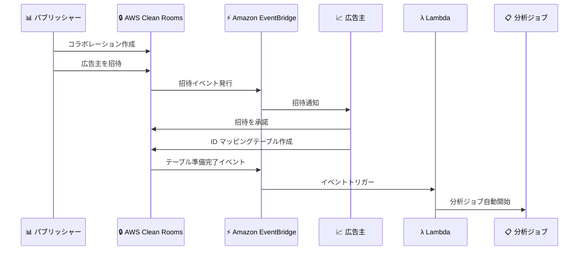

# AWS Clean Rooms - メンバー招待とテーブル準備完了イベントの EventBridge 連携

**リリース日**: 2025 年 12 月 16 日
**サービス**: AWS Clean Rooms
**機能**: Amazon EventBridge へのメンバー招待・テーブル準備完了イベント発行

## 概要

AWS Clean Rooms が Amazon EventBridge に対して、メンバー招待とテーブル準備完了に関するイベントを発行できるようになりました。この機能により、コラボレーションメンバーはリアルタイムで招待通知やリソース準備完了の通知を受け取ることができ、データクリーンルームでの共同作業の透明性と効率性が大幅に向上します。

AWS Clean Rooms は、複数の企業が基盤となるデータを共有することなく、集合的なデータセットを分析できるサービスです。今回のアップデートにより、コラボレーションのライフサイクル全体を通じてイベント駆動型のワークフローを構築できるようになりました。

**アップデート前の課題**

- コラボレーションへの招待を手動で確認する必要があった
- パートナーがテーブルを準備完了したかどうかを定期的にポーリングで確認する必要があった
- 分析開始のタイミングを把握するのに時間がかかっていた

**アップデート後の改善**

- 招待を受けた際に EventBridge 経由で自動通知を受信可能
- ID マッピングテーブルや ID 名前空間の関連付け完了時に自動通知
- イベント駆動型の自動分析ワークフローを構築可能

## アーキテクチャ図



コラボレーションのライフサイクルイベントが EventBridge を通じて自動的に通知され、後続の処理を自動化できます。

## サービスアップデートの詳細

### 主要機能

1. **メンバー招待イベント**
   - コラボレーションへの招待時に EventBridge イベントを発行
   - 招待されたメンバーがリアルタイムで通知を受信
   - 招待の確認と参加プロセスを効率化

2. **テーブル準備完了イベント**
   - AWS Entity Resolution リソースの関連付け完了時にイベント発行
   - ID マッピングテーブルの準備完了を通知
   - ID 名前空間の関連付け完了を通知

3. **自動分析ワークフロー**
   - テーブル準備完了をトリガーに分析を自動開始
   - 時間のかかる手動確認プロセスを排除
   - 分析開始までの時間を数時間から数分に短縮

## 技術仕様

### EventBridge イベントパターン

| 項目 | 詳細 |
|------|------|
| イベントソース | `aws.cleanrooms` |
| イベントタイプ | `Membership Invitation Created`, `Table Readiness Changed` |
| 配信タイプ | ベストエフォート |

### イベントパターン例

```json
{
  "source": ["aws.cleanrooms"],
  "detail-type": [
    "Membership Invitation Created",
    "Id Namespace Association Updated"
  ]
}
```

## 設定方法

### 前提条件

1. AWS Clean Rooms コラボレーションの作成権限
2. Amazon EventBridge ルールの作成権限
3. AWS Entity Resolution の設定（ID マッピングを使用する場合）

### 手順

#### ステップ 1: EventBridge ルールの作成

```bash
# メンバー招待イベントをキャプチャするルールを作成
aws events put-rule \
    --name "CleanRoomsInvitationRule" \
    --event-pattern '{
        "source": ["aws.cleanrooms"],
        "detail-type": ["Membership Invitation Created"]
    }' \
    --state ENABLED
```

AWS Clean Rooms からのメンバー招待イベントをキャプチャするルールを作成します。

#### ステップ 2: ターゲットの設定

```bash
# Lambda 関数をターゲットとして設定
aws events put-targets \
    --rule "CleanRoomsInvitationRule" \
    --targets "Id"="1","Arn"="arn:aws:lambda:us-east-1:123456789012:function:ProcessInvitation"
```

イベントを処理する Lambda 関数をターゲットとして設定します。

#### ステップ 3: テーブル準備完了イベントのルール作成

```bash
# テーブル準備完了イベントをキャプチャするルールを作成
aws events put-rule \
    --name "CleanRoomsTableReadyRule" \
    --event-pattern '{
        "source": ["aws.cleanrooms"],
        "detail-type": ["Id Namespace Association Updated"]
    }' \
    --state ENABLED
```

ID マッピングテーブルの準備完了イベントをキャプチャするルールを作成します。

## メリット

### ビジネス面

- **時間短縮**: 分析開始までの時間を数時間から数分に短縮
- **透明性向上**: コラボレーションの状態をリアルタイムで把握
- **運用効率化**: 手動確認プロセスの排除

### 技術面

- **イベント駆動アーキテクチャ**: ポーリング不要のリアルタイム通知
- **自動化**: 分析ワークフローの完全自動化が可能
- **スケーラビリティ**: 複数のコラボレーションを効率的に管理

## デメリット・制約事項

### 制限事項

- イベント配信はベストエフォート（保証なし）
- EventBridge ルールの設定が必要
- 追加の Lambda 関数や通知設定が必要

### 考慮すべき点

- イベント処理の冪等性を確保する設計が必要
- 失敗時のリトライロジックの実装を推奨

## ユースケース

### ユースケース 1: 広告キャンペーン分析の自動化

**シナリオ**: パブリッシャーが広告主を招待し、広告主が ID マッピングテーブルを作成したら自動的にメディアプランニング分析を開始したい

**実装例**:
```json
{
  "source": ["aws.cleanrooms"],
  "detail-type": ["Id Namespace Association Updated"],
  "detail": {
    "collaborationId": ["collaboration-12345"]
  }
}
```

**効果**: 広告主のテーブル準備完了後、即座に分析を開始し、キャンペーン計画のリードタイムを短縮

### ユースケース 2: 招待管理の自動化

**シナリオ**: 新しいコラボレーション招待を受けた際に、Slack や Teams に通知を送信したい

**効果**: 招待の見落としを防ぎ、コラボレーション参加までの時間を短縮

### ユースケース 3: コンプライアンス監査

**シナリオ**: すべてのコラボレーションイベントを監査ログとして記録したい

**効果**: コラボレーションのライフサイクル全体を追跡し、コンプライアンス要件を満たす

## 料金

AWS Clean Rooms の料金に加えて、Amazon EventBridge のイベント配信料金が適用されます。

| 項目 | 料金 |
|------|------|
| EventBridge イベント | 100 万イベントあたり $1.00 |
| Clean Rooms クエリ | クエリごとの料金（リージョンにより異なる） |

## 利用可能リージョン

AWS Clean Rooms が利用可能なすべてのリージョンで利用できます。詳細は [AWS リージョン表](https://docs.aws.amazon.com/general/latest/gr/clean-rooms.html#clean-rooms_region) を参照してください。

## 関連サービス・機能

- **Amazon EventBridge**: イベント駆動型アーキテクチャの構築
- **AWS Entity Resolution**: ID マッピングとエンティティ解決
- **AWS Lambda**: イベント処理の自動化

## 参考リンク

- [公式発表 (What's New)](https://aws.amazon.com/about-aws/whats-new/2025/12/clean-rooms-events-member-invitations-table-readiness/)
- [AWS Clean Rooms ドキュメント](https://docs.aws.amazon.com/clean-rooms/latest/userguide/what-is.html)
- [EventBridge 統合ガイド](https://docs.aws.amazon.com/clean-rooms/latest/userguide/eventbridge-integration-full.html)
- [AWS Entity Resolution](https://docs.aws.amazon.com/entityresolution/latest/userguide/what-is-service.html)

## まとめ

AWS Clean Rooms が EventBridge へのメンバー招待・テーブル準備完了イベント発行をサポートしました。これにより、データクリーンルームでのコラボレーションをイベント駆動型で自動化でき、分析開始までの時間を大幅に短縮できます。複数のパートナーとのデータコラボレーションを行っている組織は、この機能を活用してワークフローの効率化を検討することをお勧めします。
