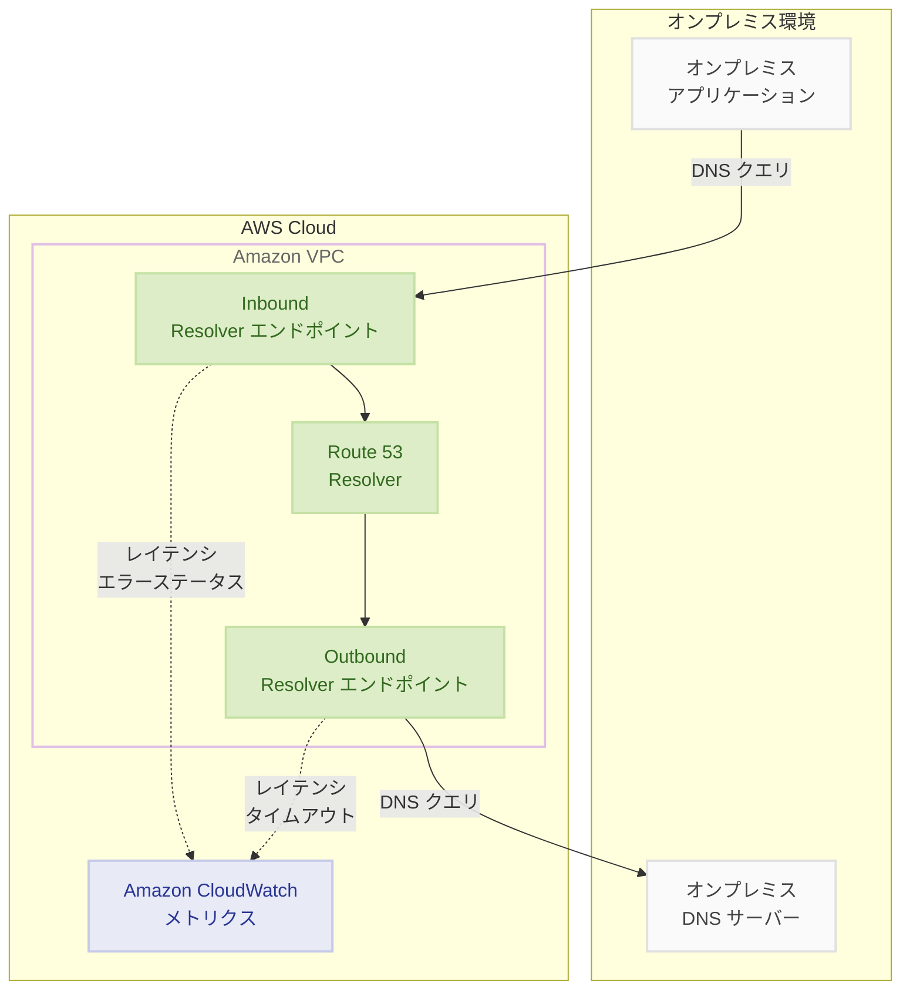

# Amazon Route 53 - Resolver エンドポイント詳細メトリクス

**リリース日**: 2025年12月16日
**サービス**: Amazon Route 53
**機能**: Resolver エンドポイント詳細メトリクス

## 概要

Amazon Route 53 は、Route 53 Resolver エンドポイントとアウトバウンド Resolver エンドポイントに関連付けられたターゲットネームサーバーのパフォーマンスと健全性を監視するための Amazon CloudWatch メトリクスを発表しました。

この新機能により、Resolver エンドポイントが受信した DNS クエリの応答レイテンシ、SERVFAIL、NXDOMAIN、REFUSED、FORMERR ステータスとなったクエリ応答の数を評価できます。また、アウトバウンド Resolver エンドポイントに関連付けられたターゲットネームサーバーの可用性も、応答レイテンシやタイムアウトしたクエリ数を通じて確認できます。

**アップデート前の課題**

- Resolver エンドポイントの詳細なパフォーマンスメトリクスが利用できなかった
- DNS クエリの失敗原因を特定するのに時間がかかっていた
- ターゲットネームサーバーの健全性を直接監視する手段がなかった

**アップデート後の改善**

- CloudWatch で Resolver エンドポイントごとの詳細メトリクスを有効化可能
- DNS クエリの応答レイテンシとエラーステータスをリアルタイムで監視
- ターゲットネームサーバーの可用性と応答時間を直接確認可能

## アーキテクチャ図



Resolver エンドポイントから CloudWatch にメトリクスが送信され、DNS クエリのパフォーマンスと健全性を監視できます。

## サービスアップデートの詳細

### 主要機能

1. **Resolver エンドポイントメトリクス**
   - DNS クエリの応答レイテンシ
   - SERVFAIL、NXDOMAIN、REFUSED、FORMERR ステータスのクエリ数
   - エンドポイントごとの有効化が可能

2. **ターゲットネームサーバーメトリクス**
   - アウトバウンドエンドポイントに関連付けられたターゲットサーバーの応答レイテンシ
   - タイムアウトしたクエリの数
   - ターゲットサーバーの可用性評価

3. **CloudWatch 統合**
   - 標準の CloudWatch メトリクスとして利用可能
   - アラームの設定が可能
   - ダッシュボードでの可視化

## 技術仕様

### 利用可能なメトリクス

| メトリクス名 | 説明 | 単位 |
|-------------|------|------|
| QueryLatency | DNS クエリの応答レイテンシ | ミリ秒 |
| ServfailCount | SERVFAIL 応答の数 | カウント |
| NxdomainCount | NXDOMAIN 応答の数 | カウント |
| RefusedCount | REFUSED 応答の数 | カウント |
| FormerrCount | FORMERR 応答の数 | カウント |
| TargetServerLatency | ターゲットサーバーの応答レイテンシ | ミリ秒 |
| TargetServerTimeoutCount | タイムアウトしたクエリの数 | カウント |

### DNS 応答ステータスの説明

| ステータス | 説明 |
|-----------|------|
| SERVFAIL | サーバー障害 - DNS サーバーがクエリを処理できなかった |
| NXDOMAIN | 存在しないドメイン - クエリされたドメインが存在しない |
| REFUSED | 拒否 - DNS サーバーがクエリを拒否した |
| FORMERR | フォーマットエラー - クエリの形式が不正 |

## 設定方法

### 前提条件

1. Route 53 Resolver エンドポイントが作成済みであること
2. CloudWatch へのアクセス権限を持つ IAM ロール
3. 適切な IAM ポリシー

### 手順

#### ステップ 1: Resolver エンドポイントの確認

既存の Resolver エンドポイントを確認します。

```bash
aws route53resolver list-resolver-endpoints \
  --query 'ResolverEndpoints[*].{Id:Id,Name:Name,Direction:Direction,Status:Status}'
```

Resolver エンドポイントの ID、名前、方向 (INBOUND/OUTBOUND)、ステータスを確認します。

#### ステップ 2: 詳細メトリクスの有効化

AWS マネジメントコンソールまたは AWS CLI を使用して、Resolver エンドポイントの詳細メトリクスを有効化します。

```bash
aws route53resolver update-resolver-endpoint \
  --resolver-endpoint-id rslvr-in-xxxxxxxx \
  --resolver-endpoint-type IPV4 \
  --update-ip-addresses SubnetId=subnet-xxxxxxxx,Ip=10.0.1.10
```

※ 詳細メトリクスの有効化は CloudWatch コンソールから行います。

#### ステップ 3: CloudWatch アラームの設定

高レイテンシやエラー率に対するアラームを設定します。

```bash
aws cloudwatch put-metric-alarm \
  --alarm-name "ResolverEndpoint-HighLatency" \
  --alarm-description "Resolver endpoint latency exceeds threshold" \
  --metric-name QueryLatency \
  --namespace AWS/Route53Resolver \
  --statistic Average \
  --period 300 \
  --threshold 100 \
  --comparison-operator GreaterThanThreshold \
  --dimensions Name=EndpointId,Value=rslvr-in-xxxxxxxx \
  --evaluation-periods 2 \
  --alarm-actions arn:aws:sns:us-east-1:123456789012:my-topic
```

DNS クエリの平均レイテンシが 100ms を超えた場合にアラームを発報します。

#### ステップ 4: CloudWatch ダッシュボードの作成

Resolver エンドポイントのメトリクスを可視化するダッシュボードを作成します。

```json
{
  "widgets": [
    {
      "type": "metric",
      "properties": {
        "metrics": [
          ["AWS/Route53Resolver", "QueryLatency", "EndpointId", "rslvr-in-xxxxxxxx"]
        ],
        "title": "DNS Query Latency",
        "period": 60,
        "stat": "Average"
      }
    },
    {
      "type": "metric",
      "properties": {
        "metrics": [
          ["AWS/Route53Resolver", "ServfailCount", "EndpointId", "rslvr-in-xxxxxxxx"],
          [".", "NxdomainCount", ".", "."],
          [".", "RefusedCount", ".", "."]
        ],
        "title": "DNS Error Counts",
        "period": 60,
        "stat": "Sum"
      }
    }
  ]
}
```

## メリット

### ビジネス面

- **迅速な問題解決**: DNS 関連の問題を素早く特定し、ダウンタイムを最小化
- **SLA 監視**: DNS サービスのパフォーマンス SLA を監視・レポート
- **コスト最適化**: 問題の早期発見により、エスカレーションコストを削減

### 技術面

- **可観測性の向上**: ハイブリッドクラウド環境の DNS インフラストラクチャを包括的に監視
- **プロアクティブな監視**: 問題が発生する前に異常を検知
- **トラブルシューティングの効率化**: エラーステータスの詳細により、根本原因の特定が容易

## デメリット・制約事項

### 制限事項

- 詳細メトリクスの有効化には追加の CloudWatch 料金が発生
- メトリクスの保持期間は CloudWatch の標準ポリシーに従う
- 一部のメトリクスはアウトバウンドエンドポイントのみで利用可能

### 考慮すべき点

- 大量の DNS クエリがある環境では、CloudWatch のコストが増加する可能性
- アラームのしきい値は環境に応じて適切に設定する必要がある
- メトリクスの粒度と保持期間のバランスを考慮

## ユースケース

### ユースケース 1: ハイブリッドクラウド DNS 監視

**シナリオ**: オンプレミスと AWS 間の DNS 解決のパフォーマンスを監視

**実装例**:
- Inbound/Outbound Resolver エンドポイントの両方でメトリクスを有効化
- ターゲットネームサーバー (オンプレミス DNS) の応答時間を監視
- タイムアウト発生時にアラートを送信

**効果**: オンプレミス DNS サーバーの問題を早期に検知し、ハイブリッド環境の安定性を向上

### ユースケース 2: DNS エラー率の監視

**シナリオ**: アプリケーションの DNS 解決失敗を監視し、サービス品質を維持

**実装例**:
- SERVFAIL、NXDOMAIN、REFUSED カウントを監視
- エラー率が閾値を超えた場合にアラームを発報
- CloudWatch Logs Insights でエラーパターンを分析

**効果**: DNS 関連のアプリケーション障害を迅速に検知・対応

### ユースケース 3: パフォーマンスベースライン確立

**シナリオ**: DNS クエリのパフォーマンスベースラインを確立し、異常を検知

**実装例**:
- QueryLatency メトリクスを継続的に収集
- CloudWatch Anomaly Detection を使用して異常を自動検知
- ベースラインからの逸脱時にアラートを送信

**効果**: 通常のパフォーマンスパターンを学習し、異常を自動的に検知

## 料金

詳細メトリクスの使用には、標準の CloudWatch および Resolver エンドポイント料金が適用されます。

### 料金構成

| 項目 | 料金 |
|------|------|
| Resolver エンドポイント | ENI あたり $0.125/時間 |
| DNS クエリ | 100 万クエリあたり $0.40 |
| CloudWatch メトリクス | カスタムメトリクスあたり $0.30/月 |
| CloudWatch アラーム | アラームあたり $0.10/月 |

### 料金例

| 構成 | 月額料金（概算） |
|------|------------------|
| 2 ENI + 1000 万クエリ/月 + 5 メトリクス | 約 $200〜250 USD |
| 4 ENI + 1 億クエリ/月 + 10 メトリクス + 5 アラーム | 約 $450〜500 USD |

※ 実際の料金はリージョンや使用状況により異なります。

## 利用可能リージョン

Route 53 Resolver エンドポイント詳細メトリクスは、Route 53 Resolver が利用可能なすべてのリージョンで利用できます。

## 関連サービス・機能

- **Amazon CloudWatch**: メトリクスの収集、可視化、アラーム
- **Amazon CloudWatch Logs**: DNS クエリログの分析
- **AWS Direct Connect**: オンプレミスとの接続
- **AWS Transit Gateway**: マルチ VPC 環境での DNS 解決

## 参考リンク

- [公式発表 (What's New)](https://aws.amazon.com/about-aws/whats-new/2025/12/route-53-detailed-metrics-resolver-endpoints/)
- [ドキュメント - Monitoring Resolver with CloudWatch](https://docs.aws.amazon.com/Route53/latest/DeveloperGuide/monitoring-resolver-with-cloudwatch.html#cloudwatch-metrics-resolver-endpoint)
- [Route 53 VPC Resolver](https://aws.amazon.com/route53/vpc-resolver/)
- [CloudWatch 料金](https://aws.amazon.com/cloudwatch/pricing/)
- [Route 53 料金](https://aws.amazon.com/route53/pricing/)

## まとめ

Amazon Route 53 の Resolver エンドポイント詳細メトリクスは、ハイブリッドクラウド環境における DNS インフラストラクチャの可観測性を大幅に向上させます。DNS クエリのレイテンシやエラーステータスをリアルタイムで監視できるようになり、問題の早期発見と迅速な対応が可能になりました。ハイブリッドクラウド環境を運用している場合は、この機能を有効化して DNS の健全性監視を強化することをお勧めします。
