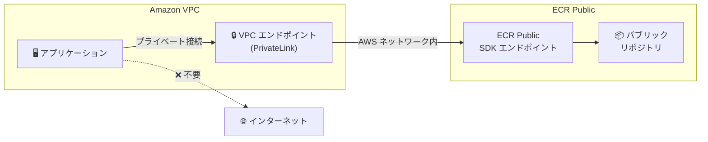

# Amazon ECR Public - PrivateLink サポート（US East SDK エンドポイント）

**リリース日**: 2025 年 12 月 17 日
**サービス**: Amazon Elastic Container Registry (ECR) Public
**機能**: PrivateLink for US East (N. Virginia) SDK Endpoint

## 概要

Amazon ECR Public が、US East (N. Virginia) SDK エンドポイントに対する PrivateLink のサポートを開始しました。これにより、お客様は ECR Public SDK エンドポイントにプライベートネットワーク接続でアクセスでき、パブリックインターネットへの露出を削減できます。

この機能強化により、Amazon VPC から ECR Public SDK エンドポイントへのプライベート接続を確立し、ECR Public リポジトリの作成・管理をセキュアに行えるようになります。

**アップデート前の課題**

- ECR Public SDK エンドポイントへのアクセスにはパブリックインターネット経由が必要だった
- 機密性の高いネットワークトラフィックがパブリックインターネットに露出していた
- 厳格なネットワークセキュリティ要件への対応が困難だった

**アップデート後の改善**

- VPC から ECR Public SDK エンドポイントへのプライベート接続が可能に
- ネットワークプライバシーとセキュリティを維持
- 厳格なネットワークセキュリティ要件に対応
- ECR Public リソースへのアクセスのためのネットワークアーキテクチャを簡素化

## アーキテクチャ図



PrivateLink を使用することで、パブリックインターネットを経由せずに ECR Public SDK エンドポイントにアクセスできます。

## サービスアップデートの詳細

### 主要機能

1. **プライベートネットワーク接続**
   - VPC から ECR Public SDK エンドポイントへの直接接続
   - AWS ネットワーク内でのトラフィック完結
   - パブリックインターネットへの露出を排除

2. **セキュリティ強化**
   - 機密性の高いネットワークトラフィックの保護
   - ネットワークセキュリティポリシーへの準拠
   - データ漏洩リスクの軽減

3. **ネットワークアーキテクチャの簡素化**
   - NAT ゲートウェイやインターネットゲートウェイが不要
   - シンプルなネットワーク構成
   - 運用負荷の軽減

## 技術仕様

### VPC エンドポイントの設定

| 項目 | 詳細 |
|------|------|
| サービス名 | com.amazonaws.us-east-1.ecr.public |
| エンドポイントタイプ | Interface |
| プライベート DNS | サポート |
| リージョン | US East (N. Virginia) |

### セキュリティグループ設定

```json
{
  "SecurityGroupRules": [
    {
      "IpProtocol": "tcp",
      "FromPort": 443,
      "ToPort": 443,
      "Description": "HTTPS for ECR Public SDK endpoint"
    }
  ]
}
```

## 設定方法

### 前提条件

1. AWS アカウントと適切な IAM 権限
2. US East (N. Virginia) リージョンの VPC
3. VPC エンドポイント作成権限

### 手順

#### ステップ 1: VPC エンドポイントの作成

```bash
aws ec2 create-vpc-endpoint \
    --vpc-id vpc-12345678 \
    --service-name com.amazonaws.us-east-1.ecr.public \
    --vpc-endpoint-type Interface \
    --subnet-ids subnet-12345678 subnet-87654321 \
    --security-group-ids sg-12345678 \
    --private-dns-enabled
```

ECR Public SDK エンドポイント用の VPC エンドポイントを作成します。

#### ステップ 2: セキュリティグループの設定

```bash
aws ec2 authorize-security-group-ingress \
    --group-id sg-12345678 \
    --protocol tcp \
    --port 443 \
    --source-group sg-app-servers
```

アプリケーションサーバーからの HTTPS 通信を許可します。

#### ステップ 3: 接続の確認

```bash
# VPC 内のインスタンスから ECR Public API を呼び出し
aws ecr-public describe-registries --region us-east-1
```

プライベート接続経由で ECR Public API にアクセスできることを確認します。

## メリット

### ビジネス面

- **コンプライアンス対応**: 厳格なネットワークセキュリティ要件を満たす
- **リスク軽減**: パブリックインターネットへの露出を削減
- **運用簡素化**: ネットワークアーキテクチャの複雑さを軽減

### 技術面

- **セキュリティ向上**: トラフィックが AWS ネットワーク内に留まる
- **レイテンシー改善**: パブリックインターネットを経由しないため安定した接続
- **コスト最適化**: NAT ゲートウェイのデータ処理料金を削減可能

## デメリット・制約事項

### 制限事項

- 現時点では US East (N. Virginia) リージョンのみ対応
- VPC エンドポイントの追加コストが発生
- プライベートサブネットからのアクセスには DNS 設定が必要

### 考慮すべき点

- 他のリージョンからのアクセスには引き続きパブリックエンドポイントを使用
- VPC エンドポイントポリシーによるアクセス制御の検討

## ユースケース

### ユースケース 1: セキュアな CI/CD パイプライン

**シナリオ**: プライベートサブネット内の CI/CD システムから ECR Public リポジトリを管理したい。

**実装例**:
```yaml
# CodeBuild プロジェクト設定
VpcConfig:
  VpcId: vpc-12345678
  Subnets:
    - subnet-private-1
    - subnet-private-2
  SecurityGroupIds:
    - sg-codebuild
```

**効果**: CI/CD パイプラインがパブリックインターネットを経由せずに ECR Public リポジトリを操作可能。

### ユースケース 2: 金融機関のコンプライアンス対応

**シナリオ**: 金融機関のセキュリティポリシーにより、すべてのトラフィックをプライベートネットワーク内に留める必要がある。

**効果**: ECR Public へのアクセスもプライベート接続で行い、コンプライアンス要件を満たす。

## 料金

VPC エンドポイントの料金が適用されます。

- エンドポイント時間料金: $0.01/時間/AZ
- データ処理料金: $0.01/GB

詳細は [AWS PrivateLink 料金ページ](https://aws.amazon.com/privatelink/pricing/) を参照してください。

## 利用可能リージョン

現時点では US East (N. Virginia) リージョンのみで利用可能です。

## 関連サービス・機能

- **Amazon ECR**: プライベートコンテナレジストリ
- **AWS PrivateLink**: プライベート接続サービス
- **Amazon VPC**: 仮想プライベートクラウド

## 参考リンク

- [公式発表 (What's New)](https://aws.amazon.com/about-aws/whats-new/2025/12/amazon-ecr-public-privatelink-us-east-n-virginia-sdk-endpoint/)
- [ECR VPC エンドポイント ドキュメント](https://docs.aws.amazon.com/AmazonECR/latest/userguide/vpc-endpoints.html)

## まとめ

Amazon ECR Public の PrivateLink サポートにより、US East (N. Virginia) リージョンで ECR Public SDK エンドポイントへのプライベート接続が可能になりました。セキュリティ要件の厳しい環境でも、パブリックインターネットを経由せずに ECR Public リポジトリを管理できます。他のリージョンへの拡張が期待されます。
