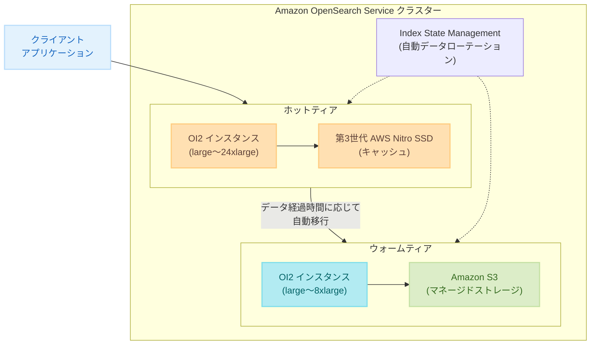

# Amazon OpenSearch Service - OI2 インスタンスとマルチティアストレージ

**リリース日**: 2025年12月17日
**サービス**: Amazon OpenSearch Service
**機能**: OI2 インスタンス、マルチティアストレージ

## 概要

Amazon OpenSearch Service は、新しい OI2 (OpenSearch Optimized Instance 2) インスタンスファミリーと、書き込み可能なウォームティアを含むマルチティアストレージアーキテクチャを発表しました。OI2 インスタンスは OR2 インスタンスと比較して最大 9% 高いインデックススループットを提供し、I8g インスタンスと比較すると最大 33% の向上を実現します。

新しいマルチティアストレージは、Amazon S3 クラウドテクノロジーとローカルインスタンスストレージを組み合わせ、耐久性とパフォーマンスを向上させます。ホットティアとウォームティアの 2 層構成で、頻繁にアクセスされるデータはホットティアで処理し、アクセス頻度の低いデータは Amazon S3 を活用したウォームティアでコスト効率よく保存できます。

**アップデート前の課題**

- UltraWarm によるウォームティアは読み取り専用データのみをサポートしており、書き込み操作ができなかった
- インデックス負荷の高いワークロードでは、既存のインスタンスタイプでは十分なスループットが得られない場合があった
- データのライフサイクル管理において、ホットからウォームへの移行時に柔軟性が制限されていた

**アップデート後の改善**

- 新しいウォームティアで書き込み操作がサポートされ、データ管理の柔軟性が大幅に向上
- OI2 インスタンスにより、インデックス負荷の高いワークロードで最大 33% のスループット向上を実現
- Index State Management 機能を使用して、データの経過時間に応じたホットからウォームへの自動ローテーションが可能

## アーキテクチャ図



OI2 インスタンスは、ホットティアとウォームティアの両方で使用でき、Amazon S3 ベースのマネージドストレージと第 3 世代 AWS Nitro SSD キャッシュを組み合わせた高性能アーキテクチャを提供します。

## サービスアップデートの詳細

### 主要機能

1. **OI2 インスタンスファミリー**
   - OR2 インスタンスと同じアーキテクチャを採用し、Amazon S3 を活用した高耐久性を実現
   - 第 3 世代 AWS Nitro SSD によるキャッシング機能
   - インスタンスサイズは large から 24xlarge まで対応
   - 最大 22.5 TB のストレージ容量

2. **書き込み可能なウォームティア**
   - 従来の UltraWarm (読み取り専用) と異なり、書き込み操作をサポート
   - ウォームティアでは OI2 インスタンス (large〜8xlarge) を使用
   - ローカルキャッシュサイズの最大 5 倍のアドレス可能なウォームストレージ

3. **Index State Management 統合**
   - データの経過時間に基づいた自動ローテーション
   - ホットティアからウォームティアへのシームレスな移行
   - カスタマイズ可能なライフサイクルポリシー

## 技術仕様

### OI2 インスタンスサイズ

| インスタンスサイズ | 用途 |
|------------------|------|
| large〜24xlarge | ホットティア (全サイズ対応) |
| large〜8xlarge | ウォームティア |

### パフォーマンス比較

| 比較対象 | インデックススループット向上 |
|---------|---------------------------|
| OR2 インスタンス | 最大 9% 向上 |
| I8g インスタンス | 最大 33% 向上 |

### 要件

- OpenSearch バージョン 3.3 以上が必要
- マネージドストレージ料金はウォームデータに適用

## 設定方法

### 前提条件

1. Amazon OpenSearch Service ドメインが OpenSearch 3.3 以上で稼働していること
2. 適切な IAM 権限を持つ AWS アカウント
3. VPC 設定 (推奨)

### 手順

#### ステップ 1: OI2 インスタンスを使用したドメインの作成

AWS マネジメントコンソールまたは AWS CLI を使用して、OI2 インスタンスタイプを選択した新しいドメインを作成します。

```bash
aws opensearch create-domain \
  --domain-name my-opensearch-domain \
  --engine-version OpenSearch_3.3 \
  --cluster-config InstanceType=oi2.large.search,InstanceCount=2 \
  --ebs-options EBSEnabled=false
```

OI2 インスタンスはマネージドストレージを使用するため、EBS は無効に設定します。

#### ステップ 2: Index State Management ポリシーの設定

データのライフサイクル管理のため、ISM ポリシーを作成してホットからウォームへの自動移行を設定します。

```json
{
  "policy": {
    "description": "Hot to warm tier migration policy",
    "default_state": "hot",
    "states": [
      {
        "name": "hot",
        "actions": [],
        "transitions": [
          {
            "state_name": "warm",
            "conditions": {
              "min_index_age": "7d"
            }
          }
        ]
      },
      {
        "name": "warm",
        "actions": [
          {
            "warm_migration": {}
          }
        ],
        "transitions": []
      }
    ]
  }
}
```

このポリシーは、インデックスが 7 日経過した後に自動的にウォームティアに移行します。

## メリット

### ビジネス面

- **コスト最適化**: アクセス頻度に応じたデータ配置により、ストレージコストを最適化
- **運用効率向上**: 自動データローテーションにより、手動でのデータ管理作業を削減
- **スケーラビリティ**: 大規模なログ分析や時系列データの長期保存に対応

### 技術面

- **高スループット**: インデックス負荷の高いワークロードで最大 33% のパフォーマンス向上
- **書き込み可能なウォームティア**: データ修正や追記が必要なユースケースに対応
- **高耐久性**: Amazon S3 ベースのストレージによる 99.999999999% (11 9's) の耐久性

## デメリット・制約事項

### 制限事項

- OpenSearch 3.3 以上が必要
- ウォームティアは OI2 インスタンスの large〜8xlarge サイズのみ対応
- 一部のリージョンでは利用不可

### 考慮すべき点

- 既存の UltraWarm からの移行には計画が必要
- マネージドストレージの料金体系を理解した上でのコスト見積もりが重要

## ユースケース

### ユースケース 1: ログ分析基盤

**シナリオ**: 大量のアプリケーションログを収集・分析し、直近のデータは高速検索、過去データは低コストで保持したい

**実装例**:
- ホットティア: 直近 7 日間のログを OI2.xlarge で高速インデックス
- ウォームティア: 7 日以上経過したログを OI2.large で低コスト保存
- ISM ポリシーで自動移行を設定

**効果**: ストレージコストを最大 50% 削減しながら、直近データの検索パフォーマンスを維持

### ユースケース 2: IoT センサーデータ分析

**シナリオ**: IoT デバイスからの時系列データを継続的に取り込み、リアルタイム分析と履歴分析の両方を実行

**実装例**:
- OI2 インスタンスの高インデックススループットを活用して大量データを取り込み
- 書き込み可能なウォームティアで過去データの補正や追記に対応

**効果**: 従来比 33% 高いインデックススループットにより、より多くのデバイスからのデータ取り込みが可能

### ユースケース 3: セキュリティ情報イベント管理 (SIEM)

**シナリオ**: セキュリティログを長期保存しながら、コンプライアンス要件を満たす必要がある

**実装例**:
- ホットティアで直近のセキュリティイベントを高速検索
- ウォームティアで規制要件に基づく長期保存 (1 年以上)
- 書き込み可能なウォームティアでインシデント調査時のアノテーション追加

**効果**: コンプライアンス要件を満たしながら、ストレージコストを最適化

## 料金

OI2 インスタンスは従量課金制とリザーブドインスタンスの両方に対応しています。料金には以下が含まれます:

- インスタンス時間料金 (NVMe ストレージ含む)
- マネージドストレージ料金 (プロビジョニング分)

### 料金例

| 構成 | 月額料金（概算） |
|------|------------------|
| OI2.large × 2 (ホット) + 1TB マネージドストレージ | 約 $500〜700 USD |
| OI2.xlarge × 2 (ホット) + OI2.large × 2 (ウォーム) + 5TB | 約 $1,500〜2,000 USD |

※ 実際の料金はリージョンや使用状況により異なります。詳細は [Amazon OpenSearch Service 料金ページ](https://aws.amazon.com/opensearch-service/pricing/) を参照してください。

## 利用可能リージョン

OI2 インスタンスファミリーとマルチティアストレージは、以下の 12 リージョンで利用可能です:

- 米国東部 (バージニア北部、オハイオ)
- 米国西部 (オレゴン)
- カナダ (中部)
- アジアパシフィック (ムンバイ、シンガポール、シドニー、東京)
- 欧州 (フランクフルト、アイルランド、ロンドン、スペイン)

## 関連サービス・機能

- **Amazon S3**: マネージドストレージのバックエンドとして使用
- **AWS Nitro System**: 第 3 世代 Nitro SSD によるキャッシング
- **Index State Management**: データライフサイクル管理の自動化
- **Amazon CloudWatch**: OpenSearch クラスターのモニタリング

## 参考リンク

- [公式発表 - OI2 インスタンス (What's New)](https://aws.amazon.com/about-aws/whats-new/2025/12/amazon-opensearch-service-oi2-instances/)
- [公式発表 - マルチティアストレージ (What's New)](https://aws.amazon.com/about-aws/whats-new/2025/12/writeable-warm-tier-opensearch-optimized-instances/)
- [ドキュメント - OpenSearch Optimized Instances](https://docs.aws.amazon.com/opensearch-service/latest/developerguide/or1.html)
- [料金ページ](https://aws.amazon.com/opensearch-service/pricing/)

## まとめ

Amazon OpenSearch Service の OI2 インスタンスとマルチティアストレージは、インデックス負荷の高いワークロードのパフォーマンス向上と、データライフサイクル管理の柔軟性を大幅に改善します。特に、書き込み可能なウォームティアの導入により、従来の読み取り専用制限が解消され、より多様なユースケースに対応できるようになりました。ログ分析、IoT データ処理、SIEM などの大規模データワークロードを運用している場合は、OI2 インスタンスへの移行を検討することをお勧めします。
