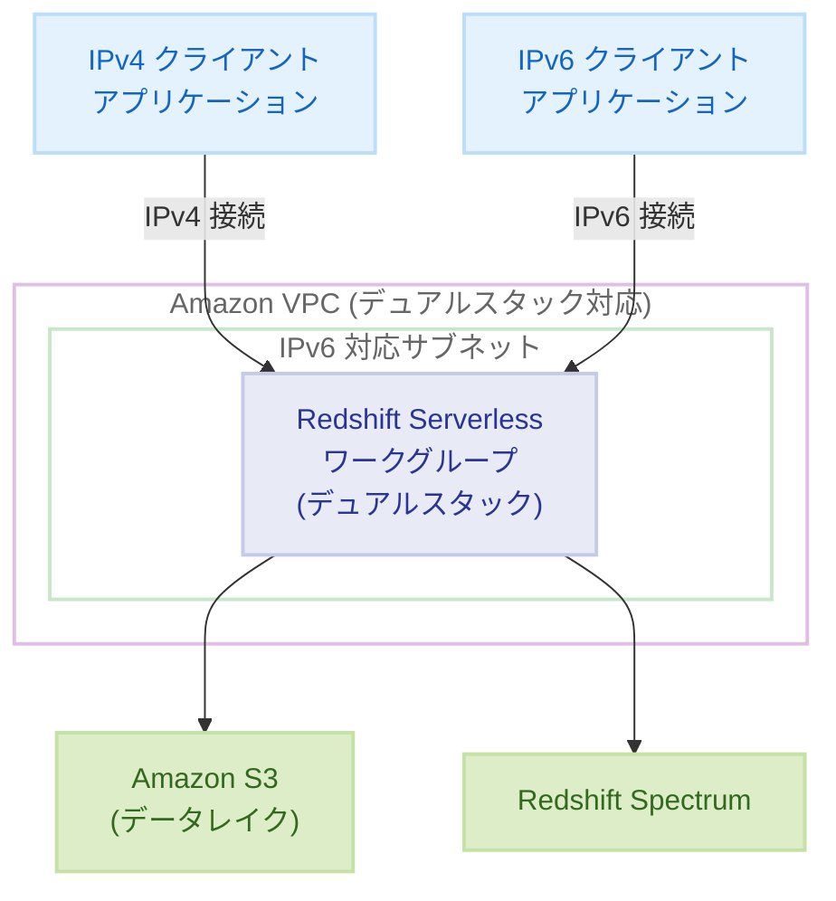

# Amazon Redshift Serverless - デュアルスタックモード (IPv6) の一般提供開始

**リリース日**: 2025年12月17日
**サービス**: Amazon Redshift Serverless
**機能**: デュアルスタックモード (IPv4/IPv6)

## 概要

Amazon Redshift Serverless は、Internet Protocol version 6 (IPv6) をサポートするデュアルスタックモードの一般提供を開始しました。この機能強化により、ネットワークインフラストラクチャの近代化と、増大するインターネット接続需要への対応が可能になります。

Redshift Serverless ワークグループを IPv4 と IPv6 の両方のアドレス (デュアルスタック) または IPv4 のみの構成で設定できるようになりました。新しいワークグループの作成時に IPv6 サポートを有効にするか、既存のワークグループを変更して IPv6 アドレッシングをサポートできます。

**アップデート前の課題**

- Redshift Serverless は IPv4 のみをサポートしており、IPv6 ネイティブ環境との接続に制限があった
- IPv6 対応が必要な組織では、追加のネットワーク変換レイヤーが必要だった
- 将来的な IPv4 アドレス枯渇に対する準備ができていなかった

**アップデート後の改善**

- IPv4 と IPv6 の両方のプロトコルでアプリケーションから Redshift ウェアハウスに接続可能
- IPv6 対応 VPC サブネットに Redshift ウェアハウスをデプロイ可能
- 既存および将来のネットワークアーキテクチャとの互換性を確保

## アーキテクチャ図



デュアルスタックモードにより、IPv4 と IPv6 の両方のクライアントから同一の Redshift Serverless ワークグループに接続できます。

## サービスアップデートの詳細

### 主要機能

1. **デュアルスタック構成**
   - 単一のワークグループで IPv4 と IPv6 の両方のアドレスをサポート
   - アプリケーションは任意のプロトコルで接続可能
   - 既存の IPv4 接続との完全な後方互換性

2. **柔軟な構成オプション**
   - 新規ワークグループ作成時に IPv6 サポートを有効化
   - 既存ワークグループの変更による IPv6 対応追加
   - IPv4 のみの構成も引き続きサポート

3. **VPC 統合**
   - IPv6 対応 VPC サブネットへのデプロイ
   - 拡張されたアドレス空間要件への対応
   - ネットワーク設定の柔軟な構成

## 技術仕様

### サポートされる構成

| 構成タイプ | 説明 |
|-----------|------|
| デュアルスタック | IPv4 と IPv6 の両方のアドレスを持つ |
| IPv4 のみ | 従来の IPv4 アドレスのみ |

### 要件

| 項目 | 詳細 |
|------|------|
| VPC 要件 | IPv6 CIDR ブロックが関連付けられた VPC |
| サブネット要件 | IPv6 CIDR ブロックが割り当てられたサブネット |
| セキュリティグループ | IPv6 トラフィックを許可するルールの追加が必要 |

## 設定方法

### 前提条件

1. IPv6 CIDR ブロックが関連付けられた VPC
2. IPv6 対応サブネット
3. 適切な IAM 権限

### 手順

#### ステップ 1: VPC の IPv6 対応確認

VPC に IPv6 CIDR ブロックが関連付けられていることを確認します。

```bash
aws ec2 describe-vpcs --vpc-ids vpc-xxxxxxxx \
  --query 'Vpcs[0].Ipv6CidrBlockAssociationSet'
```

IPv6 CIDR ブロックが関連付けられていない場合は、追加します。

```bash
aws ec2 associate-vpc-cidr-block \
  --vpc-id vpc-xxxxxxxx \
  --amazon-provided-ipv6-cidr-block
```

#### ステップ 2: サブネットへの IPv6 CIDR 割り当て

Redshift Serverless で使用するサブネットに IPv6 CIDR を割り当てます。

```bash
aws ec2 associate-subnet-cidr-block \
  --subnet-id subnet-xxxxxxxx \
  --ipv6-cidr-block 2600:1f18:xxxx:xxxx::/64
```

#### ステップ 3: セキュリティグループの更新

IPv6 トラフィックを許可するインバウンドルールを追加します。

```bash
aws ec2 authorize-security-group-ingress \
  --group-id sg-xxxxxxxx \
  --ip-permissions IpProtocol=tcp,FromPort=5439,ToPort=5439,Ipv6Ranges='[{CidrIpv6=::/0,Description="Redshift IPv6 access"}]'
```

Redshift のデフォルトポート 5439 への IPv6 アクセスを許可します。

#### ステップ 4: Redshift Serverless ワークグループの作成/更新

新規ワークグループを作成する場合:

```bash
aws redshift-serverless create-workgroup \
  --workgroup-name my-workgroup \
  --namespace-name my-namespace \
  --subnet-ids subnet-xxxxxxxx subnet-yyyyyyyy \
  --security-group-ids sg-xxxxxxxx \
  --ip-address-type dualstack
```

既存ワークグループを更新する場合:

```bash
aws redshift-serverless update-workgroup \
  --workgroup-name my-workgroup \
  --ip-address-type dualstack
```

## メリット

### ビジネス面

- **将来対応**: IPv4 アドレス枯渇に備えたインフラストラクチャの近代化
- **コンプライアンス**: IPv6 対応が必要な規制要件への対応
- **グローバル展開**: IPv6 ネイティブ環境を持つ地域へのサービス展開が容易

### 技術面

- **アドレス空間の拡張**: 事実上無制限のアドレス空間を活用可能
- **ネットワーク簡素化**: NAT 変換なしでの直接接続が可能
- **後方互換性**: 既存の IPv4 接続を維持しながら IPv6 を追加

## デメリット・制約事項

### 制限事項

- IPv6 対応には VPC とサブネットの事前設定が必要
- 一部の古いクライアントアプリケーションは IPv6 をサポートしていない可能性がある
- セキュリティグループの更新が必要

### 考慮すべき点

- IPv6 トラフィックに対するセキュリティポリシーの見直しが必要
- DNS 解決の設定確認 (AAAA レコードの解決)
- ファイアウォールルールの IPv6 対応確認

## ユースケース

### ユースケース 1: IPv6 ネイティブ環境からのデータ分析

**シナリオ**: IPv6 のみをサポートするモバイルネットワークや IoT デバイスからのデータを分析

**実装例**:
- デュアルスタックモードでワークグループを構成
- IPv6 クライアントから直接 Redshift に接続
- NAT64/DNS64 なしでのシンプルな接続

**効果**: ネットワーク変換レイヤーの削減によるレイテンシ改善とコスト削減

### ユースケース 2: マルチクラウド/ハイブリッド環境

**シナリオ**: オンプレミスの IPv6 ネットワークと AWS 間でのデータウェアハウス接続

**実装例**:
- Direct Connect または VPN で IPv6 接続を確立
- デュアルスタックモードの Redshift Serverless にアクセス
- 既存の IPv4 アプリケーションとの互換性を維持

**効果**: 統一されたネットワークアーキテクチャによる運用簡素化

### ユースケース 3: 政府・公共機関向けシステム

**シナリオ**: IPv6 対応が義務付けられている政府機関向けのデータ分析基盤

**実装例**:
- IPv6 対応要件を満たすデュアルスタック構成
- セキュリティグループで IPv6 アクセス制御
- 監査ログで IPv6 接続を追跡

**効果**: 規制要件への準拠と将来的なネットワーク移行への対応

## 料金

デュアルスタックモードの使用に追加料金はかかりません。標準の Redshift Serverless 料金が適用されます:

- RPU (Redshift Processing Unit) 時間料金
- ストレージ料金
- データ転送料金

### 料金例

| 使用量 | 月額料金（概算） |
|--------|------------------|
| 8 RPU × 100 時間/月 + 100GB ストレージ | 約 $300〜400 USD |
| 32 RPU × 200 時間/月 + 1TB ストレージ | 約 $2,000〜2,500 USD |

※ 実際の料金はリージョンや使用状況により異なります。

## 利用可能リージョン

デュアルスタックモードは、Redshift Serverless が利用可能なすべての AWS 商用リージョンで利用できます。

## 関連サービス・機能

- **Amazon VPC**: IPv6 対応 VPC とサブネットの構成
- **AWS Direct Connect**: IPv6 対応のプライベート接続
- **Amazon Route 53**: IPv6 DNS 解決 (AAAA レコード)
- **Elastic Load Balancing**: IPv6 対応ロードバランサー

## 参考リンク

- [公式発表 (What's New)](https://aws.amazon.com/about-aws/whats-new/2025/12/amazon-redshift-serverless-announces-dual-stack-mode-ipv6/)
- [AWS Blog - IPv6 addressing with Amazon Redshift](https://aws.amazon.com/blogs/big-data/ipv6-addressing-with-amazon-redshift/)
- [ドキュメント - Working with Redshift Serverless](https://docs.aws.amazon.com/redshift/latest/mgmt/working-with-serverless.html)
- [料金ページ](https://aws.amazon.com/redshift/pricing/)

## まとめ

Amazon Redshift Serverless のデュアルスタックモードは、IPv6 対応が必要な組織にとって重要なアップデートです。既存の IPv4 接続を維持しながら IPv6 サポートを追加できるため、段階的なネットワーク移行が可能です。IPv6 ネイティブ環境からのデータ分析や、規制要件への対応が必要な場合は、デュアルスタックモードの有効化を検討してください。
