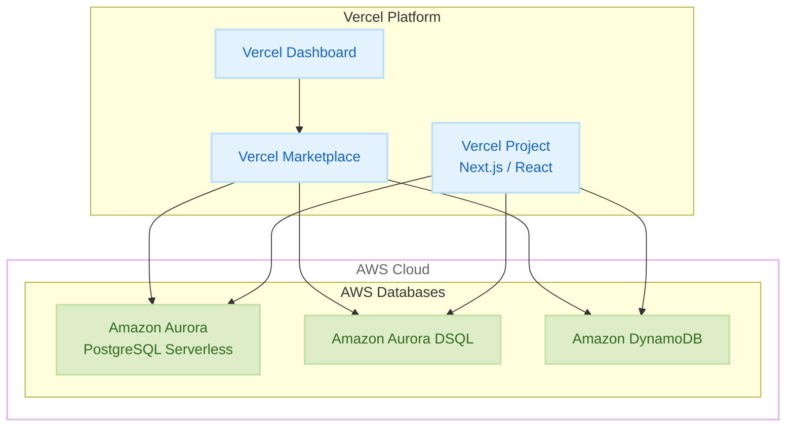

# AWS Databases - Vercel Marketplace での提供開始

**リリース日**: 2025 年 12 月 17 日
**サービス**: Amazon Aurora PostgreSQL, Amazon Aurora DSQL, Amazon DynamoDB
**機能**: Vercel Marketplace での AWS データベース統合

## 概要

AWS データベース (Amazon Aurora PostgreSQL、Amazon Aurora DSQL、Amazon DynamoDB) が Vercel Marketplace で一般提供開始されました。この統合により、Vercel から直接 AWS データベースを数秒で作成・接続できるようになります。

Vercel は、フロントエンド開発者向けのプラットフォームとして広く利用されており、Next.js などのフレームワークとの統合で知られています。今回の統合により、Vercel ユーザーは AWS の本番環境レベルのデータベースを簡単に利用できるようになりました。

**アップデート前の課題**

- Vercel プロジェクトで AWS データベースを使用するには、別途 AWS アカウントの設定が必要だった
- データベース接続の設定に時間がかかっていた
- 開発者は複数のコンソールを行き来する必要があった

**アップデート後の改善**

- Vercel から直接 AWS データベースを作成・接続可能
- 新規 AWS アカウント作成時に $100 USD のクレジットを提供
- サーバーレスオプションにより、使用していない時はゼロにスケールダウン
- 東京リージョンを含む 7 リージョンで利用可能

## アーキテクチャ図



Vercel Marketplace から AWS データベースを直接プロビジョニングし、Vercel プロジェクトに接続できます。

## サービスアップデートの詳細

### 主要機能

1. **ワンクリックデータベース作成**
   - Vercel Dashboard から直接 AWS データベースを作成
   - 数秒で本番環境レベルのデータベースをプロビジョニング
   - 接続情報の自動設定

2. **サーバーレスオプション**
   - Amazon Aurora PostgreSQL Serverless
   - Amazon Aurora DSQL
   - Amazon DynamoDB
   - 使用していない時はゼロにスケールダウンしてコストを削減

3. **新規アカウント向けクレジット**
   - Vercel から新規 AWS アカウントを作成すると $100 USD のクレジットを提供
   - 最大 6 ヶ月間、3 つのデータベースオプションで使用可能

4. **統合管理**
   - Vercel Dashboard から AWS 設定ポータルにアクセス
   - プラン管理、支払い情報、使用状況の確認が可能

## 技術仕様

### 対応データベース

| データベース | 説明 | ユースケース |
|-------------|------|-------------|
| Amazon Aurora PostgreSQL | PostgreSQL 互換のリレーショナルデータベース | トランザクション処理、複雑なクエリ |
| Amazon Aurora DSQL | 分散 SQL データベース | グローバル分散アプリケーション |
| Amazon DynamoDB | フルマネージド NoSQL データベース | 高スループット、低レイテンシー |

### 利用可能リージョン

| リージョン | コード |
|-----------|--------|
| US East (N. Virginia) | us-east-1 |
| US East (Ohio) | us-east-2 |
| US West (Oregon) | us-west-2 |
| Europe (Ireland) | eu-west-1 |
| Europe (Frankfurt) | eu-central-1 |
| Asia Pacific (Tokyo) | ap-northeast-1 ✅ |
| Asia Pacific (Mumbai) | ap-south-1 |

## 設定方法

### 前提条件

1. Vercel アカウント
2. Vercel プロジェクト

### 手順

#### ステップ 1: Vercel Marketplace にアクセス

1. Vercel Dashboard にログイン
2. 「Marketplace」または「Integrations」を選択
3. AWS を検索して選択

#### ステップ 2: AWS アカウントの作成または接続

**新規 AWS アカウントの場合:**
1. 「Create AWS Account」を選択
2. 必要な情報を入力
3. $100 USD のクレジットが自動的に適用される

**既存 AWS アカウントの場合:**
1. 「Connect existing account」を選択
2. AWS 認証情報を入力

#### ステップ 3: データベースの作成

```javascript
// Vercel プロジェクトでの接続例 (Next.js)
import { Pool } from 'pg';

const pool = new Pool({
  connectionString: process.env.DATABASE_URL,
});

export async function getUsers() {
  const { rows } = await pool.query('SELECT * FROM users');
  return rows;
}
```

Vercel の環境変数に自動的に接続情報が設定されます。

#### ステップ 4: 環境変数の確認

Vercel Dashboard の「Settings」→「Environment Variables」で、データベース接続情報が設定されていることを確認します。

## メリット

### ビジネス面

- **開発速度の向上**: 数秒でデータベースをプロビジョニングし、開発を開始
- **コスト最適化**: サーバーレスオプションにより、使用量に応じた課金
- **初期コストの削減**: 新規アカウントに $100 USD のクレジットを提供

### 技術面

- **シームレスな統合**: Vercel プロジェクトとの自動接続
- **本番環境レベルの信頼性**: AWS のマネージドデータベースサービスを利用
- **スケーラビリティ**: サーバーレスオプションによる自動スケーリング

## デメリット・制約事項

### 制限事項

- 利用可能なリージョンが 7 リージョンに限定（今後拡大予定）
- Vercel Marketplace 経由での作成に限定される機能がある可能性
- クレジットは 6 ヶ月間の有効期限あり

### 考慮すべき点

- 大規模な本番環境では、直接 AWS コンソールからの管理が必要になる場合がある
- データベースの詳細な設定は AWS コンソールで行う必要がある

## ユースケース

### ユースケース 1: Next.js アプリケーションのバックエンド

**シナリオ**: Next.js で構築した Web アプリケーションに PostgreSQL データベースを追加

**実装例**:
```javascript
// app/api/users/route.js
import { Pool } from 'pg';

const pool = new Pool({
  connectionString: process.env.DATABASE_URL,
});

export async function GET() {
  const { rows } = await pool.query('SELECT * FROM users');
  return Response.json(rows);
}

export async function POST(request) {
  const { name, email } = await request.json();
  const { rows } = await pool.query(
    'INSERT INTO users (name, email) VALUES ($1, $2) RETURNING *',
    [name, email]
  );
  return Response.json(rows[0]);
}
```

**効果**: 数分で本番環境レベルのデータベースを持つ API を構築

### ユースケース 2: リアルタイムアプリケーション

**シナリオ**: DynamoDB を使用した高スループットのリアルタイムアプリケーション

**実装例**:
```javascript
// lib/dynamodb.js
import { DynamoDBClient } from '@aws-sdk/client-dynamodb';
import { DynamoDBDocumentClient, PutCommand, GetCommand } from '@aws-sdk/lib-dynamodb';

const client = new DynamoDBClient({
  region: process.env.AWS_REGION,
});

const docClient = DynamoDBDocumentClient.from(client);

export async function saveSession(sessionId, data) {
  await docClient.send(new PutCommand({
    TableName: 'sessions',
    Item: { sessionId, ...data, ttl: Date.now() + 3600000 },
  }));
}
```

**効果**: 低レイテンシーのセッション管理を実現

### ユースケース 3: プロトタイピング

**シナリオ**: 新しいアイデアを素早くプロトタイプ化

**実装例**:
1. Vercel Marketplace から Aurora PostgreSQL を作成
2. Prisma などの ORM を使用してスキーマを定義
3. 数時間で動作するプロトタイプを構築

**効果**: $100 USD のクレジットを活用して、コストをかけずにプロトタイプを検証

## 料金

### 新規アカウント向けクレジット

- $100 USD のクレジット（6 ヶ月間有効）
- 3 つのデータベースオプションで使用可能

### 通常料金

各データベースサービスの標準料金が適用されます。

| サービス | 料金体系 |
|---------|---------|
| Amazon Aurora PostgreSQL Serverless | ACU 時間あたりの料金 + ストレージ |
| Amazon Aurora DSQL | リクエスト数 + ストレージ |
| Amazon DynamoDB | 読み取り/書き込みキャパシティ + ストレージ |

## 利用可能リージョン

東京リージョン (ap-northeast-1) を含む 7 リージョンで利用可能です。今後、追加リージョンが予定されています。

## 関連サービス・機能

- **Amazon Aurora PostgreSQL**: PostgreSQL 互換のリレーショナルデータベース
- **Amazon Aurora DSQL**: 分散 SQL データベース
- **Amazon DynamoDB**: フルマネージド NoSQL データベース
- **Vercel**: フロントエンド開発プラットフォーム

## 参考リンク

- [公式発表 (What's New)](https://aws.amazon.com/about-aws/whats-new/2025/12/aws-databases-are-available-on-the-vercel/)
- [Vercel Marketplace - AWS](https://vercel.com/marketplace/aws)
- [Amazon Aurora](https://aws.amazon.com/rds/aurora/)
- [Amazon Aurora DSQL](https://aws.amazon.com/rds/aurora/dsql/)
- [Amazon DynamoDB](https://aws.amazon.com/dynamodb/)
- [AWS Databases](https://aws.amazon.com/products/databases/)

## まとめ

AWS データベースの Vercel Marketplace での提供開始により、フロントエンド開発者は数秒で本番環境レベルのデータベースを Vercel プロジェクトに統合できるようになりました。サーバーレスオプションによるコスト最適化と、新規アカウント向けの $100 USD クレジットにより、プロトタイピングから本番環境まで幅広いユースケースに対応できます。東京リージョンでも利用可能なため、日本のユーザーも低レイテンシーで利用できます。
