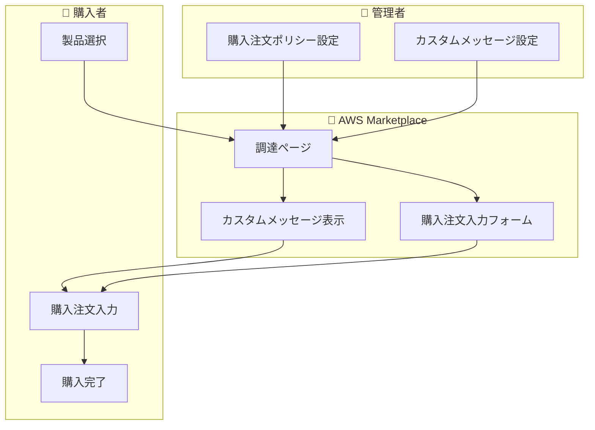

# AWS Marketplace - 必須購入注文とカスタムメッセージングのサポート

**リリース日**: 2025 年 12 月 17 日
**サービス**: AWS Marketplace
**機能**: 必須購入注文要件とカスタムメッセージング

## 概要

AWS Marketplace が購入時の必須購入注文要件とカスタムメッセージングをサポートしました。これにより、組織は調達ガバナンスを強化できます。この機能は、調達、ソフトウェア資産管理、クラウドガバナンスチームがコンプライアンスポリシーを適用しながら、購入の俊敏性を維持するのに役立ちます。

管理者は、AWS Marketplace を通じて製品をサブスクライブする際に、購入者に購入注文の提供を必須とするポリシーを適用できるようになりました。また、調達ページにカスタムメッセージを追加して、ポリシー要件やサポート連絡先に関するガイダンスを提供できます。

**アップデート前の課題**

- 購入注文なしでの製品購入が可能だった
- 調達ポリシーの適用が困難だった
- 購入者へのガイダンス提供手段が限られていた
- コスト配分の正確性に課題があった

**アップデート後の改善**

- 購入注文の必須化が可能
- カスタムメッセージで購入者にガイダンスを提供
- 調達ポリシーのコンプライアンスを購入時に適用
- 調達から支払いまでのサイクルを効率化

## アーキテクチャ図

管理者が設定したポリシーとメッセージが調達ページに表示され、購入者はガイダンスに従って購入を完了します。

## サービスアップデートの詳細

### 主要機能

1. **必須購入注文要件**
   - 製品サブスクリプション時に購入注文の提供を必須化
   - プライベートオファーとパブリックオファーの両方に適用可能
   - 様々な料金タイプに対応

2. **カスタムメッセージング**
   - 調達ページにカスタムメッセージを追加
   - ポリシー要件の説明
   - サポート連絡先の提供

3. **Private Marketplace との統合**
   - 承認済み製品のキュレーションカタログと併用可能
   - 組織内の特定ユーザーやグループ向けの制御

## 技術仕様

### 設定オプション

| 機能 | 説明 |
|------|------|
| 購入注文必須化 | 購入時に購入注文番号の入力を必須に |
| カスタムメッセージ | 調達ページに表示するガイダンステキスト |
| 組み合わせ | 両機能を組み合わせて使用可能 |

### 適用範囲

| 対象 | サポート |
|------|----------|
| パブリックオファー | ✅ |
| プライベートオファー | ✅ |
| 各種料金タイプ | ✅ |
| Private Marketplace | ✅ |

## 設定方法

### 前提条件

1. AWS Organizations の管理アカウントへのアクセス
2. AWS Marketplace の管理権限
3. 調達ポリシーの定義

### 手順

#### ステップ 1: 組織の調達設定にアクセス

AWS Marketplace コンソールから組織の調達設定にアクセスします。

#### ステップ 2: 購入注文要件の設定

購入注文を必須とするポリシーを有効化します。適用する製品タイプやオファータイプを選択します。

#### ステップ 3: カスタムメッセージの設定

調達ページに表示するカスタムメッセージを入力します。ポリシー要件の説明やサポート連絡先を含めることができます。

## メリット

### ビジネス面

- **コンプライアンス強化**: 購入時に調達ポリシーを適用
- **コスト配分の改善**: 購入注文による正確なコスト追跡
- **調達プロセスの効率化**: 調達から支払いまでのサイクルを短縮

### 技術面

- **柔軟な設定**: 購入注文のみ、メッセージのみ、または両方を設定可能
- **既存機能との統合**: Private Marketplace と併用可能
- **組織全体への適用**: AWS Organizations を通じた一元管理

## デメリット・制約事項

### 制限事項

- 設定は組織レベルで適用
- 既存のサブスクリプションには遡及適用されない

### 考慮すべき点

- 購入注文の必須化により、緊急の購入に時間がかかる可能性
- カスタムメッセージの内容を定期的に更新する必要がある

## ユースケース

### ユースケース 1: 企業の調達ポリシー適用

**シナリオ**: 大企業で、すべてのソフトウェア購入に購入注文が必要というポリシーがある

**効果**: AWS Marketplace での購入時に購入注文を必須化し、ポリシーコンプライアンスを自動的に適用

### ユースケース 2: 部門別コスト配分

**シナリオ**: 複数の部門が AWS Marketplace を使用しており、部門ごとのコストを正確に追跡したい

**効果**: 購入注文に部門コードを含めることで、正確なコスト配分を実現

### ユースケース 3: 購入者へのガイダンス提供

**シナリオ**: 新しい調達ポリシーを導入し、購入者に周知したい

**効果**: カスタムメッセージでポリシーの説明とサポート連絡先を提供し、スムーズな移行を支援

## 料金

この機能自体に追加料金はありません。通常の AWS Marketplace の料金が適用されます。

## 利用可能リージョン

AWS Marketplace がサポートされているすべての AWS リージョンで利用可能です。

## 関連サービス・機能

- **AWS Private Marketplace**: 承認済み製品のキュレーションカタログ
- **AWS Organizations**: 組織全体の管理
- **AWS Cost Explorer**: コスト分析と最適化

## 参考リンク

- [公式発表 (What's New)](https://aws.amazon.com/about-aws/whats-new/2025/12/aws-marketplace-mandatory-purchase-orders-custom-messaging/)
- [AWS Marketplace Buyer Guide - 組織の調達設定](https://docs.aws.amazon.com/marketplace/latest/buyerguide/organizational-procurement-settings.html)

## まとめ

AWS Marketplace の必須購入注文要件とカスタムメッセージング機能により、組織は調達ガバナンスを強化できるようになりました。調達ポリシーのコンプライアンスを購入時に適用し、コスト配分の正確性を向上させたい組織にとって、この機能は有用です。
