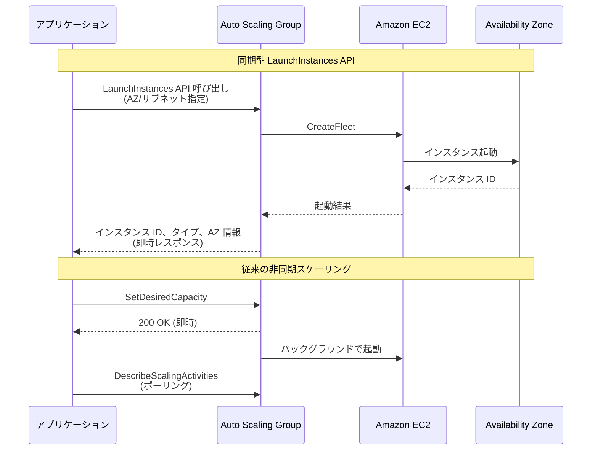

# EC2 Auto Scaling - 同期型 LaunchInstances API

**リリース日**: 2025 年 12 月 17 日
**サービス**: Amazon EC2 Auto Scaling
**機能**: LaunchInstances API (同期型インスタンス起動)

## 概要

EC2 Auto Scaling に新しい LaunchInstances API が追加されました。この API により、Auto Scaling グループ内でインスタンスをプロビジョニングする際に、より詳細な制御と即時のフィードバックが可能になります。

従来の非同期スケーリングでは、スケーリングリクエストがバックグラウンドで処理され、インスタンスの起動完了を確認するにはスケーリングアクティビティを監視する必要がありました。新しい LaunchInstances API は同期的に動作し、キャパシティの可用性に関する即時フィードバックを提供します。

**アップデート前の課題**

- スケーリングリクエストは非同期で処理され、即時のフィードバックが得られなかった
- 特定の Availability Zone にインスタンスを起動する際の制御が限定的だった
- キャパシティ不足時の代替戦略を迅速に実装することが困難だった
- インスタンス ID を即座に取得してオーケストレーションシステムで使用することができなかった

**アップデート後の改善**

- 同期的な API 呼び出しにより、キャパシティ可用性の即時フィードバックを取得
- 特定の Availability Zone やサブネットを指定してインスタンスを起動可能
- 起動成功時にインスタンス ID を即座に取得し、オーケストレーションに活用
- キャパシティ制約に基づくリアルタイムのスケーリング判断が可能に

## アーキテクチャ図



LaunchInstances API は同期的に動作し、インスタンス起動の結果を即座に返します。

## サービスアップデートの詳細

### 主要機能

1. **同期型インスタンス起動**
   - API 呼び出しが完了するまでインスタンス起動を待機
   - 起動成功時にインスタンス ID、インスタンスタイプ、AZ 情報を即座に返却
   - 起動失敗時は具体的なエラーコードと詳細を返却

2. **Availability Zone の精密な制御**
   - 特定の AZ またはサブネットを指定してインスタンスを起動
   - マルチ AZ グループでも特定の AZ にターゲットを絞った起動が可能

3. **オプションの非同期リトライ**
   - 希望キャパシティに到達するための非同期リトライオプションを提供
   - 部分的な成功時の柔軟な対応が可能

4. **リアルタイムスケーリング判断**
   - キャパシティ制約に基づく即時の代替戦略実装
   - オーケストレーションシステムとの統合が容易に

## 技術仕様

### API パラメータ

| パラメータ | 説明 |
|-----------|------|
| AutoScalingGroupName | 対象の Auto Scaling グループ名 |
| RequestedCapacity | 起動するインスタンス数（または重み付きキャパシティ） |
| AvailabilityZone | ターゲット Availability Zone |
| SubnetId | ターゲットサブネット ID |
| ClientToken | 冪等性トークン |

### API 変更履歴

| 日付 | サービス | 変更内容 |
|------|----------|----------|
| 2025/11/18 | [Auto Scaling](https://awsapichanges.com/archive/changes/b345fd-autoscaling.html) | 1 new api methods - LaunchInstances API を追加。Auto Scaling グループ内で同期的にインスタンスを起動し、インスタンス情報と起動エラーを即座に返却 |

### 制限事項

| 項目 | 制限 |
|------|------|
| 起動テンプレート | 必須（起動設定は非サポート） |
| 混合インスタンスポリシー | 完全オンデマンドまたは完全スポットのみ（混合は非サポート） |
| ウォームプール | 非サポート |
| 1 回の API 呼び出しあたりの最大インスタンス数 | 100 |

### AWS CLI での使用例

```bash
# 特定の AZ に 2 インスタンスを同期的に起動
aws autoscaling launch-instances \
    --auto-scaling-group-name my-asg \
    --requested-capacity 2 \
    --availability-zone ap-northeast-1a \
    --client-token "unique-token-12345"
```

LaunchInstances API を使用して、指定した AZ にインスタンスを同期的に起動します。

### Python SDK での使用例

```python
import boto3

client = boto3.client('autoscaling')

response = client.launch_instances(
    AutoScalingGroupName='my-asg',
    RequestedCapacity=2,
    AvailabilityZone='ap-northeast-1a',
    ClientToken='unique-token-12345'
)

# 起動成功したインスタンスの情報を取得
for instance in response.get('Instances', []):
    print(f"Instance ID: {instance['InstanceId']}")
    print(f"Instance Type: {instance['InstanceType']}")
    print(f"Availability Zone: {instance['AvailabilityZone']}")

# 起動失敗の情報を確認
for error in response.get('Errors', []):
    print(f"Error Code: {error['ErrorCode']}")
    print(f"Error Message: {error['ErrorMessage']}")
```

Python SDK を使用して同期的にインスタンスを起動し、結果を即座に処理します。

## 設定方法

### 前提条件

1. Auto Scaling グループが起動テンプレートを使用していること
2. 適切な IAM 権限 (`autoscaling:LaunchInstances`)
3. マルチ AZ グループの場合、ターゲット AZ またはサブネットの指定

### 手順

#### ステップ 1: 起動テンプレートへの移行（必要な場合）

```bash
# 起動設定から起動テンプレートへの移行
aws autoscaling update-auto-scaling-group \
    --auto-scaling-group-name my-asg \
    --launch-template LaunchTemplateId=lt-0123456789abcdef0,Version='$Latest'
```

LaunchInstances API は起動テンプレートを使用する Auto Scaling グループでのみ動作します。

#### ステップ 2: AZ リバランシングの一時停止（オプション）

```bash
# AZ リバランシングを一時停止して精密なキャパシティ制御を実現
aws autoscaling suspend-processes \
    --auto-scaling-group-name my-asg \
    --scaling-processes AZRebalance
```

複数の AZ に順次起動する場合、AZ リバランシングを一時停止することで意図しない追加起動を防止します。

#### ステップ 3: 同期的なインスタンス起動

```bash
# 特定の AZ にインスタンスを起動
aws autoscaling launch-instances \
    --auto-scaling-group-name my-asg \
    --requested-capacity 3 \
    --availability-zone ap-northeast-1a
```

指定した AZ に 3 インスタンスを同期的に起動します。

## メリット

### ビジネス面

- **迅速なスケーリング対応**: 即時フィードバックにより、キャパシティ不足時の代替戦略を迅速に実装
- **運用効率の向上**: ポーリングによる状態確認が不要になり、オーケストレーションが簡素化
- **コスト最適化**: 特定の AZ を指定することで、データ転送コストを最小化

### 技術面

- **決定論的なインスタンス ID**: 起動直後にインスタンス ID を取得し、即座にオーケストレーションに活用
- **リアルタイムのキャパシティ判断**: キャパシティ制約に基づく即時の意思決定が可能
- **非同期スケーリングとの併用**: 従来の非同期スケーリングと組み合わせた柔軟な運用

## デメリット・制約事項

### 制限事項

- 起動設定を使用する Auto Scaling グループでは使用不可
- ウォームプールが設定されている Auto Scaling グループでは使用不可
- 混合インスタンスポリシー（オンデマンド + スポット）では使用不可
- 1 回の API 呼び出しで 1 つの AZ のみ指定可能

### 考慮すべき点

- 返却されるインスタンスは `pending` 状態であり、ライフサイクルフックなどの後続処理で失敗する可能性がある
- 部分的な成功（一部のインスタンスのみ起動）が発生する可能性がある
- AZ リバランシングが有効な場合、意図しない追加起動が発生する可能性がある

## ユースケース

### ユースケース 1: 低レイテンシーアプリケーションのスケーリング

**シナリオ**: 同一 AZ 内でのインスタンス間通信が必要なアプリケーションで、特定の AZ にインスタンスを追加

**実装例**:
```python
def scale_in_same_az(asg_name, target_az, count):
    client = boto3.client('autoscaling')
    
    response = client.launch_instances(
        AutoScalingGroupName=asg_name,
        RequestedCapacity=count,
        AvailabilityZone=target_az
    )
    
    if response.get('Errors'):
        # 失敗時は別の AZ を試行
        alternative_az = get_alternative_az(target_az)
        response = client.launch_instances(
            AutoScalingGroupName=asg_name,
            RequestedCapacity=count,
            AvailabilityZone=alternative_az
        )
    
    return response['Instances']
```

**効果**: 同一 AZ 内でのインスタンス配置により、ネットワークレイテンシーを最小化

### ユースケース 2: バッチ処理のオーケストレーション

**シナリオ**: バッチジョブの実行前に必要なインスタンスを起動し、インスタンス ID を即座に取得してジョブをスケジュール

**実装例**:
```python
def prepare_batch_workers(asg_name, worker_count):
    client = boto3.client('autoscaling')
    
    response = client.launch_instances(
        AutoScalingGroupName=asg_name,
        RequestedCapacity=worker_count
    )
    
    instance_ids = [i['InstanceId'] for i in response['Instances']]
    
    # インスタンス ID を使用してバッチジョブをスケジュール
    schedule_batch_jobs(instance_ids)
    
    return instance_ids
```

**効果**: インスタンス起動完了を待たずに、即座にジョブスケジューリングを開始

### ユースケース 3: キャパシティ可用性の事前確認

**シナリオ**: 大規模なスケーリング前に、特定の AZ でのキャパシティ可用性を確認

**実装例**:
```python
def check_capacity_availability(asg_name, azs, required_capacity):
    client = boto3.client('autoscaling')
    available_azs = []
    
    for az in azs:
        try:
            response = client.launch_instances(
                AutoScalingGroupName=asg_name,
                RequestedCapacity=1,
                AvailabilityZone=az
            )
            if response['Instances']:
                available_azs.append(az)
                # テスト用インスタンスを終了
                terminate_instance(response['Instances'][0]['InstanceId'])
        except Exception as e:
            print(f"AZ {az} has capacity constraints: {e}")
    
    return available_azs
```

**効果**: 大規模スケーリング前にキャパシティ可用性を確認し、適切な AZ を選択

## 料金

この機能は追加料金なしで利用可能です。標準の EC2 および EBS 使用料金のみが適用されます。

## 利用可能リージョン

すべての AWS リージョンおよび AWS GovCloud (US) リージョンで利用可能です。

## 関連サービス・機能

- **Amazon EC2 Auto Scaling**: 自動スケーリング機能
- **Amazon EC2 Fleet**: 複数のインスタンスタイプを組み合わせたフリート管理
- **AWS Systems Manager**: インスタンスの管理と自動化

## 参考リンク

- [公式発表 (What's New)](https://aws.amazon.com/about-aws/whats-new/2025/12/ec2-auto-scaling-synchronous-api-launch-instances-auto-scaling-group)
- [Launch instances synchronously ドキュメント](https://docs.aws.amazon.com/autoscaling/ec2/userguide/launch-instances-synchronously.html)
- [Amazon EC2 Auto Scaling ユーザーガイド](https://docs.aws.amazon.com/autoscaling/ec2/userguide/what-is-amazon-ec2-auto-scaling.html)

## まとめ

EC2 Auto Scaling の LaunchInstances API により、インスタンス起動の制御性と可視性が大幅に向上しました。同期的な API 呼び出しにより、キャパシティ可用性の即時フィードバックを取得し、リアルタイムのスケーリング判断が可能になります。特に、低レイテンシーアプリケーションやバッチ処理のオーケストレーションにおいて、効率的なインスタンス管理を実現できます。
