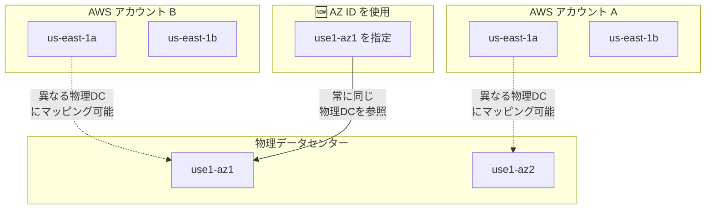

# Amazon EC2 - Availability Zone ID API サポート

**リリース日**: 2025 年 12 月 18 日
**サービス**: Amazon EC2
**機能**: Availability Zone ID (AZ ID) パラメータサポート

## 概要

Amazon EC2 が、API 全体で Availability Zone ID (AZ ID) パラメータをサポートするようになりました。これにより、インスタンス、ボリューム、サブネットなどのリソースを、一貫したゾーン識別子を使用して作成・管理できるようになります。

AZ ID は、すべての AWS アカウントで同じ物理的な場所を表す一貫した静的な識別子です。これにより、リソースの配置を最適化し、マルチアカウント環境でのリソース管理が大幅に簡素化されます。

**アップデート前の課題**

- AZ 名（例: us-east-1a）はアカウントごとに異なる物理的な場所にマッピングされる可能性があった
- マルチアカウント環境でリソースを同じ物理的な場所に配置することが困難だった
- アカウント間で AZ 名を手動でマッピングする必要があった
- ゾーンの追跡と整合性の維持が複雑だった

**アップデート後の改善**

- AZ ID パラメータを EC2 API で直接指定可能になった
- すべてのアカウントで同じ物理的な場所を保証できるようになった
- アカウント間での手動マッピングが不要になった
- リソースの一貫した配置が容易になった

## アーキテクチャ図



AZ ID を使用することで、アカウントに関係なく常に同じ物理データセンターを参照できます。

## サービスアップデートの詳細

### 主要機能

1. **AZ ID パラメータの直接指定**
   - EC2 API で AZ ID を直接指定してリソースを作成可能
   - AZ 名の代わりに AZ ID を使用することで一貫性を確保
   - すべてのアカウントで同じ物理的な場所を保証

2. **対応リソースタイプ**
   - インスタンス
   - 起動テンプレート
   - Dedicated Hosts
   - リザーブドインスタンス
   - フリート
   - スポットインスタンス
   - EBS ボリューム
   - キャパシティ予約
   - ネットワークインサイト
   - VPC エンドポイントとサブネット
   - ネットワークインターフェイス
   - 高速スナップショット復元
   - EC2 Instance Connect

3. **マルチアカウント環境での利点**
   - 組織全体で一貫したリソース配置
   - クロスアカウントでのレイテンシー最適化
   - 災害復旧計画の簡素化

## 技術仕様

### AZ 名と AZ ID の違い

| 項目 | AZ 名 | AZ ID |
|------|-------|-------|
| 形式 | us-east-1a | use1-az1 |
| アカウント間の一貫性 | なし（ランダムマッピング） | あり（固定） |
| 物理的な場所の特定 | 不可 | 可能 |
| 用途 | 従来の API 呼び出し | クロスアカウント配置 |

### API 使用例

```bash
# AZ ID を使用してインスタンスを起動
aws ec2 run-instances \
    --image-id ami-12345678 \
    --instance-type t3.micro \
    --placement AvailabilityZoneId=use1-az1

# AZ ID を使用してサブネットを作成
aws ec2 create-subnet \
    --vpc-id vpc-12345678 \
    --cidr-block 10.0.1.0/24 \
    --availability-zone-id use1-az1

# AZ ID を使用して EBS ボリュームを作成
aws ec2 create-volume \
    --size 100 \
    --volume-type gp3 \
    --availability-zone-id use1-az1
```

### AZ ID の確認方法

```bash
# リージョン内の AZ ID を確認
aws ec2 describe-availability-zones \
    --region us-east-1 \
    --query 'AvailabilityZones[*].[ZoneName,ZoneId]' \
    --output table
```

## 設定方法

### 前提条件

1. AWS CLI v2 または最新の SDK
2. 適切な IAM 権限（ec2:DescribeAvailabilityZones など）
3. 対象リージョンへのアクセス

### 手順

#### ステップ 1: AZ ID の確認

```bash
aws ec2 describe-availability-zones \
    --region ap-northeast-1 \
    --query 'AvailabilityZones[*].[ZoneName,ZoneId,State]' \
    --output table
```

このコマンドで、リージョン内の AZ 名と対応する AZ ID を確認できます。

#### ステップ 2: AZ ID を使用したリソース作成

```bash
# 例: 東京リージョンで AZ ID を指定してインスタンスを起動
aws ec2 run-instances \
    --image-id ami-0abcdef1234567890 \
    --instance-type t3.micro \
    --placement AvailabilityZoneId=apne1-az1 \
    --subnet-id subnet-12345678
```

AZ ID を指定することで、マルチアカウント環境でも同じ物理的な場所にリソースを配置できます。

## メリット

### ビジネス面

- **運用効率の向上**: アカウント間での AZ マッピング作業が不要
- **コスト最適化**: 同一 AZ 内のリソース間通信でデータ転送コストを削減
- **コンプライアンス対応**: 特定の物理的な場所へのリソース配置要件に対応

### 技術面

- **レイテンシー最適化**: 関連リソースを確実に同じ AZ に配置
- **高可用性設計の簡素化**: マルチアカウントでの DR 構成が容易
- **Infrastructure as Code の改善**: AZ ID を使用した一貫したデプロイメント

## デメリット・制約事項

### 制限事項

- 既存のリソースの AZ ID は変更不可（新規作成時のみ指定可能）
- 一部の古い API やツールでは AZ ID がサポートされていない可能性
- AZ ID は AWS が管理するため、ユーザーが変更することは不可

### 考慮すべき点

- 既存の自動化スクリプトの更新が必要な場合がある
- AZ 名を使用している既存のコードとの互換性を確認

## ユースケース

### ユースケース 1: マルチアカウント環境でのリソース配置

**シナリオ**: 開発、ステージング、本番環境が別々の AWS アカウントにあり、すべての環境で同じ物理的な AZ にリソースを配置したい。

**実装例**:
```bash
# すべてのアカウントで同じ AZ ID を指定
aws ec2 run-instances \
    --placement AvailabilityZoneId=apne1-az1 \
    --profile dev-account

aws ec2 run-instances \
    --placement AvailabilityZoneId=apne1-az1 \
    --profile prod-account
```

**効果**: 環境間で一貫したネットワークレイテンシーとパフォーマンス特性を実現。

### ユースケース 2: クロスアカウント VPC ピアリング最適化

**シナリオ**: 複数のアカウント間で VPC ピアリングを設定し、通信するリソースを同じ AZ に配置してレイテンシーを最小化したい。

**実装例**:
```bash
# アカウント A でサブネット作成
aws ec2 create-subnet \
    --vpc-id vpc-aaa \
    --cidr-block 10.0.1.0/24 \
    --availability-zone-id use1-az2 \
    --profile account-a

# アカウント B で同じ AZ ID にサブネット作成
aws ec2 create-subnet \
    --vpc-id vpc-bbb \
    --cidr-block 10.1.1.0/24 \
    --availability-zone-id use1-az2 \
    --profile account-b
```

**効果**: クロスアカウント通信のレイテンシーを最小化し、データ転送コストを削減。

### ユースケース 3: 災害復旧計画の標準化

**シナリオ**: 組織全体で DR 計画を標準化し、特定の AZ に障害が発生した場合の影響範囲を正確に把握したい。

**実装例**:
```json
{
  "PrimaryResources": {
    "AvailabilityZoneId": "apne1-az1",
    "Resources": ["web-servers", "app-servers"]
  },
  "DRResources": {
    "AvailabilityZoneId": "apne1-az2",
    "Resources": ["dr-web-servers", "dr-app-servers"]
  }
}
```

**効果**: AZ 障害時の影響範囲を正確に特定し、迅速なフェイルオーバーを実現。

## 料金

この機能自体に追加料金はありません。通常の EC2 リソース料金が適用されます。

## 利用可能リージョン

すべての AWS 商用リージョン、中国リージョン、AWS GovCloud (US) リージョンで利用可能です。

## 関連サービス・機能

- **AWS Resource Access Manager (RAM)**: AZ ID を使用したクロスアカウントリソース共有
- **AWS Organizations**: マルチアカウント環境での一貫したリソース管理
- **Amazon VPC**: サブネットの AZ ID 指定

## 参考リンク

- [公式発表 (What's New)](https://aws.amazon.com/about-aws/whats-new/2025/12/amazon-ec2-az-id-api-support/)
- [ドキュメント - Availability Zone IDs](https://docs.aws.amazon.com/ram/latest/userguide/working-with-az-ids.html)
- [Amazon EC2 ユーザーガイド](https://docs.aws.amazon.com/AWSEC2/latest/UserGuide/)

## まとめ

Amazon EC2 の AZ ID API サポートにより、マルチアカウント環境でのリソース配置が大幅に簡素化されました。特に、組織全体で一貫したインフラストラクチャ設計を行う場合や、クロスアカウントでのレイテンシー最適化が必要な場合に有効です。既存の自動化スクリプトを AZ ID を使用するように更新することを推奨します。
