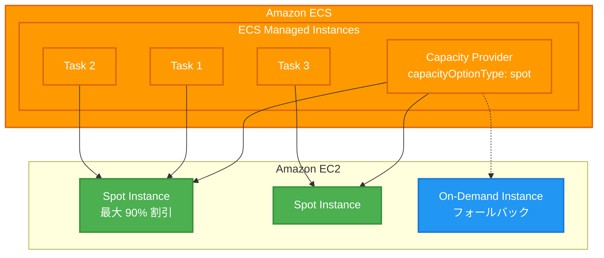

# Amazon ECS Managed Instances - Amazon EC2 Spot Instances サポート

**リリース日**: 2025 年 12 月 18 日
**サービス**: Amazon Elastic Container Service (ECS)
**機能**: ECS Managed Instances での EC2 Spot Instances サポート

## 概要

Amazon ECS Managed Instances が Amazon EC2 Spot Instances をサポートしました。この機能により、AWS が管理するインフラストラクチャ上で、オンデマンド価格と比較して最大 90% 割引の Spot 容量を活用できるようになります。

ECS Managed Instances は、インフラストラクチャ管理のオーバーヘッドを排除し、ワークロード要件に合わせて EC2 インスタンスを動的にスケーリングし、タスク配置を継続的に最適化してインフラストラクチャコストを削減するフルマネージドコンピューティングオプションです。

**アップデート前の課題**

- ECS Managed Instances ではオンデマンドインスタンスのみが利用可能だった
- コスト最適化のために Spot Instances を使用する場合、手動でのインフラストラクチャ管理が必要だった
- フォールトトレラントなワークロードでもオンデマンド価格を支払う必要があった

**アップデート後の改善**

- ECS Managed Instances で Spot Instances を直接指定可能に
- 最大 90% のコスト削減を AWS マネージドインフラストラクチャで実現
- `capacityOptionType` パラメータで `spot` または `on-demand` を簡単に切り替え可能

## アーキテクチャ図



ECS Managed Instances が Spot Instances を自動的にプロビジョニングし、タスクを最適に配置します。

## サービスアップデートの詳細

### 主要機能

1. **Spot Instances サポート**
   - Capacity Provider 設定で `capacityOptionType` パラメータを `spot` に設定
   - オンデマンド価格と比較して最大 90% のコスト削減
   - フォールトトレラントなワークロードに最適

2. **AWS マネージドインフラストラクチャ**
   - インスタンスのプロビジョニング、設定、運用を AWS が自動管理
   - タスク要件 (vCPU、メモリ、CPU アーキテクチャ) を定義するだけで最適なインスタンスを選択
   - GPU アクセラレーション、ネットワーク最適化、バースト可能なパフォーマンスインスタンスをサポート

3. **動的スケーリングと最適化**
   - ワークロード要件に合わせて EC2 インスタンスを動的にスケーリング
   - タスク配置を継続的に最適化してコストを削減
   - AWS 制御アクセスによる安全な運用

## 技術仕様

### Capacity Provider 設定

| パラメータ | 説明 | 値 |
|-----------|------|-----|
| capacityOptionType | インスタンスタイプの指定 | `spot` または `on-demand` |
| instanceTypes | 希望するインスタンスファミリー | GPU、ネットワーク最適化など |
| vCPUs | 必要な vCPU 数 | タスク要件に応じて |
| memory | 必要なメモリサイズ | タスク要件に応じて |

### API 変更履歴

| 日付 | サービス | 変更内容 |
|------|----------|----------|
| 2025/12/18 | [Amazon EC2 Container Service](https://awsapichanges.com/archive/changes/d7832c-ecs.html) | 8 updated api methods - CreateCapacityProvider API に CapacityOptionType パラメータを追加、ECS Managed Instances での Spot 容量サポート |

### 設定例

```json
{
  "capacityProvider": {
    "name": "my-spot-capacity-provider",
    "managedInstancesConfiguration": {
      "capacityOptionType": "spot",
      "instanceTypes": ["m5.large", "m5.xlarge", "c5.large"],
      "architecture": "X86_64"
    }
  }
}
```

## 設定方法

### 前提条件

1. AWS アカウント
2. Amazon ECS クラスターの設定
3. 適切な IAM 権限

### 手順

#### ステップ 1: Capacity Provider の作成

```bash
aws ecs create-capacity-provider \
  --name my-spot-capacity-provider \
  --managed-instances-configuration '{
    "capacityOptionType": "spot",
    "instanceTypes": ["m5.large", "m5.xlarge"]
  }'
```

Spot Instances を使用する Capacity Provider を作成します。`capacityOptionType` を `spot` に設定することで、Spot 容量が使用されます。

#### ステップ 2: クラスターへの関連付け

```bash
aws ecs put-cluster-capacity-providers \
  --cluster my-cluster \
  --capacity-providers my-spot-capacity-provider \
  --default-capacity-provider-strategy capacityProvider=my-spot-capacity-provider,weight=1
```

作成した Capacity Provider をクラスターに関連付けます。

#### ステップ 3: タスクの実行

```bash
aws ecs run-task \
  --cluster my-cluster \
  --task-definition my-task \
  --capacity-provider-strategy capacityProvider=my-spot-capacity-provider,weight=1
```

Spot Instances 上でタスクを実行します。

## メリット

### ビジネス面

- **大幅なコスト削減**: オンデマンド価格と比較して最大 90% のコスト削減
- **運用負荷の軽減**: AWS がインフラストラクチャを完全に管理
- **柔軟なスケーリング**: ワークロードに応じた自動スケーリング

### 技術面

- **簡単な設定**: `capacityOptionType` パラメータを設定するだけ
- **最適なインスタンス選択**: タスク要件に基づいて最適なインスタンスを自動選択
- **継続的な最適化**: タスク配置の継続的な最適化によるコスト効率向上

## デメリット・制約事項

### 制限事項

- Spot Instances は中断される可能性があるため、フォールトトレラントなワークロードに限定
- 管理費用が EC2 Spot コストに加えて発生
- 特定のインスタンスタイプの Spot 容量が利用できない場合がある

### 考慮すべき点

- ステートフルなワークロードには適さない場合がある
- 中断に対応できるアプリケーション設計が必要
- Spot 中断通知への対応を検討

## ユースケース

### ユースケース 1: バッチ処理ワークロード

**シナリオ**: 大量のデータ処理を定期的に実行するバッチジョブ

**実装例**:
```json
{
  "capacityProvider": {
    "name": "batch-spot-provider",
    "managedInstancesConfiguration": {
      "capacityOptionType": "spot",
      "instanceTypes": ["c5.2xlarge", "c5.4xlarge"]
    }
  }
}
```

**効果**: バッチ処理のコストを最大 90% 削減しながら、AWS マネージドインフラストラクチャの利便性を享受

### ユースケース 2: CI/CD パイプライン

**シナリオ**: ビルドとテストを実行する CI/CD ワークロード

**実装例**:
```json
{
  "capacityProvider": {
    "name": "cicd-spot-provider",
    "managedInstancesConfiguration": {
      "capacityOptionType": "spot",
      "instanceTypes": ["m5.large", "m5.xlarge"]
    }
  }
}
```

**効果**: CI/CD インフラストラクチャのコストを大幅に削減

### ユースケース 3: 開発・テスト環境

**シナリオ**: 本番環境以外の開発・テスト用コンテナ環境

**実装例**:
```json
{
  "capacityProvider": {
    "name": "dev-spot-provider",
    "managedInstancesConfiguration": {
      "capacityOptionType": "spot"
    }
  }
}
```

**効果**: 開発・テスト環境のインフラストラクチャコストを最小化

## 料金

ECS Managed Instances の料金は、プロビジョニングされたコンピューティングの管理費用と EC2 Spot コストの合計です。

### 料金例

| 項目 | 料金 |
|------|------|
| ECS Managed Instances 管理費用 | プロビジョニングされたコンピューティングに基づく |
| EC2 Spot Instances | オンデマンド価格の最大 90% 割引 |

詳細な料金については、[Amazon ECS 料金ページ](https://aws.amazon.com/ecs/pricing/)を参照してください。

## 利用可能リージョン

Amazon ECS Managed Instances が利用可能なすべての AWS リージョンで利用できます。

## 関連サービス・機能

- **Amazon ECS**: コンテナオーケストレーションサービス
- **Amazon EC2 Spot Instances**: 余剰 EC2 容量を割引価格で提供
- **ECS Capacity Providers**: ECS クラスターのキャパシティ管理
- **AWS Fargate**: サーバーレスコンテナ実行環境

## 参考リンク

- [公式発表 (What's New)](https://aws.amazon.com/about-aws/whats-new/2025/12/amazon-ecs-managed-instances-ec2-spot-instances/)
- [AWS Blog - Announcing Amazon ECS Managed Instances](https://aws.amazon.com/blogs/aws/announcing-amazon-ecs-managed-instances-for-containerized-applications)
- [Amazon ECS Managed Instances ドキュメント](https://docs.aws.amazon.com/AmazonECS/latest/developerguide/ManagedInstances.html)
- [Amazon ECS Managed Instances 機能ページ](https://aws.amazon.com/ecs/managed-instances/)

## まとめ

Amazon ECS Managed Instances での EC2 Spot Instances サポートにより、フォールトトレラントなコンテナワークロードのコストを最大 90% 削減できるようになりました。`capacityOptionType` パラメータを `spot` に設定するだけで、AWS マネージドインフラストラクチャの利便性を維持しながら大幅なコスト削減を実現できます。バッチ処理、CI/CD、開発・テスト環境などのワークロードに最適です。
