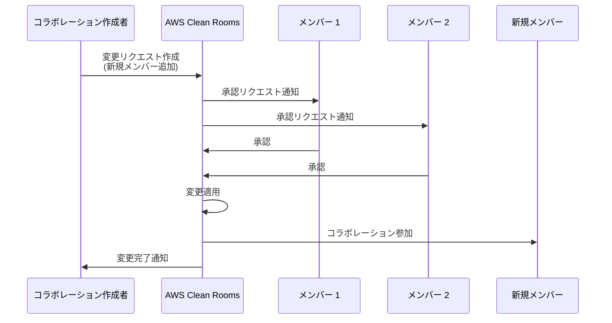

# AWS Clean Rooms - 既存コラボレーションの変更リクエスト機能

**リリース日**: 2025 年 12 月 18 日
**サービス**: AWS Clean Rooms
**機能**: Change Requests for Existing Collaborations

## 概要

AWS Clean Rooms に既存コラボレーションの設定を変更できる「変更リクエスト」機能が追加されました。この機能により、コラボレーション作成後でも新しいメンバーの追加、メンバー権限の更新、自動承認設定の変更が可能になります。

セキュリティを維持するため、変更リクエストはすべてのコラボレーションメンバーの承認が必要です。また、透明性を確保するため、すべての変更リクエストは変更履歴に記録され、メンバーが確認できます。

**アップデート前の課題**

- コラボレーション作成後にメンバーを追加するには、新しいコラボレーションを作成し直す必要があった
- メンバーの権限変更が柔軟にできなかった
- パートナーとの新しいユースケース開発時に、既存のコラボレーション設定を活用できなかった

**アップデート後の改善**

- 既存コラボレーションに新しいメンバーを追加可能
- メンバーの権限 (abilities) を動的に更新可能
- コラボレーションの自動承認設定を変更可能
- すべての変更が履歴として記録され、監査可能

## アーキテクチャ図



変更リクエストのワークフローを示しています。コラボレーション作成者が変更リクエストを作成し、既存メンバー全員の承認後に変更が適用されます。

## サービスアップデートの詳細

### 主要機能

1. **新規メンバーの追加**
   - 既存コラボレーションに新しいメンバーを追加可能
   - メンバーの表示名、AWS アカウント ID、権限を指定
   - 例: 広告主のマーケティング代理店を追加して分析結果を直接受け取れるようにする

2. **メンバー権限の更新**
   - 既存メンバーの権限 (abilities) を変更可能
   - 結果の受信権限、クエリ実行権限などを動的に調整
   - ビジネス要件の変化に柔軟に対応

3. **自動承認設定の変更**
   - コラボレーションの自動承認設定を編集可能
   - 特定の変更タイプを手動承認なしで適用可能に設定
   - 新規メンバーの即時参加を許可する設定も可能

4. **変更履歴の記録**
   - すべての変更リクエストが履歴に記録
   - メンバーによるレビューと監査が可能
   - 透明性とコンプライアンスを確保

## 技術仕様

### 変更リクエストの種類

| 変更タイプ | 説明 | 承認要件 |
|-----------|------|----------|
| メンバー追加 | 新しいメンバーをコラボレーションに追加 | 全メンバーの承認必須 |
| 権限更新 | 既存メンバーの権限を変更 | 全メンバーの承認必須 |
| 自動承認設定 | 自動承認ルールを変更 | 全メンバーの承認必須 |

### API 変更履歴

| 日付 | サービス | 変更内容 |
|------|----------|----------|
| 2025/12/18 | AWS Clean Rooms | CreateCollaborationChangeRequest、UpdateCollaborationChangeRequest API 追加 |

### 主要 API

```json
{
  "CreateCollaborationChangeRequest": {
    "collaborationIdentifier": "string",
    "changes": [
      {
        "type": "ADD_MEMBER",
        "memberDetails": {
          "displayName": "string",
          "accountId": "string",
          "abilities": ["CAN_RECEIVE_RESULTS"]
        }
      }
    ]
  }
}
```

## 設定方法

### 前提条件

1. AWS Clean Rooms コラボレーションが作成済みであること
2. コラボレーション作成者の権限を持つ IAM ユーザーまたはロール
3. 変更リクエストを承認するメンバーがコラボレーションに参加済みであること

### 手順

#### ステップ 1: 変更リクエストの作成

AWS マネジメントコンソールから変更リクエストを作成します。

1. AWS Clean Rooms コンソールにサインイン
2. 対象のコラボレーションを選択
3. 「Members」タブに移動
4. 「Add member」または「Edit」を選択
5. 変更内容を入力して保存

#### ステップ 2: 変更リクエストの確認と送信

```bash
# AWS CLI で変更リクエストを作成
aws cleanrooms create-collaboration-change-request \
  --collaboration-identifier "collaboration-id" \
  --changes '[{"type":"ADD_MEMBER","memberDetails":{"displayName":"Marketing Agency","accountId":"123456789012","abilities":["CAN_RECEIVE_RESULTS"]}}]'
```

変更リクエストを作成すると、既存のコラボレーションメンバーに承認リクエストが送信されます。

#### ステップ 3: メンバーによる承認

```bash
# 変更リクエストを承認
aws cleanrooms update-collaboration-change-request \
  --collaboration-identifier "collaboration-id" \
  --change-request-identifier "change-request-id" \
  --action APPROVE
```

すべてのメンバーが承認すると、変更が自動的に適用されます。

## メリット

### ビジネス面

- **オンボーディング時間の短縮**: 新しいパートナーを既存コラボレーションに迅速に追加
- **柔軟なパートナーシップ管理**: ビジネス関係の変化に応じて権限を調整
- **コンプライアンス強化**: すべての変更が記録され、監査証跡を提供

### 技術面

- **運用効率の向上**: コラボレーションの再作成が不要
- **セキュリティの維持**: 全メンバー承認による変更管理
- **API による自動化**: プログラマティックな変更管理が可能

## デメリット・制約事項

### 制限事項

- 変更リクエストを作成できるのはコラボレーション作成者のみ
- すべてのメンバーの承認が必要（自動承認設定がない場合）
- 変更リクエストは 1 つのコラボレーションに対して 1 つずつ処理

### 考慮すべき点

- メンバー数が多い場合、承認プロセスに時間がかかる可能性
- 自動承認設定は慎重に検討が必要

## ユースケース

### ユースケース 1: マーケティング代理店の追加

**シナリオ**: パブリッシャーと広告主のコラボレーションに、広告主のマーケティング代理店を追加して分析結果を直接受け取れるようにする。

**効果**: 代理店がインサイトに直接アクセスでき、キャンペーン最適化のスピードが向上。

### ユースケース 2: 権限の段階的拡張

**シナリオ**: 初期段階では結果受信のみの権限を持つメンバーに、信頼関係構築後にクエリ実行権限を追加。

**効果**: セキュリティを維持しながら、パートナーシップの深化に応じた柔軟な権限管理。

### ユースケース 3: 自動承認による効率化

**シナリオ**: 頻繁にメンバー追加が発生するコラボレーションで、特定の権限レベルの新規メンバーを自動承認。

**効果**: 承認プロセスの効率化とオンボーディング時間の大幅短縮。

## 料金

AWS Clean Rooms の変更リクエスト機能自体に追加料金はありません。標準の AWS Clean Rooms 料金が適用されます。

## 利用可能リージョン

AWS Clean Rooms が利用可能なすべての AWS リージョンで使用できます。詳細は [AWS リージョン表](https://docs.aws.amazon.com/general/latest/gr/clean-rooms.html#clean-rooms_region) を参照してください。

## 関連サービス・機能

- **AWS Entity Resolution**: ID マッピングテーブルとの連携でクロスデータセット分析を強化
- **Amazon EventBridge**: 変更リクエストのイベント通知との連携
- **Snowflake 連携**: AWS または Snowflake 上の企業とのコラボレーション

## 参考リンク

- [公式発表 (What's New)](https://aws.amazon.com/about-aws/whats-new/2025/12/clean-rooms-change-requests-existing-collaborations/)
- [ドキュメント - Change requests in AWS Clean Rooms](https://docs.aws.amazon.com/clean-rooms/latest/userguide/change-requests.html)
- [API リファレンス - CreateCollaborationChangeRequest](https://docs.aws.amazon.com/clean-rooms/latest/apireference/API_CreateCollaborationChangeRequest.html)
- [AWS Clean Rooms 製品ページ](https://aws.amazon.com/clean-rooms/)

## まとめ

AWS Clean Rooms の変更リクエスト機能により、既存コラボレーションの柔軟な管理が可能になりました。セキュリティを維持しながらパートナーシップの変化に対応でき、オンボーディング時間の短縮とコンプライアンス強化を実現します。データクリーンルームを活用している組織は、この機能を活用してより効率的なコラボレーション管理を検討してください。
