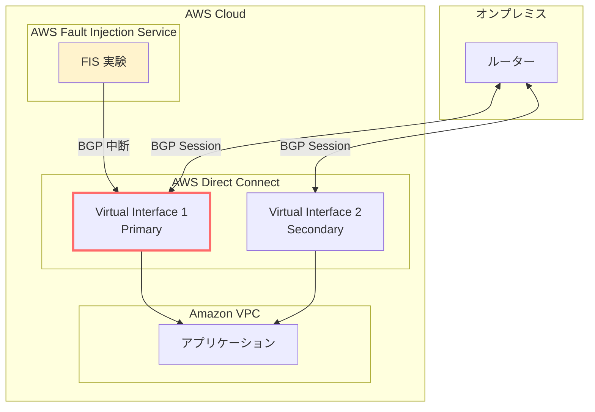

# AWS Direct Connect - AWS Fault Injection Service によるレジリエンステスト

**リリース日**: 2025 年 12 月 18 日
**サービス**: AWS Direct Connect、AWS Fault Injection Service (FIS)
**機能**: Resilience Testing with AWS Fault Injection Service

## 概要

AWS Direct Connect が AWS Fault Injection Service (FIS) との統合をサポートし、制御された環境で BGP セッションの障害をシミュレートできるようになりました。この機能により、Virtual Interface 上の BGP セッションが中断された際のアプリケーションの動作をテストし、レジリエンスメカニズムを検証できます。

Direct Connect アーキテクチャにおいてフェイルオーバーがネットワーク接続の維持に不可欠な環境で、プロアクティブにレジリエンスをテストできる重要な機能です。

**アップデート前の課題**

- Direct Connect の BGP フェイルオーバーを本番環境でテストするリスクが高かった
- 冗長構成の有効性を事前に検証する手段が限られていた
- 障害発生時のアプリケーション動作を予測することが困難だった

**アップデート後の改善**

- 制御された環境で BGP セッションの中断をシミュレート可能
- 冗長 Virtual Interface へのトラフィックルーティングを検証可能
- アプリケーションの継続動作を事前に確認可能
- カオスエンジニアリングのベストプラクティスを Direct Connect に適用可能

## アーキテクチャ図



FIS 実験により Primary Virtual Interface の BGP セッションを中断し、トラフィックが Secondary Virtual Interface に正しくルーティングされることを検証します。

## サービスアップデートの詳細

### 主要機能

1. **BGP セッション中断のシミュレーション**
   - Virtual Interface 上の BGP セッションを制御された方法で中断
   - 実際の障害シナリオを安全に再現
   - 中断時間と影響範囲を制御可能

2. **フェイルオーバー検証**
   - Primary Virtual Interface から Secondary への切り替えをテスト
   - トラフィックルーティングの正常性を確認
   - 切り替え時間の測定と最適化

3. **アプリケーション動作の観察**
   - BGP フェイルオーバー中のアプリケーション動作を監視
   - エラーハンドリングの有効性を検証
   - ユーザー影響の事前評価

## 技術仕様

### FIS アクションの詳細

| 項目 | 詳細 |
|------|------|
| アクション名 | aws:directconnect:disrupt-bgp-session |
| 対象リソース | Virtual Interface |
| 中断タイプ | BGP セッションの一時的な中断 |
| ロールバック | 自動復旧または手動停止 |

### 必要な IAM 権限

```json
{
  "Version": "2012-10-17",
  "Statement": [
    {
      "Effect": "Allow",
      "Action": [
        "fis:CreateExperimentTemplate",
        "fis:StartExperiment",
        "fis:StopExperiment",
        "fis:GetExperiment"
      ],
      "Resource": "*"
    },
    {
      "Effect": "Allow",
      "Action": [
        "directconnect:DescribeVirtualInterfaces"
      ],
      "Resource": "*"
    }
  ]
}
```

## 設定方法

### 前提条件

1. AWS Direct Connect の冗長構成が設定済みであること
2. AWS FIS の利用権限を持つ IAM ロール
3. テスト対象の Virtual Interface が特定されていること

### 手順

#### ステップ 1: FIS 実験テンプレートの作成

```bash
# FIS 実験テンプレートを作成
aws fis create-experiment-template \
  --description "Direct Connect BGP failover test" \
  --role-arn "arn:aws:iam::123456789012:role/FISRole" \
  --stop-conditions '[{"source":"none"}]' \
  --actions '{
    "DisruptBGP": {
      "actionId": "aws:directconnect:disrupt-bgp-session",
      "parameters": {
        "duration": "PT5M"
      },
      "targets": {
        "VirtualInterfaces": "targetVIF"
      }
    }
  }' \
  --targets '{
    "targetVIF": {
      "resourceType": "aws:directconnect:virtual-interface",
      "resourceArns": ["arn:aws:directconnect:us-east-1:123456789012:dxvif/dxvif-abc123"],
      "selectionMode": "ALL"
    }
  }'
```

Direct Connect Virtual Interface の BGP セッションを 5 分間中断する実験テンプレートを作成します。

#### ステップ 2: 実験の実行

```bash
# 実験を開始
aws fis start-experiment \
  --experiment-template-id "EXT123456789"
```

実験を開始すると、指定した Virtual Interface の BGP セッションが中断されます。

#### ステップ 3: 結果の確認

```bash
# 実験の状態を確認
aws fis get-experiment \
  --id "EXP123456789"
```

実験の進行状況と結果を確認し、フェイルオーバーが正常に動作したかを検証します。

## メリット

### ビジネス面

- **ダウンタイムリスクの低減**: 事前テストにより本番障害時の影響を最小化
- **SLA 遵守の確認**: 冗長構成の有効性を定期的に検証
- **コンプライアンス対応**: 災害復旧計画の実効性を証明

### 技術面

- **カオスエンジニアリングの実践**: Direct Connect にカオスエンジニアリングを適用
- **自動化されたテスト**: CI/CD パイプラインへの統合が可能
- **詳細な観測性**: CloudWatch との連携で詳細なメトリクスを取得

## デメリット・制約事項

### 制限事項

- テスト中は一時的にネットワーク接続に影響が出る可能性
- 冗長構成がない環境では使用に注意が必要
- FIS が利用可能な商用リージョンでのみ使用可能

### 考慮すべき点

- 本番環境でのテストは営業時間外に実施を推奨
- テスト前にアプリケーションチームへの通知が必要
- ロールバック手順を事前に確認

## ユースケース

### ユースケース 1: 定期的なレジリエンステスト

**シナリオ**: 月次で Direct Connect の冗長構成が正常に機能することを検証する。

**実装例**:
```bash
# 月次テストの自動実行（EventBridge ルールと組み合わせ）
aws fis start-experiment --experiment-template-id "EXT-monthly-dx-test"
```

**効果**: 冗長構成の劣化を早期に発見し、本番障害前に対処可能。

### ユースケース 2: 新規アプリケーションのデプロイ前検証

**シナリオ**: 新しいアプリケーションが Direct Connect 障害時に適切にフェイルオーバーすることを確認。

**効果**: 本番デプロイ前にネットワーク障害耐性を検証し、リリースリスクを低減。

### ユースケース 3: 災害復旧訓練

**シナリオ**: 年次の災害復旧訓練の一環として、Direct Connect 障害シナリオをシミュレート。

**効果**: DR 計画の実効性を検証し、復旧手順の改善点を特定。

## 料金

AWS FIS の標準料金が適用されます。

| 項目 | 料金 |
|------|------|
| アクション分 | $0.10/アクション分 |

例: 5 分間の BGP 中断テストを実行した場合、約 $0.50 の料金が発生します。

## 利用可能リージョン

AWS FIS が提供されているすべての AWS 商用リージョンで利用可能です。

## 関連サービス・機能

- **AWS Resilience Hub**: レジリエンス評価と FIS 実験の推奨
- **Amazon CloudWatch**: 実験中のメトリクス監視
- **AWS CloudTrail**: FIS 実験の監査ログ

## 参考リンク

- [公式発表 (What's New)](https://aws.amazon.com/about-aws/whats-new/2025/12/direct-connect-resilience-testing-fault-injection-service/)
- [AWS FIS 製品ページ](https://aws.amazon.com/fis/)
- [Direct Connect FIS アクションユーザーガイド](https://docs.aws.amazon.com/fis/latest/userguide/fis-actions-reference.html)
- [AWS Direct Connect 機能ページ](https://aws.amazon.com/directconnect/features/)

## まとめ

AWS Direct Connect と AWS FIS の統合により、ハイブリッドクラウド環境のネットワークレジリエンスを安全にテストできるようになりました。Direct Connect を利用している組織は、この機能を活用して定期的なフェイルオーバーテストを実施し、ネットワーク障害への備えを強化することを推奨します。
