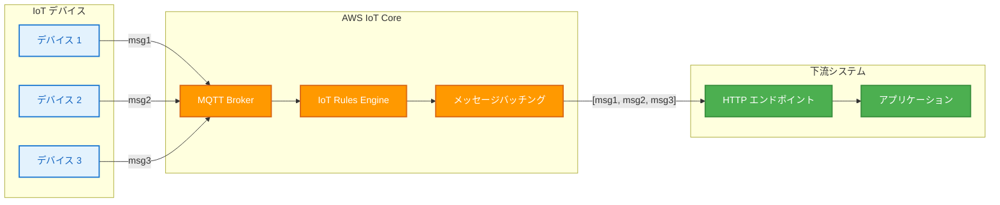

# AWS IoT Core - HTTP ルールアクションへのメッセージバッチング

**リリース日**: 2025 年 12 月 18 日
**サービス**: AWS IoT Core
**機能**: HTTP ルールアクションへのメッセージバッチング

## 概要

AWS IoT Core に HTTP ルールアクションへのメッセージバッチング機能が追加されました。この機能により、複数の IoT メッセージを単一の HTTP リクエストにまとめてから下流の HTTP エンドポイントにルーティングできるようになります。

IoT ワークロードからテレメトリを取り込む際のコストとスループットのオーバーヘッドを削減できます。

**アップデート前の課題**

- 各 IoT メッセージが個別の HTTP リクエストとして送信されていた
- 大量のメッセージを処理する際に HTTP リクエスト数が増大
- 下流エンドポイントへのスループットオーバーヘッドが発生
- API 呼び出しコストが高くなる傾向があった

**アップデート後の改善**

- 複数のメッセージを単一の HTTP リクエストにバッチ化可能
- HTTP リクエスト数の削減によるコスト最適化
- 下流エンドポイントへのスループット効率向上
- バッチパラメータのカスタマイズが可能

## アーキテクチャ図



複数のデバイスからのメッセージがバッチ化され、単一の HTTP リクエストとして下流エンドポイントに送信されます。

## サービスアップデートの詳細

### 主要機能

1. **メッセージバッチング**
   - 複数の IoT メッセージを単一の HTTP リクエストにまとめる
   - バッチサイズとタイムアウトのカスタマイズが可能
   - 効率的なデータ転送を実現

2. **HTTP ルールアクションとの統合**
   - 既存の HTTP ルールアクションにバッチング機能を追加
   - 20 以上の AWS IoT ルールアクションの一部として利用可能
   - サードパーティエンドポイントへのルーティングをサポート

3. **コストとスループットの最適化**
   - HTTP リクエスト数の削減によるコスト削減
   - 下流エンドポイントへの負荷軽減
   - 大規模 IoT ワークロードの効率的な処理

## 技術仕様

### バッチング設定パラメータ

| パラメータ | 説明 | 推奨値 |
|-----------|------|--------|
| batchMode | バッチングの有効化 | `true` |
| maxBatchSize | 最大バッチサイズ | ワークロードに応じて設定 |
| batchTimeout | バッチタイムアウト | レイテンシ要件に応じて設定 |

### API 変更履歴

| 日付 | サービス | 変更内容 |
|------|----------|----------|
| 2025/12/18 | [AWS IoT](https://awsapichanges.com/archive/changes/d7832c-iot.html) | 3 updated api methods - IoT Rules Engine HTTP アクションへのメッセージバッチング機能の追加 |

### ルール設定例

```json
{
  "rule": {
    "ruleName": "BatchedHttpRule",
    "sql": "SELECT * FROM 'devices/+/telemetry'",
    "actions": [
      {
        "http": {
          "url": "https://api.example.com/telemetry",
          "confirmationUrl": "https://api.example.com/confirm",
          "headers": [
            {
              "key": "Content-Type",
              "value": "application/json"
            }
          ],
          "batchMode": {
            "enabled": true,
            "maxBatchSize": 100,
            "batchTimeout": 5000
          }
        }
      }
    ]
  }
}
```

## 設定方法

### 前提条件

1. AWS アカウント
2. AWS IoT Core の設定済み環境
3. HTTP エンドポイントの準備
4. 適切な IAM 権限

### 手順

#### ステップ 1: IoT ルールの作成

```bash
aws iot create-topic-rule \
  --rule-name BatchedTelemetryRule \
  --topic-rule-payload '{
    "sql": "SELECT * FROM '\''devices/+/telemetry'\''",
    "actions": [
      {
        "http": {
          "url": "https://api.example.com/telemetry",
          "batchMode": {
            "enabled": true,
            "maxBatchSize": 50,
            "batchTimeout": 3000
          }
        }
      }
    ]
  }'
```

バッチングを有効にした HTTP ルールアクションを作成します。`maxBatchSize` でバッチあたりの最大メッセージ数、`batchTimeout` でバッチ送信までの最大待機時間 (ミリ秒) を設定します。

#### ステップ 2: エンドポイントの確認設定

```bash
aws iot create-topic-rule-destination \
  --destination-configuration '{
    "httpUrlConfiguration": {
      "confirmationUrl": "https://api.example.com/confirm"
    }
  }'
```

HTTP エンドポイントの確認 URL を設定します。AWS IoT Core はこの URL を使用してエンドポイントの所有権を確認します。

#### ステップ 3: デバイスからのメッセージ送信

```python
import json
from awscrt import mqtt
from awsiot import mqtt_connection_builder

# MQTT 接続の設定
mqtt_connection = mqtt_connection_builder.mtls_from_path(
    endpoint="your-iot-endpoint.iot.region.amazonaws.com",
    cert_filepath="device.pem.crt",
    pri_key_filepath="device.pem.key",
    ca_filepath="AmazonRootCA1.pem",
    client_id="device-001"
)

# テレメトリデータの送信
telemetry = {
    "deviceId": "device-001",
    "temperature": 25.5,
    "humidity": 60
}

mqtt_connection.publish(
    topic="devices/device-001/telemetry",
    payload=json.dumps(telemetry),
    qos=mqtt.QoS.AT_LEAST_ONCE
)
```

デバイスからテレメトリデータを送信します。IoT Core がメッセージをバッチ化して HTTP エンドポイントに送信します。

## メリット

### ビジネス面

- **コスト削減**: HTTP リクエスト数の削減による API 呼び出しコストの低減
- **スケーラビリティ向上**: 大規模 IoT ワークロードの効率的な処理
- **運用効率化**: 下流システムへの負荷軽減

### 技術面

- **スループット向上**: バッチ処理による効率的なデータ転送
- **レイテンシ制御**: バッチタイムアウトによるレイテンシとスループットのバランス調整
- **柔軟な設定**: バッチサイズとタイムアウトのカスタマイズ

## デメリット・制約事項

### 制限事項

- バッチングによりメッセージ配信に若干の遅延が発生する可能性
- 下流エンドポイントがバッチ形式のペイロードを処理できる必要がある
- バッチサイズの上限がある

### 考慮すべき点

- リアルタイム性が重要なワークロードではバッチタイムアウトを短く設定
- 下流エンドポイントのペイロードサイズ制限を確認
- エラーハンドリングの設計 (バッチ内の一部メッセージが失敗した場合の処理)

## ユースケース

### ユースケース 1: スマートホームプラットフォーム

**シナリオ**: 複数のスマートホームデバイスからのテレメトリを集約してプラットフォームに送信

**実装例**:
```json
{
  "sql": "SELECT * FROM 'smarthome/+/telemetry'",
  "actions": [
    {
      "http": {
        "url": "https://smarthome-platform.example.com/telemetry",
        "batchMode": {
          "enabled": true,
          "maxBatchSize": 100,
          "batchTimeout": 5000
        }
      }
    }
  ]
}
```

**効果**: 複数デバイスからのメッセージを効率的にバッチ化し、プラットフォームへの API 呼び出し数を削減

### ユースケース 2: 産業用 IoT モニタリング

**シナリオ**: 工場内のセンサーデータを分析プラットフォームに送信

**実装例**:
```json
{
  "sql": "SELECT * FROM 'factory/sensors/+'",
  "actions": [
    {
      "http": {
        "url": "https://analytics.example.com/ingest",
        "batchMode": {
          "enabled": true,
          "maxBatchSize": 200,
          "batchTimeout": 10000
        }
      }
    }
  ]
}
```

**効果**: 大量のセンサーデータを効率的にバッチ処理し、分析プラットフォームへの負荷を軽減

### ユースケース 3: 車両テレマティクス

**シナリオ**: フリート管理システムへの車両データ送信

**実装例**:
```json
{
  "sql": "SELECT * FROM 'vehicles/+/location'",
  "actions": [
    {
      "http": {
        "url": "https://fleet.example.com/tracking",
        "batchMode": {
          "enabled": true,
          "maxBatchSize": 50,
          "batchTimeout": 3000
        }
      }
    }
  ]
}
```

**効果**: 複数車両からの位置情報をバッチ化し、フリート管理システムへの効率的なデータ送信を実現

## 料金

AWS IoT Core の料金は、メッセージング、ルールエンジン実行、HTTP アクションの使用量に基づきます。

### 料金例

| 項目 | 料金 |
|------|------|
| メッセージング | メッセージ数に基づく |
| ルールエンジン実行 | ルール評価数に基づく |
| HTTP アクション | アクション実行数に基づく |

バッチングにより HTTP アクションの実行数が削減されるため、コスト最適化が期待できます。詳細な料金については、[AWS IoT Core 料金ページ](https://aws.amazon.com/iot-core/pricing/)を参照してください。

## 利用可能リージョン

AWS IoT Core が利用可能なすべての AWS リージョンで利用できます。AWS GovCloud (US) および中国リージョンを含みます。

## 関連サービス・機能

- **AWS IoT Core**: IoT デバイス接続とメッセージングサービス
- **AWS IoT Rules Engine**: IoT データのフィルタリング、処理、ルーティング
- **Amazon Kinesis**: ストリーミングデータの処理
- **AWS Lambda**: サーバーレスデータ処理

## 参考リンク

- [公式発表 (What's New)](https://aws.amazon.com/about-aws/whats-new/2025/12/aws-iot-core-message-batching-http-rule-action/)
- [AWS IoT Core HTTP バッチング開発者ガイド](https://docs.aws.amazon.com/iot/latest/developerguide/http_batching.html)
- [AWS IoT ルールアクション](https://docs.aws.amazon.com/iot/latest/developerguide/iot-rule-actions.html)
- [CreateTopicRule API リファレンス](https://docs.aws.amazon.com/iot/latest/apireference/API_CreateTopicRule.html)

## まとめ

AWS IoT Core の HTTP ルールアクションへのメッセージバッチング機能により、大規模 IoT ワークロードのコストとスループットを最適化できるようになりました。複数のメッセージを単一の HTTP リクエストにまとめることで、下流エンドポイントへの負荷を軽減し、API 呼び出しコストを削減できます。スマートホーム、産業用 IoT、車両テレマティクスなど、大量のデバイスからテレメトリを収集するユースケースに最適です。
