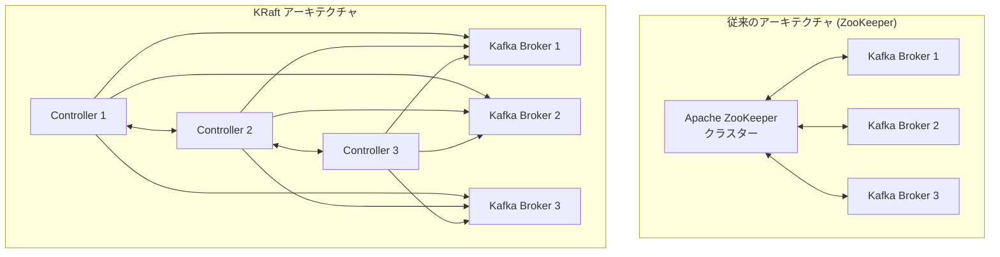

# Amazon MSK Express Brokers - Apache Kafka 3.9 と KRaft サポート

**リリース日**: 2025 年 12 月 18 日
**サービス**: Amazon Managed Streaming for Apache Kafka (MSK)
**機能**: Express Brokers での KRaft (Kafka Raft) サポート

## 概要

Amazon Managed Streaming for Apache Kafka (MSK) が Express Brokers で Apache Kafka バージョン 3.9 をサポートし、KRaft (Kafka Raft) が利用可能になりました。KRaft は Apache Kafka の新しいコンセンサスプロトコルで、メタデータ管理における Apache ZooKeeper への依存を排除します。

KRaft により、Kafka クラスターのメタデータ管理が外部の ZooKeeper ノードから Kafka 内部のコントローラーグループに移行されます。これにより、メタデータが Kafka ブローカー内のトピックとして保存・複製され、メタデータの伝播が高速化されます。

**アップデート前の課題**

- Apache ZooKeeper への依存によるアーキテクチャの複雑さ
- ZooKeeper クラスターの管理オーバーヘッド
- メタデータ伝播の遅延
- スケーリング時の ZooKeeper ボトルネック

**アップデート後の改善**

- ZooKeeper への依存を排除したシンプルなアーキテクチャ
- メタデータ伝播の高速化
- 運用管理の簡素化
- Kafka 3.9 の最新機能を活用可能

## アーキテクチャ図



KRaft により、外部の ZooKeeper クラスターが不要になり、Kafka 内部のコントローラーでメタデータを管理します。

## サービスアップデートの詳細

### 主要機能

1. **KRaft (Kafka Raft) プロトコル**
   - ZooKeeper への依存を排除
   - Kafka 内部でのメタデータ管理
   - Raft コンセンサスアルゴリズムによる高可用性

2. **Apache Kafka 3.9 サポート**
   - 最新の Kafka 機能を利用可能
   - パフォーマンスと安定性の向上
   - 新しい Express Broker クラスターで自動的に KRaft を使用

3. **Express Brokers との統合**
   - 高スループット、高速スケーリング
   - 最大 20 倍高速なスケールアップ
   - ブローカーあたり最大 5 倍のパーティション

## 技術仕様

### KRaft の特徴

| 項目 | 詳細 |
|------|------|
| コンセンサスプロトコル | Raft |
| メタデータ保存 | Kafka 内部トピック |
| ZooKeeper 依存 | なし |
| 対応 Kafka バージョン | 3.9 |

### Express Brokers の特徴

| 項目 | 詳細 |
|------|------|
| スループット | Standard Brokers の最大 3 倍 |
| スケールアップ速度 | 最大 20 倍高速 |
| パーティション数 | ブローカーあたり最大 5 倍 |
| リカバリ時間 | 90% 短縮 |

## 設定方法

### 前提条件

1. AWS アカウントへのアクセス権限
2. Amazon MSK へのアクセス権限
3. VPC とサブネットの設定

### 手順

#### ステップ 1: Express Broker クラスターの作成

AWS Management Console から新しい MSK クラスターを作成し、Express Brokers と Kafka バージョン 3.9 を選択します。

#### ステップ 2: AWS CLI での作成例

```bash
aws kafka create-cluster-v2 \
    --cluster-name my-kraft-cluster \
    --provisioned '{
        "brokerNodeGroupInfo": {
            "instanceType": "kafka.m7g.large",
            "clientSubnets": ["subnet-xxx", "subnet-yyy", "subnet-zzz"],
            "securityGroups": ["sg-xxx"]
        },
        "kafkaVersion": "3.9.0",
        "numberOfBrokerNodes": 3,
        "clusterType": "EXPRESS"
    }'
```

Express Broker クラスターを Kafka 3.9 で作成します。KRaft は自動的に有効化されます。

#### ステップ 3: クラスターの確認

```bash
aws kafka describe-cluster-v2 --cluster-arn <cluster-arn>
```

クラスターのステータスと設定を確認します。

## メリット

### ビジネス面

- **運用コスト削減**: ZooKeeper クラスターの管理が不要
- **シンプルなアーキテクチャ**: 管理対象コンポーネントの削減
- **高可用性**: Raft プロトコルによる堅牢なコンセンサス

### 技術面

- **メタデータ伝播の高速化**: Kafka 内部での効率的なメタデータ管理
- **スケーラビリティ向上**: ZooKeeper ボトルネックの排除
- **最新機能**: Kafka 3.9 の新機能を活用可能

## デメリット・制約事項

### 制限事項

- 新規クラスターのみ KRaft をサポート (既存クラスターのアップグレードは将来対応予定)
- Kafka 3.9 以降でのみ利用可能

### 考慮すべき点

- 既存の ZooKeeper ベースのクラスターからの移行には新規クラスター作成が必要
- 一部の ZooKeeper 依存ツールとの互換性確認が必要

## ユースケース

### ユースケース 1: 新規ストリーミングプラットフォームの構築

**シナリオ**: 新しいリアルタイムデータストリーミングプラットフォームを構築する

**効果**: KRaft により、ZooKeeper の管理なしでシンプルなアーキテクチャを実現。運用負荷を軽減しながら高パフォーマンスを達成

### ユースケース 2: 高スループットイベント処理

**シナリオ**: 大量のイベントをリアルタイムで処理する必要がある

**効果**: Express Brokers と KRaft の組み合わせにより、高スループットと高速スケーリングを実現

### ユースケース 3: マイクロサービス間のメッセージング

**シナリオ**: マイクロサービスアーキテクチャでのイベント駆動通信

**効果**: シンプルなアーキテクチャで信頼性の高いメッセージングを実現

## 料金

Amazon MSK Express Brokers の標準料金が適用されます。KRaft 機能自体に追加料金はありません。ZooKeeper クラスターが不要になるため、全体的なコスト削減が期待できます。

## 利用可能リージョン

Amazon MSK Express Brokers がサポートされているすべての AWS リージョンで利用可能です。

## 関連サービス・機能

- **Amazon MSK Serverless**: サーバーレス Kafka
- **Amazon MSK Connect**: Kafka Connect のマネージドサービス
- **Amazon Kinesis Data Streams**: リアルタイムデータストリーミング

## 参考リンク

- [公式発表 (What's New)](https://aws.amazon.com/about-aws/whats-new/2025/12/aws-msk-express-brokers-support-kraft/)
- [Amazon MSK ドキュメント](https://docs.aws.amazon.com/msk/latest/developerguide/what-is-msk.html)
- [Apache Kafka KRaft ドキュメント](https://kafka.apache.org/documentation/#kraft)

## まとめ

Amazon MSK Express Brokers での KRaft サポートにより、ZooKeeper への依存を排除したモダンな Kafka アーキテクチャが利用可能になりました。新規クラスターを構築する場合は、Kafka 3.9 と KRaft を選択することで、シンプルで高パフォーマンスなストリーミングプラットフォームを実現できます。
